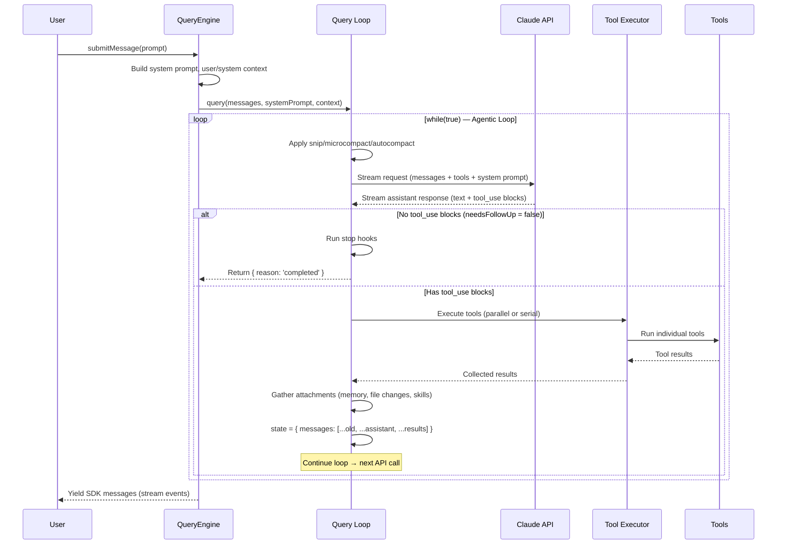
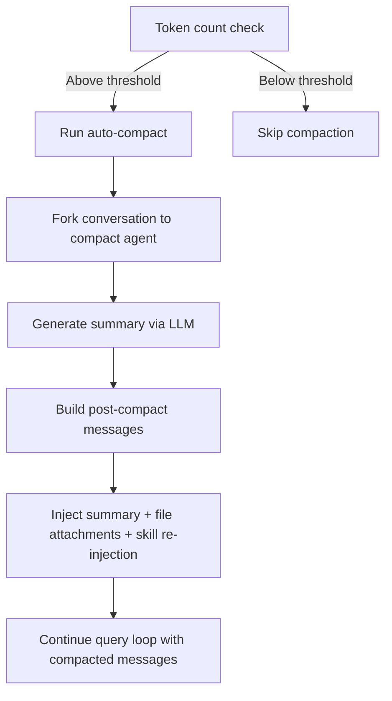
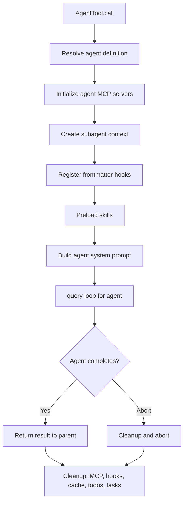

# Claude Code — Overall Architecture and Design Deep Dive

> **Document 00**: This is the first in a series of detailed analysis documents covering the leaked Claude Code CLI source code (2026-03-31). This document provides a high-level architectural overview, module-by-module breakdown, and analysis of core design patterns.

---

## Table of Contents

1. [Project Overview](#1-project-overview)
2. [Tech Stack](#2-tech-stack)
3. [Directory Structure and Module Map](#3-directory-structure-and-module-map)
4. [Core Architecture — The Big Picture](#4-core-architecture--the-big-picture)
5. [The Query Loop — Heart of the System](#5-the-query-loop--heart-of-the-system)
6. [LLM API Integration](#6-llm-api-integration)
7. [System Prompt Design](#7-system-prompt-design)
8. [Context Management](#8-context-management)
9. [Tool System](#9-tool-system)
10. [Multi-Agent Architecture](#10-multi-agent-architecture)
11. [Memory and Session Management](#11-memory-and-session-management)
12. [Skill and Rule System](#12-skill-and-rule-system)
13. [Permission System](#13-permission-system)
14. [IDE Bridge](#14-ide-bridge)
15. [Key Design Patterns](#15-key-design-patterns)
16. [Core Problems and Challenges](#16-core-problems-and-challenges)
17. [Areas Worth Further Investigation](#17-areas-worth-further-investigation)
18. [Summary](#18-summary)

---

## 1. Project Overview

Claude Code is Anthropic's official CLI tool that enables developers to interact with Claude directly from the terminal. It is a full-featured agentic coding assistant capable of:

- **File operations**: Reading, writing, editing files with diff-based modifications
- **Shell execution**: Running bash/PowerShell commands with security sandboxing
- **Code search**: ripgrep-based content search and glob-based file pattern matching
- **Multi-agent orchestration**: Spawning sub-agents for parallel task execution
- **IDE integration**: Bidirectional bridge with VS Code and JetBrains
- **MCP protocol support**: Connecting to external tool servers via Model Context Protocol
- **Session management**: Persistent conversations with context compression
- **Memory system**: Long-term memory across sessions via CLAUDE.md files and memdir

**Scale**: ~1,900 files, 512,000+ lines of TypeScript code.

---

## 2. Tech Stack

| Category | Technology | Notes |
|----------|-----------|-------|
| **Runtime** | Bun | High-performance JS runtime; uses `bun:bundle` for feature flags and dead code elimination |
| **Language** | TypeScript (strict) | Full strict mode with Zod v4 for runtime validation |
| **Terminal UI** | React + Ink | React components rendered to terminal via Ink library |
| **CLI Parsing** | Commander.js | With extra-typings for type-safe CLI argument parsing |
| **Schema Validation** | Zod v4 | Used for tool input schemas, config validation |
| **Code Search** | ripgrep | Via GrepTool for fast content search |
| **Protocols** | MCP SDK, LSP | Model Context Protocol for external tools, Language Server Protocol for code intelligence |
| **API** | Anthropic SDK | Official SDK for Claude API calls with streaming support |
| **Telemetry** | OpenTelemetry + gRPC | Lazy-loaded (~1.1MB combined) to avoid startup penalty |
| **Feature Flags** | GrowthBook | Server-side feature flags with local caching |
| **Auth** | OAuth 2.0, JWT, macOS Keychain | Multi-layer authentication |

### Build-Time Feature Flags

A distinctive pattern is the use of `bun:bundle`'s `feature()` function for compile-time dead code elimination:

```typescript
import { feature } from 'bun:bundle'

// Entire code path is stripped at build time when flag is false
const voiceCommand = feature('VOICE_MODE')
  ? require('./commands/voice/index.js').default
  : null
```

Notable flags: `PROACTIVE`, `KAIROS`, `BRIDGE_MODE`, `DAEMON`, `VOICE_MODE`, `AGENT_TRIGGERS`, `MONITOR_TOOL`, `COORDINATOR_MODE`, `HISTORY_SNIP`, `CONTEXT_COLLAPSE`, `REACTIVE_COMPACT`, `CACHED_MICROCOMPACT`, `TOKEN_BUDGET`, `EXPERIMENTAL_SKILL_SEARCH`.

---

## 3. Directory Structure and Module Map

```
src/
├── main.tsx                    # CLI entrypoint (Commander.js parser + Ink renderer init)
├── query.ts                    # ★ CORE: The agentic query loop (while(true) loop)
├── QueryEngine.ts              # ★ CORE: Query lifecycle manager, session state owner
├── Tool.ts                     # Tool type definitions, buildTool() factory
├── tools.ts                    # Tool registry (getAllBaseTools, getTools, assembleToolPool)
├── commands.ts                 # Slash command registry
├── context.ts                  # System/user context collection (git status, CLAUDE.md)
├── cost-tracker.ts             # Token cost tracking
│
├── tools/                      # ★ ~40 tool implementations
│   ├── AgentTool/              #   Sub-agent spawning (multi-agent core)
│   ├── BashTool/               #   Shell command execution with security
│   ├── FileReadTool/           #   File reading (images, PDFs, notebooks)
│   ├── FileEditTool/           #   Partial file modification (string replacement)
│   ├── FileWriteTool/          #   File creation / overwrite
│   ├── GlobTool/               #   File pattern matching search
│   ├── GrepTool/               #   ripgrep-based content search
│   ├── SkillTool/              #   Skill execution
│   ├── MCPTool/                #   MCP server tool invocation
│   ├── LSPTool/                #   Language Server Protocol integration
│   ├── EnterPlanModeTool/      #   Plan mode toggle
│   ├── SendMessageTool/        #   Inter-agent messaging
│   ├── TeamCreateTool/         #   Team agent management
│   └── ...                     #   Many more tools
│
├── commands/                   # ~50 slash command implementations
│   ├── compact/                #   Context compression command
│   ├── diff/                   #   View changes
│   ├── memory/                 #   Persistent memory management
│   ├── plan/                   #   Plan mode
│   ├── resume/                 #   Session restoration
│   └── ...
│
├── services/                   # ★ External service integrations
│   ├── api/                    #   Anthropic API client (claude.ts is 3420 lines!)
│   │   ├── claude.ts           #   Core API call logic, streaming, tool schemas
│   │   ├── withRetry.ts        #   Retry logic with exponential backoff
│   │   └── errors.ts           #   Error classification and handling
│   ├── compact/                #   ★ Context compression engine
│   │   ├── compact.ts          #   Main compaction logic (1706 lines)
│   │   ├── autoCompact.ts      #   Automatic compaction triggers
│   │   ├── microCompact.ts     #   Micro-compaction for tool results
│   │   ├── prompt.ts           #   Compaction prompt templates
│   │   └── snipCompact.ts      #   History snipping
│   ├── tools/                  #   ★ Tool execution engine
│   │   ├── toolExecution.ts    #   Core tool execution (1746 lines)
│   │   ├── StreamingToolExecutor.ts  # Parallel streaming tool execution
│   │   └── toolOrchestration.ts     # Tool batching and orchestration
│   ├── mcp/                    #   MCP server connection management
│   ├── lsp/                    #   Language Server Protocol manager
│   ├── SessionMemory/          #   Session memory extraction and management
│   ├── extractMemories/        #   Automatic memory extraction
│   └── analytics/              #   GrowthBook feature flags and analytics
│
├── bridge/                     # IDE integration bridge (VS Code, JetBrains)
├── coordinator/                # Multi-agent coordinator mode
├── skills/                     # Skill system (bundled + user-defined)
├── state/                      # Application state management
├── types/                      # TypeScript type definitions
├── utils/                      # Utility functions (~200+ files)
├── components/                 # Ink UI components (~140 files)
├── hooks/                      # React hooks
├── screens/                    # Full-screen UIs
├── memdir/                     # Memory directory (persistent memory)
├── plugins/                    # Plugin system
├── tasks/                      # Task management
└── query/                      # Query pipeline helpers
    ├── config.ts               # Query configuration
    ├── deps.ts                 # Dependency injection for query loop
    ├── stopHooks.ts            # Stop hook handling
    └── tokenBudget.ts          # Token budget management
```

---

## 4. Core Architecture — The Big Picture

The architecture follows a **layered agentic loop** pattern:

```
┌─────────────────────────────────────────────────────────┐
│                    User Interface Layer                   │
│  (CLI via Commander.js + React/Ink Terminal UI)          │
│  main.tsx → REPL.tsx → interactiveHelpers.tsx            │
├─────────────────────────────────────────────────────────┤
│                   QueryEngine Layer                       │
│  (Session lifecycle, message management, SDK interface)  │
│  QueryEngine.ts → submitMessage() → query()              │
├─────────────────────────────────────────────────────────┤
│                    Query Loop Layer                       │
│  ★ query.ts — The agentic while(true) loop              │
│  Streaming → Tool Execution → Context Management → Loop │
├─────────────────────────────────────────────────────────┤
│                   API / Model Layer                       │
│  services/api/claude.ts — Anthropic API streaming        │
│  Tool schema assembly, thinking config, caching          │
├─────────────────────────────────────────────────────────┤
│                  Tool Execution Layer                     │
│  services/tools/ — Orchestration + Execution             │
│  StreamingToolExecutor (parallel) / runTools (serial)    │
├─────────────────────────────────────────────────────────┤
│                   Tool Implementation Layer               │
│  tools/ — 40+ individual tool implementations            │
│  Each: inputSchema + call() + checkPermissions()         │
├─────────────────────────────────────────────────────────┤
│                  Context Management Layer                 │
│  compact/ — Auto/manual/reactive/micro compaction        │
│  context.ts — Git status, CLAUDE.md, date injection      │
│  attachments — Memory, skill discovery, file changes     │
├─────────────────────────────────────────────────────────┤
│                  External Services Layer                  │
│  MCP servers, LSP servers, OAuth, Analytics              │
└─────────────────────────────────────────────────────────┘
```

### Data Flow for a Single User Turn



---

## 5. The Query Loop — Heart of the System

**File**: `src/query.ts` (1730 lines)

The query loop is the most critical piece of the entire system. It implements the classic **ReAct (Reasoning + Acting)** pattern as an infinite `while(true)` loop.

### Loop Structure

```typescript
export async function* query(params: QueryParams): AsyncGenerator<...> {
  // Immutable params: systemPrompt, userContext, systemContext, canUseTool
  // Mutable state: messages, toolUseContext, autoCompactTracking, turnCount, etc.
  
  let state: State = { messages, toolUseContext, turnCount: 1, ... }
  
  while (true) {
    // 1. PRE-PROCESSING
    //    - Apply snip compaction (HISTORY_SNIP feature)
    //    - Apply micro-compaction (tool result compression)
    //    - Apply context collapse (CONTEXT_COLLAPSE feature)
    //    - Run auto-compaction if needed
    
    // 2. API CALL
    //    - Build full system prompt with contexts
    //    - Stream response from Claude API
    //    - Collect assistant messages and tool_use blocks
    //    - Handle streaming tool execution (parallel)
    
    // 3. POST-STREAMING CHECKS
    //    - Handle abort signals
    //    - Handle prompt-too-long recovery (reactive compact)
    //    - Handle max_output_tokens recovery (up to 3 retries)
    //    - Run stop hooks
    //    - Check token budget
    
    // 4. TOOL EXECUTION (if needsFollowUp)
    //    - Execute tools via StreamingToolExecutor or runTools
    //    - Collect tool results
    //    - Gather attachment messages (memory, file changes, skills)
    //    - Check maxTurns limit
    
    // 5. STATE UPDATE → Continue loop
    state = { messages: [...old, ...assistant, ...toolResults], turnCount++ }
  }
}
```

### Key Loop State

```typescript
type State = {
  messages: Message[]                    // Full conversation history
  toolUseContext: ToolUseContext          // Tool execution context
  autoCompactTracking: AutoCompactTrackingState  // Compaction state
  maxOutputTokensRecoveryCount: number   // Recovery attempt counter
  hasAttemptedReactiveCompact: boolean   // Reactive compact guard
  maxOutputTokensOverride: number | undefined
  pendingToolUseSummary: Promise<...>    // Async summary generation
  stopHookActive: boolean | undefined    // Stop hook state
  turnCount: number                      // Current turn number
  transition: Continue | undefined       // Why previous iteration continued
}
```

### Loop Transitions (Continue Reasons)

The loop can continue for several reasons, tracked via `state.transition`:

| Transition | Description |
|-----------|-------------|
| `next_turn` | Normal: tool results collected, continue to next API call |
| `max_output_tokens_recovery` | Model hit output limit, inject recovery message |
| `max_output_tokens_escalate` | Escalate from 8K to 64K output tokens |
| `reactive_compact_retry` | Prompt too long, compacted and retrying |
| `collapse_drain_retry` | Context collapse drained staged collapses |
| `stop_hook_blocking` | Stop hook returned blocking errors |
| `token_budget_continuation` | Token budget not yet exhausted |

### Loop Termination (Terminal Reasons)

| Reason | Description |
|--------|-------------|
| `completed` | Model finished without requesting tools |
| `aborted_streaming` | User interrupted during streaming |
| `aborted_tools` | User interrupted during tool execution |
| `blocking_limit` | Token count at blocking limit |
| `prompt_too_long` | Prompt too long, recovery failed |
| `max_turns` | Reached maxTurns limit |
| `hook_stopped` | Hook prevented continuation |
| `model_error` | API error |
| `image_error` | Image size/resize error |
| `stop_hook_prevented` | Stop hook prevented continuation |

---

## 6. LLM API Integration

**File**: `src/services/api/claude.ts` (3420 lines)

### API Call Flow

The API integration is handled by `queryModelWithStreaming()` which:

1. **Assembles the request**: System prompt, messages, tool schemas, thinking config
2. **Configures betas**: Prompt caching, thinking, structured outputs, effort, etc.
3. **Handles streaming**: Processes `BetaRawMessageStreamEvent` events
4. **Manages caching**: Global cache scope with `SYSTEM_PROMPT_DYNAMIC_BOUNDARY` marker
5. **Supports fallback**: Model fallback on 529 errors (overloaded)

### Tool Schema Assembly

Tools are converted to API format via `toolToAPISchema()`:
- Each tool's `inputSchema` (Zod) is converted to JSON Schema
- Tool descriptions are generated dynamically via `tool.prompt()`
- Deferred tools (via ToolSearch) use `defer_loading: true`
- MCP tools pass through their `inputJSONSchema` directly

### Prompt Caching Strategy

Claude Code uses a sophisticated multi-tier caching strategy:

```
┌──────────────────────────────────────────┐
│ System Prompt (static sections)          │ ← Cache breakpoint 1
├──────────────────────────────────────────┤
│ SYSTEM_PROMPT_DYNAMIC_BOUNDARY           │
├──────────────────────────────────────────┤
│ System Prompt (dynamic sections)         │ ← Cache breakpoint 2
├──────────────────────────────────────────┤
│ Tool Schemas                             │
├──────────────────────────────────────────┤
│ User Context (CLAUDE.md, date)           │
├──────────────────────────────────────────┤
│ System Context (git status)              │
├──────────────────────────────────────────┤
│ Conversation Messages                    │ ← Grows each turn
└──────────────────────────────────────────┘
```

The `SYSTEM_PROMPT_DYNAMIC_BOUNDARY` marker separates static (cacheable across users) from dynamic (per-session) content.

### Thinking Configuration

Three modes:
- `disabled`: No thinking blocks
- `adaptive`: Model decides when to think (budget-based)
- Explicit budget: Fixed thinking token allocation

---

## 7. System Prompt Design

**File**: `src/constants/prompts.ts` (915 lines)

The system prompt is assembled from multiple sections:

### Static Sections (Cacheable)

1. **Intro Section**: "You are Claude Code, an interactive CLI tool..."
2. **System Section**: Operating principles and safety guidelines
3. **Doing Tasks Section**: How to approach coding tasks
4. **Actions Section**: Available actions and capabilities
5. **Using Your Tools Section**: Tool usage guidelines
6. **Tone and Style Section**: Communication style guidelines
7. **Output Efficiency Section**: Token efficiency guidelines

### Dynamic Sections (Per-Session)

8. **Session Guidance**: Skill tool commands, session-specific instructions
9. **Memory**: Loaded from `~/.claude/memory.md` and project CLAUDE.md files
10. **Environment Info**: CWD, OS, model name, shell, knowledge cutoff
11. **Language**: User's preferred language setting
12. **Output Style**: Custom output formatting
13. **MCP Instructions**: Connected MCP server instructions
14. **Scratchpad**: Scratchpad directory instructions
15. **Function Result Clearing**: Model-specific FRC instructions
16. **Token Budget**: Budget continuation instructions

### User Context (Prepended to Messages)

- **CLAUDE.md content**: Project-specific instructions from CLAUDE.md files
- **Current date**: "Today's date is YYYY-MM-DD"

### System Context (Appended to System Prompt)

- **Git status**: Branch, main branch, recent commits, status
- **Cache breaker**: Optional injection for cache invalidation

### Context Assembly Flow

```
fetchSystemPromptParts()
  ├── getSystemPrompt(tools, model, dirs, mcpClients)
  │   ├── Static sections (cached via systemPromptSection registry)
  │   └── Dynamic sections (some cached, some recomputed)
  ├── getUserContext()
  │   ├── CLAUDE.md files (project + user + enterprise)
  │   └── Current date
  └── getSystemContext()
      ├── Git status (memoized per session)
      └── Cache breaker (if set)
```

---

## 8. Context Management

Context management is one of the most sophisticated aspects of Claude Code, with multiple layers of compression and optimization.

### Multi-Layer Context Compression

```
Layer 1: Snip Compaction (HISTORY_SNIP)
  └── Removes old message groups, preserving recent context
  
Layer 2: Micro-Compaction
  └── Compresses individual tool results (large outputs → summaries)
  └── Cached micro-compaction: edits API cache entries directly
  
Layer 3: Context Collapse (CONTEXT_COLLAPSE)
  └── Projects a collapsed view of conversation history
  └── Staged collapses committed on overflow
  
Layer 4: Auto-Compaction
  └── Full conversation summarization when token count exceeds threshold
  └── Uses a separate LLM call to generate summary
  
Layer 5: Reactive Compaction (REACTIVE_COMPACT)
  └── Triggered by prompt-too-long API errors
  └── Emergency compaction as fallback
  
Layer 6: Tool Result Budget
  └── Per-message aggregate budget for tool result sizes
  └── Large results persisted to disk, replaced with previews
```

### Auto-Compaction Flow



### Compaction Prompt Design

The compaction prompt (`src/services/compact/prompt.ts`) instructs the model to produce a structured summary with 9 sections:

1. Primary Request and Intent
2. Key Technical Concepts
3. Files and Code Sections (with code snippets)
4. Errors and Fixes
5. Problem Solving
6. All User Messages
7. Pending Tasks
8. Current Work
9. Optional Next Step

The prompt uses `<analysis>` tags as a "drafting scratchpad" that gets stripped from the final summary, improving quality through chain-of-thought.

### Session Memory

**File**: `src/services/SessionMemory/`

Session memory is a persistent note-taking system that survives compaction:

- Template-based structure with sections (Title, Current State, Task Spec, Files, Workflow, Errors, etc.)
- Updated via a separate LLM call using the FileEdit tool
- Stored at `~/.claude/session-memory/<session-id>.md`
- Customizable templates and prompts

---

## 9. Tool System

### Tool Architecture

**File**: `src/Tool.ts` (793 lines)

Every tool implements the `Tool` interface:

```typescript
type Tool<Input, Output, Progress> = {
  name: string
  inputSchema: ZodSchema          // Zod schema for input validation
  
  // Core methods
  call(args, context, canUseTool, parentMessage, onProgress): Promise<ToolResult>
  prompt(options): Promise<string>  // Dynamic tool description for LLM
  description(input, options): Promise<string>
  
  // Permission methods
  checkPermissions(input, context): Promise<PermissionResult>
  validateInput?(input, context): Promise<ValidationResult>
  
  // Concurrency
  isConcurrencySafe(input): boolean  // Can run in parallel?
  isReadOnly(input): boolean
  isDestructive?(input): boolean
  
  // UI rendering (React/Ink)
  renderToolUseMessage(input, options): ReactNode
  renderToolResultMessage?(content, progress, options): ReactNode
  renderToolUseProgressMessage?(progress, options): ReactNode
  
  // Metadata
  maxResultSizeChars: number
  shouldDefer?: boolean            // Deferred loading via ToolSearch
  isMcp?: boolean
  isLsp?: boolean
}
```

### Tool Registry

**File**: `src/tools.ts` (390 lines)

Tools are registered in `getAllBaseTools()` with conditional inclusion:

```typescript
export function getAllBaseTools(): Tools {
  return [
    AgentTool,
    BashTool,
    ...(hasEmbeddedSearchTools() ? [] : [GlobTool, GrepTool]),
    FileReadTool, FileEditTool, FileWriteTool,
    NotebookEditTool, WebFetchTool, WebSearchTool,
    TodoWriteTool, AskUserQuestionTool, SkillTool,
    EnterPlanModeTool, ExitPlanModeV2Tool,
    ...(isAgentSwarmsEnabled() ? [TeamCreateTool, TeamDeleteTool] : []),
    ...(SleepTool ? [SleepTool] : []),
    ...(isToolSearchEnabledOptimistic() ? [ToolSearchTool] : []),
    // ... many more conditional tools
  ]
}
```

### Tool Execution Pipeline

**File**: `src/services/tools/toolExecution.ts` (1746 lines)

Each tool call goes through:

1. **Input validation**: Zod schema parsing
2. **Pre-tool-use hooks**: Custom hooks before execution
3. **Permission check**: Tool-specific + general permission system
4. **Execution**: `tool.call()` with progress reporting
5. **Post-tool-use hooks**: Custom hooks after execution
6. **Result mapping**: Convert output to `ToolResultBlockParam`
7. **Result storage**: Large results persisted to disk

### Parallel Tool Execution

Two execution strategies:

**StreamingToolExecutor** (preferred, feature-gated):
- Starts executing tools as they stream in from the API
- Concurrent-safe tools run in parallel
- Non-concurrent tools run exclusively
- Results buffered and emitted in order
- Sibling abort: Bash errors cancel parallel siblings

**runTools** (fallback):
- Partitions tool calls into batches
- Concurrent-safe batches run in parallel (up to 10 concurrency)
- Non-concurrent batches run serially

```typescript
// Partition logic
function partitionToolCalls(toolUseMessages, toolUseContext): Batch[] {
  // Group consecutive concurrency-safe tools together
  // Each non-safe tool gets its own batch
  // Result: [{ safe: true, blocks: [A, B, C] }, { safe: false, blocks: [D] }, ...]
}
```

---

## 10. Multi-Agent Architecture

### Agent Types

Claude Code supports multiple agent patterns:

1. **Sub-agents** (via `AgentTool`): Spawned for specific tasks, run in isolation
2. **Fork agents**: Inherit parent's full context (prompt cache sharing)
3. **Team agents** (via `TeamCreateTool`): Named persistent agents for parallel work
4. **Coordinator mode**: Dedicated orchestrator that only delegates, never executes directly

### Sub-Agent Lifecycle

**File**: `src/tools/AgentTool/runAgent.ts` (974 lines)



### Agent Communication

Agents communicate through:

1. **AgentTool result**: Sub-agent's final text response returned to parent
2. **SendMessageTool**: Continue an existing agent with follow-up messages
3. **Task notifications**: `<task-notification>` XML messages for async agents
4. **Shared AppState**: Some state shared via `setAppStateForTasks`

### Coordinator Mode

**File**: `src/coordinator/coordinatorMode.ts` (370 lines)

When `CLAUDE_CODE_COORDINATOR_MODE=1`:
- The main agent becomes a pure coordinator
- Only has access to: AgentTool, SendMessageTool, TaskStopTool
- Workers get the full tool set
- Detailed system prompt with workflow phases: Research → Synthesis → Implementation → Verification

### Fork Subagents

Fork agents are a special optimization:
- Inherit parent's full conversation context
- Share parent's prompt cache (byte-identical API prefix)
- Used for research tasks where context is valuable
- Directive-style prompts (not full briefings)

---

## 11. Memory and Session Management

### Memory Hierarchy

```
┌─────────────────────────────────────────┐
│ Enterprise CLAUDE.md                     │ ← Organization-wide rules
├─────────────────────────────────────────┤
│ User CLAUDE.md (~/.claude/CLAUDE.md)    │ ← User preferences
├─────────────────────────────────────────┤
│ Project CLAUDE.md (repo root)           │ ← Project-specific rules
├─────────────────────────────────────────┤
│ Directory CLAUDE.md (nested)            │ ← Directory-specific rules
├─────────────────────────────────────────┤
│ Session Memory                           │ ← Per-session notes
├─────────────────────────────────────────┤
│ Memory Directory (memdir)               │ ← Persistent memory store
├─────────────────────────────────────────┤
│ Auto-extracted Memories                  │ ← LLM-extracted insights
└─────────────────────────────────────────┘
```

### CLAUDE.md System

CLAUDE.md files are the primary mechanism for persistent instructions:
- Loaded at session start via `getUserContext()`
- Injected as user context (prepended to messages)
- Support nested directory-level files
- Filtered for injected memory files

### Session Memory

**File**: `src/services/SessionMemory/`

- Template-based structured notes (Title, Current State, Files, Errors, etc.)
- Updated periodically via LLM calls using FileEdit tool
- Survives compaction (re-injected post-compact)
- Customizable templates at `~/.claude/session-memory/config/template.md`

### Memory Extraction

**File**: `src/services/extractMemories/`

Automatic extraction of insights from conversations:
- Triggered at session end or periodically
- Uses LLM to identify memorable patterns
- Stored for future session reference

### Session Persistence

- Transcripts stored in session storage
- Sidechain transcripts for sub-agents
- Resume capability via `/resume` command
- Session metadata (agent type, worktree path, description)

---

## 12. Skill and Rule System

### Skills

**File**: `src/skills/`

Skills are reusable workflows:

- **Bundled skills**: Built-in skills like `loop`, `remember`, `verify`, `simplify`, `skillify`
- **User-defined skills**: Custom skills in `~/.claude/skills/` or project `.claude/skills/`
- **MCP-based skills**: Skills backed by MCP server tools

Skills are loaded via `loadSkillsDir.ts` and executed through `SkillTool`:

```typescript
// Bundled skills include:
- batch.ts          // Batch operations
- claudeApi.ts      // Claude API interaction
- debug.ts          // Debugging assistance
- keybindings.ts    // Keybinding management
- loop.ts           // Iterative task loops
- remember.ts       // Memory management
- simplify.ts       // Code simplification
- skillify.ts       // Convert workflows to skills
- stuck.ts          // Help when stuck
- verify.ts         // Verification workflows
```

### Rules (CLAUDE.md)

Rules are defined in CLAUDE.md files and injected as user context:
- Project rules: coding standards, testing requirements
- User rules: personal preferences, language settings
- Enterprise rules: organization-wide policies

---

## 13. Permission System

### Permission Modes

| Mode | Description |
|------|-------------|
| `default` | Prompt user for each tool use |
| `plan` | Read-only mode, no writes allowed |
| `bypassPermissions` | Skip all permission checks |
| `acceptEdits` | Auto-accept file edits |
| `auto` | Classifier-based auto-approval |

### Permission Check Flow

```
Tool Call → validateInput() → checkPermissions() → Permission Rules Check
  ├── Always-allow rules (session, local, user, CLI, policy)
  ├── Always-deny rules
  ├── Always-ask rules
  ├── Pre-tool-use hooks
  ├── Classifier check (auto mode)
  └── User prompt (interactive)
```

### Security Features

- **Bash security**: Command parsing, destructive command warnings, path validation
- **Sandbox mode**: Isolated execution environment
- **Read-only validation**: Prevents writes in plan mode
- **MCP tool permissions**: Per-server permission rules

---

## 14. IDE Bridge

**File**: `src/bridge/`

The bridge system enables bidirectional communication between Claude Code CLI and IDE extensions:

- **VS Code extension**: Full integration with editor
- **JetBrains plugin**: IDE integration
- **Transport**: WebSocket-based messaging
- **Authentication**: JWT-based session authentication
- **Session management**: Create, resume, and manage sessions from IDE

Key files:
- `bridgeMain.ts` (112KB): Main bridge loop
- `replBridge.ts` (98KB): REPL session bridge
- `bridgeMessaging.ts`: Message protocol
- `sessionRunner.ts`: Session execution management

---

## 15. Key Design Patterns

### 1. Generator-Based Streaming

The entire query pipeline uses async generators for streaming:

```typescript
async function* query(params): AsyncGenerator<StreamEvent | Message, Terminal> {
  // Yields events as they happen
  // Returns terminal reason when done
}
```

This enables:
- Real-time streaming to UI
- Backpressure handling
- Clean cancellation via generator `.return()`

### 2. Feature Flag Dead Code Elimination

```typescript
const module = feature('FLAG')
  ? require('./module.js')
  : null
```

Bun's bundler strips the entire `require()` and dependent code when the flag is false.

### 3. Dependency Injection for Testing

```typescript
// query/deps.ts
export type QueryDeps = {
  callModel: typeof queryModelWithStreaming
  autocompact: typeof autocompactIfNeeded
  microcompact: typeof microcompactMessages
  uuid: () => string
}

export function productionDeps(): QueryDeps { ... }
// Tests can inject mock deps
```

### 4. Memoized Context Collection

```typescript
export const getGitStatus = memoize(async () => { ... })
export const getSystemContext = memoize(async () => { ... })
export const getUserContext = memoize(async () => { ... })
```

Context is collected once per session and cached.

### 5. Parallel Prefetch at Startup

```typescript
// main.tsx — fired as side-effects before other imports
startMdmRawRead()
startKeychainPrefetch()
```

Heavy I/O is parallelized before module evaluation begins.

### 6. Lazy Loading for Heavy Modules

```typescript
// OpenTelemetry (~400KB) and gRPC (~700KB) loaded on demand
const otel = await import('@opentelemetry/api')
```

---

## 16. Core Problems and Challenges

### 1. Context Window Management
The biggest engineering challenge. Multiple compaction strategies (snip, micro, auto, reactive, collapse) exist because no single approach works for all cases. The system must balance:
- Preserving important context
- Staying within token limits
- Maintaining prompt cache efficiency
- Handling edge cases (images, large tool results)

### 2. Prompt Cache Stability
Cache busting is expensive. The system goes to great lengths to keep the API request prefix stable:
- Static/dynamic boundary in system prompt
- Sorted tool schemas
- Deferred tool loading via ToolSearch
- MCP instructions moved to attachments
- Agent list moved to attachments

### 3. Permission Security
Balancing usability with security:
- Auto-mode classifier for automatic approval
- Bash command parsing for security analysis
- Path validation for file operations
- Destructive command warnings

### 4. Multi-Agent Coordination
Managing concurrent agents with:
- Shared vs. isolated state
- Permission propagation
- Context sharing (fork vs. fresh)
- Resource cleanup on completion/abort

### 5. Error Recovery
Multiple recovery mechanisms:
- Model fallback on 529 errors
- Max output tokens escalation (8K → 64K)
- Multi-turn recovery for truncated outputs
- Reactive compaction for prompt-too-long
- Context collapse drain for overflow

---

## 17. Areas Worth Further Investigation

1. **LLM Output Parsing**: How streaming responses are parsed, different output modes (plan, agent, code), tool call extraction — covered in Document 02
2. **Code Indexing and Retrieval**: How code is searched, indexed, and placed into context — covered in Document 01
3. **Diff and Merge System**: How file edits are displayed and applied
4. **Plugin Architecture**: How plugins are loaded, sandboxed, and integrated
5. **Voice Mode**: Speech-to-text integration and voice interaction
6. **Remote Sessions**: How remote execution environments work
7. **Task System**: Background task management and monitoring
8. **Proactive Mode**: Autonomous agent behavior
9. **KAIROS System**: Advanced scheduling and trigger system
10. **Prompt Cache Break Detection**: How cache breaks are detected and mitigated

---

## 18. Summary

Claude Code is a remarkably sophisticated agentic coding assistant with several standout architectural decisions:

1. **The Query Loop** (`query.ts`) is the heart of the system — a well-structured `while(true)` loop with clear state management, multiple recovery paths, and clean transition tracking.

2. **Context management** is the most complex subsystem, with 6+ layers of compression working together to keep conversations within token limits while preserving important information.

3. **The tool system** is cleanly abstracted with a unified `Tool` interface, supporting parallel execution, streaming, and sophisticated permission checking.

4. **Multi-agent support** ranges from simple sub-agents to full coordinator mode with worker orchestration, fork-based context sharing, and team management.

5. **Prompt engineering** is deeply integrated into the architecture — the system prompt is assembled from cached sections, tool descriptions are dynamic, and compaction prompts use chain-of-thought scaffolding.

6. **Performance optimization** is pervasive: parallel prefetch at startup, lazy loading of heavy modules, prompt cache stability, streaming tool execution, and build-time dead code elimination.

The codebase represents a production-grade implementation of an agentic AI system, with extensive error handling, telemetry, and feature flagging that enables rapid experimentation while maintaining stability.

---

*Next document: [01-code-retrieval-indexing-and-context-building.md](./01-code-retrieval-indexing-and-context-building.md) — Deep dive into code search, indexing, and context placement strategies.*
