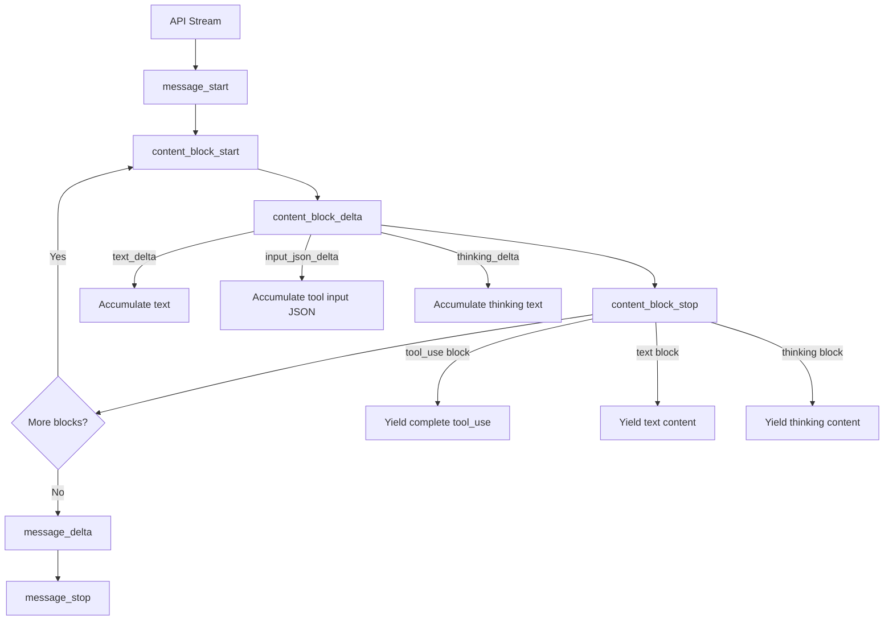
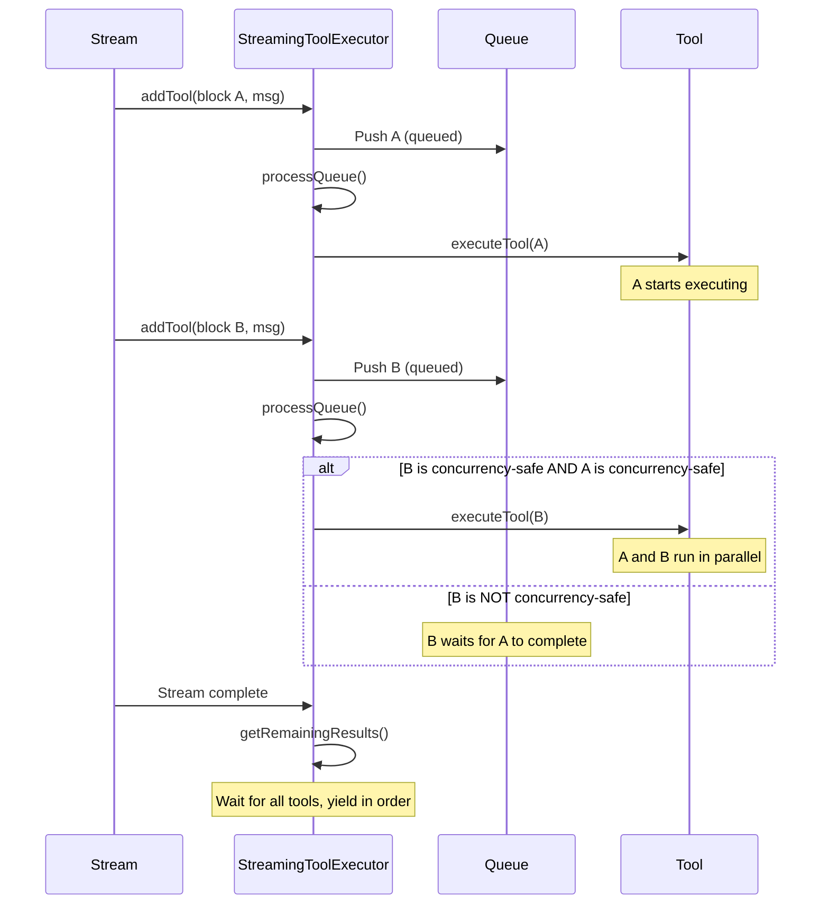

# Claude Code — LLM Output Parsing, Tool Calling, and Execution Context

> **Document 02**: Deep dive into how Claude Code handles LLM output formats, parses streaming responses, executes tool calls (including parallel execution), and manages different operational modes (plan, agent, code).

---

## Table of Contents

1. [LLM Output Format Overview](#1-llm-output-format-overview)
2. [Streaming Response Processing](#2-streaming-response-processing)
3. [Output Content Block Types](#3-output-content-block-types)
4. [Different Operational Modes](#4-different-operational-modes)
5. [Tool Call Extraction and Dispatch](#5-tool-call-extraction-and-dispatch)
6. [Tool Execution Pipeline](#6-tool-execution-pipeline)
7. [Parallel Tool Execution — StreamingToolExecutor](#7-parallel-tool-execution--streamingtoolexecutor)
8. [Parallel Tool Execution — runTools (Legacy)](#8-parallel-tool-execution--runtools-legacy)
9. [Permission Checking Flow](#9-permission-checking-flow)
10. [Error Recovery and Retry Mechanisms](#10-error-recovery-and-retry-mechanisms)
11. [Model Fallback System](#11-model-fallback-system)
12. [Stop Hooks and Turn Termination](#12-stop-hooks-and-turn-termination)
13. [Token Budget and Auto-Continue](#13-token-budget-and-auto-continue)
14. [Key Implementation Details](#14-key-implementation-details)
15. [Summary](#15-summary)

---

## 1. LLM Output Format Overview

Claude Code uses the **Anthropic Messages API** (beta endpoint) with streaming. The LLM output is a structured `BetaMessage` containing an array of content blocks.

### API Response Structure

```typescript
// From @anthropic-ai/sdk
type BetaMessage = {
  id: string                    // Message ID (e.g., "msg_01XFDUDYJgAACzvnptvVoYEL")
  type: 'message'
  role: 'assistant'
  content: BetaContentBlock[]   // Array of content blocks
  model: string                 // Model used
  stop_reason: BetaStopReason   // 'end_turn' | 'tool_use' | 'max_tokens' | null
  stop_sequence: string | null
  usage: BetaUsage              // Token counts
}

type BetaUsage = {
  input_tokens: number
  output_tokens: number
  cache_creation_input_tokens?: number
  cache_read_input_tokens?: number
  cache_deleted_input_tokens?: number
}
```

### Content Block Types

The LLM can output several types of content blocks in a single response:

```typescript
type BetaContentBlock =
  | TextBlock           // Plain text output
  | ToolUseBlock        // Tool call request
  | ThinkingBlock       // Extended thinking (chain-of-thought)
  | RedactedThinkingBlock  // Redacted thinking (privacy)
  | ConnectorTextBlock  // Internal connector text
```

### Stop Reasons

| Stop Reason | Meaning | Claude Code Behavior |
|-------------|---------|---------------------|
| `end_turn` | Model finished naturally | Turn ends, run stop hooks |
| `tool_use` | Model wants to call tools | Execute tools, continue loop |
| `max_tokens` | Hit output token limit | Recovery: escalate or retry |
| `null` | Still streaming | Continue processing |

**Important**: Claude Code does NOT rely on `stop_reason === 'tool_use'` to detect tool calls. Instead, it checks for the presence of `tool_use` blocks in the content:

```typescript
// In query.ts — tool detection during streaming
if (message.type === 'assistant') {
  const msgToolUseBlocks = message.message.content.filter(
    content => content.type === 'tool_use',
  ) as ToolUseBlock[]
  if (msgToolUseBlocks.length > 0) {
    toolUseBlocks.push(...msgToolUseBlocks)
    needsFollowUp = true  // ← This is the actual loop-continuation signal
  }
}
```

---

## 2. Streaming Response Processing

### The Streaming Pipeline

**File**: `src/services/api/claude.ts` — `queryModelWithStreaming()`

The streaming pipeline processes `BetaRawMessageStreamEvent` events from the Anthropic SDK:



### Stream Event Processing

```typescript
// Simplified from queryModelWithStreaming()
for await (const event of stream) {
  switch (event.type) {
    case 'message_start':
      // Initialize message with usage data
      // Record TTFT (Time To First Token)
      break
      
    case 'content_block_start':
      // Start accumulating a new content block
      // Type: text, tool_use, thinking, redacted_thinking
      break
      
    case 'content_block_delta':
      // Accumulate partial content
      // text_delta → append to text buffer
      // input_json_delta → append to JSON buffer
      // thinking_delta → append to thinking buffer
      break
      
    case 'content_block_stop':
      // Content block is complete
      // For tool_use: parse accumulated JSON input
      // Yield the complete block as part of an AssistantMessage
      break
      
    case 'message_delta':
      // Update stop_reason and usage
      break
      
    case 'message_stop':
      // Message is complete
      break
  }
}
```

### Yielding During Streaming

Claude Code yields `AssistantMessage` objects during streaming, not raw events. Each `content_block_stop` event triggers a yield:

```typescript
// In queryModelWithStreaming()
// When a content block completes, yield an AssistantMessage
yield {
  type: 'assistant',
  uuid: randomUUID(),
  timestamp: new Date().toISOString(),
  message: {
    id: messageId,
    role: 'assistant',
    content: [...accumulatedBlocks, currentBlock],
    model: modelId,
    stop_reason: null,  // null until message_delta
    usage: currentUsage,
  },
  requestId: requestId,
}
```

This means the query loop receives **multiple AssistantMessage yields per API response** — one per content block. The last yield has the final `stop_reason`.

### Stream Events for UI

In addition to AssistantMessages, the streaming pipeline yields `StreamEvent` objects for UI rendering:

```typescript
type StreamEvent = {
  type: 'stream_event'
  event: BetaRawMessageStreamEvent
  ttftMs?: number  // Time to first token (on message_start)
}
```

These are forwarded to the React/Ink UI for real-time display.

---

## 3. Output Content Block Types

### Text Blocks

```typescript
type TextBlock = {
  type: 'text'
  text: string
}
```

Text blocks contain the model's natural language response. In Claude Code, text output is:
- Rendered in the terminal via Ink/React components
- Formatted as Markdown
- May contain XML tags for structured communication (e.g., `<system-reminder>`)

### Tool Use Blocks

```typescript
type ToolUseBlock = {
  type: 'tool_use'
  id: string           // Unique ID for this tool call
  name: string         // Tool name (e.g., "Read", "Bash", "Edit")
  input: object        // Tool-specific input parameters
}
```

Tool use blocks are the primary mechanism for the model to take actions. Key properties:
- **Multiple per response**: The model can request multiple tool calls in a single response
- **Streamed incrementally**: The `input` JSON is accumulated via `input_json_delta` events
- **Validated on completion**: Input is parsed against the tool's Zod schema after streaming

### Thinking Blocks

```typescript
type ThinkingBlock = {
  type: 'thinking'
  thinking: string     // The model's chain-of-thought reasoning
  signature: string    // Cryptographic signature for verification
}

type RedactedThinkingBlock = {
  type: 'redacted_thinking'
  data: string         // Encrypted thinking content
}
```

Thinking blocks contain the model's internal reasoning. They are:
- **Not shown to users** by default (can be enabled with verbose mode)
- **Preserved across turns** within a trajectory (required by API rules)
- **Stripped on model fallback** (signatures are model-bound)
- **Counted in token estimation** (thinking text, not signature)

### Thinking Rules (from code comments)

> "The rules of thinking are lengthy and fortuitous..."
> 1. A message containing thinking/redacted_thinking must be in a query with `max_thinking_length > 0`
> 2. A thinking block may not be the last message in a block
> 3. Thinking blocks must be preserved for the duration of an assistant trajectory

---

## 4. Different Operational Modes

Claude Code operates in several modes that affect output behavior:

### Normal Mode (Default)

- Full tool access
- Text + tool_use output
- Interactive permission prompts
- Thinking enabled (adaptive)

### Plan Mode

- **Read-only tools only**: No file writes, no bash mutations
- Model can use: Read, Grep, Glob, WebFetch, WebSearch, AgentTool (Explore/Plan agents)
- Output focuses on analysis and planning
- Entered via `EnterPlanModeTool` or `/plan` command
- Exited via `ExitPlanModeV2Tool`

```typescript
// Plan mode restricts tool access
if (permissionMode === 'plan') {
  // Filter to read-only tools
  // Add plan-specific agents (Explore, Plan)
  // Disable write tools
}
```

### Coordinator Mode

- **No direct tool execution**: Only AgentTool, SendMessageTool, TaskStopTool
- Output is primarily text (instructions to user) and tool calls (spawning workers)
- Workers do the actual work
- System prompt is completely different (coordinator-specific)

```typescript
// Coordinator system prompt
"You are Claude Code, an AI assistant that orchestrates software engineering tasks across multiple workers."
// Only tools: Agent, SendMessage, TaskStop
```

### Agent/Sub-Agent Mode

- Runs in a separate query loop
- May have restricted tool access (per agent definition)
- May have different thinking config (disabled for cost control)
- May have different permission mode (e.g., `bubble` for background agents)
- Output is captured and returned to parent as tool result

### Proactive Mode

- Autonomous agent behavior
- Simplified system prompt
- Continuous work loop
- No user interaction required

### Fast Mode

- Uses a faster/cheaper model for simple operations
- Toggled based on task complexity
- Cooldown period between switches

---

## 5. Tool Call Extraction and Dispatch

### Extraction During Streaming

Tool calls are extracted from the streaming response in real-time:

```typescript
// In query.ts — inside the streaming loop
for await (const message of deps.callModel({ ... })) {
  if (message.type === 'assistant') {
    // Extract tool_use blocks from this assistant message fragment
    const msgToolUseBlocks = message.message.content.filter(
      content => content.type === 'tool_use',
    ) as ToolUseBlock[]
    
    if (msgToolUseBlocks.length > 0) {
      toolUseBlocks.push(...msgToolUseBlocks)
      needsFollowUp = true
      
      // If streaming tool execution is enabled, start executing immediately
      if (streamingToolExecutor) {
        for (const toolBlock of msgToolUseBlocks) {
          streamingToolExecutor.addTool(toolBlock, message)
        }
      }
    }
  }
}
```

### Key Design: Streaming Tool Execution

When `streamingToolExecution` is enabled (feature gate), tools start executing **while the model is still streaming**. This means:

1. Model outputs `tool_use` block A → execution starts immediately
2. Model continues streaming text or more `tool_use` blocks
3. Model outputs `tool_use` block B → execution starts (if concurrency-safe)
4. Model finishes streaming
5. Remaining tool results are collected

This significantly reduces latency for multi-tool responses.

### Input Backfilling

Before yielding tool calls to the SDK/UI, inputs are "backfilled" with derived fields:

```typescript
// In query.ts — backfill observable input
if (tool?.backfillObservableInput) {
  const inputCopy = { ...originalInput }
  tool.backfillObservableInput(inputCopy)
  // Only clone if new fields were ADDED (not overwritten)
  // Overwrites would break VCR fixture hashes
}
```

For example, `FileEditTool.backfillObservableInput` expands `~` in `file_path` to the absolute path.

---

## 6. Tool Execution Pipeline

### Full Pipeline for a Single Tool Call

**File**: `src/services/tools/toolExecution.ts` — `runToolUse()` and `checkPermissionsAndCallTool()`

```mermaid
graph TD
    A[ToolUseBlock from API] --> B{Tool exists?}
    B -->|No| C[Error: No such tool]
    B -->|Yes| D{Aborted?}
    D -->|Yes| E[Cancel message]
    D -->|No| F[Input Validation]
    
    F --> G{Zod parse OK?}
    G -->|No| H[Format Zod error]
    H --> I{Schema not sent?}
    I -->|Yes| J[Add ToolSearch hint]
    I -->|No| K[Return error]
    
    G -->|Yes| L[tool.validateInput]
    L --> M{Valid?}
    M -->|No| N[Return validation error]
    M -->|Yes| O[Pre-tool-use hooks]
    
    O --> P[Permission Check]
    P --> Q{Allowed?}
    Q -->|Denied| R[Permission denied hooks]
    Q -->|Ask| S[Show permission prompt]
    Q -->|Allowed| T[Start execution span]
    
    S --> U{User approves?}
    U -->|No| V[Reject message]
    U -->|Yes| T
    
    T --> W[tool.call()]
    W --> X[Post-tool-use hooks]
    X --> Y[Map result to ToolResultBlockParam]
    Y --> Z[Maybe persist large result]
    Z --> AA[Yield result message]
```

### Input Validation

```typescript
// Step 1: Zod schema validation
const parsedInput = tool.inputSchema.safeParse(toolInput)
if (!parsedInput.success) {
  // Format Zod error with field-level details
  const errorMsg = formatZodValidationError(parsedInput.error)
  
  // Check if schema wasn't sent (deferred tool not loaded)
  const hint = buildSchemaNotSentHint(tool, messages, tools)
  
  yield errorMessage + (hint ?? '')
  return
}

// Step 2: Tool-specific validation
const validationResult = await tool.validateInput(parsedInput.data, context)
if (!validationResult.result) {
  yield validationResult.message
  return
}
```

### Tool Result Format

Tool results are returned as `ToolResultBlockParam`:

```typescript
type ToolResultBlockParam = {
  type: 'tool_result'
  tool_use_id: string      // Matches the tool_use block's id
  content: string | ContentBlockParam[]  // Result content
  is_error?: boolean       // Whether this is an error result
}
```

Each tool implements `mapToolResultToToolResultBlockParam()` to convert its output:

```typescript
// Example: GrepTool
mapToolResultToToolResultBlockParam(output, toolUseID) {
  if (output.filenames.length === 0) {
    return { tool_use_id: toolUseID, type: 'tool_result', content: 'No files found' }
  }
  return {
    tool_use_id: toolUseID,
    type: 'tool_result',
    content: output.filenames.join('\n'),
  }
}
```

---

## 7. Parallel Tool Execution — StreamingToolExecutor

**File**: `src/services/tools/StreamingToolExecutor.ts` (531 lines)

The `StreamingToolExecutor` is the primary tool execution engine, designed for maximum parallelism with streaming.

### Architecture

```
StreamingToolExecutor
├── tools: TrackedTool[]          // Queue of all tools
├── toolUseContext: ToolUseContext // Shared execution context
├── hasErrored: boolean           // Error cascade flag
├── siblingAbortController        // Child of parent abort
└── progressAvailableResolve      // Wake-up signal for progress
```

### Tool States

```
queued → executing → completed → yielded
```

### Concurrency Model

```typescript
// Concurrency-safe tools can run in parallel
// Non-concurrent tools must run exclusively

private canExecuteTool(isConcurrencySafe: boolean): boolean {
  const executingTools = this.tools.filter(t => t.status === 'executing')
  return (
    executingTools.length === 0 ||
    (isConcurrencySafe && executingTools.every(t => t.isConcurrencySafe))
  )
}
```

**Concurrency-safe tools** (can run in parallel):
- GrepTool (`isConcurrencySafe() = true`)
- GlobTool (`isConcurrencySafe() = true`)
- FileReadTool (`isConcurrencySafe() = true`)
- WebFetchTool (`isConcurrencySafe() = true`)
- WebSearchTool (`isConcurrencySafe() = true`)

**Non-concurrent tools** (must run exclusively):
- BashTool (depends on command — read-only commands are concurrent-safe)
- FileEditTool (writes to files)
- FileWriteTool (writes to files)
- AgentTool (spawns sub-processes)

### Execution Flow



### Error Cascade (Sibling Abort)

When a Bash tool errors, all sibling tools are cancelled:

```typescript
if (isErrorResult && tool.block.name === BASH_TOOL_NAME) {
  this.hasErrored = true
  this.erroredToolDescription = this.getToolDescription(tool)
  this.siblingAbortController.abort('sibling_error')
}
```

Only Bash errors trigger cascade — other tool errors are independent:
> "Bash commands often have implicit dependency chains (e.g. mkdir fails → subsequent commands pointless). Read/WebFetch/etc are independent — one failure shouldn't nuke the rest."

### Progress Reporting

Tools can report progress during execution:

```typescript
// Progress messages are yielded immediately (not buffered)
if (update.message.type === 'progress') {
  tool.pendingProgress.push(update.message)
  // Signal that progress is available
  if (this.progressAvailableResolve) {
    this.progressAvailableResolve()
  }
}
```

### Interrupt Handling

When the user interrupts (ESC):

```typescript
private getToolInterruptBehavior(tool: TrackedTool): 'cancel' | 'block' {
  const definition = findToolByName(this.toolDefinitions, tool.block.name)
  return definition?.interruptBehavior?.() ?? 'block'
}
```

- `cancel`: Tool is immediately cancelled with a synthetic error
- `block`: Tool continues running, user waits for completion

---

## 8. Parallel Tool Execution — runTools (Legacy)

**File**: `src/services/tools/toolOrchestration.ts` (189 lines)

The legacy `runTools` function is used when streaming tool execution is disabled.

### Partitioning Strategy

```typescript
function partitionToolCalls(toolUseMessages, toolUseContext): Batch[] {
  // Group consecutive concurrency-safe tools together
  // Each non-safe tool gets its own batch
  // Example: [Read, Read, Grep, Edit, Read, Read]
  //        → [{ safe: true, [Read, Read, Grep] },
  //           { safe: false, [Edit] },
  //           { safe: true, [Read, Read] }]
}
```

### Execution

```typescript
// Concurrent batch: all tools run in parallel
async function* runToolsConcurrently(blocks, ...): AsyncGenerator {
  yield* all(
    blocks.map(async function* (toolUse) {
      yield* runToolUse(toolUse, ...)
    }),
    getMaxToolUseConcurrency(),  // Default: 10
  )
}

// Serial batch: tools run one at a time
async function* runToolsSerially(blocks, ...): AsyncGenerator {
  for (const toolUse of blocks) {
    yield* runToolUse(toolUse, ...)
  }
}
```

### Max Concurrency

```typescript
function getMaxToolUseConcurrency(): number {
  return parseInt(process.env.CLAUDE_CODE_MAX_TOOL_USE_CONCURRENCY || '', 10) || 10
}
```

---

## 9. Permission Checking Flow

### Permission Decision Types

```typescript
type PermissionDecision = 
  | { behavior: 'allow', reason?: PermissionDecisionReason }
  | { behavior: 'deny', message: string, reason?: PermissionDecisionReason }
  | { behavior: 'ask', message: string }
```

### Permission Check Order

```
1. Tool-specific checkPermissions()
   └── e.g., FileEditTool checks write permissions
   
2. General permission rules (alwaysAllowRules)
   ├── cliArg rules (from --allowedTools)
   ├── session rules (user approved this session)
   ├── localSettings rules (on-disk grants)
   └── policySettings rules (enterprise policies)

3. Pre-tool-use hooks
   └── Custom hooks that can allow/deny

4. Permission mode check
   ├── bypassPermissions → allow
   ├── acceptEdits → allow for edits
   ├── auto → classifier check
   └── default → prompt user

5. User prompt (if needed)
   └── Allow once / Allow always / Deny
```

### Auto Mode Classifier

When `permissionMode === 'auto'`, a classifier determines if the tool call is safe:

```typescript
// Simplified auto-mode flow
if (permissionMode === 'auto') {
  const classifierResult = await classifyToolCall(tool, input)
  if (classifierResult === 'safe') {
    return { behavior: 'allow' }
  }
  // Fall through to user prompt
}
```

### Speculative Classifier Check

For Bash commands, a speculative classifier check starts before the model finishes streaming:

```typescript
// In toolExecution.ts
if (tool.name === BASH_TOOL_NAME) {
  startSpeculativeClassifierCheck(input.command)
  // Result is consumed later during actual permission check
}
```

---

## 10. Error Recovery and Retry Mechanisms

### Max Output Tokens Recovery

When the model hits the output token limit (`stop_reason === 'max_tokens'`):

```typescript
// Recovery strategy (up to 3 attempts)
const MAX_OUTPUT_TOKENS_RECOVERY_LIMIT = 3

// Step 1: Inject recovery message
yield createUserMessage({
  content: 'Your response was cut off. Continue from where you left off.',
  isMeta: true,
})

// Step 2: Escalate output tokens (8K → 64K)
if (recoveryCount >= 1) {
  maxOutputTokensOverride = ESCALATED_MAX_TOKENS  // 64K
}

// Step 3: Continue loop
state = { ...state, maxOutputTokensRecoveryCount: recoveryCount + 1 }
```

### Prompt Too Long Recovery

When the prompt exceeds the context window:

```
1. Context Collapse Drain (if enabled)
   └── Commit all staged collapses to reduce context
   
2. Reactive Compact (if enabled)
   └── Emergency compaction of conversation history
   
3. Surface error to user
   └── "Conversation too long. Press esc twice to go up a few messages and try again."
```

### Media Size Error Recovery

When images/PDFs are too large:

```typescript
// Reactive compact strips media and retries
if (isWithheldMediaSizeError(lastMessage)) {
  const compacted = await reactiveCompact(messages, { stripMedia: true })
  // Retry with compacted messages
}
```

### API Error Retry

**File**: `src/services/api/withRetry.ts`

```typescript
// Exponential backoff with jitter
async function withRetry<T>(fn: () => Promise<T>, context: RetryContext): Promise<T> {
  for (let attempt = 0; attempt <= maxRetries; attempt++) {
    try {
      return await fn()
    } catch (error) {
      if (!isRetryable(error)) throw error
      const delay = getRetryDelay(attempt)  // Exponential backoff
      await sleep(delay)
    }
  }
}
```

---

## 11. Model Fallback System

When the primary model is overloaded (529 error):

```typescript
// In query.ts — catch FallbackTriggeredError
catch (innerError) {
  if (innerError instanceof FallbackTriggeredError && fallbackModel) {
    // 1. Clear all accumulated state
    assistantMessages.length = 0
    toolResults.length = 0
    toolUseBlocks.length = 0
    
    // 2. Switch model
    currentModel = fallbackModel
    toolUseContext.options.mainLoopModel = fallbackModel
    
    // 3. Strip thinking signatures (model-bound)
    messagesForQuery = stripSignatureBlocks(messagesForQuery)
    
    // 4. Discard streaming tool executor state
    streamingToolExecutor?.discard()
    streamingToolExecutor = new StreamingToolExecutor(...)
    
    // 5. Notify user
    yield createSystemMessage(
      `Switched to ${fallbackModel} due to high demand for ${originalModel}`,
      'warning',
    )
    
    // 6. Retry with new model
    continue  // Back to while(attemptWithFallback) loop
  }
}
```

### Streaming Fallback

When a streaming response fails mid-stream:

```typescript
// onStreamingFallback callback
onStreamingFallback: () => {
  streamingFallbackOccured = true
}

// After streaming completes, if fallback occurred:
if (streamingFallbackOccured) {
  // Tombstone orphaned messages (invalid thinking signatures)
  for (const msg of assistantMessages) {
    yield { type: 'tombstone', message: msg }
  }
  
  // Reset all state
  assistantMessages.length = 0
  toolResults.length = 0
  
  // Discard streaming executor
  streamingToolExecutor?.discard()
  streamingToolExecutor = new StreamingToolExecutor(...)
}
```

---

## 12. Stop Hooks and Turn Termination

**File**: `src/query/stopHooks.ts`

When the model finishes without requesting tools (`needsFollowUp === false`), stop hooks run:

```typescript
// In query.ts — after streaming, when !needsFollowUp
const stopHookResult = await handleStopHooks(
  assistantMessages,
  messagesForQuery,
  toolUseContext,
  querySource,
)

switch (stopHookResult.action) {
  case 'continue':
    // Hook wants the model to continue (e.g., verification failed)
    state = { ...state, stopHookActive: true }
    break
    
  case 'stop':
    // Normal termination
    return { reason: 'completed' }
    
  case 'prevented':
    // Hook prevented the turn from ending
    return { reason: 'stop_hook_prevented' }
}
```

### Stop Hook Types

- **Custom hooks**: User-defined hooks that run on turn completion
- **Computer use cleanup**: Auto-unhide + lock release for computer use
- **Session memory update**: Trigger session memory extraction

---

## 13. Token Budget and Auto-Continue

**File**: `src/query/tokenBudget.ts`

When a user specifies a token budget (e.g., "+500k"), the system auto-continues:

```typescript
// In query.ts — after normal turn completion
if (feature('TOKEN_BUDGET') && budgetTracker) {
  const budgetResult = checkTokenBudget(budgetTracker, state)
  if (budgetResult.shouldContinue) {
    // Inject continuation message
    yield createUserMessage({
      content: `Token budget: ${budgetResult.used}/${budgetResult.total} used. Continue working.`,
      isMeta: true,
    })
    
    incrementBudgetContinuationCount()
    state = { ...state, transition: { reason: 'token_budget_continuation' } }
    continue  // Back to while(true) loop
  }
}
```

---

## 14. Key Implementation Details

### 1. Message Normalization for API

Before sending messages to the API, they're normalized:

```typescript
// normalizeMessagesForAPI() in messages.ts
// - Merges consecutive user messages (Bedrock compatibility)
// - Filters out progress messages
// - Merges attachment messages into adjacent user messages
// - Ensures tool_result pairing (every tool_use has a tool_result)
// - Strips advisor blocks
// - Validates image counts (max per request)
```

### 2. Tool Input Normalization

Tool inputs are normalized before sending to the API:

```typescript
// normalizeToolInputForAPI() in api.ts
// - Removes undefined values
// - Converts string numbers to actual numbers (for semantic fields)
// - Handles boolean coercion
```

### 3. Thinking Block Preservation

Thinking blocks must be preserved within a trajectory:

```typescript
// Rules:
// 1. Thinking blocks in messages → query must have max_thinking_length > 0
// 2. Thinking blocks cannot be the last block
// 3. Must be preserved for the duration of an assistant trajectory
//    (single turn, or turn + tool_result + following assistant)
```

### 4. Tool Use Summary Generation

After tool execution, a summary is generated asynchronously:

```typescript
// Fire-and-forget summary generation (runs during next model call)
state.pendingToolUseSummary = generateToolUseSummary(
  toolUseBlocks,
  toolResults,
  toolUseContext,
)

// Consumed at the start of the next iteration
if (pendingToolUseSummary) {
  const summary = await pendingToolUseSummary
  if (summary) yield summary
}
```

### 5. Queued Command Processing

Between turns, queued commands (from message queue) are processed:

```typescript
// In query.ts — after tool execution
const queuedCommandsSnapshot = getCommandsByMaxPriority()
for (const cmd of queuedCommandsSnapshot) {
  if (isSlashCommand(cmd)) {
    // Process slash command
    removeFromQueue(cmd.uuid)
    consumedCommandUuids.push(cmd.uuid)
  }
}
```

### 6. Abort Signal Propagation

```
User presses ESC
  └── toolUseContext.abortController.abort()
       ├── StreamingToolExecutor checks signal
       │   ├── Queued tools → synthetic error
       │   ├── Executing tools → depends on interruptBehavior
       │   └── 'cancel' tools → immediate abort
       ├── API stream aborted
       └── query.ts detects abort after streaming
           └── Yields interruption message
           └── Returns { reason: 'aborted_streaming' }
```

---

## 15. Summary

Claude Code's LLM output handling is characterized by several key design decisions:

### Output Format
- Uses the Anthropic Messages API with structured content blocks (text, tool_use, thinking)
- Does NOT rely on `stop_reason` for tool detection — checks for `tool_use` blocks directly
- Supports multiple tool calls per response
- Thinking blocks provide chain-of-thought reasoning (adaptive mode)

### Streaming Architecture
- Processes `BetaRawMessageStreamEvent` events in real-time
- Yields `AssistantMessage` objects per content block (not per response)
- Enables streaming tool execution — tools start before the model finishes
- Supports streaming fallback on mid-stream failures

### Parallel Tool Execution
- **StreamingToolExecutor**: Primary engine, starts tools during streaming
  - Concurrency-safe tools run in parallel
  - Non-concurrent tools run exclusively
  - Bash errors cascade to siblings
  - Progress reported immediately
- **runTools**: Legacy fallback, partitions into batches
  - Up to 10 concurrent tools per batch
  - Serial execution for non-safe tools

### Error Recovery
- **Max output tokens**: 3-attempt recovery with token escalation (8K → 64K)
- **Prompt too long**: Context collapse drain → reactive compact → error
- **Model overload**: Automatic fallback to alternative model
- **Streaming failure**: Tombstone orphaned messages, retry with fresh state

### Mode-Specific Behavior
- **Normal**: Full tool access, interactive permissions
- **Plan**: Read-only tools, analysis focus
- **Coordinator**: Delegation only, no direct execution
- **Agent**: Isolated context, restricted tools, captured output
- **Proactive**: Autonomous loop, simplified prompt

The system is designed for maximum throughput (streaming execution, parallel tools, async prefetch) while maintaining correctness (permission checks, error recovery, abort handling) and cache efficiency (stable message format, frozen replacement decisions).

---

*Previous document: [01-code-retrieval-indexing-and-context-building.md](./01-code-retrieval-indexing-and-context-building.md)*
*Next document: [03-multi-agent-memory-session-management.md](./03-multi-agent-memory-session-management.md) — Deep dive into multi-agent communication, memory systems, and session lifecycle.*
