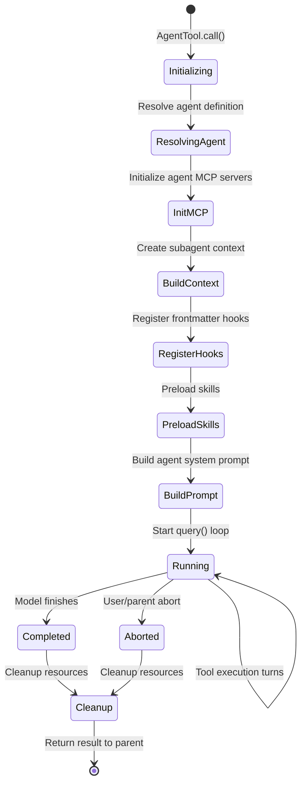
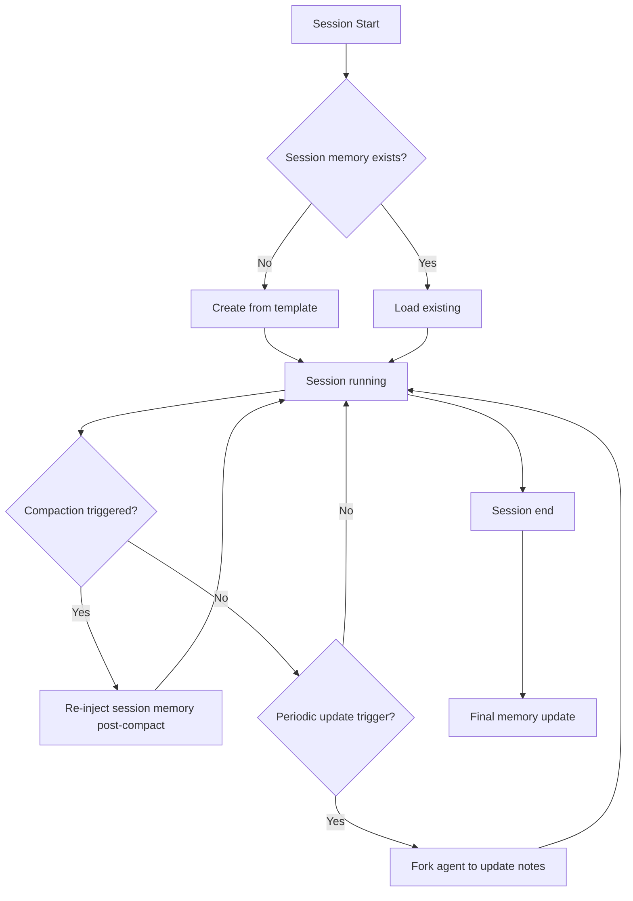
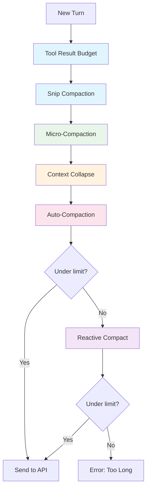
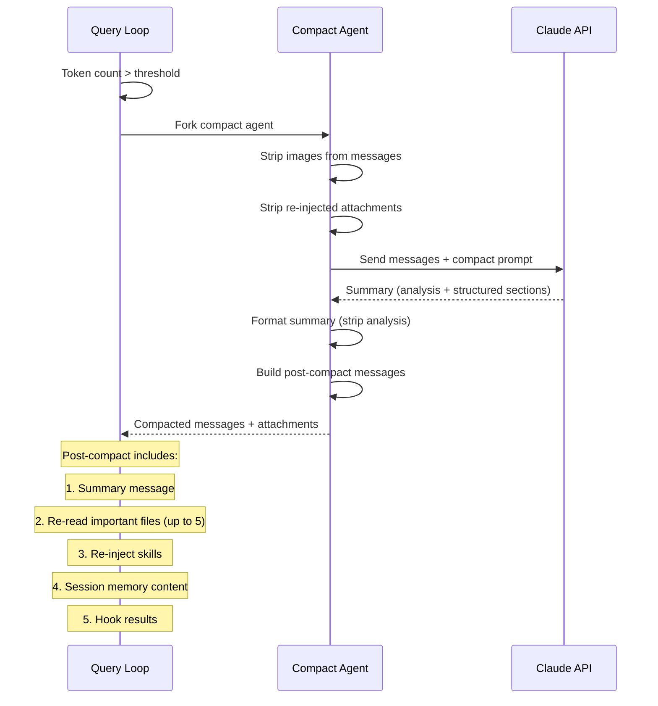
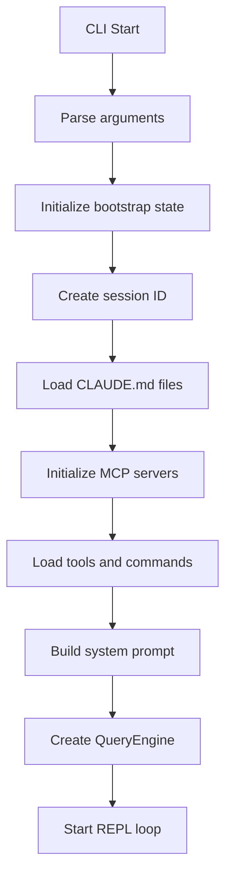

# Claude Code — Multi-Agent Design, Memory, Session Management, and Runtime

> **Document 03**: Deep dive into multi-agent communication patterns, memory hierarchy, session lifecycle, context compression strategies, and the runtime architecture.

---

## Table of Contents

1. [Multi-Agent Architecture Overview](#1-multi-agent-architecture-overview)
2. [Agent Types and Lifecycle](#2-agent-types-and-lifecycle)
3. [Agent Communication Patterns](#3-agent-communication-patterns)
4. [Fork Subagent — Cache-Sharing Optimization](#4-fork-subagent--cache-sharing-optimization)
5. [Coordinator Mode — Worker Orchestration](#5-coordinator-mode--worker-orchestration)
6. [Memory Hierarchy](#6-memory-hierarchy)
7. [Session Memory System](#7-session-memory-system)
8. [Context Compression Deep Dive](#8-context-compression-deep-dive)
9. [Session Lifecycle and Persistence](#9-session-lifecycle-and-persistence)
10. [Runtime Architecture](#10-runtime-architecture)
11. [User Interaction Model](#11-user-interaction-model)
12. [SDK Interface](#12-sdk-interface)
13. [Key Design Patterns and Trade-offs](#13-key-design-patterns-and-trade-offs)
14. [Summary](#14-summary)

---

## 1. Multi-Agent Architecture Overview

Claude Code supports a rich multi-agent system with several distinct agent patterns:

```
┌─────────────────────────────────────────────────────────────┐
│                    Main Agent (REPL)                          │
│  ┌─────────────────────────────────────────────────────────┐│
│  │ QueryEngine → query() loop                              ││
│  │ Full tool access, interactive permissions               ││
│  └─────────────────────────────────────────────────────────┘│
│                                                              │
│  ┌──────────────┐  ┌──────────────┐  ┌──────────────┐      │
│  │  Sub-Agent    │  │  Fork Agent  │  │  Team Agent  │      │
│  │  (AgentTool)  │  │  (Forked)    │  │  (Swarm)     │      │
│  │  Isolated ctx │  │  Shared cache│  │  Persistent  │      │
│  │  Own query()  │  │  Own query() │  │  Named agent │      │
│  └──────────────┘  └──────────────┘  └──────────────┘      │
│                                                              │
│  ┌──────────────┐  ┌──────────────┐  ┌──────────────┐      │
│  │  Session Mem  │  │  Compact     │  │  Skill       │      │
│  │  Agent        │  │  Agent       │  │  Agent       │      │
│  │  (Forked)     │  │  (Forked)    │  │  (Forked)    │      │
│  │  Background   │  │  Background  │  │  Background  │      │
│  └──────────────┘  └──────────────┘  └──────────────┘      │
│                                                              │
│  ┌─────────────────────────────────────────────────────────┐│
│  │ Coordinator Mode (optional)                             ││
│  │ Main agent becomes pure orchestrator                    ││
│  │ Workers do all tool execution                           ││
│  └─────────────────────────────────────────────────────────┘│
└─────────────────────────────────────────────────────────────┘
```

---

## 2. Agent Types and Lifecycle

### Sub-Agent (via AgentTool)

**File**: `src/tools/AgentTool/runAgent.ts` (974 lines)

The primary mechanism for spawning autonomous agents:

```typescript
// AgentTool input schema
z.object({
  prompt: z.string(),           // Task description
  subagent_type: z.enum(['worker', 'researcher', 'verifier']).optional(),
  model: z.string().optional(), // Override model
  description: z.string(),      // Human-readable description
})
```

#### Sub-Agent Lifecycle



#### Sub-Agent Context Isolation

```typescript
// createSubagentContext() — key isolation decisions
const subagentContext = {
  // CLONED (isolated)
  readFileState: cloneFileStateCache(parent.readFileState),
  abortController: createChildAbortController(parent.abortController),
  nestedMemoryAttachmentTriggers: new Set(),
  toolDecisions: undefined,
  contentReplacementState: cloneContentReplacementState(parent.state),
  
  // NO-OP (isolated)
  setAppState: () => {},           // Can't modify parent state
  setInProgressToolUseIDs: () => {},
  setResponseLength: () => {},
  
  // SHARED (read-only)
  getAppState: wrappedGetAppState, // Wrapped to set shouldAvoidPermissionPrompts
  options: customOptions,          // May have different tools/model
  
  // NEW
  agentId: createAgentId(),        // Unique agent ID
  queryTracking: { chainId: randomUUID(), depth: parent.depth + 1 },
}
```

### Fork Agent (via runForkedAgent)

**File**: `src/utils/forkedAgent.ts` (690 lines)

Fork agents inherit the parent's full conversation context for prompt cache sharing:

```typescript
// Fork agent creation
const result = await runForkedAgent({
  promptMessages: [createUserMessage({ content: taskPrompt })],
  cacheSafeParams: {
    systemPrompt,      // Identical to parent
    userContext,        // Identical to parent
    systemContext,      // Identical to parent
    toolUseContext,     // Cloned from parent
    forkContextMessages: messages,  // Parent's full message history
  },
  canUseTool,
  querySource: 'session_memory',
  forkLabel: 'session_memory',
  maxTurns: 1,
})
```

**Key property**: The API request prefix (system prompt + tools + context messages) is byte-identical to the parent's, enabling prompt cache hits.

**Used for**:
- Session memory updates
- Compact summaries
- Prompt suggestions
- Side questions (/btw)
- Skill execution
- Post-turn summaries

### Team Agent (via TeamCreateTool)

**File**: `src/tools/TeamCreateTool/`

Named persistent agents for parallel work in swarm mode:

```typescript
// Team agent creation
z.object({
  name: z.string(),        // Unique agent name
  description: z.string(), // What this agent does
  tools: z.array(z.string()).optional(), // Restricted tool set
})
```

Team agents:
- Have persistent identity (name-based)
- Can be messaged via SendMessageTool
- Can be deleted via TeamDeleteTool
- Run in the in-process swarm runner

---

## 3. Agent Communication Patterns

### Parent → Sub-Agent

Communication is one-directional at creation:

```typescript
// Parent sends prompt to sub-agent
AgentTool.call({
  prompt: "Fix the null pointer in src/auth/validate.ts:42...",
  description: "Fix auth bug",
})
```

### Sub-Agent → Parent

Results flow back as the tool result:

```typescript
// Sub-agent's final text response becomes the tool result
return {
  data: {
    result: lastAssistantMessage.text,
    agentId: agentId,
  }
}
```

### Parent → Existing Agent (SendMessage)

Continue an existing agent with follow-up:

```typescript
// SendMessageTool
z.object({
  to: z.string(),      // Agent ID
  message: z.string(), // Follow-up message
})
```

### Async Agent Notifications

In coordinator mode, agent results arrive as `<task-notification>` XML:

```xml
<task-notification>
  <task-id>agent-a1b</task-id>
  <status>completed</status>
  <summary>Agent "Investigate auth bug" completed</summary>
  <result>Found null pointer in src/auth/validate.ts:42...</result>
  <usage>
    <total_tokens>15000</total_tokens>
    <tool_uses>8</tool_uses>
    <duration_ms>12500</duration_ms>
  </usage>
</task-notification>
```

### Shared State Communication

Some state is shared between agents:

```typescript
// setAppStateForTasks — always reaches root store
// Used for: task registration, background bash task tracking
// Prevents zombie processes when setAppState is no-op

// updateAttributionState — shared functional callback
// Safe to share: concurrent calls compose via React's state queue

// readFileState — cloned at creation
// Sub-agent sees parent's file cache snapshot
// Changes don't propagate back
```

### Scratchpad Communication (Coordinator Mode)

In coordinator mode, workers can communicate via a shared scratchpad directory:

```typescript
// Scratchpad directory for cross-worker knowledge
content += `\nScratchpad directory: ${scratchpadDir}`
content += `\nWorkers can read and write here without permission prompts.`
```

---

## 4. Fork Subagent — Cache-Sharing Optimization

### The Cache-Sharing Problem

Every API call has a cache key based on: system prompt + tools + model + message prefix. Fork agents solve the problem of running side tasks without paying the full input token cost.

### CacheSafeParams

```typescript
type CacheSafeParams = {
  systemPrompt: SystemPrompt       // Must match parent
  userContext: { [k: string]: string }  // Must match parent
  systemContext: { [k: string]: string } // Must match parent
  toolUseContext: ToolUseContext    // Contains tools, model
  forkContextMessages: Message[]   // Parent's full history
}
```

### Cache Hit Guarantee

For a fork to hit the parent's cache:
1. System prompt must be byte-identical
2. Tool schemas must be in the same order
3. Model must be the same
4. Message prefix must be identical (parent's messages)
5. Thinking config must match (budget_tokens)

```
Parent's API call:
  [system prompt] [tools] [parent messages] [user turn]
                                              ↑ cache breakpoint

Fork's API call:
  [system prompt] [tools] [parent messages] [fork prompt]
  ←────── identical prefix ──────→           ↑ new content
```

### Saved CacheSafeParams

After each turn, the main loop saves its params for post-turn forks:

```typescript
// In stopHooks.ts — after each turn
saveCacheSafeParams({
  systemPrompt,
  userContext,
  systemContext,
  toolUseContext,
  forkContextMessages: messages,
})

// Post-turn forks (session memory, prompt suggestion) use:
const params = getLastCacheSafeParams()
```

---

## 5. Coordinator Mode — Worker Orchestration

**File**: `src/coordinator/coordinatorMode.ts` (370 lines)

### Architecture

```
┌─────────────────────────────────────────┐
│           Coordinator Agent              │
│  Tools: Agent, SendMessage, TaskStop     │
│  Role: Plan, delegate, synthesize        │
├─────────────────────────────────────────┤
│                                          │
│  ┌──────────┐  ┌──────────┐  ┌────────┐│
│  │ Worker 1  │  │ Worker 2  │  │Worker 3││
│  │ Research  │  │ Implement │  │ Verify ││
│  │ Full tools│  │ Full tools│  │Full tls││
│  └──────────┘  └──────────┘  └────────┘│
│                                          │
│  Communication: task-notification XML    │
│  Shared: Scratchpad directory            │
└─────────────────────────────────────────┘
```

### Workflow Phases

| Phase | Who | Purpose |
|-------|-----|---------|
| Research | Workers (parallel) | Investigate codebase, find files |
| Synthesis | **Coordinator** | Read findings, craft implementation specs |
| Implementation | Workers | Make targeted changes per spec |
| Verification | Workers | Test changes work |

### Key Design Principles

1. **Workers can't see coordinator's conversation** — every prompt must be self-contained
2. **Coordinator must synthesize** — never delegate understanding ("based on your findings" is an anti-pattern)
3. **Parallelism is the superpower** — launch independent workers concurrently
4. **Continue vs. spawn** — choose based on context overlap

### Worker Tool Access

```typescript
// Workers get full tool access
const workerTools = Array.from(ASYNC_AGENT_ALLOWED_TOOLS)
  .filter(name => !INTERNAL_WORKER_TOOLS.has(name))
  .sort()

// Internal tools (coordinator-only)
const INTERNAL_WORKER_TOOLS = new Set([
  TEAM_CREATE_TOOL_NAME,
  TEAM_DELETE_TOOL_NAME,
  SEND_MESSAGE_TOOL_NAME,
  SYNTHETIC_OUTPUT_TOOL_NAME,
])
```

---

## 6. Memory Hierarchy

### Memory Sources (Priority Order)

```
┌─────────────────────────────────────────────────────────┐
│ 1. Enterprise CLAUDE.md                                  │
│    Location: Configured by enterprise admin              │
│    Scope: Organization-wide rules and policies           │
│    Injection: User context (prepended to messages)       │
├─────────────────────────────────────────────────────────┤
│ 2. User CLAUDE.md                                        │
│    Location: ~/.claude/CLAUDE.md                         │
│    Scope: Personal preferences and rules                 │
│    Injection: User context (prepended to messages)       │
├─────────────────────────────────────────────────────────┤
│ 3. Project CLAUDE.md                                     │
│    Location: <project-root>/CLAUDE.md                    │
│    Scope: Project-specific instructions                  │
│    Injection: User context (prepended to messages)       │
├─────────────────────────────────────────────────────────┤
│ 4. Directory CLAUDE.md (nested)                          │
│    Location: <project>/<dir>/CLAUDE.md                   │
│    Scope: Directory-specific rules                       │
│    Injection: Attachment messages (on file access)       │
├─────────────────────────────────────────────────────────┤
│ 5. Session Memory                                        │
│    Location: ~/.claude/session-memory/<session>.md        │
│    Scope: Current session notes                          │
│    Injection: Post-compact re-injection                  │
├─────────────────────────────────────────────────────────┤
│ 6. Memory Directory (memdir)                             │
│    Location: ~/.claude/memory/                           │
│    Scope: Persistent cross-session memory                │
│    Injection: Memory prefetch attachments                │
├─────────────────────────────────────────────────────────┤
│ 7. Auto-Extracted Memories                               │
│    Location: ~/.claude/memory/auto/                      │
│    Scope: LLM-extracted insights                         │
│    Injection: Memory prefetch attachments                │
└─────────────────────────────────────────────────────────┘
```

### CLAUDE.md Loading

**File**: `src/utils/claudemd.ts`

```typescript
// CLAUDE.md files are loaded at session start
async function getMemoryFiles(): Promise<MemoryFileInfo[]> {
  return [
    ...await getUserMemoryFiles(),      // ~/.claude/CLAUDE.md
    ...await getProjectMemoryFiles(),   // <project>/CLAUDE.md
    ...await getEnterpriseMemoryFiles(), // Enterprise config
  ]
}

// Nested CLAUDE.md files are loaded on file access
async function getMemoryFilesForNestedDirectory(
  dirPath: string,
): Promise<MemoryFileInfo[]> {
  // Walk up from dirPath to project root
  // Collect all CLAUDE.md files in between
}
```

### Memory Injection Points

| Memory Type | Injection Point | Timing |
|-------------|----------------|--------|
| User/Project/Enterprise CLAUDE.md | User context | Session start |
| Nested CLAUDE.md | Attachment message | On file access in directory |
| Session Memory | Post-compact injection | After compaction |
| Memdir files | Memory prefetch attachment | Per-turn (async) |
| Auto-extracted | Memory prefetch attachment | Per-turn (async) |

---

## 7. Session Memory System

**File**: `src/services/SessionMemory/prompts.ts` (325 lines)

### Template Structure

```markdown
# Session Title
_A short and distinctive 5-10 word descriptive title_

# Current State
_What is actively being worked on right now?_

# Task specification
_What did the user ask to build?_

# Files and Functions
_What are the important files?_

# Workflow
_What bash commands are usually run?_

# Errors & Corrections
_Errors encountered and how they were fixed_

# Codebase and System Documentation
_Important system components_

# Learnings
_What has worked well? What has not?_

# Key results
_Specific output the user asked for_

# Worklog
_Step by step, what was attempted, done?_
```

### Update Mechanism

Session memory is updated via a forked agent that uses the FileEdit tool:

```typescript
// Session memory update prompt (simplified)
const updatePrompt = `
Based on the user conversation above, update the session notes file.
The file ${notesPath} has already been read for you.

CRITICAL RULES:
- NEVER modify section headers or italic descriptions
- ONLY update content BELOW the italic descriptions
- Write DETAILED, INFO-DENSE content
- Keep each section under ~${MAX_SECTION_LENGTH} tokens
- Always update "Current State" to reflect most recent work
`
```

### Section Size Management

```typescript
const MAX_SECTION_LENGTH = 2000      // Per-section token limit
const MAX_TOTAL_SESSION_MEMORY_TOKENS = 12000  // Total budget

// Oversized sections get condensing reminders
function generateSectionReminders(sectionSizes, totalTokens): string {
  if (totalTokens > MAX_TOTAL_SESSION_MEMORY_TOKENS) {
    return `CRITICAL: File is ~${totalTokens} tokens, exceeds max ${MAX_TOTAL}. MUST condense.`
  }
}
```

### Session Memory Lifecycle



---

## 8. Context Compression Deep Dive

### Compression Strategy Overview



### Layer 1: Tool Result Budget (Per-Message)

**Trigger**: Every turn, before other compression
**Mechanism**: Persist largest tool results to disk when aggregate exceeds budget
**Key property**: Decisions are frozen — once seen, a result's fate never changes

```
Message with 3 tool results:
  Read(file1.ts) → 50K chars
  Read(file2.ts) → 30K chars  
  Grep(pattern)  → 5K chars
  
Budget: 60K chars
Over budget by: 25K chars

Action: Persist file1.ts result to disk (largest)
Result: 2K preview + file path reference
```

### Layer 2: Snip Compaction (HISTORY_SNIP)

**Trigger**: Token count above threshold
**Mechanism**: Remove oldest message groups, preserving recent context
**Key property**: Lightweight, no LLM call required

```
Before snip:
  [Group 0: old messages] [Group 1: older] [Group 2: recent] [Group 3: latest]
  
After snip:
  [PTL_RETRY_MARKER] [Group 2: recent] [Group 3: latest]
```

### Layer 3: Micro-Compaction

**Trigger**: Various (time-based, count-based, cached)
**Mechanism**: Clear old tool result content

Three strategies:
1. **Time-based**: Gap since last assistant > threshold → clear old results
2. **Cached MC**: Use API `cache_edits` to delete from server cache (no local mutation)
3. **Legacy**: Replace old results with `[Old tool result content cleared]`

### Layer 4: Context Collapse (CONTEXT_COLLAPSE)

**Trigger**: Token count approaching limit
**Mechanism**: Project a collapsed view of conversation history
**Key property**: Staged collapses committed on overflow

```
Full history:
  [Turn 1] [Turn 2] [Turn 3] [Turn 4] [Turn 5]
  
Collapsed view:
  [Summary of Turns 1-3] [Turn 4] [Turn 5]
```

### Layer 5: Auto-Compaction

**Trigger**: Token count exceeds auto-compact threshold
**Mechanism**: Full conversation summarization via separate LLM call
**Key property**: Most expensive but most thorough



### Layer 6: Reactive Compaction (REACTIVE_COMPACT)

**Trigger**: API returns prompt-too-long error
**Mechanism**: Emergency compaction as last resort
**Key property**: Withholds error from UI, compacts, retries

```typescript
// In query.ts — reactive compact flow
if (isWithheld413) {
  // 1. Try context collapse drain first
  if (contextCollapse?.recoverFromOverflow(messages)) {
    continue  // Retry with collapsed messages
  }
  
  // 2. Try reactive compact
  if (!hasAttemptedReactiveCompact) {
    const compacted = await reactiveCompact(messages, toolUseContext)
    state = { ...state, hasAttemptedReactiveCompact: true }
    continue  // Retry with compacted messages
  }
  
  // 3. Surface error
  yield errorMessage
  return { reason: 'prompt_too_long' }
}
```

### Post-Compaction Recovery

After compaction, the system re-injects critical context:

```typescript
// buildPostCompactMessages() in compact.ts
const postCompactMessages = [
  compactionBoundaryMarker,    // System message marking compact point
  ...summaryMessages,          // The summary itself
  ...fileAttachments,          // Re-read up to 5 important files
  ...skillAttachments,         // Re-inject active skills
  ...sessionMemoryAttachment,  // Session memory content
  ...hookResults,              // Hook-provided context
]
```

File re-reading budget:
```typescript
const POST_COMPACT_MAX_FILES_TO_RESTORE = 5
const POST_COMPACT_TOKEN_BUDGET = 50_000
const POST_COMPACT_MAX_TOKENS_PER_FILE = 5_000
const POST_COMPACT_MAX_TOKENS_PER_SKILL = 5_000
const POST_COMPACT_SKILLS_TOKEN_BUDGET = 25_000
```

---

## 9. Session Lifecycle and Persistence

### Session Creation



### Session Persistence

Sessions are persisted to disk for resume capability:

```
~/.claude/projects/<project-hash>/
├── <session-id>/
│   ├── transcript.jsonl       # Full conversation transcript
│   ├── tool-results/          # Persisted large tool results
│   │   ├── <tool-use-id>.txt
│   │   └── <tool-use-id>.json
│   └── sidechain/             # Sub-agent transcripts
│       ├── <agent-id>.jsonl
│       └── ...
├── session-memory/
│   └── <session-id>.md        # Session memory notes
└── metadata.json              # Session metadata
```

### Session Resume

**File**: `src/commands/resume/`

```typescript
// Resume flow
1. List available sessions (by recency)
2. User selects session
3. Load transcript from disk
4. Reconstruct message history
5. Reconstruct content replacement state
6. Resume query loop with loaded messages
```

### Transcript Recording

Every message is recorded to the transcript:

```typescript
// In query.ts and runAgent.ts
await recordSidechainTranscript([message], agentId, lastRecordedUuid)
```

Transcript format: JSONL (one JSON object per line)

---

## 10. Runtime Architecture

### Process Model

```
┌─────────────────────────────────────────────────────────┐
│ Bun Runtime Process                                      │
│                                                          │
│  ┌──────────────────────────────────────────────────┐   │
│  │ Main Thread                                       │   │
│  │  ├── React/Ink UI (terminal rendering)           │   │
│  │  ├── QueryEngine (session management)            │   │
│  │  ├── Query Loop (agentic loop)                   │   │
│  │  ├── Tool Execution (parallel via async)         │   │
│  │  └── MCP Client Connections                      │   │
│  └──────────────────────────────────────────────────┘   │
│                                                          │
│  ┌──────────────────────────────────────────────────┐   │
│  │ Child Processes (spawned by BashTool)             │   │
│  │  ├── Shell commands (bash/powershell)            │   │
│  │  ├── MCP server processes (stdio transport)      │   │
│  │  └── LSP server processes                        │   │
│  └──────────────────────────────────────────────────┘   │
│                                                          │
│  ┌──────────────────────────────────────────────────┐   │
│  │ Network Connections                               │   │
│  │  ├── Anthropic API (HTTPS streaming)             │   │
│  │  ├── MCP servers (SSE/WebSocket/HTTP)            │   │
│  │  ├── IDE Bridge (WebSocket)                      │   │
│  │  └── OAuth endpoints                             │   │
│  └──────────────────────────────────────────────────┘   │
└─────────────────────────────────────────────────────────┘
```

### State Management

**File**: `src/state/AppStateStore.ts`

```typescript
type AppState = {
  toolPermissionContext: ToolPermissionContext  // Permission rules
  mcp: {
    clients: MCPServerConnection[]             // MCP server connections
    tools: MCPTool[]                           // Available MCP tools
  }
  fastMode: boolean                            // Fast mode toggle
  effortValue: EffortValue                     // Effort level
  advisorModel: string | undefined             // Advisor model
  // ... many more fields
}
```

State is managed via React-style functional updates:

```typescript
setAppState((prev: AppState) => ({
  ...prev,
  toolPermissionContext: {
    ...prev.toolPermissionContext,
    mode: 'auto',
  },
}))
```

### Bootstrap Sequence

**File**: `src/bootstrap/`

```
1. startMdmRawRead()           // Prefetch MDM config (parallel)
2. startKeychainPrefetch()     // Prefetch keychain (parallel)
3. Parse CLI arguments         // Commander.js
4. Initialize GrowthBook       // Feature flags
5. Load global config          // ~/.claude/config.json
6. Initialize session state    // Session ID, timestamps
7. Load tools and commands     // Tool registry
8. Initialize MCP servers      // Connect to configured servers
9. Build system prompt         // Assemble all sections
10. Create QueryEngine         // Session lifecycle manager
11. Start REPL                 // Begin interactive loop
```

---

## 11. User Interaction Model

### REPL Loop

```mermaid
graph TD
    A[User Input] --> B{Slash command?}
    B -->|Yes| C[Execute command]
    B -->|No| D{Image paste?}
    D -->|Yes| E[Process image]
    D -->|No| F[Create user message]
    
    C --> G[Command result]
    E --> F
    F --> H[QueryEngine.submitMessage]
    H --> I[query() loop]
    I --> J[Stream response to UI]
    J --> K{Tool calls?}
    K -->|Yes| L[Execute tools]
    L --> M[Show tool results]
    M --> I
    K -->|No| N[Turn complete]
    N --> O[Wait for input]
    O --> A
    
    G --> O
```

### Input Types

| Input | Handling |
|-------|----------|
| Text | Direct user message |
| `/command` | Slash command execution |
| Image paste | Base64 encoding + attachment |
| File drag | File path extraction + read |
| ESC | Abort current operation |
| ESC ESC | Go back / cancel |
| Ctrl+C | Exit |

### Permission Prompts

When a tool requires permission:

```
┌─────────────────────────────────────────┐
│ Claude wants to run: bash               │
│ Command: npm test                       │
│                                         │
│ [y] Allow once                          │
│ [a] Allow always for this session       │
│ [n] Deny                                │
│ [d] Deny always                         │
└─────────────────────────────────────────┘
```

### Progress Display

Tools report progress via the Ink UI:

```
⠋ Reading src/main.ts...
⠋ Searching for "authentication"...
⠋ Running npm test...
  ├── PASS src/auth.test.ts (2.3s)
  ├── PASS src/login.test.ts (1.1s)
  └── 2 tests passed
```

---

## 12. SDK Interface

### SDK Entry Points

Claude Code can be used as an SDK (not just CLI):

```typescript
// SDK usage
import { createSession, submitMessage } from '@anthropic-ai/claude-code'

const session = await createSession({
  model: 'claude-sonnet-4-20250514',
  tools: [...],
  systemPrompt: '...',
})

for await (const event of submitMessage(session, 'Fix the auth bug')) {
  if (event.type === 'assistant') {
    console.log(event.message.content)
  }
}
```

### SDK Message Types

```typescript
// Messages yielded by the SDK
type SDKMessage = 
  | StreamEvent           // Raw streaming events
  | RequestStartEvent     // API request started
  | AssistantMessage      // Model response
  | UserMessage           // Tool results
  | AttachmentMessage     // Context attachments
  | ProgressMessage       // Tool progress
  | SystemMessage         // System notifications
  | TombstoneMessage      // Message deletion
  | ToolUseSummaryMessage // Tool use summary
```

### SDK Hooks

The SDK supports custom hooks at various points:

```typescript
// Hook types
type HookEvent = 
  | 'pre_tool_use'       // Before tool execution
  | 'post_tool_use'      // After tool execution
  | 'post_sampling'      // After model response
  | 'stop'               // Before turn ends
  | 'session_start'      // Session initialization
```

---

## 13. Key Design Patterns and Trade-offs

### 1. Isolation by Default, Sharing by Opt-in

Sub-agents are fully isolated by default. Sharing must be explicitly opted into:

```typescript
// Default: isolated
const ctx = createSubagentContext(parent)

// Opt-in sharing
const ctx = createSubagentContext(parent, {
  shareSetAppState: true,        // Share state mutations
  shareAbortController: true,    // Share abort signal
  shareSetResponseLength: true,  // Share response metrics
})
```

**Rationale**: Prevents accidental state corruption between concurrent agents.

### 2. Cache-First Architecture

Every design decision considers prompt cache impact:
- System prompt split into static/dynamic sections
- Tool schemas sorted deterministically
- Replacement decisions frozen after first observation
- Fork agents share parent's cache prefix
- MCP instructions moved to attachments (avoid cache busting)

### 3. Graceful Degradation

Multiple fallback layers for every failure mode:
- Model overload → fallback model
- Prompt too long → collapse → reactive compact → error
- Max output → escalate → retry → error
- Tool error → error message to model → model adapts
- MCP server down → tool unavailable message

### 4. Async Everything

Background work runs concurrently with the main loop:
- Memory prefetch during model streaming
- Skill discovery during model streaming
- Tool use summary generation during next model call
- Session memory update as forked agent
- Transcript recording as fire-and-forget

### 5. Generator-Based Pipeline

The entire system uses async generators for streaming:

```typescript
// query() → yields events
// queryModelWithStreaming() → yields stream events
// runToolUse() → yields tool results
// StreamingToolExecutor → yields completed results
// getAttachmentMessages() → yields attachments
```

This enables:
- Backpressure handling
- Clean cancellation
- Real-time UI updates
- Memory efficiency (no buffering)

---

## 14. Summary

### Multi-Agent System
- **Sub-agents** (AgentTool): Isolated context, own query loop, result returned to parent
- **Fork agents**: Share parent's cache prefix, used for background tasks
- **Team agents**: Named persistent agents for swarm mode
- **Coordinator mode**: Pure orchestrator with worker delegation

### Memory System
- **7-layer hierarchy**: Enterprise → User → Project → Directory → Session → Memdir → Auto
- **CLAUDE.md**: Primary persistent instruction mechanism
- **Session memory**: Structured notes surviving compaction
- **Memory prefetch**: Async injection of relevant memories

### Context Compression
- **6 layers**: Tool budget → Snip → Micro-compact → Collapse → Auto-compact → Reactive
- **Cache-aware**: Every layer preserves prompt cache stability
- **Post-compact recovery**: Re-injects files, skills, session memory

### Session Management
- **Persistent transcripts**: JSONL format, per-session directories
- **Resume capability**: Full conversation restoration
- **Sub-agent sidechains**: Separate transcript files per agent

### Runtime
- **Single process**: Bun runtime with async concurrency
- **React/Ink UI**: Terminal rendering via React components
- **State management**: React-style functional updates
- **Generator pipeline**: Streaming from API to UI

The system is designed for maximum throughput and cache efficiency while maintaining correctness through isolation-by-default and graceful degradation at every layer.

---

*Previous document: [02-llm-output-parsing-tool-calling-context.md](./02-llm-output-parsing-tool-calling-context.md)*
