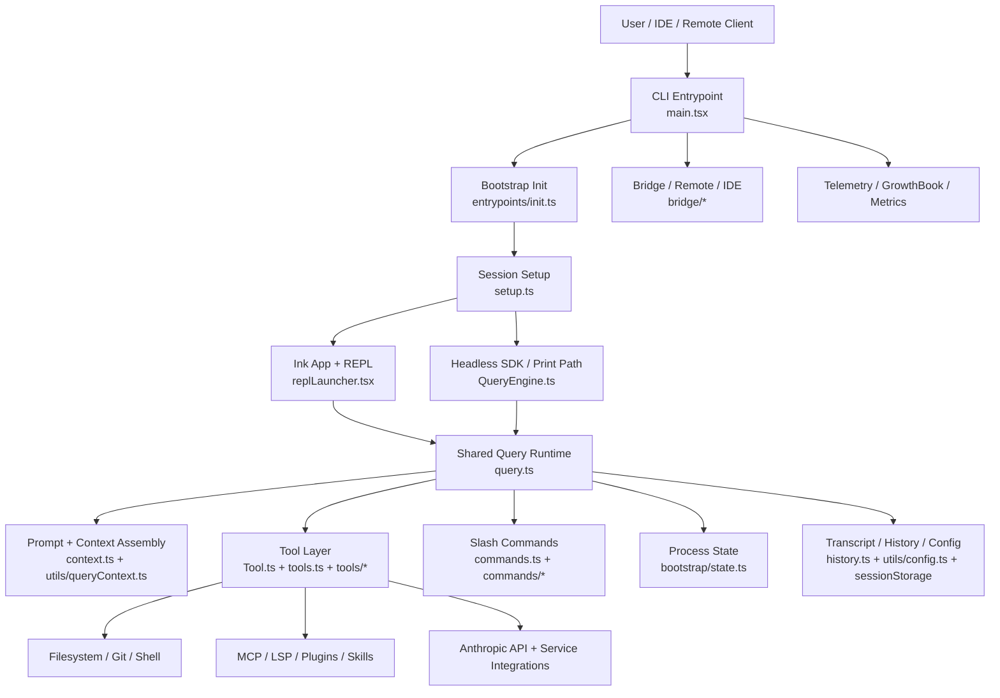
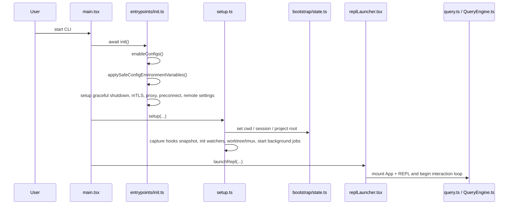

## Document 1: System Architecture Overview

### Scope

This document analyzes the overall architecture of the Claude Code CLI codebase located under `src/`, with emphasis on:

- the architectural style
- the major runtime subsystems
- the startup and lifecycle pipeline
- the configuration and state model
- the core abstractions and their contracts
- the engineering tradeoffs visible in the implementation

The analysis is grounded in the following key files:

- `src/main.tsx`
- `src/entrypoints/init.ts`
- `src/setup.ts`
- `src/replLauncher.tsx`
- `src/QueryEngine.ts`
- `src/query.ts`
- `src/context.ts`
- `src/utils/queryContext.ts`
- `src/Tool.ts`
- `src/tools.ts`
- `src/commands.ts`
- `src/bootstrap/state.ts`
- `src/history.ts`
- `src/assistant/sessionHistory.ts`
- `src/utils/config.ts`

---

## 1. Executive Summary

### What

Claude Code is best understood as a **modular monolithic agent runtime for terminal-first software engineering**, not as a simple CLI wrapper around an LLM API.

It combines five architectural roles inside a single Bun/TypeScript process:

1. **CLI shell and TUI host**
2. **agent/query orchestration runtime**
3. **tool execution platform**
4. **session/configuration/state substrate**
5. **integration hub for external systems** such as MCP, IDE bridges, OAuth, telemetry, LSP, and remote control

### Why

This architecture favors **latency, local control, and feature richness** over strict subsystem isolation. For an interactive coding CLI, that is a rational choice:

- the agent must react quickly to terminal input
- filesystem and git access are local by nature
- tool calls need tight coupling with permissions, UI, and session state
- multiple execution modes must coexist: interactive REPL, non-interactive print/SDK, bridge-driven sessions, and subagents

A distributed or service-oriented architecture would add too much overhead for this product shape.

### How

The system is centered on a **shared query/tool substrate** and multiple frontends:

- `src/main.tsx` parses startup intent and launches the appropriate mode
- `src/entrypoints/init.ts` performs safe early initialization
- `src/setup.ts` binds process/session/worktree state and starts session-scoped infrastructure
- `src/replLauncher.tsx` mounts the interactive UI
- `src/query.ts` is the common model/tool loop
- `src/QueryEngine.ts` wraps that loop for headless and SDK-style execution
- `src/tools.ts` and `src/Tool.ts` define the executable capability surface
- `src/commands.ts` defines the user-facing command surface
- `src/bootstrap/state.ts` provides a process-wide runtime state substrate
- `src/utils/config.ts` and the settings system provide layered configuration and trust-aware environment injection

### Architectural Classification

| Dimension | Classification | Why it fits |
|---|---|---|
| Deployment style | **Single-process modular monolith** | Everything runs inside one CLI process with local state and shared memory |
| Interaction model | **Terminal-first reactive app** | Ink-based TUI plus command parser and REPL loop |
| Agent model | **Tool-augmented LLM runtime** | Query loop drives tools, permissions, hooks, summaries, and retries |
| Extensibility model | **Registry + capability composition** | Tools, commands, skills, plugins, MCP resources, bridge features |
| Execution shape | **Hybrid synchronous/asynchronous orchestration** | User input is interactive, tool/runtime work is async, many startup tasks are prefetched in parallel |

---

## 2. Top-Level Architecture

### System Topology

### Architectural Reading

The core idea is not “one main class controls everything.” Instead, the architecture is split into **planes**:

| Plane | Main files | Responsibility |
|---|---|---|
| **Entrypoint plane** | `src/main.tsx`, `src/entrypoints/init.ts`, `src/setup.ts` | Process boot, trust-aware initialization, feature gating, session/worktree preparation |
| **Interaction plane** | `src/replLauncher.tsx`, `src/components/App.js`, `src/screens/REPL.js`, `src/ink/*` | Terminal UI, rendering, input handling, session interaction |
| **Agent runtime plane** | `src/query.ts`, `src/QueryEngine.ts`, `src/utils/processUserInput/*` | Message loop, model interaction, tool sequencing, result emission |
| **Capability plane** | `src/Tool.ts`, `src/tools.ts`, `src/tools/*`, `src/commands.ts`, `src/commands/*` | Executable tools, slash commands, skills, MCP, agent/team operations |
| **State and persistence plane** | `src/bootstrap/state.ts`, `src/history.ts`, `src/utils/config.ts`, `src/utils/sessionStorage.ts` | Runtime state, config, history, transcript, cost/session tracking |
| **Integration plane** | `src/services/*`, `src/bridge/*`, `src/plugins/*`, `src/skills/*`, `src/upstreamproxy/*` | External APIs, telemetry, bridge protocols, plugin/skill ecosystems |

### What This Means Architecturally

This is a **shared-core architecture**:

- multiple product modes reuse a common orchestration substrate
- product-specific behaviors are attached at the edges
- feature flags and environment gates keep one codebase serving many runtime shapes

That is why the repository has both:

- a very large `src/main.tsx` entrypoint
- and many sharply specialized subsystems beneath it

---

## 3. Architectural Style: Why This Is a Modular Monolith

### What

The codebase is neither a classic tiny CLI nor a distributed multi-service agent platform. It is a **modular monolith with optional micro-agent behavior inside one process tree**.

### Why

This choice optimizes for the realities of a coding assistant:

1. **Locality matters**
   - file reads, edits, shell commands, git inspection, and path trust are local operations
2. **Latency matters**
   - terminal interactions feel bad if every action crosses process or network boundaries unnecessarily
3. **Session coupling is strong**
   - permissions, tool visibility, prompt context, model state, and transcript persistence must stay coherent
4. **UI and execution are tightly linked**
   - tool progress, permission prompts, message rendering, and summaries all depend on the same event stream

### How the code expresses this

- `src/bootstrap/state.ts` keeps process-scoped runtime state rather than pushing everything into isolated services
- `src/tools.ts` assembles the effective tool surface in-process
- `src/commands.ts` does the same for user commands
- `src/query.ts` is a shared execution loop used by different entrypoints
- `src/QueryEngine.ts` adds an SDK/headless wrapper without creating a second orchestration implementation

### Pros & Cons

| Pros | Cons |
|---|---|
| low runtime overhead | large dependency graph |
| strong cross-feature coordination | risk of architectural drift toward god modules |
| easy to share context and state | process-wide state can become hard to reason about |
| simpler deployment and packaging | testing isolated subsystems can be more difficult |
| ideal for terminal UX | some files become very large (`main.tsx`, `bootstrap/state.ts`) |

### Alternative considered implicitly

A service-per-concern architecture would likely separate:

- model runtime
- tool runner
- session store
- UI host
- plugin runtime

But for this product, that would increase:

- startup cost
- serialization overhead
- operational complexity
- failure surfaces between subsystems

So the chosen architecture is a good fit for a terminal-native agent.

---

## 4. Core Runtime Building Blocks

## 4.1 Entrypoint and Boot Pipeline

### What

The startup path is a staged boot sequence that carefully separates:

- safe pre-trust initialization
- configuration activation
- session/worktree setup
- UI or headless launch

### How

From the inspected code:

- `src/main.tsx` imports `init` and `initializeTelemetryAfterTrust` from `src/entrypoints/init.ts`
- `src/main.tsx` calls `await init()` early
- `src/main.tsx` later calls `launchRepl(...)`
- `src/setup.ts` configures cwd, session/worktree context, hooks snapshot, background jobs, and prefetch behavior

### Startup Sequence

### Why this split exists

The code explicitly distinguishes **safe configuration application before trust** from **full configuration application later**:

- `applySafeConfigEnvironmentVariables()` is used during `init()`
- `applyConfigEnvironmentVariables()` is used after trust/managed settings timing permits it

This is a security-sensitive design. It avoids letting untrusted project-scoped settings fully mutate the process environment too early.

### Pros & Cons

- **Pros**
  - safer startup semantics
  - cleaner separation between pre-trust and trusted execution
  - easier to overlap background initialization with UI boot
- **Cons**
  - startup logic is distributed across several files
  - understanding the real lifecycle requires tracing `main.tsx`, `init.ts`, and `setup.ts` together

---

## 4.2 Shared Query Runtime

### What

The architectural heart of the system is the **shared query/runtime loop**.

This layer is responsible for:

- assembling the final system prompt and context
- accepting user input and slash-command expansions
- invoking the model
- coordinating tool calls
- emitting assistant/user/system/progress/attachment events
- persisting transcript state
- handling retries, budgets, compact boundaries, and structured output enforcement

### How

Two important files define this layer:

- `src/query.ts`: the common low-level execution loop
- `src/QueryEngine.ts`: a higher-level wrapper for SDK/headless use

`QueryEngine` explicitly says it extracts core query lifecycle logic into a standalone class for the headless/SDK path, while still relying on `query()` underneath.

This is architecturally important:

- **interactive REPL** and **headless execution** are not separate agent implementations
- they are **different shells around one shared engine core**

### Why it is designed this way

This prevents the most common failure mode in multi-surface agent products: **behavior drift between interactive and programmatic modes**.

If the REPL path and SDK path had separate orchestration loops, they would diverge in:

- tool visibility
- compaction behavior
- transcript semantics
- structured output rules
- permission handling
- retry policy

Using `query()` as the common substrate keeps those concerns aligned.

### Pros & Cons

| Pros | Cons |
|---|---|
| unified behavior across modes | query/runtime surface becomes dense |
| less duplicated logic | debugging can require tracing many event types |
| easier feature rollout | event semantics are more complex than a simple request/response model |
| consistent transcript and tool handling | interaction-specific logic still leaks into runtime concerns sometimes |

---

## 4.3 Tool Runtime as Capability Layer

### What

The tool system is the executable capability substrate for the agent.

A tool in this architecture is not just a function. It is a **rich runtime contract** including:

- input schema
- description generation
- permission checks
- execution
- progress rendering
- result rendering
- concurrency safety metadata
- read-only / destructive semantics
- search/read classification
- optional MCP metadata

### How

The core contract is defined in `src/Tool.ts`.

The `Tool` type includes methods such as:

- `call(...)`
- `description(...)`
- `checkPermissions(...)`
- `validateInput(...)`
- `isConcurrencySafe(...)`
- `isReadOnly(...)`
- `renderToolUseMessage(...)`
- `renderToolResultMessage(...)`
- `mapToolResultToToolResultBlockParam(...)`

The concrete catalog is assembled in `src/tools.ts`, where:

- built-in tools are listed in `getAllBaseTools()`
- deny rules filter tools before exposure
- REPL mode and simple mode can change the visible tool set
- MCP tools are merged through `assembleToolPool(...)`
- feature flags eliminate or include tools at build/runtime boundaries

### Why this abstraction is strong

The architecture treats tools as **first-class UI + policy + execution objects**, not just execution handlers.

That enables:

- the same tool definition to power model exposure
- permission enforcement
- UI rendering
- transcript serialization
- compact/summary behavior

### Core Tool Contract Table

| Contract area | Where defined | Why it matters |
|---|---|---|
| schema and typing | `src/Tool.ts` | model-call safety, validation, consistent tool exposure |
| catalog assembly | `src/tools.ts` | central source of truth for built-in tool set |
| permission filtering | `src/tools.ts`, permission context | hide or deny tools before invocation |
| UX rendering | `src/Tool.ts` methods + tool-specific UI | makes tool execution visible and understandable |
| mode gating | feature flags, REPL/simple mode, env checks | keeps one runtime adaptable to many environments |

### Pros & Cons

- **Pros**
  - excellent extensibility model
  - unified semantics for execution and presentation
  - strong foundation for MCP and plugin interop
- **Cons**
  - high interface complexity
  - more effort to author a new tool correctly
  - risk that some tools only partially implement the contract

---

## 4.4 Command Layer vs Tool Layer

### What

A crucial architectural distinction is that **commands** and **tools** are different systems.

- **Commands** are user-facing control surfaces such as `/compact`, `/config`, `/memory`, `/review`, `/resume`
- **Tools** are model-invocable capabilities such as Bash, Read, Edit, WebFetch, Agent, MCP, LSP

### How

- `src/commands.ts` assembles the command registry
- `src/tools.ts` assembles the tool registry
- both registries support dynamic composition from built-ins, plugins, skills, and feature-gated modules

`commands.ts` also shows that command availability is filtered by:

- authentication/provider conditions
- feature flags
- plugin and skill loading
- remote-safe or bridge-safe constraints

### Why the split is correct

This is a very good design choice.

Commands and tools solve different problems:

| Surface | Primary caller | Job |
|---|---|---|
| command | human user | change session behavior, request workflows, drive UX |
| tool | model | act on the world under permissions and schemas |

Merging both into one abstraction would simplify the code superficially but would blur security, UX, and mental models.

### Pros & Cons

- **Pros**
  - cleaner security boundaries
  - clearer user mental model
  - better compatibility with agentic prompting
- **Cons**
  - more concepts for maintainers to understand
  - some workflows span both layers, increasing orchestration complexity

---

## 4.5 State, Session, and Persistence Substrate

### What

The system has a strong process-local state substrate plus layered persistence.

`src/bootstrap/state.ts` is the central runtime state holder for:

- session identity
- project root vs current cwd
- token/cost metrics
- telemetry handles
- flags and latches
- model state
- trust/session toggles
- prompt cache metadata
- invoked skills
- channel allowlists
- session lineage (`parentSessionId`)

### Why

A terminal agent needs a lot of cross-cutting session state that is awkward to thread through every function call. The architecture chooses **centralized runtime state** for practicality.

This is especially useful because the process must coordinate:

- UI state
- tool permissions
- prompt assembly
- telemetry
- compaction
- session restore
- bridge events
- remote mode

### How persistence is layered

There are at least three persistence styles visible in the overview files:

1. **Global and project config** via `src/utils/config.ts`
2. **Prompt history** via `src/history.ts` in `history.jsonl`
3. **Session event history / transcript** via session storage and remote event fetching helpers such as `src/assistant/sessionHistory.ts`

`history.ts` is notable because it blends:

- global storage location
- project filtering
- session ordering
- lazy pasted-content restoration
- lock-protected append semantics

`assistant/sessionHistory.ts` shows that some session history is also retrievable from a remote session events API.

### Why the stable project root matters

`bootstrap/state.ts` distinguishes:

- `projectRoot`: stable identity for history/skills/session anchoring
- `cwd`: mutable operational working directory

This is an excellent design decision for worktree-heavy flows. It prevents temporary worktree navigation from accidentally redefining the logical project.

### Pros & Cons

| Pros | Cons |
|---|---|
| simple to access shared state | global state can become sprawling |
| enables rich cross-cutting features | harder to model pure data flow |
| efficient for a single-process CLI | can increase coupling across modules |
| practical for session-centric UX | requires careful test reset discipline |

---

## 5. Configuration Architecture

### What

Configuration is not a single flat file. The architecture combines:

- **global config**
- **project config**
- **settings by source**
- **trust-aware environment injection**
- **memory files such as `CLAUDE.md`**

### How

From `src/utils/config.ts` and related settings helpers:

- `getGlobalConfig()` reads the global config file and caches it
- `getCurrentProjectConfig()` resolves project configuration using a canonical project path
- project config is keyed by normalized path inside the global config structure
- config writes are lock-protected and backed up
- trust is checked by path ancestry via `checkHasTrustDialogAccepted()`

From `src/entrypoints/init.ts` and `src/utils/managedEnv.ts`:

- safe env vars are applied early via `applySafeConfigEnvironmentVariables()`
- full env application occurs later via `applyConfigEnvironmentVariables()`
- settings sources include `policySettings`, `projectSettings`, `localSettings`, `flagSettings`, and user-scoped settings

From `src/context.ts`:

- `CLAUDE.md`-derived memory files are loaded into user context unless disabled or bare mode forbids auto-discovery

### Configuration Layers

| Layer | Primary mechanism | Scope | Notes |
|---|---|---|---|
| **Global config** | `getGlobalConfig()` in `src/utils/config.ts` | user/machine | themes, onboarding, preferences, caches, auth-adjacent metadata |
| **Project config** | `getCurrentProjectConfig()` | repository/project | trust, allowed tools, onboarding, worktree session state |
| **Settings sources** | `getSettingsForSource(...)` | multi-source | includes policy-managed and local/project settings |
| **Process env projection** | `applySafeConfigEnvironmentVariables()` / `applyConfigEnvironmentVariables()` | runtime | bridges config into environment variables |
| **Memory files** | `CLAUDE.md`, local/user/managed memory paths | prompt/context | behavior- and instruction-shaping content injected into user context |

### Why this design is strong

The architecture recognizes that configuration is not just preference storage. It affects:

- security posture
- prompt content
- tool behavior
- plugin loading
- shell/git behavior
- enterprise policy

So configuration is treated as part of the runtime architecture, not a convenience utility.

### Pros & Cons

- **Pros**
  - supports enterprise policy and local flexibility simultaneously
  - trust-aware loading reduces obvious attack surfaces
  - backup/lock logic shows strong operational maturity
- **Cons**
  - multiple overlapping config concepts raise learning cost
  - runtime behavior may depend on both config values and derived env vars
  - debugging effective config requires tracing several layers

---

## 6. Startup, Loading, and Performance Strategy

### What

The architecture is explicitly optimized for startup responsiveness.

### How

Several patterns show up repeatedly:

- **dynamic imports** for heavy or optional modules
- **feature-flag-based dead code elimination** through `bun:bundle`
- **parallel prefetch** in startup/setup paths
- **cache-first loading** for plugins and related metadata
- **fire-and-forget noncritical work** when blocking would hurt UX

Examples visible in the inspected files:

- `commands.ts` lazily imports heavy or feature-gated commands
- `tools.ts` conditionally requires feature-gated tools
- `replLauncher.tsx` delays loading `App` and `REPL` until launch
- `init.ts` defers telemetry-heavy imports
- `setup.ts` starts several background jobs without blocking the first interaction unnecessarily

### Why

A coding CLI must feel instant even though it owns a very large feature surface. This architecture therefore uses **late binding** aggressively.

### Pros & Cons

- **Pros**
  - better perceived performance
  - lower default memory/startup cost
  - optional features do not tax all users equally
- **Cons**
  - more complex loading behavior
  - harder to reason about feature availability statically
  - dynamic import boundaries can complicate debugging and testing

---

## 7. Core Abstractions and Their Contracts

This repository becomes much easier to understand if you anchor it around a few primary abstractions.

### Abstraction Table

| Abstraction | Defined primarily in | Contract |
|---|---|---|
| **Session** | `src/bootstrap/state.ts`, session storage helpers | stable identity, lineage, state continuity, transcript anchoring |
| **Tool** | `src/Tool.ts` | typed capability with schema, permissions, execution, rendering, and metadata |
| **Command** | `src/commands.ts`, `src/types/command.ts` | user-invoked session control or workflow surface |
| **Query runtime** | `src/query.ts`, `src/QueryEngine.ts` | message loop binding prompt, tools, model, transcript, and result events |
| **Context bundle** | `src/context.ts`, `src/utils/queryContext.ts` | system prompt + user context + system context + runtime extras |
| **Project identity** | `src/bootstrap/state.ts`, `src/utils/config.ts` | canonical project root separate from transient cwd |
| **Configuration source** | `src/utils/config.ts`, settings modules | trust-aware, layered source of process and behavioral configuration |

### Why these abstractions matter

They form the real architectural contracts between modules. The codebase is large, but it is not arbitrary; many modules exist to implement or enrich one of these contracts.

---

## 8. Why This Architecture Instead of Others?

### Why not a simpler “CLI wrapper around API calls” architecture?

Because the product does far more than submit prompts:

- it manages tools and permissions
- it renders interactive UI
- it tracks sessions and transcripts
- it supports commands, plugins, MCP, and bridge integrations
- it persists cross-turn state
- it handles worktrees, hooks, and policy settings

A thin wrapper would collapse under these requirements.

### Why not a pure micro-agent or multi-process architecture?

Because the dominant workload is still a **single session with deeply shared context**. Splitting everything into isolated agents/services would increase:

- state synchronization complexity
- latency
- process management overhead
- security boundary complexity

The current design allows multi-agent behavior where needed, but keeps the baseline architecture local and centralized.

### How extensibility is balanced against complexity

The codebase balances extensibility through a few consistent patterns:

- registry-style assembly (`commands.ts`, `tools.ts`)
- feature gating (`bun:bundle`, env checks)
- typed contracts (`Tool`, `Command`)
- late binding (dynamic imports)
- shared runtime core (`query.ts`)

This is a strong balance. The main cost is architectural density rather than runtime fragmentation.

---

## 9. Pros & Cons of the Overall Architecture

### Strengths

- **Excellent fit for a terminal-native agent**
- **Shared runtime core across interactive and programmatic modes**
- **Strong tool abstraction with policy and UI integrated**
- **Thoughtful trust-aware configuration model**
- **Good startup optimization discipline**
- **Flexible extension points: skills, plugins, MCP, bridge, feature flags**
- **Stable project/session concepts despite mutable working directories**

### Weaknesses

- **Very high cognitive load for new contributors**
- **Large central files indicate complexity pressure**
- **Global process state increases coupling**
- **Feature-flagged dynamic imports can obscure the effective runtime**
- **Configuration semantics are powerful but nontrivial to debug**

### Plausible Improvement Directions

1. extract a clearer documented boundary between REPL-specific orchestration and SDK/headless orchestration
2. reduce `main.tsx` responsibilities by formalizing explicit startup phases/modules
3. introduce a more explicit architecture map for configuration precedence and trust boundaries
4. further isolate state domains inside `bootstrap/state.ts` to reduce “global bag of state” growth

---

## 10. Deep Questions

1. **Where is the long-term architectural boundary between `query.ts` and `QueryEngine.ts`?**
   - Is `QueryEngine` eventually meant to become the single public runtime abstraction, with REPL also migrating onto it?

2. **Can `bootstrap/state.ts` remain maintainable as the number of cross-cutting session concerns grows?**
   - Would a domain-partitioned state model preserve current ergonomics while improving modularity?

3. **How stable is the current split between commands, tools, skills, and plugins?**
   - Is the conceptual model fully settled, or are there still overlapping capability types that should be normalized?

4. **How far can trust-aware config injection be pushed before the configuration model becomes too implicit?**
   - Especially when runtime behavior depends on both settings objects and projected environment variables.

5. **Should the architecture formalize a dedicated “execution graph” model for agent/tool/state transitions?**
   - That could improve debuggability, bridge interoperability, and replayability.

---

## 11. Next Deep-Dive Directions

The next documents should follow the actual architectural dependency order visible in the code:

1. **LLM Integration Layer**
   - focus on `src/query.ts`, `src/services/api/*`, streaming, retries, usage, and provider/model controls
2. **Agent Loop & State Machine**
   - focus on loop semantics, stop conditions, message/event types, and compaction boundaries
3. **Tool Call & Function Calling**
   - focus on `src/Tool.ts`, `src/tools.ts`, permission checks, schemas, MCP merge, and result handling
4. **Prompt Engineering System**
   - focus on `src/constants/prompts.ts`, `src/context.ts`, `src/utils/queryContext.ts`, `CLAUDE.md`, and prompt layering

---

## 12. Bottom Line

Claude Code’s architecture is best described as a **high-capability modular monolith with a shared agent runtime core**.

Its most important engineering decision is not any single feature, but the decision to keep the following tightly integrated:

- terminal UI
- query orchestration
- tool execution
- permissions
- prompt/context assembly
- session persistence
- configuration and trust

That integration makes the system more complex internally, but it is also what enables Claude Code to behave like a real software-engineering agent instead of a thin chat shell.
