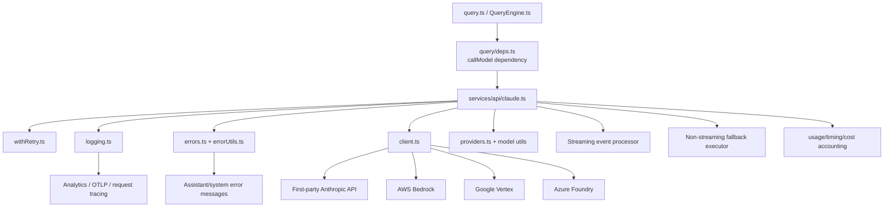

## Document 2: LLM Integration Layer

### Scope

This document analyzes how Claude Code integrates with language models at the transport, request, retry, streaming, accounting, and observability layers.

The analysis is grounded in the following key files:

- `src/services/api/claude.ts`
- `src/services/api/client.ts`
- `src/services/api/withRetry.ts`
- `src/services/api/errors.ts`
- `src/services/api/errorUtils.ts`
- `src/services/api/logging.ts`
- `src/services/api/usage.ts`
- `src/utils/model/providers.ts`
- `src/utils/sideQuery.ts`
- `src/query/deps.ts`
- `src/query.ts`
- `src/utils/managedEnv.ts`

---

## 1. Executive Summary

### What

Claude Code’s LLM integration layer is a **streaming-first, Anthropic-protocol-centric runtime** that supports multiple deployment backends while preserving one shared request model.

It is responsible for:

- selecting the effective API backend
- creating authenticated clients
- assembling request parameters and betas
- executing streaming and non-streaming message requests
- retrying and degrading gracefully under failure
- measuring tokens, cost, time-to-first-token, and request timing
- translating low-level API failures into product-level assistant/system messages

### Why

The codebase optimizes for **one stable model protocol with multiple infrastructure targets**, instead of building a generic provider abstraction across unrelated APIs.

That means Claude Code supports backend diversity such as:

- Anthropic first-party API
- AWS Bedrock
- Google Vertex AI
- Azure Foundry

but still centers the runtime on the **Anthropic Messages API shape**.

This is an important architectural choice: it minimizes feature mismatch around:

- tool use
- streaming event semantics
- thinking blocks
- structured outputs
- beta headers
- usage accounting

### How

The layer is split into several cooperating modules:

- `src/utils/model/providers.ts` chooses the backend family
- `src/services/api/client.ts` builds the correct client and auth path
- `src/services/api/withRetry.ts` wraps calls with backoff, fallback, and retry semantics
- `src/services/api/claude.ts` owns the request lifecycle and stream processing
- `src/services/api/errors.ts` converts low-level failures into user/runtime messages
- `src/services/api/logging.ts` emits analytics, telemetry, timing, and usage logs
- `src/query/deps.ts` exposes the API call as an injectable dependency for the agent loop

### Architectural Classification

| Dimension | Classification | Why it fits |
|---|---|---|
| provider architecture | **Backend-routed single protocol** | multiple backends, but one dominant request/response contract |
| response mode | **Streaming-first with non-streaming fallback** | main path streams events; fallback recovers from proxy/transport failures |
| retry strategy | **Policy-rich adaptive retry wrapper** | retries depend on source, status code, auth/provider type, and fast mode |
| observability | **Deep inline telemetry** | request IDs, TTFT, usage, gateway detection, chain tracking, cost logging |
| abstraction strength | **Operational abstraction > generic provider abstraction** | abstraction focuses on reliability and compatibility more than universal model portability |

---

## 2. Top-Level Architecture

### Integration Topology



### Core Observation

This is **not** a classic `Provider` interface like:

- `OpenAIProvider`
- `AnthropicProvider`
- `LocalLlamaProvider`

Instead, the architecture says:

> “Keep the Anthropic Messages contract stable, and vary the transport/auth/backend beneath it.”

That is why `client.ts` returns an `Anthropic`-typed client even for Bedrock, Vertex, and Foundry, sometimes with explicit comments that the return type is slightly “lying” for compatibility.

This is a pragmatic integration architecture, not a purist abstraction.

---

## 3. What the Provider Abstraction Actually Is

## 3.1 What

The provider abstraction is intentionally thin.

In `src/utils/model/providers.ts`, the system defines:

- `firstParty`
- `bedrock`
- `vertex`
- `foundry`

selected entirely by environment:

- `CLAUDE_CODE_USE_BEDROCK`
- `CLAUDE_CODE_USE_VERTEX`
- `CLAUDE_CODE_USE_FOUNDRY`
- otherwise `firstParty`

### Why

This reveals the architectural boundary clearly:

- the code is **multi-backend**
- but not **multi-protocol**

That is a deliberate tradeoff.

A truly generic provider layer for GPT/Claude/Local would need to normalize:

- different streaming APIs
- different tool call formats
- different JSON/schema conventions
- different token accounting schemes
- different stop-reason semantics
- different auth and quota models

Claude Code avoids that complexity by standardizing on the Anthropic ecosystem.

### How

`src/services/api/client.ts` constructs a compatible client for each backend:

- first-party: `new Anthropic(...)`
- Bedrock: `AnthropicBedrock`
- Foundry: `AnthropicFoundry`
- Vertex: `AnthropicVertex`

The higher layers do **not** need to know which one was chosen. They all speak the same Anthropic-style API surface.

### Pros & Cons

| Pros | Cons |
|---|---|
| one request model across backends | not a generic OpenAI/Claude/local abstraction |
| fewer feature mismatches | difficult to support non-Anthropic-native semantics cleanly |
| strong support for tool use, thinking, and betas | portability to other ecosystems is limited |
| simpler upper-layer orchestration | backend-specific quirks still leak into auth and retry logic |

### Direct answer to the required question

**How is provider abstraction designed to support multiple models?**

In this codebase, the answer is: **it supports multiple Anthropic-compatible backends, not arbitrary model families**. The abstraction boundary lives at the client-construction and auth-routing layer, not at a universal LLM capability interface.

If this project later wanted GPT/local support, it would need either:

1. a new higher-level capability abstraction above `claude.ts`, or
2. protocol adapters that emulate Anthropic’s message/tool semantics faithfully.

---

## 4. Request Lifecycle

### End-to-End Flow

```mermaid
sequenceDiagram
    participant Loop as query.ts
    participant Deps as query/deps.ts
    participant Claude as services/api/claude.ts
    participant Retry as withRetry.ts
    participant Client as client.ts
    participant Backend as Anthropic / Bedrock / Vertex / Foundry
    participant Log as logging.ts
    participant Err as errors.ts

    Loop->>Deps: callModel(...)
    Deps->>Claude: queryModelWithStreaming(...)
    Claude->>Claude: normalize messages, build betas, tool schemas, system blocks
    Claude->>Retry: withRetry(getClient, streaming attempt)
    Retry->>Client: getAnthropicClient(...)
    Client->>Backend: authenticated client creation
    Retry->>Backend: messages.create({stream:true}).withResponse()
    Backend-->>Claude: streaming events
    Claude->>Claude: accumulate content, usage, TTFT, stop reason
    Claude->>Loop: stream_event + assistant messages + system retry events
    Claude->>Log: success/error metrics, cost, latency, provider, gateway
    Claude->>Err: convert failures to assistant/system API error messages
```

### Key boundary files

- `src/query/deps.ts` defines `callModel: typeof queryModelWithStreaming`
- `productionDeps()` wires that dependency to `queryModelWithStreaming`

This is important: the agent loop does not hardcode all API details. It depends on a well-defined callable runtime boundary.

### Why that matters

This gives the codebase two things at once:

- production calls go through the full streaming runtime
- tests can inject alternative call-model behavior without spying on everything globally

That is a small but meaningful architectural seam.

---

## 5. Client Construction and Authentication

## 5.1 What

`src/services/api/client.ts` is the client factory.

It handles:

- session-scoped default headers
- OAuth refresh checks
- API key header configuration
- backend-specific auth flows
- proxy/mTLS-aware fetch configuration
- request ID injection for first-party requests

### How

The client factory adds headers such as:

- `x-app: cli`
- `User-Agent`
- `X-Claude-Code-Session-Id`
- remote container/session headers when present
- `x-client-app` for SDK consumers
- optional custom headers from `ANTHROPIC_CUSTOM_HEADERS`

It then branches by provider:

| Provider | Auth / client strategy | Key details |
|---|---|---|
| **firstParty** | `Anthropic` client | OAuth token or API key, optional staging base URL |
| **bedrock** | `AnthropicBedrock` | AWS region resolution, bearer-token or refreshed AWS credentials |
| **vertex** | `AnthropicVertex` | GoogleAuth, project fallback logic, region per model |
| **foundry** | `AnthropicFoundry` | API key or Azure AD bearer provider |

### Why this design works

The upper layer remains nearly backend-agnostic because client construction absorbs most auth complexity.

That is exactly what a good integration boundary should do.

### Important nuance

`buildFetch(...)` injects `x-client-request-id` only for first-party Anthropic URLs. This is a thoughtful observability optimization:

- first-party backend can use it for log correlation
- third-party or strict proxy backends might reject unknown headers

### Pros & Cons

- **Pros**
  - backend complexity is localized
  - session metadata is automatically propagated
  - request tracing is built in
- **Cons**
  - `client.ts` becomes infrastructure-dense
  - backend quirks still require explicit code paths
  - return-type uniformity is partly synthetic

---

## 6. Streaming-First Execution Model

## 6.1 What

The main execution path is `queryModelWithStreaming(...)` in `src/services/api/claude.ts`.

It is the default path for the main conversation loop and emits:

- `stream_event`
- `assistant` messages
- `system` API retry messages

### How

The runtime performs a streaming request via:

- `anthropic.beta.messages.create({ ...params, stream: true }, ...).withResponse()`

It then processes raw stream events such as:

- `message_start`
- `content_block_start`
- `content_block_delta`
- `content_block_stop`
- `message_delta`
- `message_stop`

### Event Handling Strategy

| Event | Runtime action |
|---|---|
| `message_start` | initialize partial message, compute TTFT, seed usage |
| `content_block_start` | create mutable assembly slot for text/thinking/tool input blocks |
| `content_block_delta` | append text, thinking, tool JSON, connector text, signatures |
| `content_block_stop` | finalize one assistant message block and yield it |
| `message_delta` | update cumulative usage, stop reason, final usage on last yielded message, compute cost |
| `message_stop` | terminate stream cleanly |

### Why streaming is the default

Because Claude Code is a terminal agent, streaming is not a cosmetic feature. It improves:

- perceived latency
- tool visibility
- interactive trust
- interruption/abort behavior
- progressive rendering of text and tool use

For an agentic coding workflow, this is worth the extra complexity.

### Direct answer to the required question

**Why use streaming, and how is complexity balanced?**

Streaming is chosen because the CLI must behave like a live collaborator rather than a batch request processor. The complexity is balanced by:

- centralizing stream handling in one file (`claude.ts`)
- using one retry wrapper (`withRetry.ts`)
- explicitly accumulating block state instead of relying on opaque SDK partial parsing
- providing a controlled non-streaming fallback path

### Pros & Cons

| Pros | Cons |
|---|---|
| better UX and perceived speed | much more stateful code |
| supports progressive tool visibility | more failure modes than request/response |
| enables TTFT measurement and stream telemetry | partial-state correctness is subtle |
| allows clean user interruption | fallback logic becomes nontrivial |

---

## 7. Why the Stream Processor Is More Complex Than Normal SDK Usage

### What

`claude.ts` does not simply delegate all stream processing to a higher-level SDK helper. It uses the raw streaming response and performs its own event accumulation.

### Why

The code comments explicitly state one reason: avoiding inefficient repeated partial JSON parsing in the SDK path for tool input deltas.

That is an important engineering clue.

The runtime wants control over:

- tool input accumulation
- immutable vs mutable block handling
- exact event order semantics
- usage accumulation
- assistant message emission timing

### How

The stream processor maintains local mutable state such as:

- `partialMessage`
- `contentBlocks`
- `usage`
- `ttftMs`
- `stopReason`
- `didFallBackToNonStreaming`
- `fallbackMessage`

This is a hand-rolled event reducer over the raw stream.

### Architectural implication

This is effectively a **custom stream state machine** embedded in the transport layer.

That is more work, but it avoids hidden SDK behavior and gives the CLI exact control over message boundaries.

---

## 8. Retry and Resilience Strategy

## 8.1 What

`src/services/api/withRetry.ts` is not a generic retry helper. It is a **policy engine**.

It handles:

- exponential backoff with jitter
- `retry-after` support
- 429/529 capacity policies
- persistent unattended retry mode
- auth refresh and credential cache invalidation
- stale keep-alive recovery
- fast-mode cooldown and fallback
- context-window overflow adjustment
- model fallback triggering after repeated overload

### How

The wrapper is an async generator:

- it can yield `SystemAPIErrorMessage` progress updates during retry waits
- it eventually returns the successful operation result
- or throws `CannotRetryError` / `FallbackTriggeredError`

This is architecturally elegant because it integrates naturally with a streaming CLI.

### Retry decision dimensions

| Dimension | Example logic |
|---|---|
| request source | foreground sources may retry 529; background sources drop quickly |
| auth state | 401/403 may force token refresh or credential cache clear |
| backend type | Bedrock and Vertex have provider-specific auth failure handling |
| transport health | `ECONNRESET` / `EPIPE` can disable keep-alive and reconnect |
| fast mode | 429/529 may trigger cooldown or switch back to normal speed |
| long unattended runs | persistent retry mode yields keep-alive system messages |
| context overflow | max token budget is reduced and retried automatically |

### Why this design is strong

A coding agent has different retry semantics for:

- visible user-blocking queries
- invisible background summaries/classifiers
- remote/CCR sessions
- long unattended sessions

A flat retry helper could not express this well.

### Pros & Cons

- **Pros**
  - highly operationally mature
  - optimized for real CLI and enterprise conditions
  - integrates retries into user-visible progress
- **Cons**
  - policy is spread across many branches
  - retry behavior is hard to reason about without tracing source + provider + mode
  - may be difficult to port to a radically different model/provider stack

---

## 9. Non-Streaming Fallback Strategy

### What

If streaming fails, `claude.ts` can fall back to a non-streaming request path through `executeNonStreamingRequest(...)`.

### When fallback happens

The code supports fallback for cases such as:

- stream creation failures on certain gateways
- stream completes with no usable assistant content
- idle watchdog timeout
- certain proxy/transport anomalies
- 404 on streaming path where non-streaming may still work

### How

Fallback behavior includes:

- explicit instrumentation events
- preserving or linking request IDs where possible
- reusing retry policies through `withRetry(...)`
- capping fallback request timeout via `getNonstreamingFallbackTimeoutMs()`
- yielding the fallback assistant message into the same runtime stream

### Why this is valuable

This is a classic production-hardening tradeoff.

Some gateways or proxies are unreliable for streaming but fine for normal requests. Rather than failing the user immediately, the runtime attempts a degraded-but-usable path.

### Why it is also dangerous

The code explicitly documents one risk: mid-stream fallback can double-trigger tool execution when streaming tool execution is active.

That is why fallback can be disabled by:

- `CLAUDE_CODE_DISABLE_NONSTREAMING_FALLBACK`
- feature flags such as `tengu_disable_streaming_to_non_streaming_fallback`

### Direct answer to the required question

**What is the exception degradation strategy?**

The degradation strategy is layered:

1. retry in-place when the failure is safely retryable
2. refresh auth or rebuild the client when credentials/sockets are stale
3. adjust request parameters for context-overflow cases
4. switch from fast mode to normal mode when needed
5. fall back from streaming to non-streaming for transport/gateway issues
6. trigger model fallback after repeated overload on eligible models
7. finally, emit a user-facing assistant/system error message with targeted remediation

That is a sophisticated and well-ordered degradation ladder.

---

## 10. Error Normalization and User-Facing Failure Semantics

### What

The LLM integration layer does not expose raw SDK or HTTP failures directly.

Instead:

- `errorUtils.ts` extracts transport/root-cause detail
- `errors.ts` classifies failures and maps them into assistant-facing error messages
- `logging.ts` emits structured analytics and telemetry for those failures

### Why

The same low-level failure needs different treatments:

- telemetry classification
- retry decision
- user-facing messaging
- non-interactive vs interactive guidance

A single “throw error.message” approach would be far too weak.

### How

#### `errorUtils.ts`

Focuses on transport-root analysis:

- SSL/TLS certificate failure detection
- connection cause-chain extraction
- HTML error page sanitization
- deserialized API error recovery for resumed sessions

#### `errors.ts`

Focuses on product semantics:

- authentication failures
- prompt-too-long errors
- media size/PDF errors
- tool use mismatch corruption
- model availability issues
- quota/rate limit interpretation
- 404 provider/model remediation
- refusal handling

### Error mapping model

| Layer | Role |
|---|---|
| transport extraction | find the real root cause (SSL, timeout, reset, HTML error page) |
| classification | assign a stable analytics/error class |
| UX translation | turn failure into actionable assistant/system guidance |
| retry/fallback | decide whether to retry, switch mode, or stop |

### Pros & Cons

- **Pros**
  - strong user-facing resilience
  - good analytics consistency
  - supports provider- and mode-specific messaging
- **Cons**
  - error behavior is distributed across multiple files
  - some branches depend on exact API message text, which is fragile |

---

## 11. Token Usage, Cost, and Timing Accounting

### What

The integration layer tracks much more than request success/failure.

It records:

- input tokens
- output tokens
- cache-read tokens
- cache-creation tokens
- request duration
- duration including retries
- TTFT (time to first token)
- cost in USD
- previous request linkage
- gateway/proxy hints
- tool/thinking/text output sizes

### How

#### In `claude.ts`

- `updateUsage(...)` merges cumulative usage from streaming events carefully
- `message_start` seeds usage
- `message_delta` updates final usage and stop reason
- cost is derived from the resolved model and usage
- non-streaming fallback usage is accounted for in the finalization path

#### In `logging.ts`

- `logAPIQuery(...)` logs request intent
- `logAPIError(...)` logs error metadata
- `logAPISuccessAndDuration(...)` logs success, timing, TTFT, content lengths, cache token metrics, and tracing output

#### In `usage.ts`

- `fetchUtilization()` hits a separate OAuth usage endpoint
- this is not per-request accounting, but quota/plan utilization state for subscribers

### Why this is architecturally important

This LLM layer is tightly coupled to product economics and performance diagnostics.

It is not just a transport layer; it is also the **cost and latency observability plane**.

### Pros & Cons

| Pros | Cons |
|---|---|
| excellent operational visibility | more coupling between transport and analytics |
| easier capacity and cache analysis | logging surface is large |
| supports UX improvements via TTFT and fallback telemetry | harder to replace with a simpler API adapter |

---

## 12. Observability as a First-Class Concern

### What

Observability is deeply embedded rather than bolted on.

### Evidence in code

- first-party request correlation via `x-client-request-id`
- `request_id` extraction from response or errors
- gateway fingerprinting from response headers and base URL in `logging.ts`
- OTLP event export
- query-source attribution
- chain tracking for nested/subagent requests
- previous-request linkage for cache analysis
- explicit events for stream stalls, fallback, overload, and watchdog timeout

### Why this matters

LLM systems are notoriously hard to debug because failures may stem from:

- application bugs
- provider bugs
- quota policy
- proxies and gateways
- authentication drift
- stream truncation
- context overflow

This codebase acknowledges that reality and instruments the layer accordingly.

### Observability planes

| Plane | Examples |
|---|---|
| **request analytics** | `tengu_api_query`, `tengu_api_success`, `tengu_api_error` |
| **stream health** | stall events, no-events fallback, idle watchdog timeout |
| **cost/perf** | TTFT, duration, token usage, costUSD |
| **traceability** | request IDs, previous request IDs, query chain IDs |
| **gateway diagnostics** | Helicone/Portkey/LiteLLM/Kong/Databricks fingerprinting |

---

## 13. Side Queries and Secondary Model Calls

### What

Not every model call goes through the full main-loop orchestration.

`src/utils/sideQuery.ts` defines a lighter wrapper for “side queries” such as:

- classifiers
- session search
- permission explainers
- validation tasks

### Why

The system needs a path that still preserves:

- attribution headers
- model betas
- structured-output support
- analytics and usage logging

without dragging in the full agent conversation loop.

### How

`sideQuery(...)`:

- creates a client with `getAnthropicClient(...)`
- computes attribution fingerprint
- builds system blocks with CLI prefix
- applies structured-output beta if needed
- normalizes model string
- sends `client.beta.messages.create(...)`
- logs success with usage and duration

### Architectural insight

This is a good pattern: **full runtime path for main conversations, lightweight shared wrapper for auxiliary model tasks**.

It avoids code duplication without forcing every small task through the full REPL orchestration stack.

---

## 14. Design Analysis: Why This LLM Layer Looks the Way It Does

### Why not a generic provider interface?

Because the product depends deeply on Anthropic-native features:

- tool semantics
- stream event semantics
- beta headers
- thinking blocks
- structured output behavior
- prompt caching strategies

A generic provider layer would either:

- leak feature mismatches upward, or
- collapse to the least common denominator

The current design preserves richer capability at the cost of portability.

### Why not non-streaming by default?

Because terminal UX, tool transparency, and interruption semantics would all get worse.

### Why not let the SDK own more of the stream state?

Because the runtime wants exact control over:

- tool JSON accumulation
- message boundary emission
- partial-state correction
- retry/fallback decisions
- latency accounting

### Why not separate observability into a distinct middleware stack?

Because many observability facts are only visible at precise points in the request/stream lifecycle. Embedding them into the transport path guarantees fidelity.

---

## 15. Pros & Cons of the Overall LLM Integration Design

### Strengths

- **Excellent production hardening**
- **Strong support for streaming CLI interactions**
- **Thoughtful backend routing with shared upper-layer semantics**
- **Detailed retry and degradation strategy**
- **Rich cost/latency/trace observability**
- **Useful split between full main-loop calls and lightweight side queries**

### Weaknesses

- **Anthropic-centric by design**, so broader provider portability is limited
- **`claude.ts` is very large**, indicating concentrated complexity
- **Retry, error, and fallback logic spans multiple modules**, raising cognitive load
- **Some correctness relies on matching provider error text or API wording**
- **Streaming fallback can interact badly with tool execution in edge cases**

### Plausible Improvement Directions

1. extract a dedicated streaming event reducer module from `src/services/api/claude.ts`
2. formalize a transport-neutral capability interface if future GPT/local support is a real requirement
3. centralize retry policy rules into a more declarative table/state model
4. isolate fallback policy from core request assembly to reduce `claude.ts` density

---

## 16. Deep Questions

1. **Is the Anthropic-protocol-centric architecture a permanent product bet, or a transitional implementation?**
   - If GPT/local support becomes strategic, where should the abstraction boundary move?

2. **Can `src/services/api/claude.ts` stay maintainable as more betas, providers, and stream edge cases accumulate?**
   - Would a reducer/state-machine extraction preserve control without increasing indirection too much?

3. **What is the long-term contract between streaming fallback and tool execution?**
   - Can fallback be made idempotent enough to avoid duplicate tool execution without disabling it entirely?

4. **How much retry/fallback policy should be query-source-specific versus transport-specific?**
   - Today both concerns are interwoven in `withRetry.ts`.

5. **Could observability be made even more replay-friendly?**
   - For example, by formalizing a persisted request/stream event log suitable for deterministic debugging.

---

## 17. Next Deep-Dive Directions

The next most natural follow-ups from this layer are:

1. **Agent Loop & State Machine**
   - how `query.ts` consumes stream events, schedules tools, detects convergence, and terminates
2. **Tool Call & Function Calling**
   - how tool schemas enter requests, how tool responses re-enter the conversation, and how permission checks shape tool availability
3. **Prompt Engineering System**
   - how system prompt blocks, attribution headers, `CLAUDE.md`, and mode-specific context are assembled before each API call

---

## 18. Bottom Line

Claude Code’s LLM integration layer is best described as a **streaming-first, reliability-heavy Anthropic runtime with multi-backend routing**.

Its central architectural decision is to avoid a generic “all LLMs are the same” abstraction and instead preserve a rich, stable Anthropic-style protocol while absorbing backend differences below the request layer.

That decision makes the system:

- more operationally robust
- better suited to agentic coding workflows
- stronger in tool/stream semantics

but also:

- less provider-portable
- more concentrated in a few large transport/runtime files

For Claude Code’s current shape, that tradeoff appears intentional and well-justified.