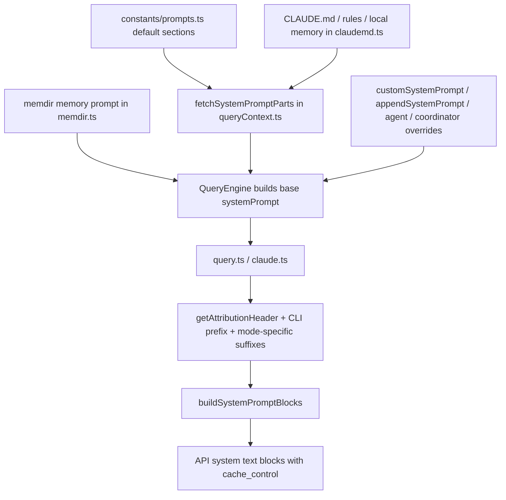

## Document 3: Prompt Engineering System

### Scope

This document analyzes Claude Code’s prompt engineering system: how default instructions are authored, how system prompt layers are assembled, how `CLAUDE.md` and memory content are injected, how mode-specific variants alter prompt behavior, how tool prompts participate in the final request, and how the entire system is optimized for prompt-cache stability.

Primary code references:

- `src/constants/prompts.ts`
- `src/utils/queryContext.ts`
- `src/utils/systemPrompt.ts`
- `src/constants/systemPromptSections.ts`
- `src/utils/claudemd.ts`
- `src/memdir/memdir.ts`
- `src/QueryEngine.ts`
- `src/services/api/claude.ts`
- `src/Tool.ts`
- `src/tools.ts`
- `src/main.tsx`

---

## 1. Executive Summary

### What

Claude Code uses a **layered, cache-aware, dynamically assembled system prompt architecture**.

Its prompt system includes all of the following:

- a large default system prompt authored in `src/constants/prompts.ts`
- optional replacement or append layers from CLI/session options
- mode-specific prompt variants for coordinator, proactive, agents, and simple mode
- user/project/session instructions loaded from `CLAUDE.md`-style memory files
- auto-memory instructions loaded from `memdir`
- environment and session guidance
- tool descriptions/prompts that are rendered into model-facing schemas
- final API-level transformation into cache-aware `system` blocks

### Why

The project needs a prompt system that can do two seemingly conflicting things at once:

- be **rich and adaptive** enough to support many workflows and environments
- remain **stable enough** to preserve prompt-cache hits across a long session

That is why the architecture emphasizes:

- section-level memoization
- explicit static/dynamic boundaries
- lazy loading of volatile sections
- sticky latching of certain headers
- deferred tool loading

This is not just prompt composition. It is **prompt composition under cache economics**.

### How

The prompt system is assembled in layers:

### Architectural Classification

| Dimension | Classification | Why it fits |
|---|---|---|
| prompt architecture | **Layered system-prompt composition** | multiple prompt sources with explicit precedence |
| adaptation style | **Mode- and environment-sensitive** | simple/coordinator/proactive/agent variants change the prompt shape |
| memory integration | **File-backed instruction layering** | `CLAUDE.md`, rules files, and memdir prompts contribute durable instructions |
| tool integration | **Prompt + schema hybrid** | tools influence both the system prompt and the API tool descriptors |
| optimization style | **Prompt-cache-aware assembly** | explicit dynamic boundary, section memoization, schema caching, sticky latches |

---

## 2. The Core Design Idea

The key architectural idea is:

> **Prompt content is not a single string. It is a structured stack of sections with different lifetimes, priorities, and cache properties.**

That means the runtime distinguishes between:

- stable instructions that can be reused across turns
- dynamic instructions that must be recomputed
- durable user/project rules from files
- volatile session guidance
- tool schemas that change the prompt budget dramatically

This is the right mental model for the whole subsystem.

---

## 3. The Main Prompt Layers

## 3.1 Layer overview

Claude Code’s effective prompt can be understood as the following layered stack:

| Layer | Source | Typical scope |
|---|---|---|
| **Core default prompt** | `src/constants/prompts.ts` | product-wide behavior and core operating rules |
| **Mode/role override** | coordinator / agent / proactive / simple mode | runtime mode or role |
| **User-provided session override** | `--system-prompt`, `--append-system-prompt` | session-level customization |
| **Memory / `CLAUDE.md` instructions** | `src/utils/claudemd.ts` | managed, user, project, local, auto-memory |
| **Environment and session guidance** | `computeSimpleEnvInfo()`, session-specific sections | current machine/session/tool set |
| **Tool-facing prompt metadata** | per-tool `prompt(...)` and schema assembly | tool behavior contract |
| **Final transport wrappers** | attribution header, CLI prefix, cache blocks | API-facing request structure |

### Important insight

These are not all assembled in one place.

The assembly is distributed intentionally:

- `prompts.ts` defines the default authoring system
- `queryContext.ts` fetches base prompt parts
- `QueryEngine.ts` composes the session-specific stack
- `claude.ts` adds transport-facing wrappers and caching layout

---

## 4. Default System Prompt in `src/constants/prompts.ts`

## 4.1 What

`src/constants/prompts.ts` is the main authored prompt library.

It defines large sections such as:

- intro and identity
- system-level tool/use behavior
- task execution guidance
- action safety guidance
- using-your-tools guidance
- tone/style and output efficiency
- session-specific guidance
- environment details
- memory prompt insertion
- MCP instructions
- proactive / brief / token-budget sections

### Why this file matters

This is the canonical source of Claude Code’s **product-level behavioral policy**.

It is not just “system prompt text”; it is a declarative policy manual encoded as sections.

---

## 4.2 Section structure

Examples of section builders include:

- `getSimpleIntroSection(...)`
- `getSimpleSystemSection()`
- `getSimpleDoingTasksSection()`
- `getActionsSection()`
- `getUsingYourToolsSection(...)`
- `getSimpleToneAndStyleSection()`
- `getOutputEfficiencySection()`
- `getSessionSpecificGuidanceSection(...)`
- `computeSimpleEnvInfo(...)`
- `getScratchpadInstructions()`
- `getFunctionResultClearingSection(...)`
- `getProactiveSection()`

### Why section functions are better than one monolithic string

This gives the codebase:

- composability
- explicit feature gating
- testability
- better cache control
- easier reasoning about precedence

A single giant static string would be much harder to evolve safely.

---

## 4.3 The authored content is opinionated product behavior

The prompt text in `prompts.ts` does much more than define tone.

It encodes policies such as:

- prefer dedicated tools over shell where possible
- do not re-attempt denied tool calls blindly
- do not create files unless necessary
- avoid gold-plating and speculative abstraction
- confirm risky or irreversible actions
- be accurate about tests and verification
- use task/todo tools where available
- use ToolSearch and parallel tool calls strategically

### Why this matters

The system prompt is used as a **behavioral control plane**, not just an instruction preface.

---

## 5. Static vs Dynamic Prompt Sections

## 5.1 Explicit boundary marker

One of the most important prompt-engineering decisions appears in `src/constants/prompts.ts`:

- `SYSTEM_PROMPT_DYNAMIC_BOUNDARY`

The comment is explicit:

- everything before the boundary can use global cache scope
- everything after contains user/session-specific content

### Why this is excellent design

This gives the prompt system a first-class notion of:

- **stable prefix**
- **dynamic suffix**

Prompt caching becomes a design primitive, not an afterthought.

---

## 5.2 Section memoization via `systemPromptSection(...)`

`src/constants/systemPromptSections.ts` defines:

- `systemPromptSection(...)`
- `DANGEROUS_uncachedSystemPromptSection(...)`
- `resolveSystemPromptSections(...)`

### What it does

Prompt sections can be:

- memoized and reused until `/clear` or `/compact`
- or explicitly marked as volatile when recomputation is necessary

### Why

Some sections are expensive or churn-prone:

- memory prompt loading
- MCP instruction text
- environment details
- dynamic session guidance

Memoization reduces unnecessary cache busting.

### Why the “dangerous” variant exists

The dangerous version forces engineers to acknowledge:

- this section is volatile
- it may break prompt caching
- there should be a clear reason

That is a very healthy engineering pattern.

---

## 6. Base Prompt Fetching in `src/utils/queryContext.ts`

## 6.1 What

`fetchSystemPromptParts(...)` returns three core pieces:

- `defaultSystemPrompt`
- `userContext`
- `systemContext`

These form the base cache-key prefix for query calls.

### Why this split matters

It shows that Claude Code conceptually separates:

- authored system instruction text
- user-context facts
- system/runtime context facts

This is a better design than flattening everything into one free-form blob too early.

---

## 6.2 Custom prompt replacement semantics

`fetchSystemPromptParts(...)` has an important rule:

- if `customSystemPrompt` is set, default prompt building is skipped
- `systemContext` is also skipped, because it would otherwise append to a default that is no longer being used

### Why this is good

This prevents accidental half-replacement semantics.

A true replacement prompt should not silently keep parts of the original stack unless explicitly requested.

---

## 7. Final Session-Level Prompt Composition in `QueryEngine.ts`

## 7.1 What

`QueryEngine.submitMessage()` is where several important prompt layers are actually combined.

It calls `fetchSystemPromptParts(...)`, then builds:

- `defaultSystemPrompt`
- coordinator user context additions when relevant
- optional memory-mechanics prompt
- append prompt layers
- final `systemPrompt`

using `asSystemPrompt([...])`

### Why this composition point matters

This is where base prompt engineering becomes **session-specific runtime prompt engineering**.

---

## 7.2 Memory-mechanics prompt injection

A notable behavior in `QueryEngine.ts`:

- when a custom system prompt is provided and a memory path override exists
- `loadMemoryPrompt()` may still inject memory mechanics guidance

### Why

A custom prompt may replace the default behavioral layers, but the runtime still needs the model to know:

- how the memory directory works
- which tools to use
- which files to write
- what `MEMORY.md` means

This is a good example of separating:

- **product identity/policy prompt**
- **capability mechanics prompt**

---

## 8. Override and Precedence Rules in `src/utils/systemPrompt.ts`

## 8.1 What

`buildEffectiveSystemPrompt(...)` defines explicit precedence rules.

The documented order is approximately:

0. override system prompt
1. coordinator prompt
2. agent prompt
3. custom system prompt
4. default system prompt

and then `appendSystemPrompt` is added at the end except where full override applies.

### Why this matters

This is the clearest statement of prompt precedence in the codebase.

It answers the “which prompt wins?” question directly.

---

## 8.2 Agent and coordinator variants

### Coordinator mode

When coordinator mode is active, the runtime can replace the default prompt with a coordinator prompt.

### Agent prompt

For a main-thread agent definition:

- built-in agents may compute a prompt using the tool context
- custom agents can supply their own prompt

### Proactive special case

In proactive mode, agent instructions are appended to the default prompt rather than replacing it.

### Why this is architecturally interesting

Prompt layering is not uniform across modes. The runtime deliberately changes replacement vs append semantics depending on product goals.

That is nuanced prompt engineering, not simple concatenation.

---

## 9. `CLAUDE.md` and File-Backed Instruction Layers

## 9.1 What

`src/utils/claudemd.ts` defines the discovery, parsing, ordering, and inclusion rules for file-backed instructions.

The top-of-file comment is especially useful. Files are loaded in this conceptual order:

1. managed memory (`/etc/.../CLAUDE.md`-style global policy)
2. user memory (`~/.claude/CLAUDE.md`)
3. project memory (`CLAUDE.md`, `.claude/CLAUDE.md`, `.claude/rules/*.md`)
4. local memory (`CLAUDE.local.md`)

And project/local files are discovered by walking upward from CWD to root.

### Why this design makes sense

It maps naturally to instruction scope:

- organization/global policy
- personal global defaults
- repository instructions
- local private project instructions

This is exactly the prompt-layer model the user requested to understand.

---

## 9.2 Priority semantics

The comment also notes that files are loaded in reverse order of priority so later-loaded items have higher effective priority.

### Interpretation

Claude Code is approximating instruction precedence through ordering in the composed prompt.

That is common and practical in LLM systems.

---

## 9.3 Supported files and traversal behavior

The runtime reads, depending on directory and settings:

- `CLAUDE.md`
- `.claude/CLAUDE.md`
- `.claude/rules/*.md`
- `CLAUDE.local.md`

It also supports:

- additional directories through `--add-dir` if enabled
- symlink-aware path resolution
- nested worktree deduplication logic
- exclusion patterns via settings

### Why this is strong engineering

This is much more than “read one file if present.”

It is a robust instruction discovery system with:

- symlink awareness
- include safety
- permission/error logging
- worktree correctness
- conditional rule matching

---

## 9.4 `@include` directives

`claudemd.ts` supports `@include`-style references in memory files.

Key properties:

- relative/home/absolute forms supported
- processed only in leaf text nodes, not code blocks
- circular references prevented by `processedPaths`
- non-existent files ignored
- include depth capped (`MAX_INCLUDE_DEPTH = 5`)

### Why this matters

This allows modular prompt authoring without requiring one giant `CLAUDE.md`.

### Risk and mitigation

Includes can make prompt provenance harder to understand, so the code tracks parents and external include approval warnings.

That is a thoughtful safety/control mechanism.

---

## 9.5 Conditional rules via frontmatter paths

Rules in `.claude/rules/*.md` can include frontmatter `paths` that match only certain target files.

### Why this is powerful

It creates a **conditional prompt layer**:

- only inject certain rules when the current task/path context matches

This is more precise than globally injecting all repo rules.

It improves both:

- relevance
- prompt budget efficiency

---

## 10. Auto Memory / Memdir Prompt Layer

## 10.1 What

`src/memdir/memdir.ts` defines the auto-memory prompt system.

It provides:

- `loadMemoryPrompt()`
- `buildMemoryLines(...)`
- `buildMemoryPrompt(...)`
- `truncateEntrypointContent(...)`
- daily-log variants for Kairos/proactive modes

### Why this is separate from `CLAUDE.md`

Because auto memory is not just instruction text. It is a **behavioral subsystem** teaching the model:

- what memory is for
- what to save vs not save
- where to write files
- how `MEMORY.md` works
- when to access/search past context

This is capability instruction, not just user policy.

---

## 10.2 What the memory prompt teaches

`buildMemoryLines(...)` includes sections about:

- what memory is
- what types of memory to save
- what NOT to save
- how to save memories
- when to access memory
- when to use plan/tasks instead of memory
- how to search past context

### Why this is prompt engineering, not just documentation

This prompt actively changes model behavior during runtime.

It is a structured operating manual for the memory subsystem.

---

## 10.3 `MEMORY.md` as index, not content store

A key design principle appears repeatedly:

- `MEMORY.md` is an index
- individual memories live in separate files
- the index must remain concise and truncation-safe

### Why

This prevents the memory prompt from growing without bound while still giving the model a durable entrypoint into memory.

That is a very elegant long-context strategy.

---

## 10.4 Truncation and boundedness

`truncateEntrypointContent(...)` enforces:

- max line count
- max byte count

and appends a warning if truncation occurs.

### Why this matters

The prompt system is explicitly designed to keep memory entrypoints bounded.

This is prompt engineering under practical context constraints.

---

## 11. Tool Prompts as Part of the Prompt System

## 11.1 What

Every tool in `src/Tool.ts` can provide `prompt(...)`.

In practice, tool prompts are rendered into API-facing tool descriptors in `claude.ts`, not merged into the plain system prompt text directly.

### Why this still belongs to prompt engineering

Because the model’s effective operating prompt is not only the `system` text blocks. It also includes:

- tool names
- tool descriptions/prompts
- JSON schemas
- strict/deferred flags

These shape model behavior just as much as text instructions do.

---

## 11.2 ToolSearch coupling

When tool search is enabled:

- not all tool schemas are included at once
- deferred tools are injected only after discovery
- extra prompt hints about deferred tools or Chrome tool search may be prepended or appended

### Why this matters

The prompt system and tool system are deeply coupled.

ToolSearch is effectively a **prompt budget management strategy** as much as a tool discovery feature.

---

## 12. Final Prompt Shaping in `src/services/api/claude.ts`

## 12.1 What happens in the transport layer

By the time `claude.ts` sees the prompt, it still adds several important wrappers:

- attribution header from message fingerprint
- CLI system prompt prefix via `getCLISyspromptPrefix(...)`
- advisor instructions when enabled
- Chrome tool-search instructions when needed
- final cache-aware block conversion via `buildSystemPromptBlocks(...)`

### Why

This separates:

- **semantic content assembly** from earlier layers
- **transport-facing and caching-aware wrapping** at the API layer

That is a clean division.

---

## 12.2 `buildSystemPromptBlocks(...)`

`buildSystemPromptBlocks(...)` converts the final `SystemPrompt` array into API `TextBlockParam[]`.

It uses `splitSysPromptPrefix(...)` and assigns `cache_control` according to block cache scope.

### Why this is crucial

This is the final step where prompt engineering becomes **prompt transport engineering**.

The architecture is explicitly aware that:

- different sections should have different cache scopes
- adding extra blocks carelessly can cause API errors or cache fragmentation

This is one of the strongest engineering signals in the entire prompt system.

---

## 13. User, Project, and Session Layers — Direct Answers

### User-level layers

User-level prompt/configuration layers include:

- user global `~/.claude/CLAUDE.md`
- user `~/.claude/rules/*.md`
- CLI/session `--system-prompt`
- CLI/session `--append-system-prompt`
- settings-derived language/output-style preferences

### Project-level layers

Project-level prompt/configuration layers include:

- repo `CLAUDE.md`
- repo `.claude/CLAUDE.md`
- repo `.claude/rules/*.md`
- private `CLAUDE.local.md`
- optional additional directory `CLAUDE.md` loading when enabled

### Session-level layers

Session-level prompt/configuration layers include:

- coordinator mode prompt
- main-thread agent prompt
- proactive/autonomous prompt variant
- environment info
- session-specific guidance
- MCP instructions
- scratchpad instructions
- token-budget/brief/fast-mode-adjacent sections
- attribution header and CLI prompt prefix

### How the user configures them

From the inspected code, user-facing configuration happens through a mix of:

- memory files (`CLAUDE.md`, `.claude/rules/*.md`, `CLAUDE.local.md`)
- CLI flags in `src/main.tsx` such as `--system-prompt`, `--system-prompt-file`, `--append-system-prompt`, `--append-system-prompt-file`
- settings/state used by prompt section builders (language, output style, mode toggles)

---

## 14. Why This Prompt System Looks the Way It Does

### Why not a single static system prompt?

Because the product supports:

- many operating modes
- file-backed user/project instructions
- large tool pools
- dynamic MCP servers
- memory systems
- cache-sensitive long sessions

A single static string would be too rigid and too expensive.

### Why not fully free-form string concatenation everywhere?

Because cache behavior, precedence, and correctness would become unmanageable.

The current sectioned architecture makes those concerns explicit.

### Why keep dynamic sections after a boundary?

Because prompt caching is a major performance and cost feature.

### Why keep `CLAUDE.md` separate from auto memory?

Because they solve different problems:

- `CLAUDE.md` = durable instruction overlay
- memdir = behavioral memory subsystem and persistent recall mechanism

---

## 15. Pros & Cons of the Overall Prompt Architecture

### Strengths

- **Clear layered model with meaningful precedence**
- **Strong cache-awareness built into prompt design**
- **Robust file-backed instruction discovery (`CLAUDE.md`, rules, local)**
- **Separation between default product behavior and session/runtime overlays**
- **Good support for mode-specific variants**
- **Tool schemas and deferred loading integrated into prompt-budget strategy**
- **Memoized sections reduce unnecessary churn**

### Weaknesses

- **Prompt assembly is distributed across multiple modules**, which raises onboarding cost
- **Feature-flag dependence makes the effective prompt shape hard to predict statically**
- **Replacement vs append semantics vary by mode**, which is powerful but subtle
- **File-backed instructions plus includes plus conditional rules can become hard to trace**
- **Prompt behavior and cache behavior are tightly coupled**, increasing implementation complexity

### Plausible Improvement Directions

1. expose a prompt-inspection/debug view that shows the final layered prompt with provenance labels per section/file
2. centralize precedence documentation in one small runtime-visible module
3. add explicit prompt provenance metadata for `CLAUDE.md` includes and conditional-rule matches
4. consider a formal prompt-layer manifest instead of partially distributed construction logic

---

## 16. Deep Questions

1. **Should the prompt system remain distributed, or has it reached the point where a dedicated “prompt assembly graph” abstraction would help?**

2. **How much dynamic behavior can be tolerated before prompt-cache gains begin to erode significantly?**
   - The system already works hard to stabilize cache keys.

3. **Are `CLAUDE.md` includes and conditional rules discoverable enough for users?**
   - Power is high, but prompt provenance may become opaque.

4. **Should tool prompts remain embedded in tool schema generation, or should the project expose a first-class “model context manifest” showing both system text and tool context together?**

5. **How should prompt versioning evolve if the team wants stronger A/B testing or prompt rollout safety?**
   - Today the design is modular, but not obviously version-manifest-driven.

---

## 17. Next Deep-Dive Directions

The next strongest follow-ups from the prompt system are:

1. **Multi-Agent System**
   - because agent definitions and agent-specific prompts are already part of the layering model
2. **Context Management & Compression**
   - because prompt design and context compaction are tightly interdependent
3. **Memory & Persistence**
   - because `CLAUDE.md`, memdir, and file-backed recall represent a major part of long-term behavior shaping

---

## 18. Bottom Line

Claude Code’s prompt engineering system is best understood as a **layered, cache-optimized prompt composition framework** rather than a single system prompt.

Its most important architectural ideas are:

- prompt layers with real precedence
- file-backed instruction overlays (`CLAUDE.md`, rules, local memory)
- mode-specific replacement/append semantics
- deep coupling between tools and prompt budget
- explicit static/dynamic boundaries for cache stability

That combination makes the system significantly more complex than a typical prompt template, but it is also what enables Claude Code to behave like a long-running, configurable coding agent rather than a one-shot chat wrapper.