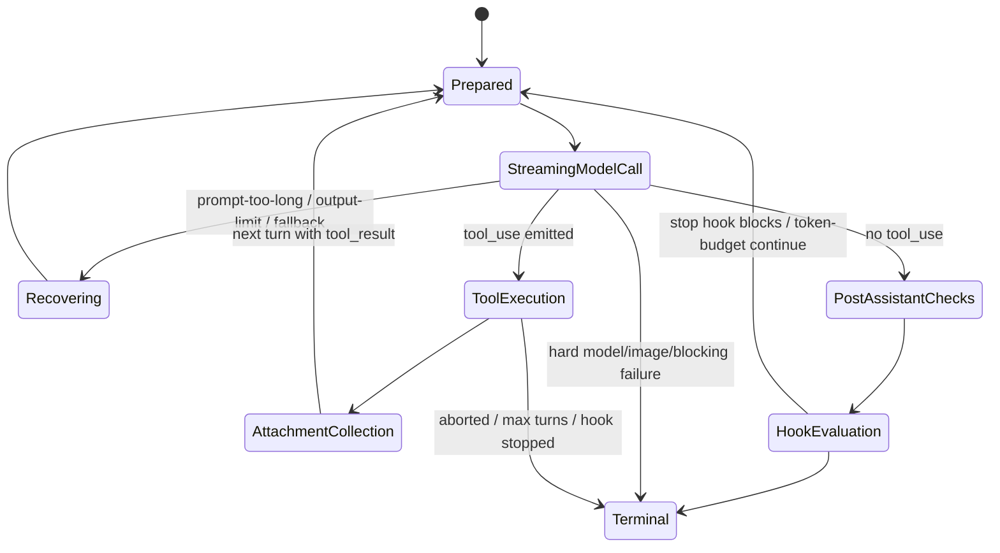

## Document 4: Agent Loop & State Machine

### Scope

This document analyzes Claude Code’s core execution loop and its implicit state machine, focusing on how a single user turn becomes a sequence of model calls, tool executions, recovery branches, hook interceptions, and terminal outcomes.

Primary code references:

- `src/QueryEngine.ts`
- `src/query.ts`
- `src/query/stopHooks.ts`
- `src/query/deps.ts`
- `src/utils/abortController.ts`
- `src/utils/combinedAbortSignal.ts`
- `src/services/tools/toolOrchestration.ts`
- `src/services/tools/StreamingToolExecutor.ts`
- `src/services/compact/*`
- `src/utils/messages.ts`
- `src/utils/queryHelpers.ts`

---

## 1. Executive Summary

### What

Claude Code’s agent loop is a **streaming, turn-recursive, recovery-heavy execution loop**.

It is not a simple:

- send prompt
- receive answer
- maybe run tool
- stop

workflow.

Instead, the runtime repeatedly moves through a cycle like:

1. prepare context
2. compact/project history if needed
3. call the model as a stream
4. collect assistant blocks and tool uses
5. run tools
6. attach side information and queued work
7. decide whether to continue, recover, or terminate

Two files divide the responsibility cleanly:

- `src/QueryEngine.ts` owns **conversation/session lifecycle and SDK-facing state**
- `src/query.ts` owns the **inner multi-iteration reasoning loop**

### Why

This design exists because Claude Code is not just a chat UI. It is an **agentic runtime** that must:

- preserve long-lived conversation state
- survive context pressure
- handle multi-step tool trajectories
- retry and recover from prompt-length and output-limit failures
- support interruption and session persistence
- expose structured progress and result events to REPL/SDK consumers

A naïve request-response loop would not support those constraints well.

### How

The architecture composes three nested layers:

```mermaid
flowchart TD
    A[User / SDK prompt] --> B[QueryEngine.submitMessage]
    B --> C[processUserInput + system prompt assembly]
    C --> D[query()]
    D --> E[queryLoop while true]
    E --> F[Context prep / compaction / projection]
    F --> G[Streaming model call]
    G --> H{Tool use blocks?}
    H -- No --> I[Stop hooks / budget / terminal checks]
    H -- Yes --> J[Tool execution + attachments]
    J --> K[Append tool results to messages]
    K --> E
    I -- Continue --> E
    I -- Stop --> L[Result emitted by QueryEngine]
```

### Architectural Classification

| Dimension | Classification | Why it fits |
|---|---|---|
| main execution style | **ReAct-like recursive turn loop** | model emits tool use, runtime executes tools, then re-prompts with results |
| orchestration style | **Stateful async generator** | both `QueryEngine.submitMessage()` and `query()` yield structured intermediate events |
| control model | **Implicit state machine encoded in continuations** | transitions are represented by `state = next; continue` rather than an enum dispatcher |
| recovery style | **Inline self-healing loop** | prompt-too-long, max-output-tokens, model fallback, stop-hook retry all re-enter the loop |
| lifecycle boundary | **Session-owned outer engine + per-turn inner loop** | outer state persists across user turns, inner state resets per turn |

---

## 2. The Two-Level Runtime Model

## 2.1 Outer Level: `QueryEngine`

### What

`src/QueryEngine.ts` is the lifecycle owner for a conversation.

Its class comment is explicit:

- **one `QueryEngine` per conversation**
- each `submitMessage()` is a new turn
- messages, file cache, usage, permission denials, and related state persist across turns

### Responsibilities

`QueryEngine` owns:

- the mutable conversation history (`mutableMessages`)
- the shared `AbortController`
- permission denial accumulation
- cumulative usage accounting
- read-file cache continuity
- SDK-facing result shaping
- transcript/session persistence integration
- system prompt assembly and initial tool/model context construction

### Why this outer layer exists

Without `QueryEngine`, `query.ts` would need to own both:

- fine-grained agent iteration logic
- cross-turn session continuity

That would collapse two distinct state scopes into one file.

The split is good architecture:

- `QueryEngine` = **conversation/session scope**
- `query.ts` = **single submitted-turn scope**

---

## 2.2 Inner Level: `queryLoop()`

### What

`src/query.ts` implements the real agent loop.

`query()` is a thin wrapper that:

- calls `queryLoop(params, consumedCommandUuids)`
- propagates yielded events
- marks queued commands as completed if the loop finishes normally

The actual state machine lives in `queryLoop()`.

### Key observation

The loop is written as:

- an async generator
- with a `while (true)` loop
- plus a mutable `state` object
- plus `continue`-based transition edges
- plus terminal `return { reason: ... }`

That means the state machine is **explicit in behavior but implicit in syntax**.

---

## 3. State Model

## 3.1 Loop State

`query.ts` defines a `State` type carrying mutable per-turn state across loop iterations:

- `messages`
- `toolUseContext`
- `autoCompactTracking`
- `maxOutputTokensRecoveryCount`
- `hasAttemptedReactiveCompact`
- `maxOutputTokensOverride`
- `pendingToolUseSummary`
- `stopHookActive`
- `turnCount`
- `transition`

### Why this matters

This is the real evidence that Claude Code is state-machine-driven.

The loop does not merely recurse with raw messages. It carries a structured control state that tracks:

- where the last continuation came from
- whether recovery already ran
- whether compaction is currently “active” as a mode
- whether a stop-hook retry is already in progress
- whether a deferred summary is pending from the prior tool batch

### Why not use a formal enum state machine?

Because the branching logic is rich and data-heavy.

A formal enum such as:

- `Planning`
- `Executing`
- `Observing`
- `Reflecting`

would be too coarse to represent the actual runtime branches, which depend on:

- context overflow
- tool follow-up necessity
- model fallback
- stop-hook decisions
- max-output-token recovery
- budget continuation
- user interruption

So the implementation chooses a **data-centric transition object** over a classic state enum.

---

## 3.2 Practical State Machine Interpretation

Although no enum is declared, the runtime behaves like this:



This is more accurate than a simple four-state “plan/execute/observe/reflect” narrative.

---

## 4. Startup of a Turn: `QueryEngine.submitMessage()`

## 4.1 What happens before the inner loop starts

Before `query()` is called, `QueryEngine.submitMessage()` performs substantial setup:

1. reset turn-scoped skill-discovery tracking
2. install cwd
3. compute persistence mode
4. wrap `canUseTool()` to capture permission denials
5. determine initial model and thinking configuration
6. fetch system prompt parts via `fetchSystemPromptParts(...)`
7. optionally inject memory-mechanics prompt
8. construct the final system prompt stack
9. process user input and slash-command effects
10. persist accepted user messages to transcript early
11. emit a system init message
12. call `query(...)`

### Why this design is important

The agent loop is intentionally **not responsible for front-door normalization**.

That keeps `query.ts` focused on:

- iterative sampling
- tool-use recursion
- recovery branches

while `QueryEngine` handles:

- prompt/session setup
- SDK/replay semantics
- persistence
- result aggregation

---

## 4.2 Early transcript persistence

A notable design choice in `QueryEngine.submitMessage()` is that user messages are persisted **before** the API responds.

### Why

The code comment explains the failure mode clearly:

- if the process is killed after the user submits a prompt but before the model yields any assistant output
- then a resume operation would otherwise fail because the transcript lacks the accepted user message

This is a subtle but strong engineering decision.

It shows the loop is designed around **crash/interruption reality**, not idealized execution.

---

## 5. Core Iteration Structure in `queryLoop()`

## 5.1 The iteration skeleton

At the top of each `while (true)` iteration, `queryLoop()`:

1. destructures the current `state`
2. starts skill discovery prefetch
3. emits `stream_request_start`
4. initializes or increments `queryTracking`
5. projects messages after the latest compact boundary
6. applies tool-result budgeting
7. applies snip compaction
8. applies microcompact
9. applies context collapse projection
10. applies auto-compact if needed
11. prepares model/tool execution state
12. streams the model response
13. either terminates or continues with tools/recovery

### Why this order matters

The order is deliberate.

#### Before the model call

The runtime reduces context pressure in layered stages:

- `applyToolResultBudget(...)`
- snip compaction
- microcompact
- context collapse
- autocompact

That means the system prefers **cheap, local, granular reductions** before falling back to full summarization.

This is a very strong architecture choice.

---

## 5.2 Query tracking

Each iteration computes a `queryTracking` value:

- `chainId`
- `depth`

### Why

This gives the runtime a causal trace across recursive agent activity, including subagents and retries.

This is useful for:

- analytics
- debugging
- nested tool/agent coordination
- attribution of retries and failures

It also shows the loop is not viewed as isolated calls but as a **query chain**.

---

## 6. The Model Sampling Phase

## 6.1 Streaming-first control flow

Inside the iteration, the runtime calls `deps.callModel(...)`, which resolves to `queryModelWithStreaming(...)` in production.

During this stream:

- assistant messages are accumulated
- tool use blocks are collected
- partial tool execution may start via `StreamingToolExecutor`
- fallback may invalidate partial assistant outputs and force tombstoning

### Why this is architecturally significant

The loop does not wait for a fully materialized model response. It reacts while the model is still streaming.

That makes the execution model:

- lower latency
- more interactive
- more complex

This is one of the biggest reasons the state machine is rich.

---

## 6.2 Streaming fallback and tombstones

If streaming fallback occurs mid-response, `query.ts` explicitly:

- yields tombstones for orphaned assistant messages
- clears `assistantMessages`
- clears `toolResults`
- clears `toolUseBlocks`
- resets `needsFollowUp`
- discards pending streaming tool results

### Why

Partial assistant content from a failed stream is not trustworthy state.

Especially with thinking/tool blocks, preserving invalid partial data would break future API validity and transcript integrity.

This is effectively a **mini rollback** inside the loop.

---

## 6.3 Tool-use detection

During streaming, every assistant message is scanned for `tool_use` blocks.

When present:

- the blocks are added to `toolUseBlocks`
- `needsFollowUp = true`
- streaming tool execution may begin immediately

### Interpretation

This is the point where the loop switches from “sampling-only” to “tool-mediated recursion”.

In ReAct terms:

- assistant text/thinking = reasoning trace
- `tool_use` = action proposal
- `tool_result` = observation
- next iteration = reflection + next step

So yes, the loop is **ReAct-like**, but with substantial production extensions.

---

## 7. The Real State Machine: Continuation Reasons

The field `state.transition` records why the previous iteration continued.

This is one of the most revealing design details in the whole runtime.

### Continuation reasons visible in code

- `collapse_drain_retry`
- `reactive_compact_retry`
- `max_output_tokens_escalate`
- `max_output_tokens_recovery`
- `stop_hook_blocking`
- `token_budget_continuation`
- `next_turn`

### Why this is smart

The loop is easier to debug and test because continuations are **labeled by cause**, not inferred only from message patterns.

That gives the code a lightweight form of explicit state transition metadata without needing a heavyweight state-machine framework.

---

## 8. Recovery Branches

## 8.1 Prompt-too-long recovery

### What

If the streamed result is a withheld prompt-too-long API error, the runtime tries recovery in order:

1. `contextCollapse.recoverFromOverflow(...)`
2. `reactiveCompact.tryReactiveCompact(...)`
3. surface the withheld error and terminate

### Why this order

- context collapse is cheaper and more granular
- reactive compact is heavier and more destructive to original context fidelity
- only if both fail should the user see the actual overflow failure

### Engineering quality

This is a strong staged recovery design.

---

## 8.2 Media-size recovery

If the last message is a recoverable media-size error, the loop can attempt reactive compact-based strip/retry behavior.

### Why

Images/PDF-heavy prompts can fail for size reasons that are not solvable by collapse alone.

This shows the state machine is not just about tool use. It also encodes **media-aware error recovery**.

---

## 8.3 Max-output-token recovery

If the model is cut off by max output tokens, the loop has two recovery modes:

1. **escalate output token cap** to `ESCALATED_MAX_TOKENS` if allowed
2. otherwise inject a hidden user meta-message instructing the model to resume directly

This can happen multiple times up to `MAX_OUTPUT_TOKENS_RECOVERY_LIMIT = 3`.

### Why this is clever

Instead of treating output-limit exhaustion as fatal, the runtime models it as a recoverable truncation.

That is exactly the kind of practical behavior an agent CLI needs.

### Tradeoff

The loop becomes harder to reason about because a single apparent response may actually be only one segment of a larger logical answer trajectory.

---

## 8.4 Model fallback as loop-level recovery

If `FallbackTriggeredError` is thrown and a `fallbackModel` exists, the loop:

- switches the current model
- yields missing tool results for abandoned blocks
- clears partial assistant/tool state
- rebuilds streaming tool execution
- strips model-bound signatures when needed
- yields a warning system message
- retries the request

### Why this matters

Model fallback is not handled only in the API layer. The query loop must repair its own local logical state too.

This is a good example of **cross-layer recovery ownership**:

- API layer decides fallback is necessary
- query loop decides how to keep conversation semantics coherent

---

## 9. Tool Execution Phase

## 9.1 What happens when follow-up is needed

If `needsFollowUp` is true, the runtime enters the tool phase.

It either uses:

- `StreamingToolExecutor` when enabled
- or `runTools(...)` for batch tool orchestration

### How

For each tool update:

- yielded progress/messages are surfaced
- corresponding `tool_result` user messages are normalized for the next model turn
- `newContext` from tool execution may update `toolUseContext`

### Why

The loop treats tool execution as **part of the state machine**, not an external callback.

That means tool execution can influence:

- next-turn messages
- refreshed tool registry
- attachments
- abort behavior
- hook-based continuation blocking

---

## 9.2 Why streaming tool execution exists

The existence of `StreamingToolExecutor` indicates the system wants to overlap:

- model streaming
- tool execution
- result availability

### Why this design is attractive

It reduces latency in trajectories where the model emits multiple tool-use blocks during streaming.

### Cost

It complicates rollback and fallback handling, which is why the code has explicit discard/reset logic when streaming fallback or abort happens.

---

## 10. Attachment Phase

After tools run, the loop collects additional non-tool observations:

- queued commands
- memory attachments
- skill discovery attachments
- file-change attachments
- other environment-derived attachments

### Why this phase exists

The loop’s observation model is broader than `tool_result`.

In agent terms, the “observe” step includes:

- tool outputs
- background task notifications
- relevant memory injections
- skill-discovery signals
- edited file artifacts

So the architecture is better described as:

> **Action + Environment Observation + Context Enrichment**

rather than just “run a tool and continue”.

---

## 11. Stop Hooks as a Post-Assistant Interceptor State

## 11.1 What

If the model finishes with no further tool use, `queryLoop()` delegates to `handleStopHooks(...)`.

This is effectively an **interceptor state between apparent completion and real completion**.

### `handleStopHooks(...)` can do all of the following:

- run stop hooks and yield their progress
- return blocking errors that force another loop iteration
- prevent continuation entirely
- run teammate/task-completed hooks
- emit summary/system messages
- abort if cancellation happens during hook execution

### Why this is architecturally important

A superficial reading might think “no tool use” means terminal state.

That is false in Claude Code.

The runtime reserves the right to reopen the loop after post-sampling policy checks.

This is a major state-machine extension beyond vanilla ReAct.

---

## 11.2 Stop hook outcomes

| Outcome | Loop effect |
|---|---|
| `preventContinuation` | terminal return with `stop_hook_prevented` |
| `blockingErrors.length > 0` | append hidden user meta-messages and continue |
| normal success | proceed to token-budget completion checks |
| hook abort | emit interruption and prevent continuation |

### Why this design is strong

Hooks are integrated without turning them into special-case external control flow. They are modeled as just another continuation decision point.

---

## 12. Token Budget Continuation

### What

When the feature is enabled, the loop checks `checkTokenBudget(...)` after successful assistant completion and hooks.

It may decide:

- continue with a hidden “nudge” user message
- or stop and log completion metadata

### Why this exists

A coding agent often stops too early when output is long but still productive.

This mechanism creates a controlled form of **automatic continuation based on budget heuristics**.

### Why this is subtle

This is not the same as max-output-token recovery.

- max-output-token recovery = technical truncation repair
- token-budget continuation = product-level “keep going, this is still worthwhile” decision

That distinction is architecturally meaningful.

---

## 13. Termination Conditions

`queryLoop()` can return terminal reasons including:

- `completed`
- `blocking_limit`
- `prompt_too_long`
- `image_error`
- `model_error`
- `aborted_streaming`
- `aborted_tools`
- `hook_stopped`
- `stop_hook_prevented`
- `max_turns`

### Why this is better than a boolean success/failure

The outer runtime and SDK layer can distinguish:

- normal completion
- user interruption
- policy stop
- system failure
- context exhaustion
- image/media failure

That enables richer UX and more accurate result typing.

---

## 14. Max Turns and Convergence Control

## 14.1 Max-turn enforcement

`QueryEngine.submitMessage()` and `queryLoop()` both guard turn-count-based termination.

If the turn count would exceed `maxTurns`, the loop yields an attachment:

- `type: 'max_turns_reached'`

and terminates.

### Why this matters

This is the main hard guardrail against infinite self-recursion.

---

## 14.2 Soft convergence signals

Claude Code also relies on softer convergence signals:

- no `tool_use` blocks produced
- stop hooks did not re-open the loop
- token budget decided not to continue
- no recovery branch is active
- no queued tool results remain

### Interpretation

The system does not use a single “done” predicate. It uses a **composite convergence condition**.

That is sensible for agentic workflows, but harder to formalize.

---

## 15. Abort, Interrupt, and Cancellation Design

## 15.1 What

Abort propagation is a first-class concern.

`src/utils/abortController.ts` and `src/utils/combinedAbortSignal.ts` provide:

- listener-limit-safe `AbortController` creation
- child controllers that inherit parent cancellation
- weak-reference cleanup to avoid retention
- combined signals with optional timeout
- explicit cleanup of timers and listeners

### Why this matters

Long-lived agent sessions accumulate listeners and timers. A naïve abort implementation would leak resources or trip `MaxListenersExceededWarning`.

The implementation shows the runtime has been hardened for real operational use.

---

## 15.2 Abort semantics in the loop

There are two major abort checkpoints:

1. **after streaming** but before further processing
2. **after tool execution**

In both cases the loop:

- emits synthetic missing tool results if needed
- performs special cleanup for computer-use integrations
- may suppress redundant interruption messages for submit-interrupt paths
- returns an explicit terminal reason

### Why this is good design

User interruption is treated as a valid state transition, not as an exceptional crash.

---

## 16. Error Recovery and Restartability

## 16.1 What counts as error recovery

This loop supports several restart/recovery classes:

- model fallback retry
- prompt-too-long recovery
- media-size recovery
- max-output-token continuation
- stop-hook retry
- token-budget continuation

### Why it matters

Many agent frameworks stop at the first model or context irregularity.

Claude Code instead treats many of them as **recoverable transition triggers**.

This is one of the system’s strongest engineering characteristics.

---

## 16.2 What counts as restartability

At the outer layer, `QueryEngine` plus transcript persistence enables session continuity across process restarts.

At the inner layer, the loop itself is restartable only at certain boundaries, because some transient in-flight stream state is intentionally discarded.

### Practical design implication

- persistent history survives
- invalid partial in-flight state does not

That is the correct tradeoff.

---

## 17. Concurrency and Async Scheduling

## 17.1 Where concurrency appears

The agent loop contains targeted concurrency rather than general parallel task scheduling.

Examples:

- memory prefetch runs in parallel with model/tool work
- skill discovery prefetch runs in parallel with model/tool work
- streaming tool execution overlaps with model streaming
- post-sampling hooks run after model response, some fire-and-forget
- background task summary generation can happen during long-running flows

### Why this design works

The runtime exploits concurrency **only where latency hiding is valuable and correctness boundaries are clear**.

That is safer than turning the whole loop into a concurrent workflow engine.

---

## 17.2 Why not make the whole loop more parallel?

Because agent loops are correctness-sensitive around:

- message ordering
- transcript persistence
- tool-result pairing
- compaction boundaries
- abort semantics

So Claude Code chooses **selective overlap**, not maximal concurrency.

That is a very reasonable engineering tradeoff.

---

## 18. Direct Answers to the Required Questions

## 18.1 Why this loop style instead of a simpler pattern?

Claude Code is closest to a **production-hardened ReAct loop** with recovery extensions.

It chooses this pattern because the agent must:

- interleave reasoning and acting
- handle multiple tool/action rounds in one user turn
- preserve state across long sessions
- recover from API/context failures inline
- expose incremental progress to CLI/SDK consumers

A pure plan-and-execute model would be too rigid, and a single-call chat model would be too weak.

---

## 18.2 How does it prevent infinite loops and deadlocks?

The main safeguards are:

- `maxTurns`
- explicit continuation reasons
- one-shot guards like `hasAttemptedReactiveCompact`
- `MAX_OUTPUT_TOKENS_RECOVERY_LIMIT`
- stop-hook active state to avoid spirals
- token-budget stopping rules
- abort propagation
- prompt-blocking hard limit when autocompact is not allowed

There is no formal deadlock detector, but the system uses many practical loop guards.

---

## 18.3 How are state persistence and recovery designed?

Persistence is primarily owned by `QueryEngine` and the transcript/session storage layers:

- accepted user messages are persisted early
- assistant/progress/attachment/system messages are recorded as they are produced
- compact boundaries prune retained in-memory history but preserve resumability
- read-file cache and mutable message state persist across turns in the same engine

Recovery is split by scope:

- API-layer retry/fallback handles transport/provider issues
- query loop handles logical recovery and continuation
- outer engine handles cross-turn/session continuity

---

## 19. Pros & Cons of the Agent Loop Design

### Strengths

- **Very robust for real-world agent workflows**
- **Strong support for iterative tool use**
- **Thoughtful recovery logic for context and output limits**
- **Clear separation between session-level and turn-level state**
- **Good cancellation semantics**
- **Async generator design fits CLI/SDK streaming well**

### Weaknesses

- **`src/query.ts` is very large and highly concentrated**
- **The state machine is implicit**, so onboarding cost is high
- **Many transitions are feature-flag dependent**, making runtime behavior harder to reason about globally
- **Recovery branches interact in subtle ways**
- **Testing the full combinatorial space is difficult**

### Plausible Improvement Directions

1. extract a dedicated `queryLoop` transition reducer/state module
2. formalize transition/terminal reason types in a small visible file for easier reasoning
3. separate recovery policies from the main loop body
4. expose a debug-mode state transition trace for replay and deterministic diagnosis

---

## 20. Deep Questions

1. **Has `src/query.ts` reached the size where its implicit state machine should become an explicit transition system?**
   - Would that improve maintainability, or just add indirection?

2. **Which continuation causes are fundamentally “reasoning continuations” versus “runtime repair continuations”?**
   - Should these be modeled separately?

3. **Can streaming tool execution and streaming fallback be made easier to reason about together?**
   - Today the rollback/discard logic is correct-minded but cognitively expensive.

4. **Should stop hooks remain embedded in the main loop, or become a formal middleware phase?**
   - The current approach is powerful but blends policy and execution tightly.

5. **How observable is the state machine in production?**
   - If a user reports a looping or premature-stop bug, is there enough persisted transition evidence to reconstruct the exact path?

---

## 21. Next Deep-Dive Directions

The next best follow-up documents from here are:

1. **Tool Call & Function Calling**
   - how tools are registered, permissioned, executed, and re-injected into the loop
2. **Prompt Engineering System**
   - how system prompt parts and context layers are assembled before each loop iteration
3. **Context Management & Compression**
   - how snip, microcompact, collapse, and autocompact form a tiered context strategy

---

## 22. Bottom Line

Claude Code’s core agent loop is best understood as a **stateful async-generator runtime implementing a production-grade ReAct loop with layered recovery**.

Its most important architectural traits are:

- a clean split between `QueryEngine` and `query.ts`
- iterative tool-mediated recursion within a single user turn
- recovery-first handling of prompt, output, fallback, and hook failures
- strong interruption and persistence semantics

This design is more complex than a typical agent tutorial loop, but that complexity is largely justified by the operational demands of a real coding assistant.