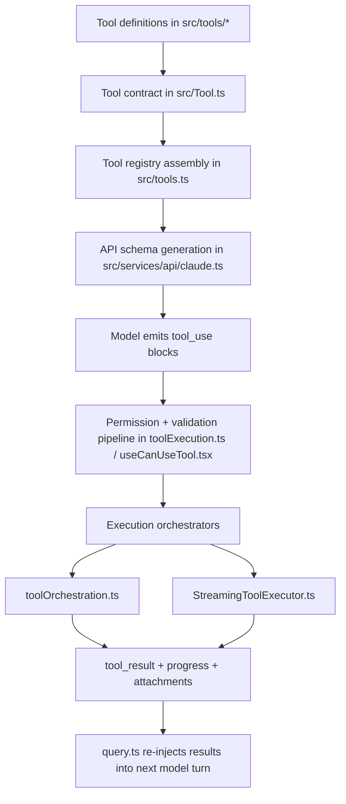
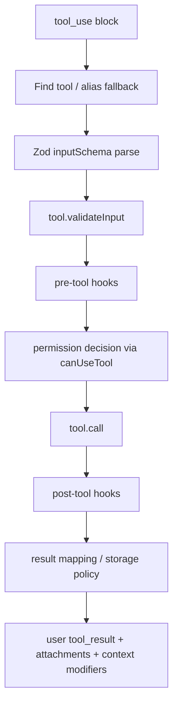

## Document 6: Tool Call & Function Calling

### Scope

This document analyzes Claude Code’s tool-calling architecture, from tool definition and registration to model-facing schema generation, permission gating, execution orchestration, progress streaming, result shaping, and graceful failure handling.

Primary code references:

- `src/Tool.ts`
- `src/tools.ts`
- `src/query.ts`
- `src/services/tools/toolExecution.ts`
- `src/services/tools/toolOrchestration.ts`
- `src/services/tools/StreamingToolExecutor.ts`
- `src/hooks/useCanUseTool.tsx`
- `src/services/api/claude.ts`
- `src/utils/toolSchemaCache.ts`
- `src/utils/toolSearch.ts`
- `src/utils/toolResultStorage.ts`
- `src/services/tools/toolHooks.ts`

---

## 1. Executive Summary

### What

Claude Code’s tool system is a **typed, policy-aware, streaming-compatible function-calling runtime**.

It is responsible for:

- defining the contract for every built-in and MCP tool
- assembling the effective tool pool for a given session and permission mode
- converting tools into model-facing API schemas
- validating and permission-checking tool calls before execution
- executing tools serially or concurrently depending on safety rules
- supporting overlapped streaming execution while the model is still responding
- converting outputs into `tool_result` messages and UI/transcript artifacts
- gracefully degrading when schemas are absent, permissions fail, tools error, or fallback interrupts execution

### Why

The system is not just a collection of functions. In Claude Code, tools are part of the **agent runtime contract** between:

- the model
- the policy system
- the user interface
- the transcript/session layer
- the tool execution environment

A simplistic “function registry” would not be sufficient because Claude Code needs:

- tool-specific validation and permission rules
- UI rendering for in-progress and completed calls
- transcript-safe serialization
- concurrency safety controls
- dynamic loading/deferred schemas for large tool pools
- support for MCP tools and built-in tools in the same pipeline

### How

The architecture has five main layers:

### Architectural Classification

| Dimension | Classification | Why it fits |
|---|---|---|
| tool definition model | **Rich behavioral interface** | tools include execution, permission, rendering, result mapping, and policy hooks |
| registry style | **Central assembly with environment- and mode-based filtering** | `src/tools.ts` is the main composition root |
| model contract | **Schema-driven function calling with dynamic deferral** | tool descriptors are generated from typed schemas and may be deferred via ToolSearch |
| execution model | **Mixed serial / concurrent / streaming** | runtime chooses execution mode based on `isConcurrencySafe()` and streaming state |
| safety model | **Validation + permission + hook + transcript-aware** | tool calls pass multiple guard layers before and after execution |

---

## 2. The Core Abstraction: `Tool` in `src/Tool.ts`

## 2.1 What

`src/Tool.ts` defines the main contract for a tool.

A tool is not just:

- a name
- a JSON schema
- a callback

Instead, a `Tool` bundles together:

- execution logic (`call(...)`)
- a typed `inputSchema`
- optional `inputJSONSchema`
- permission hooks (`checkPermissions(...)`)
- validation hooks (`validateInput(...)`)
- concurrency declaration (`isConcurrencySafe(...)`)
- read-only / destructive flags
- model-facing prompt generation (`prompt(...)`)
- UI rendering methods for use/progress/result/error/rejection states
- transcript/search helpers
- result serialization (`mapToolResultToToolResultBlockParam(...)`)
- optional context modification (`contextModifier` in results)

### Why this design is important

Claude Code treats a tool as a **cross-cutting runtime object**, not a narrow backend function.

That makes sense because a tool participates in several systems simultaneously:

- LLM function calling
- permissions and approvals
- UI rendering
- transcript storage
- analytics and telemetry
- context shaping between turns

A minimal interface would scatter this logic across multiple registries or type maps.

---

## 2.2 Tool contract anatomy

### Key fields and methods

| Contract element | Purpose |
|---|---|
| `name`, `aliases` | stable lookup and backwards compatibility |
| `inputSchema` / `inputJSONSchema` | model-facing argument contract and runtime validation |
| `call(...)` | actual tool behavior |
| `description(...)` | natural-language description for approvals and UX |
| `checkPermissions(...)` | tool-specific permission preflight |
| `validateInput(...)` | semantic validation beyond type checking |
| `isConcurrencySafe(...)` | determines serial vs parallel scheduling |
| `isReadOnly(...)`, `isDestructive(...)` | safety and policy hints |
| `prompt(...)` | generates API-facing tool prompt text |
| `mapToolResultToToolResultBlockParam(...)` | maps output into Anthropic `tool_result` blocks |
| render methods | UI rendering for tool use/progress/result/rejection/error |
| `backfillObservableInput(...)` | mutates observer-facing copies of input for legacy/derived fields |
| `maxResultSizeChars` | controls large-output persistence strategy |
| `strict` | enables stricter API adherence to schema for eligible models/betas |
| `shouldDefer` / `alwaysLoad` | controls deferred loading via ToolSearch |

### Why this is richer than typical function-calling APIs

Most LLM frameworks stop at:

- schema
- handler

Claude Code goes much further because it wants tools to be **first-class product objects**, not just callable endpoints.

---

## 2.3 `buildTool(...)` and safe defaults

### What

`src/Tool.ts` provides `buildTool(...)`, which fills in safe defaults for common methods.

Defaults include:

- `isEnabled` → `true`
- `isConcurrencySafe` → `false`
- `isReadOnly` → `false`
- `isDestructive` → `false`
- `checkPermissions` → allow
- `toAutoClassifierInput` → `''`
- `userFacingName` → `name`

### Why

This ensures tools are fail-closed where it matters:

- concurrency defaults to conservative
- read-only defaults to false
- destructive defaults to false unless explicitly marked

### Engineering consequence

This reduces boilerplate while preserving safety.

---

## 3. Tool Registry and Discovery in `src/tools.ts`

## 3.1 What

`src/tools.ts` is the central composition root for built-in tools.

It imports and conditionally assembles tools such as:

- file tools
- bash / powershell
- agent/swarm tools
- web and search tools
- task tools
- plan/worktree tools
- MCP resource tools
- ToolSearch
n- feature-gated experimental tools

### Why

This gives the codebase one canonical place to answer:

- what tools exist?
- which tools are built-in?
- which ones are available in this mode/environment?

That centralization matters because tool availability affects:

- prompt caching
- token usage
- permissions
- UI
- model behavior

---

## 3.2 Registry assembly logic

### `getAllBaseTools()`

This is the exhaustive source of truth for potential built-in tools in the current build/environment.

It includes feature- and env-gated conditionals such as:

- `process.env.USER_TYPE === 'ant'`
- `feature('...')`
- mode-specific tool availability
- REPL integration
- workflow and background tools

### `getTools(permissionContext)`

This applies mode and permission filtering.

Notable behavior:

- `CLAUDE_CODE_SIMPLE` shrinks the tool set drastically
- REPL mode hides primitive tools when REPL wrapper is active
- blanket deny rules can remove tools before the model ever sees them

### `assembleToolPool(permissionContext, mcpTools)`

This is the full pool assembler.

It:

1. gets built-in tools
2. filters MCP tools by deny rules
3. sorts built-ins and MCP tools by name for prompt-cache stability
4. deduplicates by name, with built-ins winning conflicts

### Why this design is strong

This is more than a registry. It is a **prompt-shaping tool pool assembler**.

Sorting and deduplication are explicitly influenced by prompt-cache stability, which is a very production-minded detail.

---

## 3.3 Built-in and MCP tools share one contract

### What

MCP tools are not handled in a separate execution universe.

The architecture integrates them into the same `Tools` collection, with extra metadata such as:

- `isMcp`
- `mcpInfo`
- optional raw JSON schema via `inputJSONSchema`

### Why

This allows:

- one execution pipeline
- one permission system
- one UI rendering pipeline
- one model-facing schema assembly path

This is an excellent unification boundary.

---

## 4. Model-Facing Tool Schema Generation

## 4.1 What

Tool definitions do not go directly to the model.

Instead, `src/services/api/claude.ts` converts the effective tool pool into API-facing tool schemas via `toolToAPISchema(...)`.

The code around the main request path shows:

- tool-search enablement is computed per model/session context
- the tool list is filtered based on discovered deferred tools
- each surviving tool is converted to an API tool descriptor
- extra tool schemas can be appended (e.g. server-provided tools such as advisor)

### Why tool schema exists

The schema is the contract between runtime code and model behavior.

Without it:

- the model cannot reliably produce typed arguments
- dynamic tools cannot be safely deferred or discovered
- runtime validation errors become more frequent
- prompt caching becomes unstable because tool descriptors would vary ad hoc

### Direct answer to the required question

**Why is tool schema needed, and how is it kept in sync with code?**

Tool schema is needed because the model must be told exactly how to call each tool, with stable names, descriptions, and typed parameters. Synchronization is maintained primarily by co-locating schemas inside each tool object (`inputSchema` or `inputJSONSchema`) and generating the API descriptor from the tool definition at request time, rather than maintaining a separate manual schema registry.

This is a good design because the runtime and the model contract derive from the same source object.

---

## 4.2 Deferred loading and ToolSearch

### What

Claude Code does not always send all tool schemas upfront.

`claude.ts` computes whether ToolSearch mode is enabled, then:

- keeps all non-deferred tools
- keeps `ToolSearchTool`
- only includes deferred tools if they have been discovered from prior tool-search activity

It also marks tools as `defer_loading` when appropriate.

### Why

This solves a real scaling problem:

- too many tools inflate the prompt
- MCP tools may connect dynamically
- some tools are niche and should not occupy prompt budget on turn 1

ToolSearch allows the model to discover tools lazily.

### Architectural significance

This means the tool system is not just a registry—it is also a **tool bandwidth management system**.

---

## 4.3 Strict mode, `alwaysLoad`, and schema caching

### Strict mode

Tools can declare `strict`, which lets the runtime request stricter schema adherence for eligible models.

### `alwaysLoad`

Some deferred-capable tools can still force inclusion in the initial prompt when the model must know about them immediately.

### Schema caching

`src/utils/toolSchemaCache.ts` memoizes rendered tool schemas per session.

The file comment is especially revealing:

- tool schemas sit early in the prompt and thus affect downstream cache keys
- GrowthBook toggles, MCP reconnects, or dynamic prompt content would otherwise churn prompt cache unnecessarily

### Why this matters

This is a very mature optimization.

The project recognizes that tool schema generation is not just correctness logic—it is also **prompt-cache key management**.

---

## 5. From `tool_use` to runtime execution

## 5.1 Where tool calls enter the runtime

After the model streams assistant messages, `src/query.ts` scans for `tool_use` blocks.

If any exist:

- they are collected into `toolUseBlocks`
- the loop flags `needsFollowUp = true`
- execution is delegated to either:
  - `StreamingToolExecutor`
  - or `runTools(...)`

### Why

This is classic agentic recursion:

- model proposes an action
- runtime validates/executes it
- tool output becomes the next observation
- the next turn continues with `tool_result`

---

## 5.2 Unknown tools and alias fallback

`runToolUse(...)` in `toolExecution.ts` first tries the active tool pool, then falls back to deprecated alias matches from `getAllBaseTools()`.

### Why

This protects transcript replay and resume flows from tool renames.

That is a subtle but important long-lived-session design choice.

---

## 6. Single Tool Execution Pipeline in `toolExecution.ts`

## 6.1 What

`runToolUse(...)` and `checkPermissionsAndCallTool(...)` implement the detailed execution pipeline for one tool use.

### Pipeline shape

### Key stages

1. schema validation with `inputSchema.safeParse(...)`
2. semantic validation via `validateInput(...)`
3. speculative classifier start for Bash when applicable
4. backfill observer-visible input copies
5. pre-tool hooks and optional input rewrites
6. permission resolution
7. actual `tool.call(...)`
8. result mapping to `tool_result`
9. large-result processing / persistence handling
10. telemetry, errors, and optional context modification

### Why this is rich

A single tool call is a mini workflow, not a single function invocation.

---

## 6.2 Schema validation and the “schema not sent” hint

### What

If a tool’s Zod parse fails, `toolExecution.ts` can append a special hint when the tool was deferred and its schema was not actually sent to the model.

The runtime tells the model, in effect:

- this tool’s schema was not in prompt
- load it through ToolSearch
- then retry

### Why this is excellent

This is a graceful recovery path for one of the hardest deferred-tool UX issues.

Without it, the model sees only a raw validation error like:

- expected array, got string

With it, the model learns the structural cause:

- the schema was absent
- so typed values degenerated into strings

This is a smart self-repair mechanism.

---

## 6.3 Observer backfilling without mutating API input

The tool system supports `backfillObservableInput(...)`.

### Why

Some tools want observers—such as:

- transcript serialization
- permission UI
- hooks
- SDK stream consumers

to see legacy or derived fields.

But mutating the real API-bound input would:

- alter prompt-cache bytes
- affect result serialization
- break replay/VCR fidelity

So the runtime backfills a **clone visible to observers**, not the original call input.

This is a careful and impressive engineering detail.

---

## 7. Permission System Integration

## 7.1 What

`src/hooks/useCanUseTool.tsx` provides the main permission gate.

The result space is effectively:

- allow
- deny
- ask

with multiple sources of decision:

- config/rules
- classifier
- hooks
- interactive dialog
- coordinator/swarm-specific permission routing

### Why

Tool safety is central to a coding agent.

The model cannot be trusted to invoke tools blindly, especially:

- shell execution
- file writes
- network access
- remote/MCP actions

The permission system is therefore part of the tool runtime, not an afterthought.

---

## 7.2 Permission decision flow

### High-level behavior

`useCanUseTool(...)`:

1. creates a permission context object
2. resolves immediately if already aborted
3. gets a permission decision from `hasPermissionsToUseTool(...)` or forced decision
4. if allow → logs and returns
5. if deny → logs and returns
6. if ask → routes through coordinator/swarm/interactive handlers as needed
7. handles classifier-assisted auto-approvals for Bash in certain cases
8. aborts cleanly on cancellation

### Why this design is strong

This function unifies:

- local interactivity
- coordinator/worker async flows
- background classifier signals
- structured logging

without changing the tool execution contract.

---

## 7.3 Tool-specific and general permissions

There are two layers:

- **general permission system** in the shared permission code
- **tool-specific `checkPermissions(...)`** inside individual tools

### Why this split is good

General rules handle global policy; tool-specific checks handle domain knowledge.

Example classes of tool-specific checks include:

- path-sensitive edits
- network or server-specific restrictions
- semantic safety checks for shell-like tools

This preserves extensibility without bloating one giant permission engine.

---

## 8. Serial vs Parallel Orchestration

## 8.1 `toolOrchestration.ts`

### What

`runTools(...)` partitions tool calls into batches via `partitionToolCalls(...)`.

A batch is either:

1. one non-concurrency-safe tool, or
2. multiple consecutive concurrency-safe tools

Then:

- concurrency-safe batches run with `runToolsConcurrently(...)`
- unsafe batches run with `runToolsSerially(...)`

### Direct answer to the required question

**How is concurrent control implemented for parallel tool calls?**

Concurrency is controlled by per-tool declarations through `isConcurrencySafe(...)`, then enforced by batching in `partitionToolCalls(...)`. Safe batches are executed in parallel with a bounded concurrency limit (`CLAUDE_CODE_MAX_TOOL_USE_CONCURRENCY`, default 10), while unsafe calls execute serially and may apply ordered context modifiers after completion.

This is a pragmatic, data-driven concurrency model.

---

## 8.2 Why this concurrency model works

The code does not attempt arbitrary DAG scheduling.

Instead, it asks each tool a simple question:

- is this specific invocation concurrency-safe?

That is enough to unlock important latency wins without introducing a full workflow engine.

### Strength

Simple, conservative, easy to understand.

### Limitation

It cannot express richer dependencies such as:

- tool B depends on tool A’s output
- tools C and D can run together only if they touch disjoint paths

Still, for the product’s needs, this tradeoff is sensible.

---

## 9. Streaming Tool Execution

## 9.1 What

`src/services/tools/StreamingToolExecutor.ts` executes tools while the model is still streaming.

It maintains tracked tool records with:

- status (`queued`, `executing`, `completed`, `yielded`)
- pending progress
- results
- context modifiers
- concurrency-safe flag

### Why

This overlaps:

- model output streaming
- tool start time
- progress surfacing
- result availability

which reduces latency in multi-tool turns.

---

## 9.2 Ordering model

`StreamingToolExecutor` allows:

- parallel execution of concurrency-safe tools
- exclusive execution of unsafe tools
- immediate yielding of progress messages
- buffered yielding of final results in tool-arrival order

### Why this is clever

It gives users the benefits of overlap **without fully abandoning deterministic result ordering**.

That is particularly useful for transcript and UI stability.

---

## 9.3 Failure cascade model

A notable design detail:

- Bash errors can abort sibling tools
- not all tool errors do

Why? The comment explains the rationale:

- Bash commands often represent dependency chains
- many other tool types are independent

This is a nuanced and domain-specific degradation strategy.

### Synthetic cancellation results

When tools are cancelled due to:

- sibling error
- user interruption
- streaming fallback

the executor generates synthetic `tool_result` error blocks rather than leaving unmatched `tool_use` blocks.

That preserves transcript and API consistency.

---

## 10. Tool Results as Runtime Objects, not Raw Strings

## 10.1 What

Tool outputs are transformed into several forms:

- `tool_result` content for the model
- rendered result UI for the user
- search/transcript text for indexing
- attachment/system/progress messages for runtime bookkeeping
- persisted large-result previews or replacements

### Why

One raw output representation would not satisfy all consumers.

The model needs one shape, the UI another, the transcript another.

### Result shaping pieces

| Concern | Mechanism |
|---|---|
| model-facing result | `mapToolResultToToolResultBlockParam(...)` |
| rich UI rendering | `renderToolResultMessage(...)` |
| transcript indexing | `extractSearchText(...)` |
| large output policy | `toolResultStorage.ts` |
| compact display | `getToolUseSummary(...)`, grouped rendering hooks |

---

## 10.2 Large result handling

`maxResultSizeChars` is a significant design field.

### Why

Some tool outputs should not be fully embedded into the next prompt or transcript.

When exceeded, the runtime may persist the output and provide Claude with:

- a preview
- a file path

instead of the full body.

### Why this matters

This is essential for:

- prompt size management
- transcript usability
- avoiding circular read/write loops

The comments explicitly call out special handling for tools like `Read`, where persistence could create pathological loops.

---

## 11. Hooks Around Tool Use

## 11.1 What

`toolExecution.ts` integrates:

- pre-tool hooks
- post-tool hooks
- permission-denied hooks
- failure hooks

### Why

This lets the product insert policy and automation around tool calls without rewriting tool implementations.

### Architectural role

Hooks act as a middleware-like layer, but are embedded in the execution pipeline rather than externalized into a completely generic middleware stack.

This keeps tool execution explicit while still extensible.

---

## 11.2 Input rewriting and continuation blocking

Pre-tool hooks can:

- emit progress/messages
- modify input
- influence permission behavior
- request that continuation be prevented

This means the tool pipeline is not purely passive. It can actively shape both:

- the current tool call
- the next control-flow decision in `query.ts`

That tight integration is powerful, though it increases mental complexity.

---

## 12. Graceful Degradation and Failure Handling

## 12.1 Unknown tool

If no tool exists for the emitted name:

- analytics are logged
- a synthetic user `tool_result` error is yielded
- the turn stays structurally valid

## 12.2 Schema parse failure

If `inputSchema.safeParse(...)` fails:

- a structured validation error is returned
- a ToolSearch recovery hint may be appended for deferred tools

## 12.3 Semantic validation failure

If `validateInput(...)` fails:

- the runtime returns a tool error block without executing the tool

## 12.4 Permission denial

If permission is denied:

- a structured decision is logged
- denial-specific hooks and UX can run
- the call ends without execution

## 12.5 Execution exception

If `tool.call(...)` throws or execution fails unexpectedly:

- the runtime logs the error
- returns a structured `tool_result` error block

## 12.6 Streaming fallback or interrupt

If streaming fallback or user interrupt occurs mid-tool-execution:

- synthetic error results are injected
- partial state is discarded or cancelled cleanly

### Direct answer to the required question

**How does the system gracefully degrade when tool execution fails?**

It degrades by converting failures into structurally valid `tool_result` error messages that preserve the assistant-tool-result contract, while also logging analytics, triggering relevant hooks, and—when needed—teaching the model how to recover (for example via ToolSearch hints for deferred-schema failures). In streaming mode it also synthesizes cancellation results so partially emitted `tool_use` blocks never become dangling state.

---

## 13. Security and Sandbox Boundary

### What

The tool system itself is not the sandbox, but it is the **decision and routing boundary** that decides whether a tool invocation is allowed to reach the execution environment.

Evidence in code:

- permission modes and rules in `ToolPermissionContext`
- destructive/read-only flags
- `checkPermissions(...)`
- `canUseTool(...)`
- interactive confirmation queues
- coordinator/swarm permission routing
- mode-specific hiding/removal of tools from the prompt entirely

### Why this design is correct

It is safer to stop unsafe calls **before the model sees them as guaranteed available behavior** or before the executor runs them.

### Limitation

Actual sandboxing and environment isolation belong to tool implementations and runtime environment layers, not to the tool registry itself. This document’s scope stops at the call boundary.

---

## 14. Why This Tool Architecture Looks the Way It Does

### Why not a simple function registry?

Because Claude Code tools need:

- permission awareness
- UI rendering
- transcript shaping
- concurrency metadata
- hooks and analytics
- dynamic deferral and discovery

A simple registry would push complexity elsewhere and fragment the system.

### Why not fully generic middleware around a tiny core tool interface?

Because much of the metadata is inherently part of the tool itself:

- is it destructive?
- can it run concurrently?
- how should it render?
- how should large outputs be persisted?

The current design keeps those answers close to the tool definition.

### Why dynamic deferral instead of always sending all tools?

Because prompt budget and prompt-cache stability matter, especially with MCP tools and large tool pools.

### Why parallel execution is capability-based rather than dependency-graph-based?

Because most latency benefit can be captured with a much simpler `isConcurrencySafe(...)` contract.

---

## 15. Pros & Cons of the Overall Tool System

### Strengths

- **Very rich tool abstraction with strong co-location of behavior**
- **Good integration between model schemas and runtime validation**
- **Thoughtful permission and approval pipeline**
- **Practical concurrency model with bounded parallelism**
- **Advanced streaming execution support**
- **Excellent degradation behavior for schema, permission, and execution failures**
- **Prompt-cache-aware schema generation and tool ordering**
- **Clean unification of built-in and MCP tools**

### Weaknesses

- **The `Tool` interface is very large**, increasing implementation burden
- **Tool concerns are broad**: API contract, UX, policy, and execution all live close together
- **Understanding the full call path requires reading multiple modules**
- **Deferred-tool behavior adds cognitive complexity**
- **Hook interactions can make the execution pipeline harder to reason about**

### Plausible Improvement Directions

1. define narrower internal sub-interfaces for execution, rendering, and permission capabilities while preserving the current external `Tool` ergonomics
2. add explicit dependency metadata if richer tool parallelism becomes necessary
3. expose a per-tool execution trace for easier debugging of hook/permission/tool interactions
4. consider extracting schema-generation policy from `claude.ts` into a dedicated tool-schema service module

---

## 16. Deep Questions

1. **Has the `Tool` interface become too broad, or is its breadth the correct consequence of tools being first-class product objects?**
   - Where is the right boundary between cohesion and interface bloat?

2. **Will `isConcurrencySafe(...)` remain sufficient as tool interactions grow more complex?**
   - At what point would explicit dependency modeling become necessary?

3. **Can deferred tool loading scale cleanly with hundreds or thousands of MCP tools?**
   - What becomes the new bottleneck: discovery UX, model reasoning, or schema churn?

4. **Should permission logic become more transport-neutral and host-neutral, or is the current REPL/coordinator/swarm integration appropriately pragmatic?**

5. **How much of result shaping belongs to tool definitions versus shared infrastructure?**
   - Today the tool object is powerful, but also heavy.

---

## 17. Next Deep-Dive Directions

The next strongest follow-ups from the tool layer are:

1. **Prompt Engineering System**
   - because tool prompts and tool schema visibility are deeply entangled with system-prompt assembly
2. **Context Management & Compression**
   - because tool results strongly influence context growth and compaction behavior
3. **Runtime & Execution Environment**
   - because actual sandboxing, subprocess control, and file-system safety live beneath these tool calls

---

## 18. Bottom Line

Claude Code’s tool-calling system is best described as a **schema-driven, permission-aware, streaming-capable agent action runtime**.

Its central architectural decision is to treat tools as **rich runtime objects** rather than simple callable functions. That choice enables:

- strong safety integration
- dynamic tool discovery
- robust streaming execution
- transcript- and UI-aware results
- high-quality graceful degradation

The cost is complexity and a large interface surface, but for an agentic coding CLI, that tradeoff appears deliberate and largely justified.