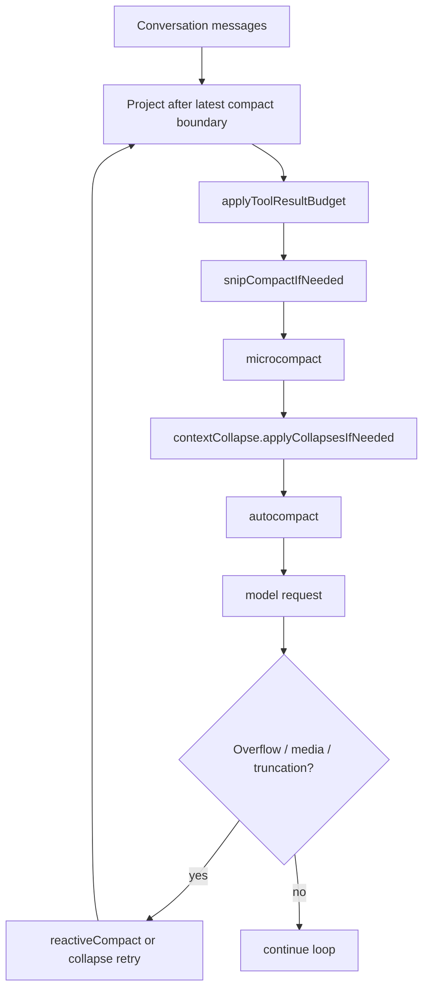

## Document 7: Context Management & Compression

### Scope

This document analyzes Claude Code’s context-management and compression architecture: how it keeps long-running sessions usable under model context limits while preserving enough state to continue work coherently.

Primary code references:

- `src/query.ts`
- `src/services/compact/microCompact.ts`
- `src/services/compact/autoCompact.ts`
- `src/services/compact/compact.ts`
- `src/services/compact/prompt.ts`
- `src/services/compact/sessionMemoryCompact.ts`
- `src/services/compact/postCompactCleanup.ts`
- `src/services/compact/apiMicrocompact.ts`
- `src/utils/messages.ts`
- `src/utils/toolResultStorage.ts`
- `src/services/contextCollapse/*`

---

## 1. Executive Summary

### What

Claude Code uses a **tiered context-management pipeline**, not a single “summarize when too long” mechanism.

From the inspected code, the runtime applies several context controls at different points and with different levels of invasiveness:

1. **project after latest compact boundary**
2. **tool-result budgeting**
3. **snip compaction**
4. **microcompact**
5. **context collapse**
6. **auto-compact**
7. **reactive compact** after withheld overflow/media errors
8. **manual / partial compact**
9. **session-memory compaction** as an alternative compact path

### Why

A long-running coding agent accumulates context from many different sources:

- assistant text
- tool use / tool results
- attachments
- memory and hook messages
- file reads and edits
- planning artifacts
- streaming thinking blocks

These do not all deserve the same retention strategy.

So the architecture uses multiple compaction layers because different context growth problems need different solutions.

### How

The main loop in `query.ts` applies context reduction roughly in this order:

### Architectural Classification

| Dimension | Classification | Why it fits |
|---|---|---|
| strategy style | **Layered reduction pipeline** | multiple reduction mechanisms with increasing invasiveness |
| retention model | **Boundary-based selective preservation** | compact boundaries define retained vs summarized history |
| optimization style | **Prompt-cache-aware context shrinking** | several strategies avoid rewriting stable prompt prefixes unnecessarily |
| recovery style | **Preemptive + reactive** | reduction happens both before API calls and after overflow/media failures |
| persistence style | **Summary + preserved tail + rehydrated attachments** | compaction never means “forget everything” |

---

## 2. The Core Design Idea

The central design idea is:

> **Context pressure is solved first with cheap local edits, and only later with expensive semantic summarization.**

This is the most important architectural principle in the subsystem.

It explains why the runtime does not jump straight to full summarization every time token counts rise.

### Why this is the right strategy

Because full summarization has significant cost:

- extra API calls
- prompt-cache invalidation
- lossy transformation of prior reasoning/work
- more complex replay and continuation semantics

So the architecture tries progressively stronger measures:

- remove or rewrite low-value bulky artifacts first
- preserve granular history when possible
- summarize only when cheaper techniques are insufficient

That is very good systems design.

---

## 3. Compact Boundaries as the Fundamental Structural Primitive

## 3.1 What

The context system revolves around **compact boundary messages**.

`compact.ts`, `sessionMemoryCompact.ts`, and `query.ts` all rely on this idea.

The main loop begins from:

- `getMessagesAfterCompactBoundary(messages)`

rather than always from the full transcript.

### Why this matters

A compact boundary is the system’s explicit marker that:

- history before this point has been transformed
- later iterations should operate on a projected suffix
- additional metadata may be needed to interpret preserved segments and loaded tools

This is better than an implicit “messages array was replaced” approach.

---

## 3.2 Boundary metadata

The inspected code shows boundary metadata can carry information such as:

- pre-compact token count
- pre-compact discovered deferred tools
- preserved segment linkage (`headUuid`, `anchorUuid`, `tailUuid`)

### Why this is smart

Compaction is not just deleting messages. It is a graph surgery problem:

- some messages are summarized
- some are preserved verbatim
- transcript links may need relinking
- tool-discovery state must survive summary loss

The boundary metadata is the architecture’s way of carrying those invariants explicitly.

---

## 4. The Pre-Request Reduction Pipeline in `query.ts`

## 4.1 Observed order of operations

The grep results in `src/query.ts` show the following sequence in the main loop:

1. start from messages after latest compact boundary
2. `applyToolResultBudget(...)`
3. `snipCompactIfNeeded(...)`
4. `deps.microcompact(...)`
5. `contextCollapse.applyCollapsesIfNeeded(...)`
6. `deps.autocompact(...)`
7. proceed to model call

### Why the order matters

This is a carefully staged funnel from lightest to heaviest interventions.

Each stage is allowed to reduce pressure before the next, more invasive stage gets a chance.

That is strong architecture.

---

## 4.2 Why boundary projection happens first

`query.ts` starts from a projection of messages after the most recent compact boundary.

### Why

The loop should not re-process history that has already been summarized and structurally replaced.

This keeps the runtime aligned with its own compacted worldview.

---

## 5. Tool-Result Budgeting

## 5.1 What

Before the more specialized compact passes, the runtime applies:

- `applyToolResultBudget(...)`

This lives outside the dedicated compact folder because tool-result storage is both:

- a context-management concern
- a tool result persistence/display concern

### Why this stage exists

Tool outputs are often the single biggest source of context bloat.

But they are also structurally regular and easier to trim than arbitrary conversation history.

So budgeting tool results early is cheaper than running semantic compaction.

### Architectural role

This stage acts as a **specialized pre-filter for high-volume machine-generated content**.

---

## 6. Snip Compaction

## 6.1 What

`query.ts` applies snip before microcompact.

The code comments explain why:

- snip removes messages
- the surviving assistant usage metadata still reflects pre-snip context
- `snipTokensFreed` is threaded into later autocompact threshold logic

### Why this matters

The system does not trust raw usage metadata after structural changes.

It explicitly corrects threshold decisions with an estimated delta.

That is very careful engineering.

---

## 6.2 Why snip comes before microcompact

Because snip removes larger structural chunks, while microcompact mostly edits specific content patterns.

If snip already reduces the context sufficiently, later stages may do less work or no work.

This ordering is sensible.

---

## 7. Microcompact: Localized Tool/Thinking Reduction

## 7.1 What

`src/services/compact/microCompact.ts` implements a localized compaction stage focused on tool results and, in some cases, cache editing.

It provides:

- token estimation helpers
- compactable tool classification
- cached microcompact state
- time-based microcompact
- cached microcompact path with deferred API edits

### Why this is a distinct subsystem

Microcompact solves a specific problem:

- large old tool results are expensive to resend
- they are often less valuable than the surrounding conversation structure
- they can often be cleared without losing high-level task continuity

So it is more targeted than full summarization.

---

## 7.2 Compactable tools

The code defines `COMPACTABLE_TOOLS` including categories like:

- file read/write/edit
- shell tools
- grep/glob
- web fetch/search

### Why

These are high-volume tools whose raw outputs quickly dominate context size.

Not every tool output is equally profitable to compact.

That selectivity is good design.

---

## 7.3 Cached microcompact path

When supported by build/model/source constraints, the cached path:

- tracks compactable tool results
- identifies tool results to delete
- queues `cache_edits` blocks for the API layer
- keeps local messages unchanged
- defers boundary emission until after API response so real deleted-token counts are known

### Why this is architecturally significant

This is a very advanced prompt-cache optimization.

The system wants to reduce effective input size **without rewriting the local prompt prefix** and without discarding transcript fidelity.

That means microcompact is not merely message mutation — it is also **API-level cache-aware context editing**.

---

## 7.4 Time-based microcompact

`microCompact.ts` also supports a time-gap-triggered path.

When the gap since the last assistant message exceeds a configured threshold:

- server cache is assumed cold
- old compactable tool results are content-cleared directly in messages
- only the most recent tool results are kept
- cached MC state is reset

### Why this makes sense

Cache editing assumes a warm cache.

If the cache is already cold, there is no reason to preserve it with edit blocks; direct message mutation becomes the simpler and cheaper path.

This is a very mature optimization strategy.

---

## 7.5 Why microcompact is before autocompact

Because microcompact is cheaper, more local, and often prompt-cache-friendly.

If it gets the request back under budget, the system avoids a much more destructive full compaction.

That is exactly what a well-designed tiered context system should do.

---

## 8. API-Native Context Editing

## 8.1 What

`src/services/compact/apiMicrocompact.ts` describes API-level context-edit strategies such as:

- `clear_tool_uses_20250919`
- `clear_thinking_20251015`

The module builds a `ContextManagementConfig` that can be sent to the API.

### Why this matters

This shows the architecture is evolving toward **native provider-supported context management**, not only client-side message rewriting.

That is an important design direction.

---

## 8.2 Thinking-clearing support

The API-native path can preserve or clear thinking turns depending on settings like:

- whether thinking exists
- whether redacted thinking is active
- whether “clear all thinking” mode is desired

### Why this is notable

Thinking blocks are semantically different from normal text and from tool outputs.

The context system explicitly treats them as their own compression class.

---

## 9. Context Collapse

## 9.1 What

`query.ts` applies context collapse before autocompact:

- `contextCollapse.applyCollapsesIfNeeded(...)`

The comments in `autoCompact.ts` explain the relationship clearly:

- when context collapse is enabled, it becomes the main context-management system
- autocompact is suppressed to avoid racing with collapse

### Why this matters

The project recognizes that multiple context-management strategies can conflict if run independently.

So it explicitly establishes a precedence relationship.

---

## 9.2 Why collapse precedes autocompact

The comment in `query.ts` says collapse runs before autocompact so that, if collapse gets the request under threshold, autocompact becomes a no-op and granular context is preserved.

### Interpretation

Context collapse is considered less destructive or more structurally faithful than full autocompact in the scenarios where it applies.

That is a very important policy choice.

---

## 9.3 Collapse retry transitions

`query.ts` records transition reasons such as:

- `collapse_drain_retry`

and special-cases interactions between collapse and reactive compact.

### Why this matters

Context collapse is not just a preprocessing step; it also participates in recovery control flow.

So it is part of the query loop state machine, not only a helper function.

---

## 10. Auto-Compact

## 10.1 What

`src/services/compact/autoCompact.ts` implements threshold-based automatic full compaction.

It includes:

- effective context window sizing
- warning/error/autocompact thresholds
- circuit-breaker logic
- integration with session-memory compaction
- fallback to legacy compact conversation summarization

### Why this is necessary

Sometimes localized edits are not enough.

The runtime needs a reliable “hard” mechanism to shrink the conversation substantially before the next turn.

---

## 10.2 Effective context window

`getEffectiveContextWindowSize(...)` computes:

- model context window
- minus reserved output tokens
- possibly overridden by env/test settings

### Why

The system does not treat the raw context window as fully available for input.

It reserves budget for the summary/output itself.

That is correct and avoids self-induced prompt-too-long failures during compaction.

---

## 10.3 Threshold model

`calculateTokenWarningState(...)` computes:

- percentage left
- warning threshold state
- error threshold state
- autocompact threshold state
- blocking-limit state

### Why this matters

Context management is not binary. The UI/runtime needs early signals before catastrophic overflow.

This threshold model supports:

- warnings
- proactive compaction
- hard blocking behavior

---

## 10.4 Circuit breaker

`autoCompact.ts` stops retrying after a capped number of consecutive autocompact failures.

### Why this is excellent engineering

Without a circuit breaker, an irrecoverably oversized session would hammer the API with doomed autocompaction attempts on every turn.

The code comment explicitly calls out this production failure mode.

---

## 10.5 Why autocompact is sometimes suppressed

`shouldAutoCompact(...)` disables or suppresses autocompact in cases such as:

- explicit disable envs
- session-memory / compact recursion guards
- reactive-only compact experiments
- context collapse ownership mode

### Why this matters

The system understands that “always auto-compact when large” would create strategy conflicts and even deadlocks in forked compact/session-memory agents.

This is disciplined subsystem interaction management.

---

## 11. Session-Memory Compaction

## 11.1 What

`src/services/compact/sessionMemoryCompact.ts` provides an alternate compaction path using extracted session memory rather than generating a fresh summary via a compact API call.

This path can:

- use already-extracted session memory content
- keep a configurable suffix of recent messages
- preserve tool-use/result invariants
- reintroduce a compact summary user message built from session memory

### Why this is interesting

This is an alternative philosophy of compaction:

- instead of asking the model to summarize now
- reuse persistent session-memory state that may already encode the important long-term context

That is a strong design direction for long-lived agents.

---

## 11.2 Configurable retention floor and cap

The session-memory path uses config values such as:

- `minTokens`
- `minTextBlockMessages`
- `maxTokens`

### Why

A good compacted suffix should preserve:

- enough semantic recency
- enough textual user/assistant interaction
- but not too much raw token weight

The architecture encodes all three constraints.

---

## 11.3 Preserving API invariants

One of the strongest pieces of logic in the file is `adjustIndexToPreserveAPIInvariants(...)`.

It expands the kept range backwards when necessary to avoid breaking:

- `tool_use` / `tool_result` pairing
- streaming assistant block groups that share `message.id` (especially thinking + tool use)

### Why this matters

This is a crucial insight:

Compaction is constrained not only by semantics, but also by **API validity invariants**.

The code explicitly protects against orphan tool results and lost thinking/message fragments after normalization.

That is excellent architecture.

---

## 11.4 Resumed-session support

The session-memory path supports cases where session memory exists but `lastSummarizedMessageId` is absent, such as resumed sessions.

### Why

Compaction must remain useful even after session lifecycle discontinuities.

This shows the context system is designed for persistence realism, not only uninterrupted ideal sessions.

---

## 12. Legacy / Manual Full Compaction

## 12.1 What

`src/services/compact/compact.ts` implements the traditional summary-based compaction flow.

Its responsibilities include:

- pre-compact hooks
- summary prompt construction
- compact summary request streaming
- prompt-too-long retry by truncating oldest groups
- cache/read-file cleanup
- post-compact attachment regeneration
- compact boundary creation
- session-start hook rerun
- post-compact hooks
- telemetry emission

### Why this file is large

Full compaction is a major workflow, not a single helper function.

It must preserve many session behaviors even though most message history is being rewritten.

---

## 12.2 Summary prompt design

`src/services/compact/prompt.ts` provides prompts such as:

- `getCompactPrompt(...)`
- `getPartialCompactPrompt(...)`
- `getCompactUserSummaryMessage(...)`

The prompt design is explicit about:

- no tools
- analysis scratchpad wrapped in `<analysis>`
- structured `
` output
- coverage of user requests, files, errors, pending tasks, and current work

### Why this matters

Compaction quality is prompt-engineered very intentionally.

The subsystem knows the summary is not casual prose — it is the future working memory of the session.

---

## 12.3 Full compaction is a forked-agent summary request

`compact.ts` uses the shared runtime/API machinery to stream a compact summary, and comments mention a forked-agent path for prompt cache sharing.

### Why this is significant

Even compaction itself is architecturally integrated into the broader agent/runtime system rather than implemented as an unrelated summarization script.

---

## 12.4 PTL retry during compaction itself

If the compaction request hits prompt-too-long, `compact.ts` can:

- group messages by API round
- drop oldest groups
- insert a synthetic user marker if needed
- retry up to a limit

### Why

Compaction failing due to prompt length would otherwise trap the user in an unrecoverable state.

This fallback is lossy, but operationally necessary.

---

## 13. Partial Compaction

## 13.1 What

`compact.ts` also supports partial compaction via `partialCompactConversation(...)` with directions:

- `from`
- `up_to`

### Why this exists

Not all compact needs are “summarize everything old.”

Sometimes the user or runtime wants to summarize only:

- the suffix after a pivot
- the prefix before a pivot

That is a more flexible context-management surface.

---

## 13.2 Cache implications

The code comments note:

- `from`: preserves prompt cache for earlier kept messages
- `up_to`: invalidates prompt cache because the summary precedes kept later messages

### Why this is architecturally important

Prompt cache behavior is treated as a first-class consequence of compaction direction.

This is a recurring theme across the whole subsystem.

---

## 14. Rehydration After Full Compaction

## 14.1 What gets reintroduced

After full compaction, `compact.ts` may reintroduce or regenerate:

- selected file attachments
- async agent attachments
- plan attachment
- plan mode attachment
- invoked-skill attachment
- deferred tools delta attachment
- agent listing delta attachment
- MCP instructions delta attachment
- session-start hook messages

### Why

A raw summary is not enough.

The model also needs key structured runtime context that used to live in the discarded history.

### Interpretation

This architecture is not “compress everything into a paragraph.”

It is:

> **summarize conversational history, then rehydrate structured machine context separately**

That is much better.

---

## 15. Reactive Compact and Error Recovery

## 15.1 What

`query.ts` integrates reactive compact when the model response indicates withheld prompt-too-long or media-size errors.

Transition labels include:

- `reactive_compact_retry`
- `collapse_drain_retry`
- `max_output_tokens_recovery`

### Why this matters

The context system is not only proactive. It also repairs requests after the model/backend rejects them.

This is essential for real-world robustness.

---

## 15.2 Reactive compact’s role

Reactive compact acts as a recovery path when:

- proactive reduction was insufficient
- autocompact is disabled/suppressed
- media-size issues require stripping/rewriting context differently

### Architectural interpretation

Reactive compact is the bridge between:

- context management subsystem
- query loop recovery state machine

It belongs equally to both.

---

## 15.3 Deferred microcompact boundary emission

For cached microcompact, `query.ts` defers microcompact boundary emission until after API response so it can use real `cache_deleted_input_tokens` deltas.

### Why

This shows that compaction accounting is synchronized with actual API usage, not just client-side guesses.

Again, strong engineering discipline.

---

## 16. Post-Compact Cleanup and State Hygiene

## 16.1 What

`src/services/compact/postCompactCleanup.ts` resets caches and subsystem state after compaction.

It clears things such as:

- microcompact state
- context-collapse state (main-thread only)
- `getUserContext` memoization / memory-file caches (main-thread only)
- system prompt section cache
- classifier approvals
- speculative checks
- beta tracing state
- session message caches

### Why this matters

Compaction invalidates many memoized assumptions.

If stale caches survive, the next turn could operate on logically impossible state.

---

## 16.2 Why main-thread-only cleanup exists

The comments explain that subagents share module-level state with the main thread, so resetting certain caches during a subagent compaction would corrupt the parent’s state.

### Why this is a very important design detail

The context system is aware of the multi-agent shared-process architecture and adjusts cleanup scope accordingly.

This is excellent cross-subsystem reasoning.

---

## 17. Direct Answers to the Required Questions

## 17.1 How is long-context compression implemented?

It is implemented as a layered pipeline combining:

- boundary-based message projection
- tool-result budgeting
- snip compaction
- microcompact (including cache-edit and time-based modes)
- context collapse
- autocompact
- reactive compact
- legacy/manual full compaction
- session-memory compaction

The system chooses progressively stronger and more lossy techniques only as needed.

---

## 17.2 How are context windows and budgets managed?

Budgets are managed through several interacting mechanisms:

- effective context window calculation reserves output space
- warning/error/autocompact/blocking thresholds are computed from token usage
- tool-result budgeting and snip reduce raw prompt weight early
- microcompact and collapse preserve useful structure while shrinking payload
- autocompact and reactive compact are fallback mechanisms when cheaper measures are insufficient
- session-memory and partial compaction provide alternate or more targeted summary paths

---

## 17.3 What are the pros and cons of summarization/compression strategies?

### Strengths

- local, cheap strategies often avoid full compaction
- compact boundaries make structural state explicit
- prompt-cache-aware methods reduce cost dramatically
- session-memory path can preserve long-lived context without repeated summarization calls
- post-compact rehydration preserves critical structured context
- the system respects API pairing and normalization invariants

### Weaknesses

- the subsystem is conceptually dense and distributed across many files
- multiple strategies can interact subtly
- some flows are highly feature-flag dependent
- full compaction is operationally heavy
- cache-aware strategies add significant cognitive complexity

---

## 18. Why This Context System Looks the Way It Does

### Why not just summarize the whole conversation whenever it gets large?

Because that would be expensive, lossy, and destructive to prompt cache stability.

### Why not only use API-native context editing?

Because the runtime needs solutions that work even when:

- API-native editing is unavailable
- session-memory compaction is preferable
- full semantic summarization is required
- media/tool semantics need special handling

### Why use compact boundaries instead of just replacing the messages array?

Because the system needs explicit structural markers for projection, transcript relinking, discovered-tool preservation, and preserved-tail semantics.

### Why does the subsystem integrate so tightly with prompt cache behavior?

Because prompt-cache economics materially affect both cost and latency in long-running coding sessions.

---

## 19. Pros & Cons of the Overall Architecture

### Strengths

- **Very sophisticated tiered reduction pipeline**
- **Strong awareness of prompt cache behavior**
- **Good separation between conversational summarization and structured context rehydration**
- **Robust API-invariant preservation**
- **Thoughtful recovery behavior for overflow/media failures**
- **Strong cleanup discipline after compaction**
- **Session-memory path points toward stronger long-lived memory architectures**

### Weaknesses

- **High complexity and many interacting strategies**
- **Behavior depends on feature flags, query source, model, and provider support**
- **Some modules are very large, especially `compact.ts`**
- **Prompt-cache optimizations make the system harder to reason about**
- **Difficult to understand fully without tracing both loop control flow and compact internals**

### Plausible Improvement Directions

1. expose a single runtime-visible context-strategy trace showing which reduction stages fired on a turn and why
2. make the policy boundary between collapse, microcompact, and autocompact more declarative
3. extract compact-boundary metadata semantics into a smaller dedicated module/type layer
4. add developer tooling to inspect the effective post-reduction message set and token budget before API submission

---

## 20. Deep Questions

1. **Will session-memory compaction eventually replace more of the legacy full-summary path, or remain an experimental side path?**

2. **Can the interaction between context collapse, reactive compact, and autocompact be made easier to reason about declaratively?**

3. **How far can prompt-cache-optimized microcompact evolve before the local message model and API message model diverge too much conceptually?**

4. **Should compact boundaries become even more explicit in the transcript model, perhaps with richer provenance and strategy metadata?**

5. **What is the long-term balance between provider-native context editing and client-side summarization?**
   - The codebase appears to be exploring both seriously.

---

## 21. Next Deep-Dive Directions

The next strongest follow-ups from the context system are:

1. **Memory & Persistence**
   - because session memory, transcript paths, boundaries, and resumability are tightly coupled
2. **Observability & Telemetry**
   - because compaction decisions and prompt-cache behavior are heavily instrumented
3. **Runtime & Execution Environment**
   - because worktree/subagent interactions and shared module state affect cleanup and retention behavior

---

## 22. Bottom Line

Claude Code’s context-management system is best understood as a **multi-stage, prompt-cache-aware reduction pipeline with explicit structural boundaries**.

Its most important architectural ideas are:

- solve context pressure with progressively stronger strategies
- preserve API invariants and transcript structure explicitly
- treat prompt cache behavior as a first-class design input
- separate semantic summary from structured rehydration
- integrate context reduction directly into the query loop’s recovery state machine

This makes the subsystem more complex than a simple summarization feature, but it is also what allows Claude Code to sustain long-running software-engineering sessions without collapsing into either runaway prompt growth or overly lossy memory.