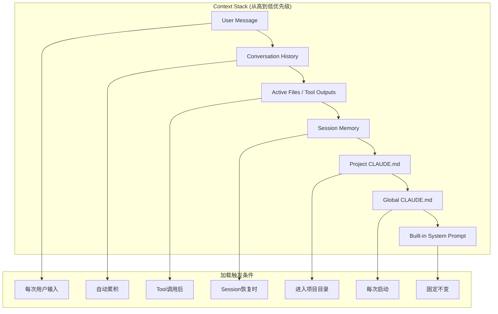
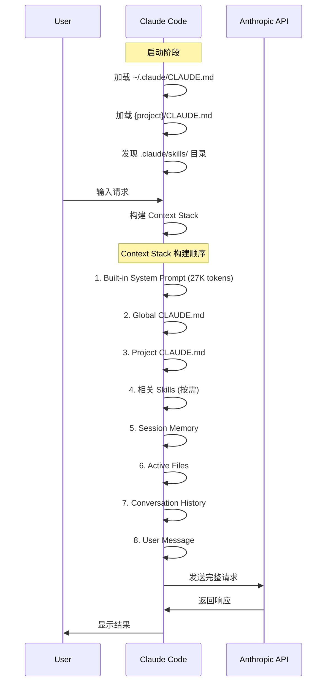
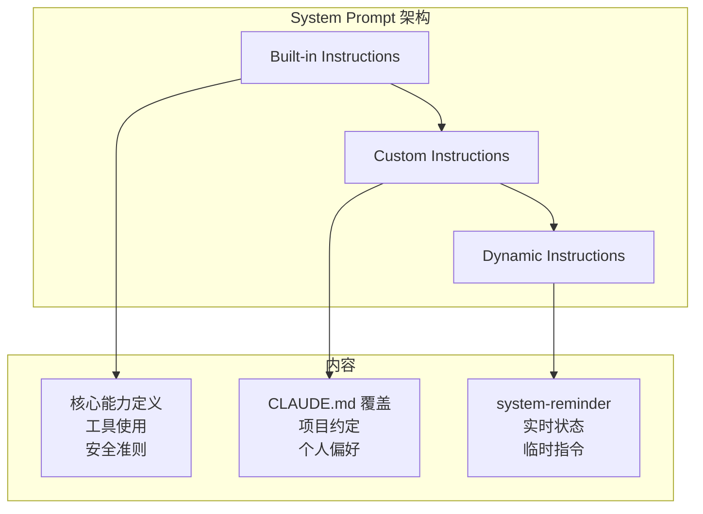

2. Context 上下文工程系统
2.1 原理说明
Context工程是Claude Code区别于普通聊天机器人的核心能力。它解决了一个根本性问题：如何在有限的Context Window（200K tokens）内，为Agent提供完成任务所需的最相关上下文。这不仅是简单的文本截断，而是一个涉及信息检索、相关性排序、动态加载的复杂系统工程。

Claude Code的Context系统采用分层注入模型：不同来源的上下文按优先级和作用域分层叠加，形成最终的Prompt。这种设计确保了关键信息（如项目规范）始终可用，同时允许动态加载任务特定的上下文。

2.2 架构设计
2.2.1 Context分层模型
graph TB
    subgraph "Context Stack"
        A[System Prompt] --> B[Global CLAUDE.md]
        B --> C[Project CLAUDE.md]
        C --> D[Session Memory]
        D --> E[Active Files]
        E --> F[Tool Outputs]
        F --> G[User Message]
    end
    
    subgraph "优先级"
        A1[最高 - 不可覆盖]
        B1[高 - 项目级]
        C1[中 - 会话级]
        D1[低 - 动态加载]
    end
2.2.2 CLAUDE.md项目记忆系统
CLAUDE.md是Claude Code的声明式记忆机制，采用Markdown格式存储项目级上下文。其设计哲学是：将项目知识从Agent的短期记忆中剥离，持久化为可版本控制的文档。

层级覆盖策略：

层级	路径	作用域	加载时机
全局	~/.claude/CLAUDE.md	所有项目	每次启动
项目	{project}/CLAUDE.md	当前项目	进入项目目录
会话	内存中动态生成	当前Session	任务切换时
CLAUDE.md结构规范：

---
version: "1.0"
last_updated: "2026-03-27"
---

# Project Context

## Architecture Overview
- Tech stack: Next.js 14, TypeScript, Prisma, PostgreSQL
- Monorepo structure: apps/web, packages/ui, packages/api

## Coding Conventions
- Use functional components with hooks
- Prefer `async/await` over raw Promises
- Error handling: use custom AppError class

## Important Patterns
### API Routes
- Always validate with Zod schemas
- Use `withAuth` HOC for protected routes

### Database
- Use transactions for multi-table operations
- Never use `delete()` without `where` clause

## Known Issues
- OAuth callback has race condition (see #234)
- Rate limiter needs tuning for batch operations
2.3 实现机制
2.3.1 自动注入流程
class ContextInjector {
  async buildContext(request: UserRequest): Promise<ContextStack> {
    const stack: ContextStack = [];
    
    // 1. 系统Prompt（固定）
    stack.push(await this.loadSystemPrompt());
    
    // 2. 全局CLAUDE.md
    const globalContext = await this.loadGlobalClaudeMd();
    if (globalContext) stack.push(globalContext);
    
    // 3. 项目CLAUDE.md
    const projectContext = await this.loadProjectClaudeMd(request.projectPath);
    if (projectContext) stack.push(projectContext);
    
    // 4. 检索相关记忆
    const relevantMemories = await this.memorySystem.retrieve(
      request.query,
      { topK: 5 }
    );
    stack.push(this.formatMemories(relevantMemories));
    
    // 5. 动态加载相关文件
    const relevantFiles = await this.codeRetrieval.search(
      request.query,
      { topK: 10 }
    );
    for (const file of relevantFiles) {
      stack.push(await this.loadFile(file.path));
    }
    
    // 6. 用户消息
    stack.push({ role: 'user', content: request.message });
    
    return stack;
  }
}
2.3.2 Context Window优化算法
滑动窗口策略：

class SlidingWindowManager {
  private readonly MAX_TOKENS = 200000;
  private readonly RESERVE_TOKENS = 20000; // 留给响应
  
  optimize(messages: Message[]): Message[] {
    const availableTokens = this.MAX_TOKENS - this.RESERVE_TOKENS;
    let currentTokens = this.countTokens(messages);
    
    if (currentTokens <= availableTokens) {
      return messages;
    }
    
    // 策略1: 压缩旧消息
    const compressed = this.compressOldMessages(messages);
    currentTokens = this.countTokens(compressed);
    
    if (currentTokens <= availableTokens) {
      return compressed;
    }
    
    // 策略2: 移除低优先级文件内容
    const pruned = this.pruneLowPriorityFiles(compressed);
    currentTokens = this.countTokens(pruned);
    
    if (currentTokens <= availableTokens) {
      return pruned;
    }
    
    // 策略3: 最终截断（保留系统消息和最近对话）
    return this.truncateWithPriority(pruned, availableTokens);
  }
  
  private compressOldMessages(messages: Message[]): Message[] {
    const thresholdIndex = Math.max(0, messages.length - 20);
    
    return messages.map((m, i) => {
      if (i < thresholdIndex && m.role === 'assistant') {
        // 压缩早期助手消息
        return {
          ...m,
          content: this.summarize(m.content)
        };
      }
      return m;
    });
  }
}
重要性评分算法：

function calculateMessageImportance(
  message: Message,
  currentTask: string,
  conversationHistory: Message[]
): number {
  const scores = {
    // 系统消息最高优先级
    system: 1.0,
    
    // 用户消息根据相关性评分
    user: calculateRelevance(message.content, currentTask),
    
    // 助手消息根据包含的关键信息评分
    assistant: extractKeyInformation(message.content).length / 100,
    
    // 工具输出根据使用频率评分
    tool: countToolReferences(message.id, conversationHistory) / 10
  };
  
  // 时间衰减因子
  const timeDecay = Math.exp(-0.1 * message.turnsAgo);
  
  // 用户显式标记的重要消息
  const explicitImportance = message.markedImportant ? 1.5 : 1.0;
  
  return scores[message.role] * timeDecay * explicitImportance;
}
2.3.3 多模态Context处理
Claude Code支持多种数据类型的统一表示：

interface MultimodalContent {
  type: 'text' | 'image' | 'structured' | 'diagram';
  content: string | BinaryData;
  metadata: {
    mimeType: string;
    tokenCount: number;
    source?: string;
  };
}

class MultimodalContextHandler {
  async process(content: unknown): Promise<MultimodalContent> {
    if (this.isImage(content)) {
      return {
        type: 'image',
        content: await this.encodeImage(content),
        metadata: {
          mimeType: 'image/png',
          tokenCount: await this.estimateImageTokens(content)
        }
      };
    }
    
    if (this.isMermaidDiagram(content)) {
      return {
        type: 'diagram',
        content: content as string,
        metadata: {
          mimeType: 'text/mermaid',
          tokenCount: this.countTokens(content as string)
        }
      };
    }
    
    if (this.isJSON(content)) {
      return {
        type: 'structured',
        content: JSON.stringify(content, null, 2),
        metadata: {
          mimeType: 'application/json',
          tokenCount: this.countTokens(JSON.stringify(content))
        }
      };
    }
    
    return {
      type: 'text',
      content: String(content),
      metadata: {
        mimeType: 'text/plain',
        tokenCount: this.countTokens(String(content))
      }
    };
  }
}
2.4 最佳实践
保持CLAUDE.md精简：目标200行以内，定期清理过时信息
使用结构化格式：采用Markdown标题层级组织信息，便于Agent解析
动态加载大文件：对于大型文档，使用Read工具按需加载而非全部注入
监控Token使用：定期使用/context命令查看当前上下文占用


## 1. Context 分层注入系统

### 1.1 Context 分层架构概览

Claude Code 的 Context 系统采用**分层注入模型**，不同来源的上下文按优先级和作用域分层叠加，形成最终的 Prompt。这种设计确保了关键信息始终可用，同时允许动态加载任务特定的上下文。



### 1.2 三层 Context 架构

| 层级 | 路径 | 作用域 | Recall | Attention | Context Load |
|------|------|--------|--------|-----------|--------------|
| **Root CLAUDE.md** | `~/.claude/CLAUDE.md` | 全局 | 最高 - 总是加载 | 随Context大小下降 | 高 - 始终消耗Token |
| **Sub-dir CLAUDE.md** | `{subdir}/CLAUDE.md` | 目录级 | 高 - 访问文件时加载 | 高于Root（噪音更少） | 中等 - 仅相关时 |
| **Skills** | `.claude/skills/**/SKILL.md` | 按需 | 较低 - 手动或自动触发 | 最高 - 新鲜聚焦 | 最低 - 按需加载 |

### 1.3 CLAUDE.md 分层加载机制

#### 1.3.1 全局 CLAUDE.md (Layer 1)

**位置**: `~/.claude/CLAUDE.md`

**加载时机**: 每次 Claude Code 启动时自动加载

**用途**: 包含跨所有项目通用的个人偏好、身份信息、快捷方式

```markdown
---
# 个人身份信息
## Identity
Name: 张三
Role: 全栈工程师
Timezone: Asia/Shanghai

## 活跃项目
| 缩写 | 项目 | 技术栈 |
|------|------|--------|
| PROJ1 | 电商平台 | Next.js, Prisma, PostgreSQL |
| PROJ2 | 内部工具 | Python, FastAPI, Vue3 |

## 关键人员
| 姓名 | 角色 |
|------|------|
| 李四 | PROJ1 产品经理 |
| 王五 | PROJ2 后端负责人 |

## 通用偏好
- 快速、直接，不废话
- 基础设施优于指令
- 单一职责原则
- 不使用表情符号

## Shell 快捷方式
| 命令 | 路径 |
|------|------|
| proj1 | ~/Projects/ecommerce/ |
| proj2 | ~/Projects/internal-tools/ |

## 关键规则
1. 永远不要提交 .env 或凭证
2. 使用 uv 运行 Python
3. 更改后始终验证构建 + 测试
```

#### 1.3.2 项目级 CLAUDE.md (Layer 2)

**位置**: `{project-root}/CLAUDE.md`

**加载时机**: 进入项目目录时加载

**用途**: 项目特定的技术栈、架构约定、命令、当前迭代信息

```markdown
---
# 项目特定上下文
## 技术栈
- Next.js 14, TypeScript, Tailwind CSS
- Prisma ORM + PostgreSQL
- tRPC 用于 API
- Zod 用于验证

## 架构
- 依赖注入贯穿始终
- 每个文件一个组件
- 所有外部依赖使用接口

## 命令
| 命令 | 用途 |
|------|------|
| npm run dev | 开发服务器在 3000 端口 |
| npm run validate | Lint + build + test |
| npm run db:migrate | 运行数据库迁移 |

## 关键模式
- 所有 API 调用通过 src/lib/api-client.ts
- 认证通过 AuthProvider wrapper 提供
- 数据库类型自动生成，永不手写

## 当前迭代
- 功能: AI 助手对话
- 分支命名: feature/ai-assistant-{description}
```

#### 1.3.3 子目录 CLAUDE.md (Layer 3)

**位置**: `{subdir}/CLAUDE.md`

**加载时机**: Claude 读取该目录或子目录中的文件时

**用途**: 模块特定的模式、API 约定

```markdown
---
# API 模块特定上下文
## API 路由约定
- 始终使用 Zod 模式验证
- 使用 withAuth HOC 保护路由
- 错误处理使用 AppError 类

## 数据库操作
- 多表操作使用事务
- 永远不要不带 where 子句使用 delete()
```

### 1.4 Context 注入顺序详解



### 1.5 Prompt Caching 优化策略

Claude Code 使用 `cache_control: {"type": "ephemeral"}` 实现 Prompt Caching，降低 90% 的 Token 成本。

```typescript
// Claude Code API 请求结构
interface ClaudeCodeRequest {
  system: [
    {
      type: "text";
      text: string;  // Built-in system prompt
      cache_control: { type: "ephemeral" }  // 缓存点1
    },
    {
      type: "text";
      text: string;  // CLAUDE.md content
      cache_control: { type: "ephemeral" }  // 缓存点2
    }
  ];
  tools: ToolDefinition[];  // 工具定义也可缓存
  messages: Message[];  // 对话历史（不缓存）
}
```

**Caching 策略**:

| 内容 | 是否缓存 | 原因 |
|------|----------|------|
| Built-in System Prompt | ✅ | 所有用户共享 |
| Global CLAUDE.md | ✅ | 个人配置不变 |
| Project CLAUDE.md | ✅ | 同项目共享 |
| Skills | ✅ | 静态内容 |
| Conversation History | ❌ | 动态变化 |
| User Message | ❌ | 每次不同 |
| Tool Outputs | ❌ | 实时变化 |

**静态内容优先、动态内容置后**的布局原则：

```
[缓存区域 - 静态内容]
├── Built-in System Prompt
├── Global CLAUDE.md
├── Project CLAUDE.md
└── Skills

[非缓存区域 - 动态内容]
├── <system-reminder> (日期、git状态等)
├── Conversation History
├── Tool Outputs
└── User Message
```

### 1.6 system-reminder 机制

对于易变信息（日期、git状态、文件修改），Claude Code 使用 `<system-reminder>` 标签在 User Message 中传递，而非更新 System Prompt：

```json
{
  "role": "user",
  "content": "<system-reminder>\n# currentDate\nToday's date is 2026-03-27.\n</system-reminder>\n\nFix the login bug"
}
```

这样可以保持 System Prompt 不变，缓存不失效。

---

## 2. Prompt 工程与系统Prompt结构

### 2.1 系统Prompt三层结构



### 2.2 Built-in System Prompt 核心内容

根据泄露的 Claude Code System Prompt，其核心结构包括：

```markdown
# Claude Code Built-in System Prompt 结构

## 1. 身份定义
You are Claude Code, an interactive CLI tool for software development.

## 2. 核心能力
- File operations (Read, Write, Edit)
- Shell command execution (Bash)
- Code search (Grep, Glob)
- Web access (WebSearch, WebFetch)
- Subagent spawning (Task/Agent)

## 3. 工具使用规则
- Read before Edit - 必须先读取再编辑
- Use exact string matching for Edit
- Check file existence before Write

## 4. 安全准则
- Ask permission before destructive operations
- Never execute untrusted code
- Respect .gitignore patterns

## 5. 行为偏好
- Be concise and direct
- Lead with findings, not process
- Use parallel tool calls when possible
```

### 2.3 XML 标签控制行为

Anthropic 官方使用 XML 标签控制 Claude 行为：

| 标签 | 作用 |
|------|------|
| `<do_not_act_before_instructions>` | 延迟行动直到条件满足 |
| `<default_to_action>` | 优先工具使用而非聊天回复 |
| `<use_parallel_tool_calls>` | 同时执行独立工具 |
| `<investigate_before_answering>` | 回答前进行研究 |
| `<avoid_excessive_markdown_and_bullet_points>` | 偏好散文而非列表 |

**示例**:

```markdown
<default_to_action>
When given a task, immediately start using tools to accomplish it rather than asking clarifying questions.
</default_to_action>

<use_parallel_tool_calls>
Execute independent tool calls simultaneously for efficiency.
</use_parallel_tool_calls>
```

### 2.4 Prompt 工程最佳实践

#### 2.4.1 正面表述优于禁止

| ❌ 避免 | ✅ 推荐 |
|--------|--------|
| "Never use X" | "Use Y instead [because reason]" |
| "Don't include X" | "Include only Y" |
| "Avoid X" | "Prefer Y" |
| "Don't explain" | "Output only the result" |

#### 2.4.2 具体优于模糊

| ❌ 模糊 | ✅ 具体 |
|--------|--------|
| "Format code properly" | "Use 2-space indentation for all code" |
| "Write good commit messages" | "Use conventional commits: `type(scope): description`" |
| "Handle errors correctly" | "Catch exceptions only when you have a specific recovery action" |

#### 2.4.3 提供动机说明

```markdown
## Python 环境
使用 `uv run` 执行所有 Python 命令。
**原因**: 自动管理虚拟环境和依赖。
```

### 2.5 Context Window 优化

#### 2.5.1 重要性评分算法

```typescript
interface MessageImportance {
  role: 'system' | 'user' | 'assistant' | 'tool';
  content: string;
  timestamp: number;
  markedImportant: boolean;
}

function calculateImportance(message: MessageImportance): number {
  const baseScores = {
    system: 1.0,
    user: 0.8,
    assistant: 0.6,
    tool: 0.4
  };
  
  // 时间衰减因子
  const age = Date.now() - message.timestamp;
  const timeDecay = Math.exp(-0.1 * age / (24 * 60 * 60 * 1000));
  
  // 显式标记重要性
  const explicitBonus = message.markedImportant ? 1.5 : 1.0;
  
  return baseScores[message.role] * timeDecay * explicitBonus;
}
```

#### 2.5.2 压缩策略

当 Context Window 接近上限（200K tokens）时：

1. **保留高优先级消息** (score > 0.7)
2. **压缩早期助手消息** - 摘要化
3. **移除低优先级文件内容**
4. **生成结构化摘要**

```typescript
interface CompactionStrategy {
  // 1. 识别保留消息
  keep: Message[];
  
  // 2. 识别可摘要消息
  summarize: Message[];
  
  // 3. 生成摘要
  summary: string;
  
  // 4. 重建上下文
  compactedContext: [
    ...keep,
    { type: 'summary', content: summary }
  ];
}
```


2.1 原理说明
Context工程是Codex区别于普通代码补全工具的关键。系统通过分层注入、智能压缩、动态检索三大机制，确保模型始终获得最相关、最精炼的上下文。

五层Context架构：

层级	内容	生命周期
Layer 5: Session	对话历史、用户偏好	单次会话
Layer 4: Project	AGENTS.md、项目结构	项目存续
Layer 3: Repository	Git状态、最近修改	工作区变化
Layer 2: Codebase	符号索引、语义搜索	按需加载
Layer 1: System	系统Prompt、工具定义	固定不变
2.2 架构设计
graph TB
    CA[Context Assembler] --> CP[Context Prioritizer]
    CP --> CC[Context Compressor]
    CC --> CR[Context Retriever]
    AG[AGENTS.md Parser] --> CA
    GI[Git Integration] --> CA
    SI[Symbol Index] --> CR
    VS[Vector Store] --> CR
2.3 实现机制
AGENTS.md自动注入：

pub async fn load(&self, cwd: &Path) -> Result<Vec<AgentsMdContent>> {
    let search_paths = vec![
        cwd.join(".codex").join("AGENTS.md"),
        cwd.join("AGENTS.md"),
    ];
    
    for path in search_paths {
        if path.exists() {
            let content = self.load_file(&path).await?;
            // 使用matter库解析YAML Front Matter
            let matter = Matter::<YAML>::new();
            let result = matter.parse(&content);
            contents.push(result);
        }
    }
    Ok(contents)
}
重要性评分算法：

fn compute_relevance_score(&self, memory: &Memory, query: &str) -> f64 {
    let mut score = 0.0;
    
    // 语义相似度 (40%)
    if let Some(embedding) = &memory.embedding {
        score += 0.4 * cosine_similarity(query_embedding, embedding);
    }
    
    // 时间衰减 (30%)
    let recency = (-age_hours / 24.0).exp();
    score += 0.3 * recency;
    
    // 重要性得分 (20%)
    score += 0.2 * memory.importance_score;
    
    // 访问频率 (10%)
    score += 0.1 * (memory.access_count as f64 / 10.0).min(1.0);
    
    score
}
滑动窗口策略：

pub fn fit_to_window(&self, messages: Vec<Message>) -> (Vec<Message>, Option<String>) {
    // 1. 分离必须保留的最近消息
    let recent = messages.split_off(messages.len() - self.min_recent_messages);
    
    // 2. 对旧消息评分并排序
    let mut scored: Vec<_> = messages.into_iter()
        .map(|m| (self.scorer.score(&m), m))
        .collect();
    scored.sort_by(|a, b| b.0.partial_cmp(&a.0).unwrap());
    
    // 3. 贪心选择高优先级消息
    let mut selected = Vec::new();
    for (score, msg) in scored {
        if self.fits_budget(&selected, &msg) {
            selected.push(msg);
        }
    }
    
    (selected, summary)
}
2.4 最佳实践
结构化Front Matter：明确定义Agent类型、权限、工具集
关键信息优先：重要约束放在AGENTS.md前面
主动提供相关文件：@src/auth/login.ts 请重构
请求Context摘要：定期 compact 释放Token