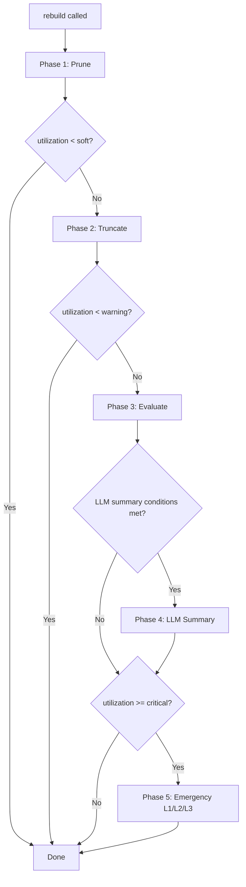
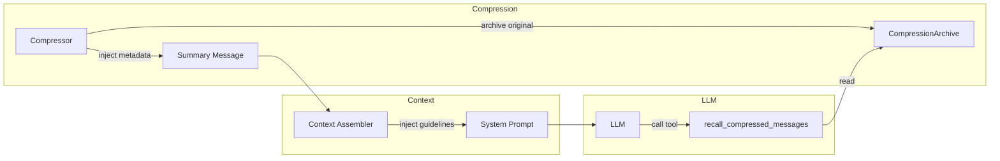
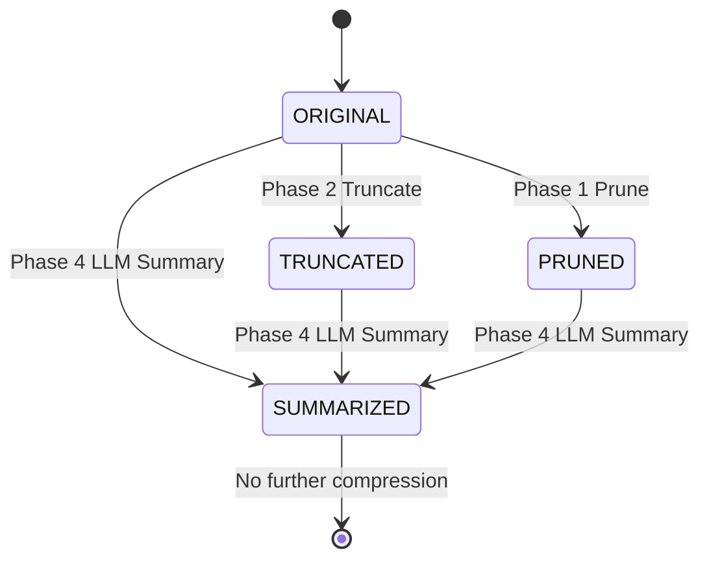
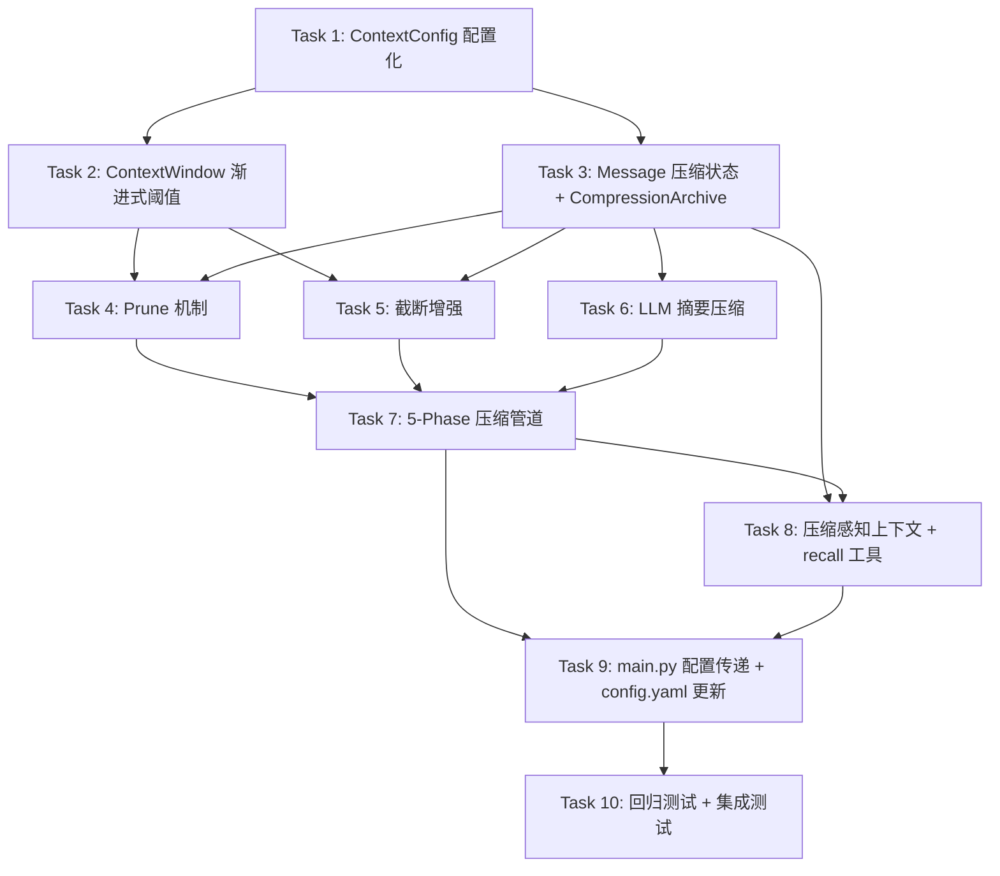

# 需求文档：上下文压缩策略优化

## 引言

当前 agent_x1 系统的上下文压缩策略存在以下核心问题：

1. **没有 LLM 语义摘要压缩**：所有压缩策略（Level 1/2/3）均基于规则（占位符替换、重要性评分贪心选择、关键词提取），无法保留对话中的语义信息。
2. **Assistant 消息不被主动截断**：`_truncate_old_tool_outputs()` 只处理 tool 角色消息，长 assistant 消息（如生成的文档内容）持续累积，导致 dynamic tokens 线性增长。
3. **压缩触发阈值过高且不渐进**：`critical_threshold=0.95` 意味着只有利用率达到 95% 才触发三级压缩管道，缺少中间渐进式压缩，可能导致从正常状态突然跳到紧急压缩，丢失大量信息。
4. **`keep_recent` 固定不变**：无论利用率多高，始终保留最近 4 条消息完整不动，高利用率时缺乏灵活性。
5. **重要性评分未被充分利用**：`ImportanceScorer` 仅在 Level 2 压缩中使用，主动截断阶段没有利用重要性评分来决定截断优先级。
6. **缺少 prune 机制**：没有类似 Gemini CLI 的 prune 步骤，无法在压缩前对大型工具输出进行预裁剪。
7. **压缩后 LLM 不知情**：当消息被压缩后，LLM 不知道前面的消息是被压缩过的，也无法在需要时回查完整的原始消息，导致压缩后可能丢失关键上下文。
8. **LLM 压缩与策略压缩缺乏协调**：LLM 摘要压缩（昂贵但语义保留好）和规则策略压缩（便宜但信息丢失多）之间没有明确的协调机制，不清楚何时用哪种、如何衔接、如何避免重复压缩。

本次优化的目标是建立一个**多级渐进式压缩体系**，在保持已有功能正常工作的前提下，引入 LLM 语义摘要压缩、渐进式阈值触发、assistant 消息截断、动态 keep_recent、重要性评分驱动截断、prune 机制、**压缩感知上下文**和**压缩策略协调机制**，使系统能够在长对话场景下有效控制上下文大小，同时最大程度保留关键语义信息。

### 涉及的核心文件

| 文件 | 职责 |
|------|------|
| `src/context/context_compressor.py` | 三级压缩管道实现 |
| `src/context/context_assembler.py` | 8层上下文组装、rebuild 流程 |
| `src/context/context_window.py` | Token 预算管理、阈值判断 |
| `src/context/importance_scorer.py` | 消息重要性评分 |
| `src/context/system_reminder.py` | 系统提醒注入（`<system-reminder>` 标签） |
| `src/context/__init__.py` | 模块导出 |
| `src/runtime/agent_loop.py` | AgentLoop 主循环（调用 build/rebuild） |
| `src/engine/base.py` | BaseEngine 抽象接口（LLM 调用） |
| `src/session/session_manager.py` | Session 管理、Turn 持久化 |
| `src/session/session_store.py` | SQLite 持久化层 |
| `src/tools/__init__.py` | 工具注册 |
| `src/tools/tool_registry.py` | 工具分类注册表 |

### 设计约束

- **向后兼容**：所有现有的压缩行为必须保留，新功能作为增强层叠加。
- **LLM 调用最小化**：LLM 摘要压缩是昂贵操作，必须仅在达到指定阈值时触发，不能每次 rebuild 都调用。
- **可配置性**：所有阈值、参数必须可通过配置调整。
- **可测试性**：LLM 摘要压缩必须支持 mock engine 注入，便于单元测试。
- **压缩透明性**：LLM 必须被明确告知上下文中哪些部分是被压缩过的，以及如何回查完整信息。

---

## 需求

### 需求 1：LLM 语义摘要压缩（P0）

**用户故事：** 作为一名开发者，我希望系统在上下文利用率达到高阈值时，使用 LLM 对旧对话进行语义摘要压缩，以便在长对话中保留关键语义信息而不是简单丢弃。

#### 验收标准

1. WHEN 上下文利用率达到 `llm_summary_threshold`（默认 80%）且尚未进行过 LLM 摘要 THEN 系统 SHALL 调用 LLM 对 `keep_recent` 窗口之外的旧消息生成语义摘要。
2. WHEN LLM 摘要压缩被触发 THEN 系统 SHALL 将旧消息替换为一条包含结构化摘要的 system 消息，摘要内容包括：关键决策、已完成的操作、当前任务状态、重要的文件变更、用户偏好。
3. WHEN LLM 摘要压缩被触发 THEN 系统 SHALL 记录日志，包含：压缩前 token 数、压缩后 token 数、压缩比率、被摘要的消息数量。
4. IF LLM 摘要调用失败（超时、API 错误等）THEN 系统 SHALL 回退到现有的 Level 1 占位符替换策略，并记录警告日志。
5. WHEN `ContextCompressor` 初始化时 THEN 系统 SHALL 接受一个可选的 `llm_caller` 参数（`Callable`），用于执行 LLM 摘要调用，以支持 mock 注入测试。
6. WHEN LLM 摘要已经执行过一次 THEN 系统 SHALL 在后续 rebuild 中跳过 LLM 摘要，直到摘要消息本身也变为"旧消息"（超出 keep_recent 窗口）且利用率再次达到阈值。
7. WHEN LLM 摘要压缩的 prompt 被构建时 THEN 系统 SHALL 使用专门设计的压缩 prompt，指导 LLM 输出结构化的 `<state_snapshot>` 格式摘要，包含 `decisions`、`completed_actions`、`current_state`、`file_changes`、`user_preferences` 等字段。
8. IF 被摘要的旧消息总 token 数小于 `min_summary_tokens`（默认 2000）THEN 系统 SHALL 跳过 LLM 摘要（消息太少不值得调用 LLM）。

### 需求 2：截断旧的长 Assistant 消息（P1）

**用户故事：** 作为一名开发者，我希望系统在主动截断阶段也能处理旧的长 assistant 消息，以便减少 30-50% 的 dynamic tokens 增长。

#### 验收标准

1. WHEN `_truncate_old_tool_outputs()` 处理超出 `keep_recent` 窗口的旧消息时 THEN 系统 SHALL 同时检查 assistant 消息（无 tool_calls 的纯文本回复），如果内容超过 `max_assistant_output_length`（默认 3000 字符）则进行 head+tail 截断。
2. WHEN 旧 assistant 消息被截断时 THEN 系统 SHALL 使用与工具输出截断相同的 head+tail 保留策略（保留前 N 字符 + 截断标记 + 后 N 字符）。
3. WHEN 旧 assistant 消息包含 tool_calls 时 THEN 系统 SHALL 不截断该消息（tool_calls 的 assistant 消息是工具调用链的一部分，截断会破坏上下文完整性）。
4. WHEN 截断发生时 THEN 系统 SHALL 在截断标记中注明 `[... N chars truncated from old assistant response ...]`，与工具输出截断标记区分。
5. IF `max_assistant_output_length` 配置为 0 或负数 THEN 系统 SHALL 禁用 assistant 消息截断（保持原有行为）。

### 需求 3：渐进式压缩阈值（P1）

**用户故事：** 作为一名开发者，我希望系统在上下文利用率逐步升高时采用渐进式压缩策略，以便避免从正常状态突然跳到紧急压缩导致大量信息丢失。

#### 验收标准

1. WHEN `ContextBudget` 初始化时 THEN 系统 SHALL 支持配置三个阈值：`soft_threshold`（默认 0.7）、`warning_threshold`（默认 0.8）、`critical_threshold`（默认 0.95）。
2. WHEN 上下文利用率达到 `soft_threshold`（70%）THEN 系统 SHALL 开始更激进的工具输出和 assistant 消息截断（降低 `max_tool_output_length` 和 `max_assistant_output_length`）。
3. WHEN 上下文利用率达到 `warning_threshold`（80%）THEN 系统 SHALL 触发 LLM 摘要压缩（需求 1）。
4. WHEN 上下文利用率达到 `critical_threshold`（95%）THEN 系统 SHALL 触发现有的三级压缩管道（Level 1 → Level 2 → Level 3）。
5. WHEN `ContextWindow` 被查询压缩级别时 THEN 系统 SHALL 提供一个 `compression_level()` 方法，返回当前应执行的压缩级别（`NONE`、`SOFT`、`WARNING`、`CRITICAL`）。
6. WHEN `rebuild()` 被调用时 THEN 系统 SHALL 根据 `compression_level()` 的返回值决定执行哪种压缩策略，而非仅依赖 `should_compress()` 的布尔判断。

### 需求 4：动态调整 keep_recent（P2）

**用户故事：** 作为一名开发者，我希望系统在高利用率时自动减少保留窗口大小，以便在 token 预算紧张时释放更多空间。

#### 验收标准

1. WHEN 上下文利用率低于 `soft_threshold`（70%）THEN 系统 SHALL 使用默认的 `keep_recent`（默认 4）。
2. WHEN 上下文利用率达到 `warning_threshold`（80%）THEN 系统 SHALL 将 `keep_recent` 减少到 `min_keep_recent`（默认 2），但不低于 2。
3. WHEN 上下文利用率达到 `critical_threshold`（95%）THEN 系统 SHALL 将 `keep_recent` 设为 `min_keep_recent`（默认 2）。
4. WHEN `keep_recent` 被动态调整时 THEN 系统 SHALL 记录日志，包含调整前后的值和触发原因。
5. IF `min_keep_recent` 配置为小于 2 THEN 系统 SHALL 强制设为 2（至少保留最近一轮 assistant+tool 交互）。

### 需求 5：在主动截断中使用重要性评分（P2）

**用户故事：** 作为一名开发者，我希望系统在主动截断阶段利用重要性评分来决定截断的激进程度，以便更智能地保留重要信息。

#### 验收标准

1. WHEN `_truncate_old_tool_outputs()` 处理旧消息时 THEN 系统 SHALL 先调用 `ImportanceScorer.score()` 计算每条消息的重要性分数。
2. WHEN 旧消息的重要性分数高于 `high_importance_threshold`（默认 0.7）THEN 系统 SHALL 使用更宽松的截断阈值（`max_tool_output_length * 2`），保留更多内容。
3. WHEN 旧消息的重要性分数低于 `low_importance_threshold`（默认 0.3）THEN 系统 SHALL 使用更激进的截断阈值（`max_tool_output_length / 2`），更积极地压缩。
4. WHEN 重要性评分被用于截断决策时 THEN 系统 SHALL 在日志中记录每条被截断消息的重要性分数和使用的截断阈值。

### 需求 6：增加 Prune 机制（P3）

**用户故事：** 作为一名开发者，我希望系统在 rebuild 流程中增加一个 prune 步骤，对大型工具输出进行预裁剪，以便更精细地管理工具输出的 token 消耗。

#### 验收标准

1. WHEN `rebuild()` 被调用时 THEN 系统 SHALL 在 `_truncate_old_tool_outputs()` 之前执行 `_prune_large_outputs()` 步骤。
2. WHEN 单条工具输出的 token 数超过 `prune_minimum`（默认 5000 tokens）THEN 系统 SHALL 将其标记为可裁剪。
3. WHEN 被标记的工具输出距离当前消息超过 `prune_protect` 条消息（默认 8 条）THEN 系统 SHALL 对其执行裁剪，将内容替换为摘要 + head/tail 预览。
4. WHEN prune 裁剪执行时 THEN 系统 SHALL 保留工具输出的前 200 字符（作为摘要预览）和后 200 字符（作为结果预览），中间用 `[... pruned N tokens for context efficiency ...]` 标记。
5. IF 工具输出在 `prune_protect` 窗口内（最近 8 条消息）THEN 系统 SHALL 不裁剪该输出，即使它超过 `prune_minimum`。

### 需求 8：压缩感知上下文与完整消息回查（P0）

**用户故事：** 作为一名开发者，我希望 LLM 在收到被压缩的上下文时，能够明确知道哪些消息是被压缩过的，并且在必要时可以回查完整的未压缩原始消息，以便在压缩后不丢失关键上下文信息。

#### 背景与设计思路

当前系统压缩消息后，LLM 完全不知道前面的消息被压缩过。这会导致：
- LLM 可能基于不完整的信息做出错误决策
- LLM 无法判断是否需要回查更详细的原始信息
- 压缩后的摘要可能遗漏了 LLM 当前步骤需要的关键细节

解决方案需要三个协同设计：
1. **压缩元数据注入**：在压缩摘要消息中嵌入元数据，告知 LLM 压缩发生了
2. **完整消息存储**：将被压缩的原始消息完整保存到 session 存储中
3. **回查工具**：提供一个内置工具让 LLM 可以按需查看被压缩的完整消息

#### 验收标准

##### 8.1 压缩元数据注入

1. WHEN LLM 摘要压缩（需求 1）被执行后 THEN 系统 SHALL 在生成的摘要 system 消息中包含一个 `<compression_metadata>` 块，内容包括：被压缩的消息数量、被压缩的消息时间范围（turn 编号范围）、压缩前的总 token 数、压缩后的 token 数、可回查的 archive_id。
2. WHEN 规则策略压缩（截断、prune、Level 1/2/3）被执行后 THEN 系统 SHALL 在截断标记中附加 `archive_id`，格式为 `[... N chars truncated ... | archive_id=<id> for full content]`。
3. WHEN 压缩摘要消息被插入到上下文中 THEN 系统 SHALL 在摘要消息末尾附加一段指引文本，告知 LLM：`"Note: The above is a compressed summary of earlier conversation. If you need the full original messages, use the 'recall_compressed_messages' tool with archive_id='<id>'."`

##### 8.2 完整消息归档存储

4. WHEN 任何压缩操作（LLM 摘要、截断、prune）将原始消息替换为压缩版本时 THEN 系统 SHALL 将被替换的完整原始消息序列化并存储到一个 `CompressionArchive` 中，以 `archive_id`（UUID）为键。
5. WHEN `CompressionArchive` 存储消息时 THEN 系统 SHALL 将数据持久化到 session 目录下的 `compression_archive.jsonl` 文件中，每行一个 archive 条目，格式为 `{"archive_id": "<id>", "turn_range": [start, end], "messages": [...], "compressed_at": "<timestamp>", "compression_type": "llm_summary|truncation|prune", "original_token_count": N}`。
6. WHEN `CompressionArchive` 被查询时 THEN 系统 SHALL 支持按 `archive_id` 检索完整的原始消息列表。
7. IF session 目录不存在或 archive 文件损坏 THEN 系统 SHALL 返回空结果并记录警告日志，不影响主流程。

##### 8.3 回查工具（recall_compressed_messages）

8. WHEN 系统初始化工具注册时 THEN 系统 SHALL 注册一个名为 `recall_compressed_messages` 的内置工具，归属于新的 `context` 工具类别。
9. WHEN LLM 调用 `recall_compressed_messages` 工具时 THEN 系统 SHALL 接受参数 `archive_id`（必选，字符串）和 `max_tokens`（可选，整数，默认 4000），返回对应 archive 中的完整原始消息内容。
10. WHEN 返回的原始消息总 token 数超过 `max_tokens` 参数时 THEN 系统 SHALL 对返回内容进行 head+tail 截断，并在截断标记中注明总消息数和总 token 数。
11. WHEN `recall_compressed_messages` 工具返回结果时 THEN 系统 SHALL 在结果前附加元数据头：`"[Archive Recall] archive_id=<id> | messages=N | original_tokens=M | showing_tokens=K"`。
12. IF `archive_id` 不存在 THEN 系统 SHALL 返回友好的错误消息：`"Archive '<id>' not found. It may have been from a previous session or already expired."`

##### 8.4 System Prompt 中的压缩感知指引

13. WHEN 系统构建 system prompt 时 AND 当前 session 中存在至少一次压缩操作 THEN 系统 SHALL 在 system prompt 的 guidelines 部分注入一段压缩感知指引，内容为：
    ```
    ### Compressed Context
    - Some earlier messages in this conversation have been compressed to save context space.
    - Compressed sections are marked with `<compression_metadata>` tags or `[... truncated ... | archive_id=<id>]` markers.
    - If you need the full original content of a compressed section, use the `recall_compressed_messages` tool with the corresponding `archive_id`.
    - Only recall when the compressed summary is insufficient for your current task.
    ```
14. WHEN 当前 session 中没有发生过任何压缩操作 THEN 系统 SHALL 不注入压缩感知指引（避免浪费 token）。

### 需求 9：LLM 压缩与策略压缩的协调机制（P0）

**用户故事：** 作为一名开发者，我希望 LLM 摘要压缩和规则策略压缩之间有明确的协调机制，以便系统能够在不同场景下选择最合适的压缩方式，避免重复压缩和资源浪费。

#### 背景与设计思路

LLM 摘要压缩和规则策略压缩各有优劣：

| 维度 | LLM 摘要压缩 | 规则策略压缩 |
|------|-------------|-------------|
| 语义保留 | 高（理解上下文语义） | 低（基于规则截断） |
| 成本 | 高（需要额外 LLM 调用） | 低（纯计算） |
| 延迟 | 高（需要等待 LLM 响应） | 低（毫秒级） |
| 压缩比 | 高（可压缩到 10-20%） | 中（通常 50-70%） |
| 适用场景 | 长对话、复杂任务 | 短对话、简单截断 |

协调机制的核心原则：
1. **策略压缩优先**：在低利用率阶段，优先使用低成本的规则策略压缩
2. **LLM 压缩兜底**：当策略压缩不足以控制上下文大小时，才触发 LLM 摘要压缩
3. **不重复压缩**：已经被 LLM 摘要过的消息不再被策略压缩处理
4. **压缩状态追踪**：系统需要追踪每条消息的压缩状态，避免重复操作

#### 验收标准

##### 9.1 压缩管道编排（Compression Pipeline Orchestrator）

1. WHEN `rebuild()` 被调用时 THEN 系统 SHALL 按以下固定顺序执行压缩管道：
   - **Phase 1: Prune**（需求 6）— 对超大工具输出进行预裁剪
   - **Phase 2: Truncate**（需求 2 + 现有截断）— 对旧消息进行 head+tail 截断
   - **Phase 3: Evaluate** — 评估当前利用率，决定是否需要进一步压缩
   - **Phase 4: LLM Summary**（需求 1）— 如果利用率仍高于 `warning_threshold`，触发 LLM 摘要
   - **Phase 5: Emergency**（现有 Level 1/2/3）— 如果利用率仍高于 `critical_threshold`，触发紧急压缩
2. WHEN 每个 Phase 执行完毕后 THEN 系统 SHALL 重新计算利用率，如果已降至安全水平（低于当前 Phase 的阈值）则跳过后续 Phase。
3. WHEN 压缩管道执行时 THEN 系统 SHALL 记录每个 Phase 的执行结果日志，包含：Phase 名称、执行前 token 数、执行后 token 数、是否跳过、跳过原因。

##### 9.2 压缩状态追踪

4. WHEN 消息被任何压缩操作处理后 THEN 系统 SHALL 在 `Message` 对象上设置 `compression_state` 属性，可选值为：`ORIGINAL`（未压缩）、`TRUNCATED`（被截断）、`PRUNED`（被裁剪）、`SUMMARIZED`（被 LLM 摘要替换）。
5. WHEN 压缩管道处理消息时 THEN 系统 SHALL 检查消息的 `compression_state`：
   - `SUMMARIZED` 状态的消息不再被 Truncate 或 Prune 处理（LLM 摘要已经是最优压缩）
   - `TRUNCATED` 状态的消息可以被 LLM Summary 进一步压缩（升级压缩）
   - `PRUNED` 状态的消息可以被 LLM Summary 进一步压缩（升级压缩）
6. WHEN `Message` 模型被初始化时 THEN 系统 SHALL 默认 `compression_state` 为 `ORIGINAL`。

##### 9.3 LLM 压缩触发条件的精细化

7. WHEN 评估是否触发 LLM 摘要压缩时 THEN 系统 SHALL 同时检查以下条件（全部满足才触发）：
   - 当前利用率 ≥ `warning_threshold`（80%）
   - 距离上次 LLM 摘要至少间隔 `min_summary_interval` 条新消息（默认 6 条）
   - 可被摘要的旧消息总 token 数 ≥ `min_summary_tokens`（默认 2000）
   - 当前 turn 中尚未执行过 LLM 摘要（每个 rebuild 周期最多一次）
8. WHEN LLM 摘要压缩被触发时 THEN 系统 SHALL 只对 `compression_state` 为 `ORIGINAL` 或 `TRUNCATED` 或 `PRUNED` 的旧消息进行摘要，跳过已经是 `SUMMARIZED` 状态的消息。
9. IF Phase 2（Truncate）已经将利用率降至 `warning_threshold` 以下 THEN 系统 SHALL 跳过 Phase 4（LLM Summary），记录日志 `"Skipping LLM summary: truncation sufficient (utilization={X}% < warning_threshold={Y}%)"`。

##### 9.4 压缩效果评估与自适应

10. WHEN 压缩管道完成所有 Phase 后 THEN 系统 SHALL 计算并记录整体压缩效果指标：总压缩比、各 Phase 贡献比例、LLM 摘要调用次数（累计）、当前 archive 数量。
11. IF 连续 3 次 rebuild 都触发了 LLM 摘要压缩 THEN 系统 SHALL 记录警告日志 `"Frequent LLM summarization detected. Consider increasing max_tokens budget or reducing task complexity."`，提示用户可能需要调整配置。
12. WHEN 压缩管道执行时 THEN 系统 SHALL 将压缩统计信息通过 `EventBus` 发出 `COMPRESSION_PIPELINE_COMPLETED` 事件，包含各 Phase 的详细统计。

### 需求 7：回归测试与集成验证

**用户故事：** 作为一名开发者，我希望所有优化改动都有完整的单元测试和集成测试覆盖，以便确保现有功能不被破坏且新功能正确工作。

#### 验收标准

1. WHEN 新的 LLM 摘要压缩功能被实现 THEN 系统 SHALL 提供单元测试，覆盖：正常摘要流程、LLM 调用失败回退、阈值未达到时跳过、最小 token 数检查、重复摘要跳过。
2. WHEN assistant 消息截断功能被实现 THEN 系统 SHALL 提供单元测试，覆盖：长 assistant 消息被截断、短 assistant 消息不被截断、带 tool_calls 的 assistant 消息不被截断、禁用配置生效。
3. WHEN 渐进式压缩阈值被实现 THEN 系统 SHALL 提供单元测试，覆盖：`compression_level()` 在不同利用率下返回正确级别、`rebuild()` 根据级别执行正确策略。
4. WHEN 动态 keep_recent 被实现 THEN 系统 SHALL 提供单元测试，覆盖：不同利用率下 keep_recent 的正确调整、最小值保护。
5. WHEN 重要性评分驱动截断被实现 THEN 系统 SHALL 提供单元测试，覆盖：高重要性消息使用宽松阈值、低重要性消息使用激进阈值。
6. WHEN prune 机制被实现 THEN 系统 SHALL 提供单元测试，覆盖：大输出被裁剪、保护窗口内不裁剪、裁剪格式正确。
7. WHEN 压缩感知上下文功能被实现 THEN 系统 SHALL 提供单元测试，覆盖：压缩元数据正确注入、archive 存储和检索、recall 工具正常工作、archive_id 不存在时的错误处理、system prompt 中压缩感知指引的条件注入。
8. WHEN 压缩协调机制被实现 THEN 系统 SHALL 提供单元测试，覆盖：5-Phase 管道按序执行、Phase 间利用率检查导致跳过、compression_state 正确追踪和尊重、LLM 摘要触发条件的精细化检查、连续摘要警告。
9. WHEN 所有优化完成 THEN 系统 SHALL 通过现有的所有单元测试（`tests/unit/test_context_compressor.py`、`tests/unit/test_context_window.py`、`tests/unit/test_context_rebuild.py`、`tests/unit/test_context_assembler.py`）。
10. WHEN 所有优化完成 THEN 系统 SHALL 通过现有的集成测试（`tests/integration/test_context_pipeline.py`）。
11. WHEN 所有优化完成 THEN 系统 SHALL 新增一个集成测试，模拟 20+ 步长对话场景，验证：渐进式压缩在不同利用率阶段的正确触发和执行、LLM 摘要与策略压缩的协调、压缩 archive 的正确存储和回查、压缩感知指引的正确注入。

---

## 技术设计概要

### 压缩层级体系（优化后）

```
利用率 0% ─────── 70% ─────── 80% ─────── 95% ─────── 100%
         │  NONE   │   SOFT    │  WARNING  │  CRITICAL  │
         │         │           │           │            │
         │ 默认截断 │ 激进截断   │ LLM摘要   │ 三级管道   │
         │ keep=4  │ keep=3    │ keep=2    │ keep=2     │
```

### 压缩管道执行流程（5-Phase Pipeline）



### 压缩感知架构



### 压缩状态机



### LLM 摘要压缩 Prompt 设计

```
You are a conversation compressor. Summarize the following conversation
history into a structured state snapshot. Preserve:
1. Key decisions made
2. Actions completed (files created/modified/deleted)
3. Current task state and progress
4. Important context and constraints
5. User preferences expressed

Output format:
<state_snapshot>
## Decisions
- [decision 1]
- [decision 2]

## Completed Actions
- [action 1]
- [action 2]

## Current State
[description of current task state]

## File Changes
- [file change 1]
- [file change 2]

## User Preferences
- [preference 1]
</state_snapshot>
```

### 关键接口变更

1. **`Message` 模型**：新增 `compression_state` 字段（枚举：`ORIGINAL`/`TRUNCATED`/`PRUNED`/`SUMMARIZED`）。
2. **`ContextCompressor.__init__`**：新增 `llm_caller`、`max_assistant_output_length`、`llm_summary_threshold`、`min_summary_tokens`、`min_summary_interval` 参数。
3. **`ContextBudget`**：新增 `soft_threshold` 字段。
4. **`ContextWindow`**：新增 `compression_level()` 方法，返回 `CompressionLevel` 枚举。
5. **`ContextAssembler.rebuild()`**：重构为 5-Phase 压缩管道。
6. **`ContextAssembler._truncate_old_tool_outputs()`**：扩展为同时处理 assistant 消息，并集成重要性评分。
7. **新增 `ContextAssembler._prune_large_outputs()`**：prune 步骤。
8. **新增 `CompressionArchive` 类**：管理被压缩消息的完整存储和检索。
9. **新增 `recall_compressed_messages` 工具**：LLM 可调用的回查工具。
10. **`SystemReminderBuilder`**：支持注入压缩感知指引。
11. **新增 `COMPRESSION_PIPELINE_COMPLETED` 事件**：通过 EventBus 发出压缩管道统计。

--------------------------------------------------------------------------


# 实施计划：上下文压缩策略优化

## 依赖关系总览



---

- [ ] 1. 新增 `ContextConfig` dataclass 并集成到 `AppConfig`
   - [ ] 1.1 在 `src/core/config.py` 中新增 `ContextConfig` dataclass（放在 `ToolSafetyConfig` 之后、`AppConfig` 之前），包含以下分组参数及默认值：
     - **Token 预算**：`context_window_tokens: int = 128000`、`reserve_tokens: int = 4096`
     - **压缩阈值**：`soft_threshold: float = 0.7`、`warning_threshold: float = 0.8`、`critical_threshold: float = 0.95`
     - **截断参数**：`max_tool_output_length: int = 1000`、`max_assistant_output_length: int = 3000`
     - **保留窗口**：`keep_recent: int = 4`、`min_keep_recent: int = 2`
     - **LLM 摘要**：`min_summary_tokens: int = 2000`、`min_summary_interval: int = 6`、`summary_threshold: int = 20`
     - **重要性评分**：`low_importance_threshold: float = 0.3`、`high_importance_threshold: float = 0.7`
     - **Prune**：`prune_minimum_tokens: int = 5000`、`prune_protect_window: int = 8`、`prune_preview_chars: int = 200`
     - **Archive**：`recall_max_tokens: int = 4000`
     - **自适应**：`frequent_summary_warning_count: int = 3`
   - [ ] 1.2 在 `ContextConfig.__post_init__` 中实现参数合法性校验：
     - `context_window_tokens > 0`
     - `0 < reserve_tokens < context_window_tokens`
     - `0.0 < soft_threshold < warning_threshold < critical_threshold < 1.0`
     - `keep_recent >= min_keep_recent >= 2`（不满足时强制 `min_keep_recent = 2`）
     - `max_tool_output_length > 0`
     - `min_summary_tokens > 0`、`min_summary_interval >= 1`
     - 校验失败时抛出 `ValueError` 并附带清晰的错误消息
   - [ ] 1.3 在 `AppConfig` 中新增 `context: ContextConfig = field(default_factory=ContextConfig)` 一级成员
   - [ ] 1.4 在 `AppConfig.validate()` 方法末尾增加 `ContextConfig` 校验调用（调用 `__post_init__` 中的校验逻辑，或在 validate 中显式调用一个 `self.context.validate()` 方法）
   - [ ] 1.5 在 `load_config()` 函数中增加从 YAML `context` 段加载配置的逻辑：
     - 在 `# Apply tool_safety config` 代码块之后，新增 `if "context" in file_config:` 块，遍历 `file_config["context"]` 的 key-value 并 `setattr(config.context, key, value)`
     - 在 `# Apply tool_safety env vars` 代码块之后，新增 `CONTEXT_*` 环境变量覆盖逻辑：
       - `CONTEXT_WINDOW_TOKENS` → `config.context.context_window_tokens`（int）
       - `CONTEXT_RESERVE_TOKENS` → `config.context.reserve_tokens`（int）
       - `CONTEXT_SOFT_THRESHOLD` → `config.context.soft_threshold`（float）
       - `CONTEXT_WARNING_THRESHOLD` → `config.context.warning_threshold`（float）
       - `CONTEXT_CRITICAL_THRESHOLD` → `config.context.critical_threshold`（float）
       - `CONTEXT_MAX_TOOL_OUTPUT` → `config.context.max_tool_output_length`（int）
       - `CONTEXT_MAX_ASSISTANT_OUTPUT` → `config.context.max_assistant_output_length`（int）
       - `CONTEXT_KEEP_RECENT` → `config.context.keep_recent`（int）
       - `CONTEXT_MIN_KEEP_RECENT` → `config.context.min_keep_recent`（int）
       - `CONTEXT_MIN_SUMMARY_TOKENS` → `config.context.min_summary_tokens`（int）
       - `CONTEXT_MIN_SUMMARY_INTERVAL` → `config.context.min_summary_interval`（int）
     - 每个环境变量读取用 `try/except (ValueError, TypeError)` 包裹，非法值记录 `logger.warning` 并忽略
   - [ ] 1.6 在 `create_default_config_file()` 函数的 `default_config` 字符串中，在 `# Path Configuration` 之前新增完整的 `context:` 配置段（含注释说明每个参数的含义和默认值）
   - [ ] 1.7 编写单元测试 `tests/unit/test_context_config.py`：
     - 测试 `ContextConfig()` 默认值全部正确
     - 测试从 dict 加载自定义值后参数正确
     - 测试阈值顺序错误（`soft > warning`）抛出 `ValueError`
     - 测试阈值范围越界（`critical = 1.5`）抛出 `ValueError`
     - 测试 `keep_recent < min_keep_recent` 时的校验行为
     - 测试 `min_keep_recent = 1` 时被强制设为 2
     - 测试负数参数（`context_window_tokens = -1`）抛出 `ValueError`
     - 测试 `AppConfig.context` 默认值正确
     - 测试 `load_config()` 从 YAML 文件加载 `context` 段（mock YAML 文件）
     - 测试 `CONTEXT_*` 环境变量覆盖（mock `os.environ`）
     - 测试非法环境变量值被忽略且记录警告日志
   - _需求：10.1（1-2）、10.2（3-5）、10.3（6-7）、10.4（8-9）、10.6（14）_

- [ ] 2. 重构 `ContextWindow` 支持渐进式压缩阈值和动态 `keep_recent`
   - [ ] 2.1 在 `src/context/context_window.py` 中新增 `CompressionLevel` 枚举（放在 `ContextBudget` 之前）：
     - `NONE = "none"` — 利用率 < `soft_threshold`
     - `SOFT = "soft"` — `soft_threshold` ≤ 利用率 < `warning_threshold`
     - `WARNING = "warning"` — `warning_threshold` ≤ 利用率 < `critical_threshold`
     - `CRITICAL = "critical"` — 利用率 ≥ `critical_threshold`
   - [ ] 2.2 修改 `ContextBudget` dataclass：
     - 新增 `soft_threshold: float = 0.7` 字段（放在 `reserve_tokens` 之后、`warning_threshold` 之前）
     - 保持 `warning_threshold: float = 0.8` 和 `critical_threshold: float = 0.95` 不变
     - 新增 `keep_recent: int = 4` 和 `min_keep_recent: int = 2` 字段
     - 新增类方法 `from_context_config(cls, ctx_config: "ContextConfig") -> "ContextBudget"`，从 `ContextConfig` 构建 `ContextBudget`
   - [ ] 2.3 修改 `ContextWindow.__init__`：
     - 新增可选参数 `context_config: Optional["ContextConfig"] = None`
     - 如果传入 `context_config`，则用 `ContextBudget.from_context_config(context_config)` 构建 budget
     - 如果只传入 `budget: ContextBudget`（旧方式），保持原有行为（向后兼容）
   - [ ] 2.4 在 `ContextWindow` 中新增 `compression_level()` 方法：
     - 调用 `self.utilization()` 获取当前利用率
     - 根据利用率与 `self.budget.soft_threshold`、`self.budget.warning_threshold`、`self.budget.critical_threshold` 比较，返回对应的 `CompressionLevel`
   - [ ] 2.5 在 `ContextWindow` 中新增 `get_dynamic_keep_recent()` 方法：
     - 获取当前 `compression_level()`
     - `NONE` 或 `SOFT`：返回 `self.budget.keep_recent`
     - `WARNING` 或 `CRITICAL`：返回 `self.budget.min_keep_recent`
     - 当返回值与 `self.budget.keep_recent` 不同时，记录 `logger.info` 日志（包含调整前后的值和触发原因）
   - [ ] 2.6 更新 `src/context/__init__.py`：在导出列表中新增 `CompressionLevel`
   - [ ] 2.7 更新 `tests/unit/test_context_window.py`：
     - 测试 `CompressionLevel` 枚举值正确
     - 测试 `compression_level()` 在利用率 0%、50%（NONE）、72%（SOFT）、85%（WARNING）、96%（CRITICAL）下返回正确级别
     - 测试 `compression_level()` 在边界值（恰好等于阈值）时的行为
     - 测试 `get_dynamic_keep_recent()` 在 NONE/SOFT 级别返回默认 `keep_recent=4`
     - 测试 `get_dynamic_keep_recent()` 在 WARNING/CRITICAL 级别返回 `min_keep_recent=2`
     - 测试 `min_keep_recent` 最小值保护（设为 1 时被强制为 2）
     - 测试 `ContextBudget.from_context_config()` 正确构建
     - 测试 `ContextWindow` 旧方式初始化（只传 `budget`）仍然正常工作
   - _需求：3.1、3.2、3.3、3.4、3.5、3.6、4.1、4.2、4.3、4.4、4.5_

- [ ] 3. 新增 `CompressionState` 枚举、`Message` 模型扩展和 `CompressionArchive` 类
   - [ ] 3.1 新建 `src/context/compression_state.py`，定义 `CompressionState` 枚举：
     - `ORIGINAL = "original"` — 未压缩
     - `TRUNCATED = "truncated"` — 被截断
     - `PRUNED = "pruned"` — 被裁剪
     - `SUMMARIZED = "summarized"` — 被 LLM 摘要替换
   - [ ] 3.2 修改 `src/core/models.py` 中的 `Message` dataclass：
     - 新增 `compression_state: str = "original"` 字段（放在 `importance` 之后、`cache_control` 之前）
     - 修改 `to_dict()` 方法：当 `compression_state != "original"` 时将其包含在输出 dict 中
     - 修改 `from_dict()` 类方法：从 dict 中读取 `compression_state`，默认 `"original"`
   - [ ] 3.3 新建 `src/context/compression_archive.py`，实现 `CompressionArchive` 类：
     - `__init__(self, session_dir: Optional[Path] = None, recall_max_tokens: int = 4000)`
     - `archive(self, messages: List[Message], compression_type: str, turn_range: Tuple[int, int]) -> str`：
       - 生成 `archive_id = str(uuid.uuid4())`
       - 构建 archive 条目 dict：`{"archive_id": id, "turn_range": [start, end], "messages": [msg.to_dict() for msg in messages], "compressed_at": datetime.now().isoformat(), "compression_type": compression_type, "original_token_count": estimated_tokens}`
       - 将条目序列化为 JSON 并追加写入 `session_dir / "compression_archive.jsonl"`
       - 如果 `session_dir` 为 None 或不存在，记录 `logger.warning` 并返回 archive_id（内存中仍保留索引）
       - 同时在内存 dict `self._index: Dict[str, dict]` 中缓存该条目
       - 返回 `archive_id`
     - `recall(self, archive_id: str, max_tokens: Optional[int] = None) -> List[Message]`：
       - 先从内存 `self._index` 查找，找不到则从 JSONL 文件逐行扫描
       - 找到后将 messages 反序列化为 `Message.from_dict()`
       - 如果总 token 数超过 `max_tokens`（默认 `self.recall_max_tokens`），对返回内容进行 head+tail 截断
       - `archive_id` 不存在时返回空列表并记录 `logger.warning`
       - JSONL 文件损坏（JSON 解析失败）时返回空列表并记录 `logger.warning`
     - `has_archives(self) -> bool`：返回是否存在任何 archive 条目
     - `get_archive_count(self) -> int`：返回 archive 条目总数
   - [ ] 3.4 更新 `src/context/__init__.py`：新增导出 `CompressionState`（from `.compression_state`）和 `CompressionArchive`（from `.compression_archive`）
   - [ ] 3.5 编写单元测试 `tests/unit/test_compression_archive.py`：
     - 测试 `CompressionState` 枚举值正确（4 个值）
     - 测试 `Message` 新增 `compression_state` 字段默认为 `"original"`
     - 测试 `Message.to_dict()` 在 `compression_state != "original"` 时包含该字段
     - 测试 `Message.from_dict()` 正确读取 `compression_state`
     - 测试 `CompressionArchive.archive()` 返回有效 UUID 格式的 archive_id
     - 测试 `CompressionArchive.archive()` 后 JSONL 文件包含正确的 JSON 条目
     - 测试 `CompressionArchive.recall()` 返回正确的原始消息列表
     - 测试 `CompressionArchive.recall()` 对不存在的 archive_id 返回空列表
     - 测试 `CompressionArchive.recall()` 的 max_tokens 截断行为
     - 测试 `session_dir` 为 None 时 archive 仍可工作（内存模式）
     - 测试 JSONL 文件损坏时 recall 返回空列表并记录警告
     - 测试 `has_archives()` 和 `get_archive_count()` 正确
   - _需求：8.2（4-7）、9.2（4-6）_

- [ ] 4. 实现 Prune 机制
   - [ ] 4.1 在 `src/context/context_compressor.py` 的 `ContextCompressor` 类中新增 `_prune_large_outputs()` 方法：
     - 方法签名：`def _prune_large_outputs(self, messages: List[Message], keep_recent: int, archive: Optional["CompressionArchive"] = None) -> List[Message]`
     - 从 `self` 读取配置参数：`prune_minimum_tokens`（默认 5000）、`prune_protect_window`（默认 8）、`prune_preview_chars`（默认 200）
     - 遍历消息列表，对每条消息：
       - 如果在保护窗口内（距末尾 < `prune_protect_window` 条），跳过
       - 如果 `compression_state == "summarized"`，跳过（已是最优压缩）
       - 如果角色为 `tool` 且内容 token 数 > `prune_minimum_tokens`：
         - 保留前 `prune_preview_chars` 字符 + `[... pruned N tokens for context efficiency ... | archive_id=<id>]` + 后 `prune_preview_chars` 字符
         - 如果 `archive` 不为 None，调用 `archive.archive([msg], "prune", (turn_idx, turn_idx))` 存储原始消息
         - 设置新消息的 `compression_state = "pruned"`
     - 返回新的消息列表（不修改原始列表）
   - [ ] 4.2 修改 `ContextCompressor.__init__`：新增参数 `prune_minimum_tokens: int = 5000`、`prune_protect_window: int = 8`、`prune_preview_chars: int = 200`，存储为实例属性
   - [ ] 4.3 更新 `tests/unit/test_context_compressor.py`：
     - 测试超过 `prune_minimum_tokens` 的工具输出被正确裁剪
     - 测试裁剪后的格式包含 head + `[... pruned ...]` + tail
     - 测试保护窗口内的大工具输出不被裁剪
     - 测试 `compression_state == "summarized"` 的消息不被裁剪
     - 测试非 tool 角色的大消息不被裁剪
     - 测试 archive 参数传入时原始消息被正确存储
     - 测试 archive 参数为 None 时不报错
     - 测试 `compression_state` 被正确设置为 `"pruned"`
   - _需求：6.1、6.2、6.3、6.4、6.5、8.1（2）、9.2（4）_

- [ ] 5. 增强截断：Assistant 消息截断 + 重要性评分驱动
   - [ ] 5.1 修改 `src/context/context_assembler.py` 中的 `_truncate_old_tool_outputs()` 方法：
     - 新增参数 `compression_level: Optional["CompressionLevel"] = None`、`archive: Optional["CompressionArchive"] = None`
     - 从 `self.compressor` 读取 `max_assistant_output_length`（新增属性）
     - 在遍历旧消息（`i < boundary`）时，除了现有的 tool 消息截断，新增 assistant 消息截断逻辑：
       - 条件：`msg.role == "assistant"` AND `msg.tool_calls is None`（纯文本 assistant）AND `len(content) > max_assistant_output_length`
       - 截断方式：与 tool 截断相同的 head+tail 策略
       - 截断标记：`[... N chars truncated from old assistant response ... | archive_id=<id>]`
       - 如果 `max_assistant_output_length <= 0`，跳过 assistant 截断（禁用）
   - [ ] 5.2 修改 `_maybe_truncate_tool_msg()` 方法（或新增 `_maybe_truncate_msg()` 方法）：
     - 扩展为同时处理 tool 和 assistant 消息
     - 集成 `ImportanceScorer`：在截断前调用 `self._importance_scorer.score(msg, turns_ago)` 计算重要性分数
     - 高重要性（> `high_importance_threshold`，默认 0.7）：使用 `max_length * 2` 作为截断阈值
     - 低重要性（< `low_importance_threshold`，默认 0.3）：使用 `max_length / 2` 作为截断阈值
     - 中间重要性：使用默认 `max_length`
     - 在日志中记录每条被截断消息的重要性分数和使用的截断阈值
   - [ ] 5.3 在 `SOFT` 压缩级别时实现更激进截断：
     - 当 `compression_level == CompressionLevel.SOFT` 时，将 `max_tool_output_length` 和 `max_assistant_output_length` 各乘以 0.5
   - [ ] 5.4 被截断的消息设置 `compression_state = "truncated"`，原始内容通过 `archive.archive()` 存储（如果 archive 不为 None）
   - [ ] 5.5 修改 `ContextCompressor.__init__`：新增参数 `max_assistant_output_length: int = 3000`、`high_importance_threshold: float = 0.7`
   - [ ] 5.6 在 `ContextAssembler.__init__` 中新增 `self._importance_scorer = ImportanceScorer()` 实例（导入 `ImportanceScorer`）
   - [ ] 5.7 更新 `tests/unit/test_context_compressor.py` 和 `tests/unit/test_context_rebuild.py`：
     - 测试长 assistant 消息（> 3000 字符）被截断
     - 测试短 assistant 消息（< 3000 字符）不被截断
     - 测试带 `tool_calls` 的 assistant 消息不被截断
     - 测试 `max_assistant_output_length = 0` 时 assistant 截断被禁用
     - 测试 `max_assistant_output_length = -1` 时 assistant 截断被禁用
     - 测试高重要性消息使用 `max_length * 2` 阈值
     - 测试低重要性消息使用 `max_length / 2` 阈值
     - 测试 SOFT 级别下截断阈值减半
     - 测试 `compression_state` 被正确设置为 `"truncated"`
     - 测试 archive 存储正确
   - _需求：2.1、2.2、2.3、2.4、2.5、5.1、5.2、5.3、5.4、3.2、8.1（2）_

- [ ] 6. 实现 LLM 语义摘要压缩
   - [ ] 6.1 在 `src/context/context_compressor.py` 的 `ContextCompressor` 类中新增以下属性和方法：
     - `__init__` 新增参数：`llm_caller: Optional[Callable] = None`、`min_summary_tokens: int = 2000`、`min_summary_interval: int = 6`
     - 新增实例属性：`self._last_summary_msg_count: int = 0`（上次 LLM 摘要时的消息数量）、`self._summary_executed_this_rebuild: bool = False`（当前 rebuild 周期是否已执行摘要）
   - [ ] 6.2 新增 `_build_summary_prompt(self, messages: List[Message]) -> str` 方法：
     - 构建摘要 prompt，指导 LLM 输出 `<state_snapshot>` 格式的结构化摘要
     - 包含 `decisions`、`completed_actions`、`current_state`、`file_changes`、`user_preferences` 字段
     - 将待摘要的消息内容拼接为 prompt 的一部分
   - [ ] 6.3 新增 `_should_llm_summarize(self, messages: List[Message], utilization: float, warning_threshold: float) -> bool` 方法：
     - 检查 4 个条件全部满足才返回 True：
       1. `utilization >= warning_threshold`
       2. 距上次摘要间隔 ≥ `min_summary_interval` 条新消息（`len(messages) - self._last_summary_msg_count >= self.min_summary_interval`）
       3. 可摘要的旧消息（`compression_state` 为 `ORIGINAL`/`TRUNCATED`/`PRUNED`）总 token 数 ≥ `min_summary_tokens`
       4. `self._summary_executed_this_rebuild == False`
     - 任一条件不满足时记录 `logger.debug` 日志说明跳过原因
   - [ ] 6.4 新增 `_llm_summarize(self, messages: List[Message], keep_recent: int, archive: Optional["CompressionArchive"] = None, utilization: float = 0.0, warning_threshold: float = 0.8) -> List[Message]` 方法：
     - 调用 `_should_llm_summarize()` 检查触发条件，不满足则返回原始 messages
     - 分离 system 消息、旧消息（keep_recent 窗口外）、最近消息
     - 从旧消息中筛选 `compression_state` 为 `ORIGINAL`/`TRUNCATED`/`PRUNED` 的消息作为待摘要消息
     - 跳过 `compression_state == "summarized"` 的消息（保留不动）
     - 调用 `self.llm_caller(_build_summary_prompt(summarizable_msgs))` 获取摘要
     - 摘要成功后：
       - 构建包含 `<compression_metadata>` 的 system 消息，内容包括：被压缩消息数量、turn 范围、压缩前 token 数、压缩后 token 数、archive_id
       - 在摘要末尾附加指引文本：`"Note: The above is a compressed summary of earlier conversation. If you need the full original messages, use the 'recall_compressed_messages' tool with archive_id='<id>'."`
       - 通过 `archive.archive()` 存储原始消息
       - 设置 `self._summary_executed_this_rebuild = True`
       - 更新 `self._last_summary_msg_count = len(messages)`
     - LLM 调用失败时（`try/except Exception`）：
       - 记录 `logger.warning` 日志
       - 回退到现有 `_summarize_old_assistants()` 占位符替换策略
     - 记录压缩日志：压缩前 token 数、压缩后 token 数、压缩比率、被摘要消息数量
     - 返回重组后的消息列表：system_msgs + 已摘要的 system 消息 + 保留的旧消息 + recent_msgs
   - [ ] 6.5 新增 `reset_rebuild_state(self)` 方法：重置 `self._summary_executed_this_rebuild = False`，在每次 rebuild 开始时调用
   - [ ] 6.6 编写单元测试 `tests/unit/test_llm_summary.py`：
     - 测试正常摘要流程：mock `llm_caller` 返回结构化摘要，验证旧消息被替换为摘要 system 消息
     - 测试摘要消息包含 `<compression_metadata>` 块和 archive_id
     - 测试摘要消息末尾包含 recall 指引文本
     - 测试 LLM 调用失败时回退到占位符替换
     - 测试利用率未达到 `warning_threshold` 时跳过
     - 测试 `min_summary_tokens` 不足时跳过
     - 测试 `min_summary_interval` 不足时跳过
     - 测试同一 rebuild 周期内不重复执行
     - 测试 `compression_state == "summarized"` 的消息不被再次摘要
     - 测试 `compression_state == "truncated"` 和 `"pruned"` 的消息可被摘要
     - 测试 archive 存储正确（原始消息被完整保存）
     - 测试 `_build_summary_prompt()` 输出格式正确
   - _需求：1.1、1.2、1.3、1.4、1.5、1.6、1.7、1.8、8.1（1、3）、9.3（7、8、9）_

- [ ] 7. 重构 `rebuild()` 为 5-Phase 压缩管道
   - [ ] 7.1 修改 `ContextAssembler.__init__`：
     - 新增可选参数 `context_config: Optional["ContextConfig"] = None`
     - 如果传入 `context_config`：
       - 用 `ContextBudget.from_context_config(context_config)` 构建 budget
       - 用 `context_config` 的参数构建 `ContextCompressor`
       - 存储 `self._context_config = context_config`
     - 如果只传入 `max_tokens: int`（旧方式）：
       - 保持原有行为：`ContextBudget(max_tokens=max_tokens)`
       - 构建默认 `ContextConfig(context_window_tokens=max_tokens)` 存储
     - 新增 `self._archive = CompressionArchive(session_dir, context_config.recall_max_tokens)` 实例
     - 新增 `self._consecutive_summary_count: int = 0`（连续 LLM 摘要计数）
   - [ ] 7.2 修改 `ContextCompressor.__init__`：
     - 新增可选参数 `context_config: Optional["ContextConfig"] = None`
     - 如果传入 `context_config`，从中读取所有参数（`max_tool_output_length`、`summary_threshold`、`keep_recent`、`low_importance_threshold`、`max_assistant_output_length`、`high_importance_threshold`、`min_summary_tokens`、`min_summary_interval`、`prune_minimum_tokens`、`prune_protect_window`、`prune_preview_chars`）
     - 如果只传入独立参数（旧方式），保持原有行为（向后兼容）
   - [ ] 7.3 重构 `ContextAssembler.rebuild()` 方法为 5-Phase 管道：
     - 在方法开头调用 `self.compressor.reset_rebuild_state()`
     - **Phase 1: Prune**
       - 获取动态 `keep_recent`：`self.window.get_dynamic_keep_recent()`
       - 调用 `self.compressor._prune_large_outputs(turn_messages, keep_recent, self._archive)`
       - 记录日志：Phase 名称、执行前/后 token 数
       - 重新计算利用率，如果 < `soft_threshold` 则跳过后续 Phase
     - **Phase 2: Truncate**
       - 获取当前 `compression_level`
       - 调用增强后的 `self._truncate_old_tool_outputs(optimized, compression_level, self._archive)`
       - 记录日志：Phase 名称、执行前/后 token 数
       - 重新计算利用率，如果 < `warning_threshold` 则跳过后续 Phase
     - **Phase 3: Evaluate**
       - 重新计算利用率
       - 检查 LLM 摘要触发条件
       - 记录当前利用率和决策日志
     - **Phase 4: LLM Summary**（条件触发）
       - 仅当 Phase 3 评估利用率 ≥ `warning_threshold` 时执行
       - 调用 `self.compressor._llm_summarize(optimized, keep_recent, self._archive, utilization, warning_threshold)`
       - 如果执行了 LLM 摘要，`self._consecutive_summary_count += 1`
       - 如果未执行，`self._consecutive_summary_count = 0`
       - 如果 `_consecutive_summary_count >= frequent_summary_warning_count`，记录 `logger.warning`
       - 记录日志：Phase 名称、执行前/后 token 数、是否跳过
     - **Phase 5: Emergency**（条件触发）
       - 仅当利用率仍 ≥ `critical_threshold` 时执行
       - 调用现有的 `self.compressor.compress_history(optimized, target_tokens=self.window.remaining())`
       - 记录日志：Phase 名称、执行前/后 token 数
     - 管道完成后：
       - 计算整体压缩效果指标（总压缩比、各 Phase 贡献比例）
       - 通过 `EventBus` 发出 `COMPRESSION_PIPELINE_COMPLETED` 事件
   - [ ] 7.4 在 `src/core/events.py` 的 `AgentEvent` 枚举中新增 `COMPRESSION_PIPELINE_COMPLETED = auto()`（放在 `CONTEXT_COMPRESSED` 之后）
   - [ ] 7.5 更新 `tests/unit/test_context_rebuild.py`：
     - 测试 5-Phase 按序执行（mock 各 Phase 方法，验证调用顺序）
     - 测试 Phase 1 后利用率降至安全水平时跳过后续 Phase
     - 测试 Phase 2 后利用率降至 `warning_threshold` 以下时跳过 Phase 4
     - 测试 Phase 4 LLM 摘要条件触发和跳过
     - 测试 Phase 5 Emergency 条件触发
     - 测试连续 3 次 LLM 摘要触发警告日志
     - 测试 `COMPRESSION_PIPELINE_COMPLETED` 事件被发出
     - 测试向后兼容：旧方式初始化 `ContextAssembler(max_tokens=128000)` 仍正常工作
     - 测试 `ContextCompressor` 旧方式初始化仍正常工作
   - _需求：9.1（1-3）、9.3（7-9）、9.4（10-12）、10.5（10-12）、10.6（15-16）_

- [ ] 8. 实现压缩感知上下文和 `recall_compressed_messages` 工具
   - [ ] 8.1 修改 `src/context/system_reminder.py` 中的 `SystemReminderBuilder`：
     - 修改 `build()` 方法签名：新增可选参数 `has_compression: bool = False`
     - 当 `has_compression == True` 时，在 `<system-reminder>` 块中（`</system-reminder>` 之前）注入压缩感知指引段：
       ```
       # compressedContext
       Some earlier messages in this conversation have been compressed to save context space.
       Compressed sections are marked with <compression_metadata> tags or [... truncated ... | archive_id=<id>] markers.
       If you need the full original content of a compressed section, use the recall_compressed_messages tool with the corresponding archive_id.
       Only recall when the compressed summary is insufficient for your current task.
       ```
     - 当 `has_compression == False` 时，不注入（避免浪费 token）
   - [ ] 8.2 修改 `ContextAssembler._add_user_message_layer()` 方法：
     - 在调用 `self._reminder_builder.build()` 时，传入 `has_compression=self._archive.has_archives()` 参数
   - [ ] 8.3 新建 `src/tools/context_tools.py`，实现 `recall_compressed_messages` 工具：
     - 定义工具函数 `def recall_compressed_messages(archive_id: str, max_tokens: int = 4000) -> str`
     - 工具需要访问 `CompressionArchive` 实例，通过模块级变量 `_archive_instance: Optional[CompressionArchive] = None` 和 `set_archive_instance(archive)` 函数实现注入
     - 调用 `_archive_instance.recall(archive_id, max_tokens)` 获取原始消息
     - 如果返回空列表（archive_id 不存在），返回：`"Archive '<id>' not found. It may have been from a previous session or already expired."`
     - 返回结果前附加元数据头：`"[Archive Recall] archive_id=<id> | messages=N | original_tokens=M | showing_tokens=K\n\n"` + 消息内容
     - 定义 `RECALL_COMPRESSED_MESSAGES_TOOL = Tool(name="recall_compressed_messages", description="...", parameters={...}, func=recall_compressed_messages, is_readonly=True)`
   - [ ] 8.4 修改 `src/tools/tool_registry.py`：
     - 在 `TOOL_CATEGORIES` 字典中新增 `"context"` 类别：`{"label": "Context Management", "description": "Recall compressed conversation history and manage context", "tools": []}`
   - [ ] 8.5 修改 `src/tools/__init__.py`：
     - 导入 `from .context_tools import RECALL_COMPRESSED_MESSAGES_TOOL, CONTEXT_TOOLS, set_archive_instance`
     - 注册：`TOOL_REGISTRY.register_many(CONTEXT_TOOLS, "context")`
     - 在 `ALL_TOOLS` 和 `__all__` 中新增相关导出
   - [ ] 8.6 更新 `src/context/__init__.py`：确保 `CompressionState` 和 `CompressionArchive` 已导出（Task 3 中已完成，此处验证）
   - [ ] 8.7 编写单元测试 `tests/unit/test_compression_awareness.py`：
     - 测试 `SystemReminderBuilder.build(has_compression=True)` 输出包含 `compressedContext` 段
     - 测试 `SystemReminderBuilder.build(has_compression=False)` 输出不包含 `compressedContext` 段
     - 测试 `recall_compressed_messages` 工具正常返回原始消息内容
     - 测试 `recall_compressed_messages` 工具对不存在的 archive_id 返回友好错误消息
     - 测试 `recall_compressed_messages` 工具的 max_tokens 截断行为
     - 测试元数据头格式正确（包含 archive_id、messages、original_tokens、showing_tokens）
     - 测试 `RECALL_COMPRESSED_MESSAGES_TOOL` 的 schema 格式正确
     - 测试 `TOOL_CATEGORIES` 包含 `"context"` 类别
   - _需求：8.1（1-3）、8.3（8-12）、8.4（13-14）_

- [ ] 9. 更新 `main.py` 配置传递链 + `config.yaml` 默认配置
   - [ ] 9.1 修改 `main.py` 中 `ContextAssembler` 的初始化（约 L224-229）：
     - 将 `max_tokens=config.llm.max_tokens * 10` 替换为 `context_config=config.context`
     - 即：`context_assembler = ContextAssembler(session_manager=new_session_manager, memory_controller=memory_controller, prompt_provider=prompt_provider, context_config=config.context)`
   - [ ] 9.2 在 `main.py` 中 engine 初始化后、AgentLoop 创建前，调用 `set_archive_instance()` 将 `context_assembler._archive` 注入到 context_tools 模块：
     - `from src.tools.context_tools import set_archive_instance`
     - `set_archive_instance(context_assembler._archive)`
   - [ ] 9.3 更新 `config/config.yaml`：在 `tool_safety:` 配置段之后、`system_prompt:` 之前，新增完整的 `context:` 配置段（含注释说明每个参数）
   - [ ] 9.4 更新 `create_default_config_file()` 中的 `default_config` 字符串（Task 1.6 中已完成，此处验证一致性）
   - [ ] 9.5 验证端到端：使用默认配置（不配置 `context` 段）运行系统，确保行为与优化前一致（零配置兼容）
   - _需求：10.3（6-7）、10.5（13）、10.6（14-16）_

- [ ] 10. 回归测试 + 集成测试
   - [ ] 10.1 运行现有所有单元测试，确保无回归：
     - `tests/unit/test_context_compressor.py`
     - `tests/unit/test_context_window.py`
     - `tests/unit/test_context_rebuild.py`
     - `tests/unit/test_context_assembler.py`
     - `tests/unit/test_importance_scorer.py`
     - `tests/unit/test_system_reminder.py`
   - [ ] 10.2 运行现有集成测试 `tests/integration/test_context_pipeline.py`，确保无回归
   - [ ] 10.3 新增集成测试 `tests/integration/test_compression_pipeline_e2e.py`：
     - 模拟 20+ 步长对话场景（逐步添加消息，每步调用 rebuild）
     - 验证渐进式压缩在不同利用率阶段（NONE → SOFT → WARNING → CRITICAL）的正确触发
     - 验证 5-Phase 管道的正确执行顺序和 Phase 跳过逻辑
     - 验证 LLM 摘要与策略压缩的协调（mock llm_caller）：
       - 策略压缩优先（低利用率只执行 Prune + Truncate）
       - LLM 摘要兜底（高利用率触发 LLM Summary）
       - 不重复压缩（`SUMMARIZED` 状态的消息不被再次处理）
     - 验证 `CompressionArchive` 的正确存储和 `recall_compressed_messages` 工具的正确回查
     - 验证压缩感知指引在 system prompt 中的正确注入（有压缩时注入、无压缩时不注入）
     - 验证配置参数通过 `ContextConfig` 正确传递到各组件
     - 验证连续 LLM 摘要警告日志
     - 验证 `COMPRESSION_PIPELINE_COMPLETED` 事件被正确发出
   - [ ] 10.4 修复所有测试失败，确保全部通过
   - [ ] 10.5 运行全部新增测试：
     - `tests/unit/test_context_config.py`（Task 1）
     - `tests/unit/test_compression_archive.py`（Task 3）
     - `tests/unit/test_llm_summary.py`（Task 6）
     - `tests/unit/test_compression_awareness.py`（Task 8）
   - _需求：7.1-7.12_
