# Claude Code 内部架构技术白皮书

## 面向AI Coding Agent平台的工程实现指南

---

**文档版本**: v1.0  
**发布日期**: 2026年3月27日  
**目标读者**: AI Coding Agent平台架构师、后端工程师、技术负责人  
**文档长度**: ~15,000字

---

## 目录

1. [Session 生命周期管理架构](#1-session-生命周期管理架构)
2. [Context 上下文工程系统](#2-context-上下文工程系统)
3. [Runtime 运行时环境](#3-runtime-运行时环境)
4. [Memory 记忆系统架构](#4-memory-记忆系统架构)
5. [Tools 工具生态系统](#5-tools-工具生态系统)
6. [Code Retrieval & Indexing 代码检索系统](#6-code-retrieval--indexing-代码检索系统)
7. [Multi-Agent Architecture 多智能体架构](#7-multi-agent-architecture-多智能体架构)

---

## 1. Session 生命周期管理架构

### 1.1 原理说明

Claude Code的Session体系是其作为持久化AI开发助手的核心基础设施。与无状态的聊天接口不同，Claude Code采用**有状态会话模型**，将每次交互视为一个可暂停、恢复、分叉的长期运行进程。这种设计借鉴了操作系统进程管理的思想：Session是资源分配的基本单位，拥有独立的内存空间、文件系统视图和执行上下文。

Session的核心价值在于**连续性**——开发者可以在周一启动一个复杂重构任务，在周三通过`--resume`精确恢复到离开时的工作状态，包括完整的对话历史、已加载的文件上下文、待办事项列表以及中间产物。这种连续性对于处理需要数小时甚至数天的复杂开发任务至关重要。

### 1.2 架构设计

#### 1.2.1 Session状态层次结构

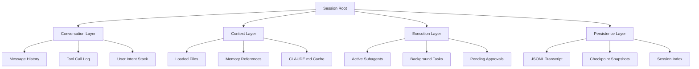

#### 1.2.2 Session生命周期状态机

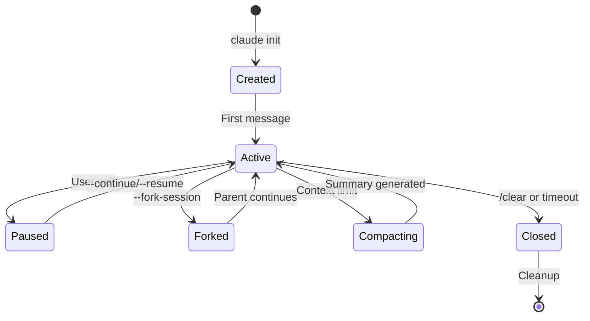

### 1.3 实现机制

#### 1.3.1 Session创建与初始化

当用户执行`claude`命令时，系统执行以下初始化流程：

```typescript
interface SessionInitConfig {
  projectPath: string;
  resumeMode?: 'continue' | 'resume' | 'fork';
  sessionId?: UUID;
  parentSessionId?: UUID;
  name?: string;
}

class SessionManager {
  async createSession(config: SessionInitConfig): Promise<Session> {
    // 1. 生成唯一Session ID (UUID v4)
    const sessionId = config.sessionId || generateUUID();
    
    // 2. 加载项目级CLAUDE.md
    const projectContext = await this.loadProjectContext(config.projectPath);
    
    // 3. 恢复父Session上下文（如果是fork）
    const inheritedContext = config.parentSessionId 
      ? await this.loadSessionSnapshot(config.parentSessionId)
      : null;
    
    // 4. 初始化Token预算管理器
    const budgetManager = new TokenBudgetManager({
      maxTokens: 200000, // Claude 3.5 Sonnet
      warningThreshold: 0.8,
      criticalThreshold: 0.95
    });
    
    // 5. 创建Session实例
    const session = new Session({
      id: sessionId,
      projectPath: config.projectPath,
      context: mergeContexts(projectContext, inheritedContext),
      budgetManager,
      createdAt: Date.now()
    });
    
    // 6. 写入Session索引
    await this.indexSession(session);
    
    return session;
  }
}
```

#### 1.3.2 持久化存储结构

Claude Code采用分层存储架构管理Session数据：

```
~/.claude/
├── history.jsonl              # 全局对话历史索引
├── settings.json              # 用户级配置
├── projects/
│   └── {project-hash}/
│       ├── sessions-index.json    # Session元数据索引
│       ├── sessions/
│       │   ├── {session-id}.jsonl # 完整对话记录
│       │   └── agent-{agent-id}.jsonl  # 子Agent记录
│       └── memory/
│           ├── MEMORY.md          # 自动生成的记忆文件
│           └── episodic/          # 情景记忆片段
└── worktrees/                 # Git worktree隔离目录
    └── agent-{id}/
```

**JSONL格式示例**：

```json
{"type": "user_message", "timestamp": 1712345678, "content": "Refactor auth module", "session_id": "550e8400-e29b-41d4-a716-446655440000"}
{"type": "tool_call", "timestamp": 1712345680, "tool": "Read", "params": {"file_path": "/src/auth.js"}, "session_id": "550e8400-e29b-41d4-a716-446655440000"}
{"type": "assistant_message", "timestamp": 1712345685, "content": "I'll analyze the auth module...", "token_usage": {"input": 1500, "output": 800}, "session_id": "550e8400-e29b-41d4-a716-446655440000"}
```

#### 1.3.3 恢复机制实现

Claude Code支持三种恢复模式：

| 模式 | 命令 | 行为 | 使用场景 |
|------|------|------|----------|
| Continue | `claude -c` | 恢复最近Session | 短暂中断后继续 |
| Resume | `claude -r [id]` | 恢复指定Session | 跨天工作恢复 |
| Fork | `--fork-session` | 创建分支Session | 并行探索不同方案 |

恢复流程伪代码：

```typescript
async function resumeSession(sessionId: string, mode: 'continue' | 'fork'): Promise<Session> {
  // 1. 加载Session记录
  const transcript = await loadTranscript(sessionId);
  
  // 2. 重建Context Window
  const contextWindow = await rebuildContext(transcript);
  
  // 3. 恢复文件系统状态
  const fileSnapshots = await restoreFileSnapshots(sessionId);
  
  // 4. 如果是fork，创建新的Session ID但继承上下文
  const newSessionId = mode === 'fork' ? generateUUID() : sessionId;
  
  // 5. 重建子Agent状态（如果有）
  const subagentStates = await restoreSubagentStates(sessionId);
  
  return new Session({
    id: newSessionId,
    parentId: mode === 'fork' ? sessionId : undefined,
    contextWindow,
    fileSnapshots,
    subagentStates
  });
}
```

#### 1.3.4 长会话Checkpoint策略

对于运行超过30小时的长期任务，Claude Code实现了多级Checkpoint机制：

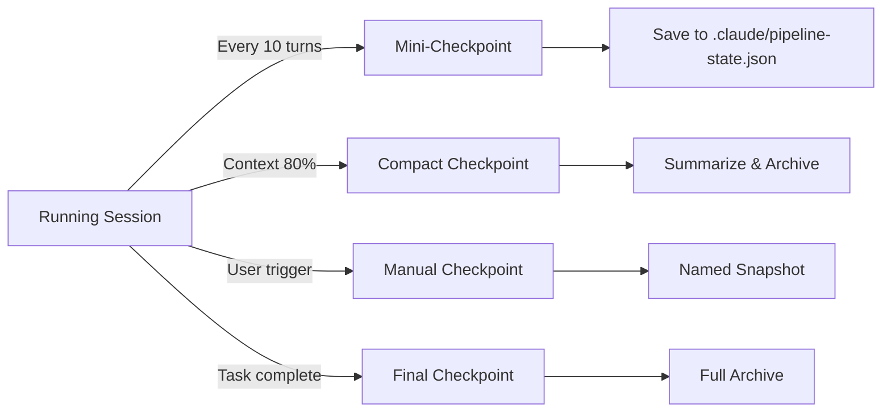

**自动清理算法**：

当Context Window接近上限（默认200K tokens）时，系统触发以下清理流程：

1. **重要性评分**：对历史消息进行TF-IDF + 时间衰减评分
2. **保留策略**：保留系统消息、最近10轮对话、关键决策点
3. **摘要生成**：将早期对话压缩为结构化摘要
4. **Token回收**：释放约40%的上下文空间

```typescript
class ContextCompactor {
  async compact(session: Session): Promise<CompactionResult> {
    const messages = session.getMessages();
    
    // 1. 计算重要性分数
    const scoredMessages = messages.map(m => ({
      ...m,
      score: this.calculateImportance(m, session.currentTask)
    }));
    
    // 2. 保留高优先级消息
    const keepThreshold = 0.7;
    const toKeep = scoredMessages.filter(m => m.score >= keepThreshold);
    
    // 3. 对低优先级消息生成摘要
    const toSummarize = scoredMessages.filter(m => m.score < keepThreshold);
    const summary = await this.generateSummary(toSummarize);
    
    // 4. 重建上下文
    const compactedContext = [
      ...toKeep,
      { type: 'summary', content: summary }
    ];
    
    return {
      originalTokens: this.countTokens(messages),
      compactedTokens: this.countTokens(compactedContext),
      reductionRatio: (messages.length - compactedContext.length) / messages.length
    };
  }
}
```

### 1.4 最佳实践

1. **命名重要Session**：使用`/rename`为关键任务Session命名，便于后续检索
2. **定期Checkpoint**：对于长任务，每完成一个里程碑手动触发`/compact`
3. **Fork探索**：在尝试不同方案前使用`--fork-session`保留原分支
4. **清理过期Session**：定期清理`~/.claude/projects/`下的旧Session文件

---

## 2. Context 上下文工程系统

### 2.1 原理说明

Context工程是Claude Code区别于普通聊天机器人的核心能力。它解决了一个根本性问题：**如何在有限的Context Window（200K tokens）内，为Agent提供完成任务所需的最相关上下文**。这不仅是简单的文本截断，而是一个涉及信息检索、相关性排序、动态加载的复杂系统工程。

Claude Code的Context系统采用**分层注入模型**：不同来源的上下文按优先级和作用域分层叠加，形成最终的Prompt。这种设计确保了关键信息（如项目规范）始终可用，同时允许动态加载任务特定的上下文。

### 2.2 架构设计

#### 2.2.1 Context分层模型

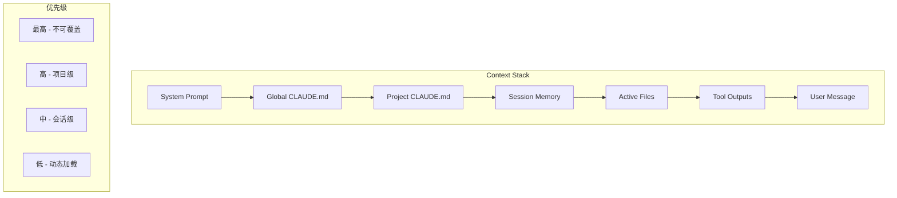

#### 2.2.2 CLAUDE.md项目记忆系统

CLAUDE.md是Claude Code的**声明式记忆机制**，采用Markdown格式存储项目级上下文。其设计哲学是：将项目知识从Agent的短期记忆中剥离，持久化为可版本控制的文档。

**层级覆盖策略**：

| 层级 | 路径 | 作用域 | 加载时机 |
|------|------|--------|----------|
| 全局 | `~/.claude/CLAUDE.md` | 所有项目 | 每次启动 |
| 项目 | `{project}/CLAUDE.md` | 当前项目 | 进入项目目录 |
| 会话 | 内存中动态生成 | 当前Session | 任务切换时 |

**CLAUDE.md结构规范**：

```markdown
---
version: "1.0"
last_updated: "2026-03-27"
---

# Project Context

## Architecture Overview
- Tech stack: Next.js 14, TypeScript, Prisma, PostgreSQL
- Monorepo structure: apps/web, packages/ui, packages/api

## Coding Conventions
- Use functional components with hooks
- Prefer `async/await` over raw Promises
- Error handling: use custom AppError class

## Important Patterns
### API Routes
- Always validate with Zod schemas
- Use `withAuth` HOC for protected routes

### Database
- Use transactions for multi-table operations
- Never use `delete()` without `where` clause

## Known Issues
- OAuth callback has race condition (see #234)
- Rate limiter needs tuning for batch operations
```

### 2.3 实现机制

#### 2.3.1 自动注入流程

```typescript
class ContextInjector {
  async buildContext(request: UserRequest): Promise<ContextStack> {
    const stack: ContextStack = [];
    
    // 1. 系统Prompt（固定）
    stack.push(await this.loadSystemPrompt());
    
    // 2. 全局CLAUDE.md
    const globalContext = await this.loadGlobalClaudeMd();
    if (globalContext) stack.push(globalContext);
    
    // 3. 项目CLAUDE.md
    const projectContext = await this.loadProjectClaudeMd(request.projectPath);
    if (projectContext) stack.push(projectContext);
    
    // 4. 检索相关记忆
    const relevantMemories = await this.memorySystem.retrieve(
      request.query,
      { topK: 5 }
    );
    stack.push(this.formatMemories(relevantMemories));
    
    // 5. 动态加载相关文件
    const relevantFiles = await this.codeRetrieval.search(
      request.query,
      { topK: 10 }
    );
    for (const file of relevantFiles) {
      stack.push(await this.loadFile(file.path));
    }
    
    // 6. 用户消息
    stack.push({ role: 'user', content: request.message });
    
    return stack;
  }
}
```

#### 2.3.2 Context Window优化算法

**滑动窗口策略**：

```typescript
class SlidingWindowManager {
  private readonly MAX_TOKENS = 200000;
  private readonly RESERVE_TOKENS = 20000; // 留给响应
  
  optimize(messages: Message[]): Message[] {
    const availableTokens = this.MAX_TOKENS - this.RESERVE_TOKENS;
    let currentTokens = this.countTokens(messages);
    
    if (currentTokens <= availableTokens) {
      return messages;
    }
    
    // 策略1: 压缩旧消息
    const compressed = this.compressOldMessages(messages);
    currentTokens = this.countTokens(compressed);
    
    if (currentTokens <= availableTokens) {
      return compressed;
    }
    
    // 策略2: 移除低优先级文件内容
    const pruned = this.pruneLowPriorityFiles(compressed);
    currentTokens = this.countTokens(pruned);
    
    if (currentTokens <= availableTokens) {
      return pruned;
    }
    
    // 策略3: 最终截断（保留系统消息和最近对话）
    return this.truncateWithPriority(pruned, availableTokens);
  }
  
  private compressOldMessages(messages: Message[]): Message[] {
    const thresholdIndex = Math.max(0, messages.length - 20);
    
    return messages.map((m, i) => {
      if (i < thresholdIndex && m.role === 'assistant') {
        // 压缩早期助手消息
        return {
          ...m,
          content: this.summarize(m.content)
        };
      }
      return m;
    });
  }
}
```

**重要性评分算法**：

```typescript
function calculateMessageImportance(
  message: Message,
  currentTask: string,
  conversationHistory: Message[]
): number {
  const scores = {
    // 系统消息最高优先级
    system: 1.0,
    
    // 用户消息根据相关性评分
    user: calculateRelevance(message.content, currentTask),
    
    // 助手消息根据包含的关键信息评分
    assistant: extractKeyInformation(message.content).length / 100,
    
    // 工具输出根据使用频率评分
    tool: countToolReferences(message.id, conversationHistory) / 10
  };
  
  // 时间衰减因子
  const timeDecay = Math.exp(-0.1 * message.turnsAgo);
  
  // 用户显式标记的重要消息
  const explicitImportance = message.markedImportant ? 1.5 : 1.0;
  
  return scores[message.role] * timeDecay * explicitImportance;
}
```

#### 2.3.3 多模态Context处理

Claude Code支持多种数据类型的统一表示：

```typescript
interface MultimodalContent {
  type: 'text' | 'image' | 'structured' | 'diagram';
  content: string | BinaryData;
  metadata: {
    mimeType: string;
    tokenCount: number;
    source?: string;
  };
}

class MultimodalContextHandler {
  async process(content: unknown): Promise<MultimodalContent> {
    if (this.isImage(content)) {
      return {
        type: 'image',
        content: await this.encodeImage(content),
        metadata: {
          mimeType: 'image/png',
          tokenCount: await this.estimateImageTokens(content)
        }
      };
    }
    
    if (this.isMermaidDiagram(content)) {
      return {
        type: 'diagram',
        content: content as string,
        metadata: {
          mimeType: 'text/mermaid',
          tokenCount: this.countTokens(content as string)
        }
      };
    }
    
    if (this.isJSON(content)) {
      return {
        type: 'structured',
        content: JSON.stringify(content, null, 2),
        metadata: {
          mimeType: 'application/json',
          tokenCount: this.countTokens(JSON.stringify(content))
        }
      };
    }
    
    return {
      type: 'text',
      content: String(content),
      metadata: {
        mimeType: 'text/plain',
        tokenCount: this.countTokens(String(content))
      }
    };
  }
}
```

### 2.4 最佳实践

1. **保持CLAUDE.md精简**：目标200行以内，定期清理过时信息
2. **使用结构化格式**：采用Markdown标题层级组织信息，便于Agent解析
3. **动态加载大文件**：对于大型文档，使用`Read`工具按需加载而非全部注入
4. **监控Token使用**：定期使用`/context`命令查看当前上下文占用

---

## 3. Runtime 运行时环境

### 3.1 原理说明

Claude Code的Runtime层负责管理Agent的执行环境，包括进程隔离、资源限制、安全沙箱和事件循环。其设计目标是：**在提供强大能力的同时，确保系统稳定性和安全性**。

Runtime采用**Capability Server架构**：核心Agent进程与外部能力（如文件系统访问、网络请求、命令执行）分离，通过MCP（Model Context Protocol）进行通信。这种设计允许：
- 细粒度的权限控制
- 能力的热插拔
- 跨进程的资源隔离

### 3.2 架构设计

#### 3.2.1 Client-Server进程模型

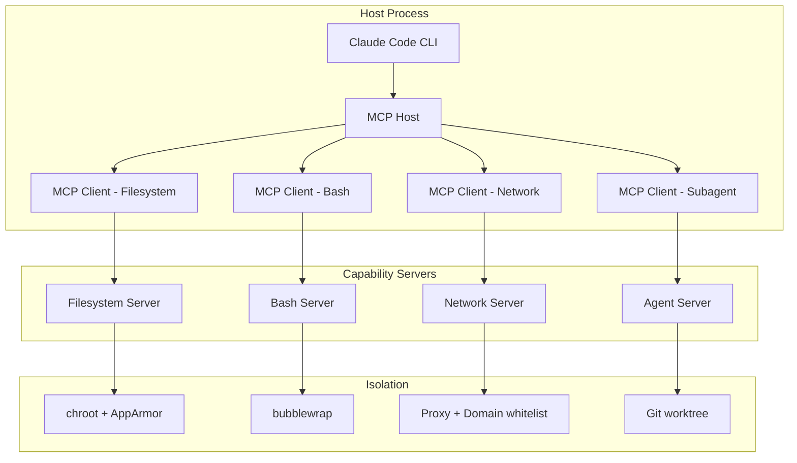

#### 3.2.2 MCP通信协议栈

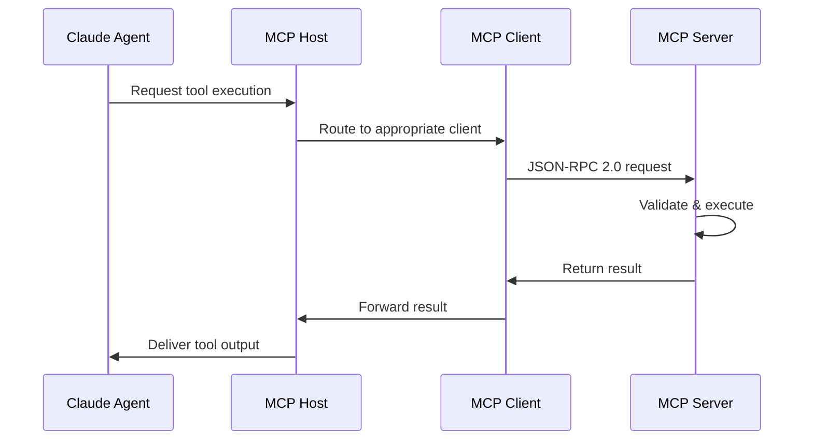

### 3.3 实现机制

#### 3.3.1 MCP协议细节

MCP（Model Context Protocol）是Anthropic开源的标准协议，定义了LLM应用与外部能力交互的规范。

**协议核心要素**：

```typescript
// MCP消息格式（JSON-RPC 2.0）
interface MCPRequest {
  jsonrpc: "2.0";
  id: string;
  method: "tools/call" | "resources/read" | "prompts/get";
  params: {
    name: string;
    arguments?: Record<string, unknown>;
  };
}

interface MCPResponse {
  jsonrpc: "2.0";
  id: string;
  result?: {
    content: Array<{
      type: "text" | "image" | "resource";
      text?: string;
      data?: string;
      mimeType?: string;
    }>;
  };
  error?: {
    code: number;
    message: string;
  };
}
```

**能力发现机制**：

```typescript
interface CapabilityDiscovery {
  // 初始化时交换能力
  async initialize(): Promise<ServerCapabilities> {
    const response = await this.sendRequest({
      method: "initialize",
      params: {
        protocolVersion: "2025-03-26",
        capabilities: {
          tools: {},
          resources: {},
          prompts: {}
        }
      }
    });
    
    return {
      tools: response.capabilities.tools?.list || [],
      resources: response.capabilities.resources?.list || [],
      prompts: response.capabilities.prompts?.list || []
    };
  }
}
```

#### 3.3.2 沙箱安全模型

Claude Code实现了多层安全防护：

**文件系统沙箱**：

```typescript
interface FilesystemSandbox {
  // chroot限制
  rootPath: string;
  
  // 权限模式
  permissions: {
    read: string[];    // Glob patterns
    write: string[];
    deny: string[];    // 优先匹配
  };
  
  // 路径解析
  resolvePath(requestedPath: string): string {
    const resolved = path.resolve(this.rootPath, requestedPath);
    
    // 防止目录遍历
    if (!resolved.startsWith(this.rootPath)) {
      throw new SecurityError("Path traversal detected");
    }
    
    // 检查权限
    if (this.matchesDeny(resolved)) {
      throw new PermissionDeniedError();
    }
    
    return resolved;
  }
}
```

**命令执行沙箱（Linux bubblewrap）**：

```bash
# Claude Code sandbox启动命令示例
bwrap \
  --ro-bind /usr /usr \
  --ro-bind /lib /lib \
  --ro-bind /lib64 /lib64 \
  --bind /home/user/project /home/user/project \
  --tmpfs /tmp \
  --unshare-net \
  --die-with-parent \
  -- bash -c "$USER_COMMAND"
```

**网络沙箱**：

```typescript
interface NetworkPolicy {
  mode: 'block' | 'whitelist' | 'allow';
  allowedDomains?: string[];
  allowedPorts?: number[];
  
  async checkRequest(url: string): Promise<boolean> {
    if (this.mode === 'block') return false;
    if (this.mode === 'allow') return true;
    
    const hostname = new URL(url).hostname;
    return this.allowedDomains.some(domain => 
      hostname === domain || hostname.endsWith(`.${domain}`)
    );
  }
}
```

#### 3.3.3 异步事件循环

```typescript
class EventLoop {
  private messageQueue: PriorityQueue<Message>;
  private semaphore: Semaphore;
  private backpressure: BackpressureController;
  
  constructor() {
    // 并发控制：最大并行度
    this.semaphore = new Semaphore(5);
    
    // 背压控制：队列满时阻塞新请求
    this.backpressure = new BackpressureController({
      maxQueueSize: 100,
      highWatermark: 80,
      lowWatermark: 20
    });
  }
  
  async run(): Promise<void> {
    while (this.running) {
      // 等待队列消息
      const message = await this.messageQueue.dequeue();
      
      // 获取执行许可
      await this.semaphore.acquire();
      
      // 处理消息
      this.processMessage(message)
        .finally(() => this.semaphore.release());
    }
  }
  
  private async processMessage(msg: Message): Promise<void> {
    try {
      // 死锁检测
      if (this.detectDeadlock(msg)) {
        throw new DeadlockError("Circular dependency detected");
      }
      
      // 执行处理
      const result = await this.handler(msg);
      
      // 发送响应
      await this.sendResponse(msg.id, result);
    } catch (error) {
      await this.sendError(msg.id, error);
    }
  }
}
```

### 3.4 最佳实践

1. **启用Sandbox模式**：生产环境始终使用`/sandbox`命令启用沙箱
2. **配置Domain白名单**：在`settings.json`中限制可访问的外部域名
3. **监控资源使用**：定期检查`/cost`和`/stats`命令的输出
4. **设置超时限制**：为Bash命令设置合理的超时，防止无限挂起

---

## 4. Memory 记忆系统架构

### 4.1 原理说明

Memory系统是Claude Code实现**跨会话连续性**的关键组件。与Context Window的短期记忆不同，Memory系统提供持久化的知识存储，使Agent能够：
- 记住用户偏好和工作习惯
- 学习项目特定的模式和约束
- 积累领域知识

Claude Code的Memory系统采用**分层存储模型**，区分不同类型的记忆：
- **工作记忆（Working Memory）**：当前Context Window中的内容
- **情景记忆（Episodic Memory）**：过去会话的事件记录
- **语义记忆（Semantic Memory）**：结构化的领域知识
- **程序记忆（Procedural Memory）**：技能和流程定义

### 4.2 架构设计

#### 4.2.1 记忆分层架构

```mermaid
graph TB
    subgraph "Memory Hierarchy"
        A[Working Memory] -->|溢出| B[Episodic Memory]
        B -->|抽象| C[Semantic Memory]
        C -->|固化| D[Procedural Memory]
    end
    
    subgraph "存储介质"
        A1[Context Window]
        B1[~/.claude/projects/{id}/memory/episodic/]
        C1[~/.claude/projects/{id}/memory/semantic/]
        D1[CLAUDE.md + Skills]
    end
    
    A --> A1
    B --> B1
    C --> C1
    D --> D1
```

#### 4.2.2 记忆生命周期

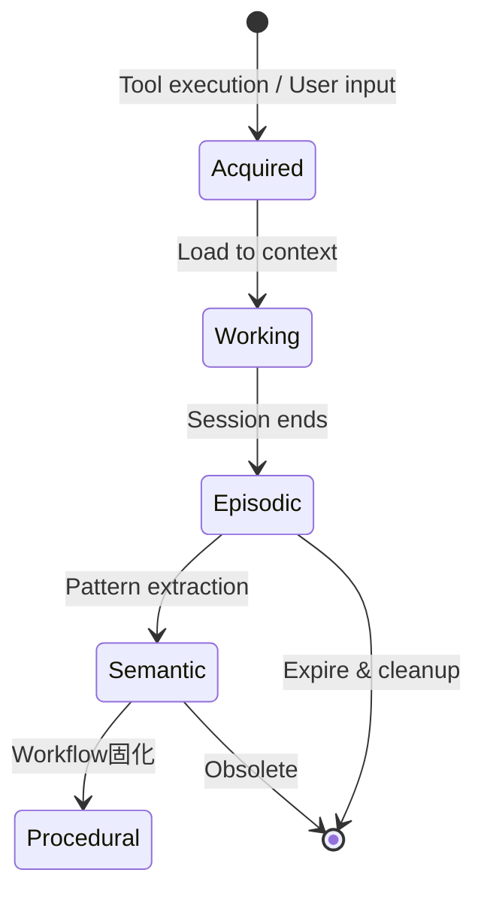

### 4.3 实现机制

#### 4.3.1 情景记忆存储结构

```typescript
interface EpisodicMemory {
  id: string;
  timestamp: number;
  sessionId: string;
  type: 'decision' | 'action' | 'outcome' | 'error';
  content: {
    task: string;
    context: string;
    action: string;
    result: string;
    lessons?: string[];
  };
  embedding: number[];  // 用于语义检索
  importance: number;   // 0-1，用于遗忘决策
}

class EpisodicMemoryStore {
  private readonly storagePath: string;
  private vectorIndex: VectorIndex;
  
  async store(memory: EpisodicMemory): Promise<void> {
    // 1. 生成embedding
    memory.embedding = await this.embedder.embed(
      `${memory.content.task} ${memory.content.action} ${memory.content.result}`
    );
    
    // 2. 计算重要性
    memory.importance = this.calculateImportance(memory);
    
    // 3. 持久化
    await fs.appendFile(
      path.join(this.storagePath, 'episodes.jsonl'),
      JSON.stringify(memory) + '\n'
    );
    
    // 4. 更新向量索引
    await this.vectorIndex.add(memory.id, memory.embedding);
  }
  
  async retrieve(query: string, options: RetrieveOptions): Promise<EpisodicMemory[]> {
    // 1. 查询向量化
    const queryEmbedding = await this.embedder.embed(query);
    
    // 2. 相似性搜索
    const candidates = await this.vectorIndex.search(queryEmbedding, options.topK * 2);
    
    // 3. 重排序（结合时间衰减和重要性）
    const scored = candidates.map(c => ({
      ...c,
      score: this.rerank(c, query)
    }));
    
    // 4. 返回TopK
    return scored
      .sort((a, b) => b.score - a.score)
      .slice(0, options.topK);
  }
}
```

#### 4.3.2 语义记忆与知识图谱

```typescript
interface SemanticMemory {
  concepts: Map<string, Concept>;
  relations: Relation[];
}

interface Concept {
  id: string;
  name: string;
  type: 'entity' | 'pattern' | 'constraint' | 'convention';
  definition: string;
  examples: string[];
  confidence: number;
  source: string[];
}

interface Relation {
  from: string;
  to: string;
  type: 'is-a' | 'uses' | 'depends-on' | 'conflicts-with';
  strength: number;
}

class SemanticMemoryBuilder {
  async extractFromSession(session: Session): Promise<void> {
    // 1. 提取关键决策
    const decisions = this.extractDecisions(session.messages);
    
    // 2. 识别模式
    for (const decision of decisions) {
      const concept: Concept = {
        id: generateUUID(),
        name: decision.pattern,
        type: 'pattern',
        definition: decision.rationale,
        examples: [decision.context],
        confidence: decision.confidence,
        source: [session.id]
      };
      
      await this.semanticMemory.addConcept(concept);
    }
    
    // 3. 更新CLAUDE.md（如果置信度足够高）
    if (this.shouldUpdateClaudeMd(decisions)) {
      await this.updateClaudeMd(decisions);
    }
  }
}
```

#### 4.3.3 遗忘曲线实现

```typescript
class ForgettingCurve {
  // Ebbinghaus遗忘曲线参数
  private readonly FORGETTING_RATE = 0.3;
  
  calculateRetention(
    memory: EpisodicMemory,
    currentTime: number
  ): number {
    const age = (currentTime - memory.timestamp) / (24 * 60 * 60 * 1000); // 天数
    const importance = memory.importance;
    
    // 修正的遗忘曲线：重要性越高，遗忘越慢
    const retention = importance * Math.exp(-this.FORGETTING_RATE * age / importance);
    
    return retention;
  }
  
  async cleanup(threshold: number = 0.1): Promise<void> {
    const now = Date.now();
    const allMemories = await this.store.getAll();
    
    const toDelete = allMemories.filter(m => 
      this.calculateRetention(m, now) < threshold
    );
    
    for (const memory of toDelete) {
      await this.store.delete(memory.id);
    }
    
    console.log(`Cleaned up ${toDelete.length} expired memories`);
  }
}
```

#### 4.3.4 记忆写入控制

```typescript
interface MemoryACL {
  // 谁可以写入哪种类型的记忆
  grants: Array<{
    agent: string;
    memoryType: 'episodic' | 'semantic' | 'procedural';
    scope: 'self' | 'project' | 'global';
    conditions?: string[];
  }>;
}

class MemoryController {
  private acl: MemoryACL;
  private reviewQueue: ReviewQueue;
  
  async requestWrite(
    agent: Agent,
    memory: Memory,
    scope: string
  ): Promise<WriteResult> {
    // 1. 检查ACL
    const grant = this.acl.grants.find(g => 
      g.agent === agent.id && g.memoryType === memory.type
    );
    
    if (!grant) {
      return { allowed: false, reason: 'No write permission' };
    }
    
    // 2. Schema验证
    const validation = this.validateSchema(memory);
    if (!validation.valid) {
      return { allowed: false, reason: validation.errors };
    }
    
    // 3. 高影响记忆进入审核队列
    if (memory.impact > 0.8) {
      const reviewId = await this.reviewQueue.submit(memory);
      return { allowed: false, pendingReview: reviewId };
    }
    
    // 4. 执行写入
    await this.store.write(memory);
    return { allowed: true };
  }
}
```

### 4.4 最佳实践

1. **定期回顾记忆**：使用`/memory`命令查看自动生成的记忆摘要
2. **手动标记重要信息**：使用`#`快捷键将关键信息添加到记忆
3. **审核高影响记忆**：对于会被写入CLAUDE.md的建议，仔细审核
4. **清理过期记忆**：定期运行记忆清理，防止存储膨胀

---

## 5. Tools 工具生态系统

### 5.1 原理说明

Tools是Claude Code与外部世界交互的**原子能力单元**。每个Tool封装了一个特定的操作（如读取文件、执行命令、搜索网络），通过标准化的接口暴露给Agent。Tools系统的设计遵循以下原则：

- **原子性**：每个Tool只做一件事，做好一件事
- **可组合性**：简单Tools可以组合成复杂工作流
- **可观察性**：所有Tool调用都被记录和审计
- **安全性**：Tool执行受权限系统控制

### 5.2 架构设计

#### 5.2.1 Tools分层架构

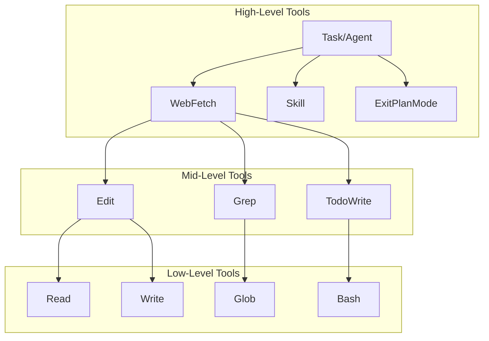

#### 5.2.2 Tools注册与发现

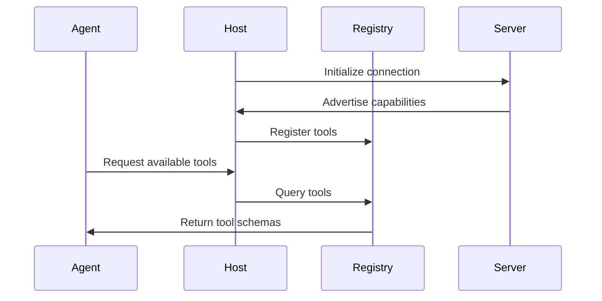

### 5.3 实现机制

#### 5.3.1 内置Tools详细规格

| Tool | 功能 | 幂等性 | 超时 | 输出限制 |
|------|------|--------|------|----------|
| Read | 读取文件内容 | 是 | 30s | 2000行/次 |
| Write | 创建/覆盖文件 | 否 | 30s | 无 |
| Edit | 精确字符串替换 | 否 | 30s | 无 |
| Bash | 执行Shell命令 | 否 | 2-10min | 30K字符 |
| Grep | 正则搜索 | 是 | 60s | 默认files_with_matches |
| Glob | 文件模式匹配 | 是 | 30s | 无 |
| LS | 列出目录 | 是 | 10s | 无 |
| Task/Agent | 创建子Agent | 否 | 无限制 | 取决于子Agent |
| WebSearch | 网络搜索 | 是 | 30s | US only |
| WebFetch | 抓取网页 | 是 | 30s | 15min缓存 |

**Read Tool实现细节**：

```typescript
interface ReadTool {
  name: 'Read';
  parameters: {
    file_path: string;
    offset?: number;      // 起始行号
    limit?: number;       // 最大行数（默认2000）
  };
  returns: {
    content: string;      // cat -n 格式
    truncated: boolean;
    total_lines: number;
  };
  
  // 强制约束
  constraints: {
    mustReadBeforeEdit: true;  // Edit前必须先Read
    lineNumberFormat: 'cat-n'; // 返回带行号格式
  };
}
```

**Edit Tool实现细节**：

```typescript
interface EditTool {
  name: 'Edit';
  parameters: {
    file_path: string;
    old_string: string;   // 必须唯一匹配
    new_string: string;
    replace_all?: boolean; // 是否替换所有匹配
  };
  returns: {
    success: boolean;
    replacements: number;
  };
  
  // 安全约束
  constraints: {
    uniquenessCheck: true;     // old_string必须唯一
    readRequirement: true;     // 必须先Read文件
    atomicity: true;           // 全有或全无
  };
}
```

**Bash Tool实现细节**：

```typescript
interface BashTool {
  name: 'Bash';
  parameters: {
    command: string;
    timeout?: number;           // 默认120000ms，最大600000ms
    cwd?: string;
    env?: Record<string, string>;
    run_in_background?: boolean;
  };
  returns: {
    stdout: string;
    stderr: string;
    exit_code: number;
    truncated: boolean;         // 输出超过30K字符
  };
  
  // 安全模式
  security: {
    sandbox: 'bubblewrap' | 'seatbelt' | 'none';
    allowedCommands?: string[];
    deniedPatterns: string[];   // 如 'rm -rf /'
  };
}
```

#### 5.3.2 MCP Tools注册协议

```typescript
interface MCPToolSchema {
  name: string;
  description: string;
  inputSchema: JSONSchema7;
  annotations?: {
    title?: string;
    readOnlyHint?: boolean;
    destructiveHint?: boolean;
    idempotentHint?: boolean;
    openWorldHint?: boolean;
  };
}

class MCPRegistry {
  private tools: Map<string, MCPToolSchema> = new Map();
  
  async register(serverName: string, tools: MCPToolSchema[]): Promise<void> {
    for (const tool of tools) {
      const qualifiedName = `mcp__${serverName}__${tool.name}`;
      
      // 验证Schema
      this.validateSchema(tool.inputSchema);
      
      // 注册
      this.tools.set(qualifiedName, {
        ...tool,
        name: qualifiedName
      });
    }
  }
  
  async execute(toolName: string, params: unknown): Promise<ToolResult> {
    const tool = this.tools.get(toolName);
    if (!tool) {
      throw new Error(`Unknown tool: ${toolName}`);
    }
    
    // 验证参数
    const valid = this.validateParams(params, tool.inputSchema);
    if (!valid) {
      throw new ValidationError('Invalid parameters');
    }
    
    // 路由到对应Server
    const [_, serverName, originalName] = toolName.split('__');
    return this.routeToServer(serverName, originalName, params);
  }
}
```

#### 5.3.3 Hooks系统架构

```typescript
// 18个Hook事件
enum HookEvent {
  PreToolUse = 'PreToolUse',           // 可阻塞
  PostToolUse = 'PostToolUse',
  UserPromptSubmit = 'UserPromptSubmit',
  PermissionRequest = 'PermissionRequest',
  SessionStart = 'SessionStart',
  SessionEnd = 'SessionEnd',
  SubagentStart = 'SubagentStart',
  SubagentStop = 'SubagentStop',
  PreCompact = 'PreCompact',
  ConfigChange = 'ConfigChange',
  Notification = 'Notification',
  Stop = 'Stop'
}

interface HookConfig {
  event: HookEvent;
  matcher?: string;  // 正则匹配Tool名
  handler: CommandHandler | PromptHandler | AgentHandler;
}

class HookSystem {
  private hooks: Map<HookEvent, HookConfig[]> = new Map();
  
  async register(hook: HookConfig): Promise<void> {
    const existing = this.hooks.get(hook.event) || [];
    existing.push(hook);
    this.hooks.set(hook.event, existing);
  }
  
  async execute(event: HookEvent, context: HookContext): Promise<HookResult> {
    const hooks = this.hooks.get(event) || [];
    
    for (const hook of hooks) {
      // 检查matcher
      if (hook.matcher && !context.toolName?.match(hook.matcher)) {
        continue;
      }
      
      // 执行handler
      const result = await this.runHandler(hook.handler, context);
      
      // PreToolUse可以阻塞
      if (event === HookEvent.PreToolUse && result.decision === 'deny') {
        return { blocked: true, reason: result.reason };
      }
    }
    
    return { blocked: false };
  }
}
```

**PreToolUse Hook示例（敏感文件拦截）**：

```json
{
  "hooks": {
    "PreToolUse": [
      {
        "matcher": "Read|Edit|Write",
        "handler": {
          "type": "command",
          "command": "#!/bin/bash\nif [[ \"$CLAUDE_TOOL_FILE_PATH\" =~ \\.env|credentials|secrets\" ]]; then\n  echo '{\"decision\": \"deny\", \"reason\": \"Access to sensitive files blocked\"}'\n  exit 2\nfi\nexit 0"
        }
      }
    ]
  }
}
```

### 5.4 最佳实践

1. **使用Edit而非Write修改文件**：Edit提供原子性和变更追踪
2. **批量读取文件**：使用Glob + Read组合减少Tool调用次数
3. **设置合理超时**：长时间任务使用`run_in_background`
4. **利用Hooks自动化**：为重复任务（如格式化、类型检查）配置PostToolUse Hooks

---

## 6. Code Retrieval & Indexing 代码检索系统

### 6.1 原理说明

代码检索系统是Claude Code理解大型代码库的**认知基础设施**。对于包含数十万行代码的项目，不可能将所有文件加载到Context Window中。代码检索系统通过预建索引和智能搜索，使Agent能够快速定位相关代码片段。

Claude Code采用**混合检索策略**：结合传统的关键词搜索（BM25）和语义搜索（向量相似度），在速度和准确性之间取得平衡。此外，系统还构建了代码图谱，支持基于关系的导航（如"查找此函数的所有调用者"）。

### 6.2 架构设计

#### 6.2.1 检索流水线

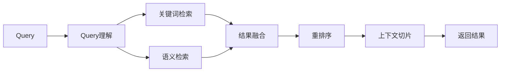

#### 6.2.2 索引架构

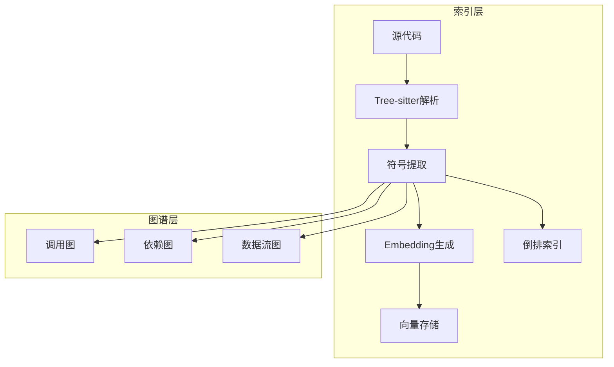

### 6.3 实现机制

#### 6.3.1 代码索引管道

```typescript
interface CodeIndexPipeline {
  // 1. 语法解析
  async parse(filePath: string): Promise<AST> {
    const parser = await this.getParserForFile(filePath);
    const content = await fs.readFile(filePath, 'utf-8');
    return parser.parse(content);
  }
  
  // 2. 符号提取
  async extractSymbols(ast: AST): Promise<Symbol[]> {
    const symbols: Symbol[] = [];
    
    traverse(ast, {
      FunctionDeclaration: (node) => {
        symbols.push({
          type: 'function',
          name: node.name,
          location: node.location,
          params: node.params,
          docstring: extractDocstring(node)
        });
      },
      ClassDeclaration: (node) => {
        symbols.push({
          type: 'class',
          name: node.name,
          location: node.location,
          methods: node.methods,
          docstring: extractDocstring(node)
        });
      }
    });
    
    return symbols;
  }
  
  // 3. 代码切片
  async createChunks(filePath: string, ast: AST): Promise<CodeChunk[]> {
    const chunks: CodeChunk[] = [];
    const content = await fs.readFile(filePath, 'utf-8');
    
    // 按函数/类切片
    for (const symbol of await this.extractSymbols(ast)) {
      chunks.push({
        filePath,
        startLine: symbol.location.start.line,
        endLine: symbol.location.end.line,
        content: content.slice(
          symbol.location.start.index,
          symbol.location.end.index
        ),
        symbol: symbol.name,
        type: symbol.type
      });
    }
    
    return chunks;
  }
  
  // 4. Embedding生成
  async generateEmbeddings(chunks: CodeChunk[]): Promise<void> {
    for (const batch of this.batches(chunks, 100)) {
      const texts = batch.map(c => 
        `${c.symbol}\n${c.type}\n${c.content.substring(0, 1000)}`
      );
      
      const embeddings = await this.embedder.embedBatch(texts);
      
      for (let i = 0; i < batch.length; i++) {
        batch[i].embedding = embeddings[i];
      }
    }
  }
}
```

#### 6.3.2 混合检索算法

```typescript
class HybridRetriever {
  private bm25Index: BM25Index;
  private vectorStore: VectorStore;
  
  async search(query: string, options: SearchOptions): Promise<SearchResult[]> {
    // 1. 关键词检索
    const keywordResults = await this.bm25Index.search(query, {
      topK: options.topK * 2
    });
    
    // 2. 语义检索
    const queryEmbedding = await this.embedder.embed(query);
    const semanticResults = await this.vectorStore.search(queryEmbedding, {
      topK: options.topK * 2
    });
    
    // 3. 结果融合（RRF - Reciprocal Rank Fusion）
    const fused = this.reciprocalRankFusion(
      keywordResults,
      semanticResults,
      { k: 60 }  // RRF常数
    );
    
    // 4. 重排序
    const reranked = await this.rerank(fused, query);
    
    // 5. 上下文切片扩展
    const withContext = await this.expandContext(
      reranked.slice(0, options.topK)
    );
    
    return withContext;
  }
  
  private reciprocalRankFusion(
    keyword: SearchResult[],
    semantic: SearchResult[],
    params: { k: number }
  ): SearchResult[] {
    const scores = new Map<string, number>();
    
    // 计算RRF分数
    for (const [rank, result] of keyword.entries()) {
      const current = scores.get(result.id) || 0;
      scores.set(result.id, current + 1 / (params.k + rank + 1));
    }
    
    for (const [rank, result] of semantic.entries()) {
      const current = scores.get(result.id) || 0;
      scores.set(result.id, current + 1 / (params.k + rank + 1));
    }
    
    // 合并并排序
    const allResults = [...keyword, ...semantic];
    const unique = this.deduplicate(allResults);
    
    return unique
      .map(r => ({ ...r, score: scores.get(r.id) || 0 }))
      .sort((a, b) => b.score - a.score);
  }
}
```

#### 6.3.3 代码图谱构建

```typescript
interface CodeGraph {
  nodes: Map<string, CodeNode>;
  edges: CodeEdge[];
}

interface CodeNode {
  id: string;
  type: 'function' | 'class' | 'module' | 'variable';
  name: string;
  filePath: string;
  location: SourceLocation;
  metadata: {
    complexity: number;
    lines: number;
    docstring?: string;
  };
}

interface CodeEdge {
  from: string;
  to: string;
  type: 'calls' | 'imports' | 'inherits' | 'uses';
  strength: number;
}

class CodeGraphBuilder {
  async buildGraph(projectPath: string): Promise<CodeGraph> {
    const graph: CodeGraph = {
      nodes: new Map(),
      edges: []
    };
    
    // 1. 解析所有文件
    const files = await glob('**/*.{js,ts,py,go,rs}', { cwd: projectPath });
    
    for (const file of files) {
      const ast = await this.parser.parse(path.join(projectPath, file));
      
      // 2. 提取节点
      const nodes = this.extractNodes(ast, file);
      for (const node of nodes) {
        graph.nodes.set(node.id, node);
      }
      
      // 3. 提取边（调用关系、导入关系）
      const edges = this.extractEdges(ast, file, graph.nodes);
      graph.edges.push(...edges);
    }
    
    // 4. 计算节点重要性（PageRank）
    this.calculatePageRank(graph);
    
    return graph;
  }
  
  // 查找函数的所有调用者
  findCallers(graph: CodeGraph, functionId: string): CodeNode[] {
    const callerIds = graph.edges
      .filter(e => e.to === functionId && e.type === 'calls')
      .map(e => e.from);
    
    return callerIds.map(id => graph.nodes.get(id)).filter(Boolean);
  }
  
  // 检测架构违规
  detectViolations(graph: CodeGraph, rules: ArchitectureRule[]): Violation[] {
    const violations: Violation[] = [];
    
    for (const rule of rules) {
      for (const edge of graph.edges) {
        if (this.violatesRule(edge, rule)) {
          violations.push({
            rule: rule.name,
            from: edge.from,
            to: edge.to,
            severity: rule.severity
          });
        }
      }
    }
    
    return violations;
  }
}
```

#### 6.3.4 增量索引更新

```typescript
class IncrementalIndexer {
  private fileHashes: Map<string, string> = new Map();
  
  async updateIndex(projectPath: string): Promise<UpdateResult> {
    const result: UpdateResult = {
      added: [],
      modified: [],
      deleted: [],
      unchanged: []
    };
    
    // 1. 扫描当前文件
    const currentFiles = await glob('**/*.{js,ts,py}', { cwd: projectPath });
    const currentSet = new Set(currentFiles);
    
    // 2. 检测删除
    for (const [file, _] of this.fileHashes) {
      if (!currentSet.has(file)) {
        result.deleted.push(file);
        await this.removeFromIndex(file);
        this.fileHashes.delete(file);
      }
    }
    
    // 3. 检测新增和修改
    for (const file of currentFiles) {
      const hash = await this.computeHash(path.join(projectPath, file));
      
      if (!this.fileHashes.has(file)) {
        // 新增
        result.added.push(file);
        await this.indexFile(file);
        this.fileHashes.set(file, hash);
      } else if (this.fileHashes.get(file) !== hash) {
        // 修改
        result.modified.push(file);
        await this.reindexFile(file);
        this.fileHashes.set(file, hash);
      } else {
        result.unchanged.push(file);
      }
    }
    
    return result;
  }
}
```

### 6.4 最佳实践

1. **定期重建索引**：大型重构后运行`index_codebase`工具
2. **结合Grep和语义搜索**：先用Grep定位文件，再用语义搜索精确定位
3. **利用代码图谱**：使用"查找所有调用者"理解函数影响范围
4. **缓存索引结果**：CI/CD中缓存索引文件加速构建

---

## 7. Multi-Agent Architecture 多智能体架构

### 7.1 原理说明

多智能体架构是Claude Code应对复杂任务的核心能力。当单个Agent的Context Window或专业能力不足以完成复杂任务时，系统可以将任务分解为子任务，分配给多个专业Agent并行执行。

Claude Code的多智能体设计遵循**Orchestrator-Worker模式**：
- **Orchestrator（主控Agent）**：负责任务分解、子Agent调度、结果聚合
- **Worker（子Agent）**：执行具体任务，拥有独立的Context和工具集

这种模式的优势在于：
- **并行执行**：独立子任务同时运行，减少总耗时
- **专业分工**：不同Agent专注不同领域（架构、前端、测试等）
- **故障隔离**：单个Agent失败不影响其他Agent
- **上下文隔离**：每个Agent只看到自己需要的上下文，避免信息过载

### 7.2 架构设计

#### 7.2.1 多智能体系统架构

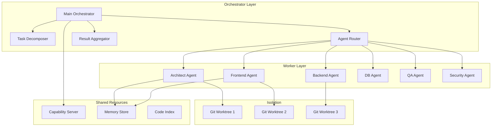

#### 7.2.2 Agent状态机

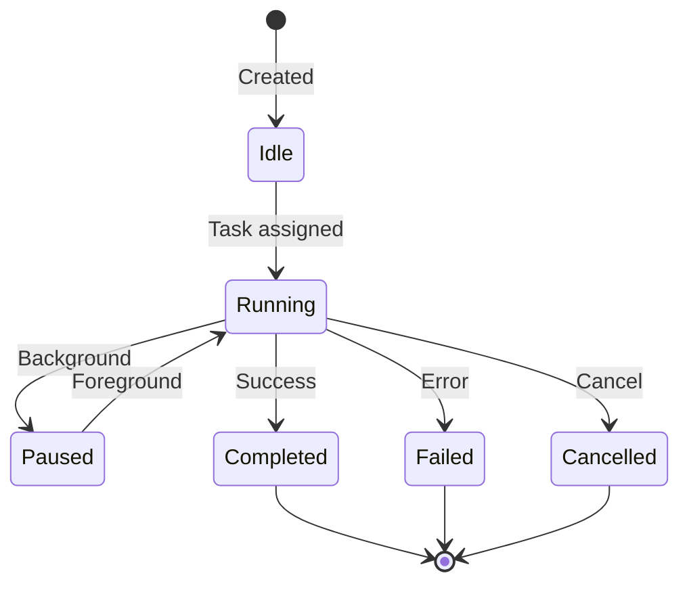

### 7.3 实现机制

#### 7.3.1 Agent角色定义与权限模型

Claude Code通过YAML Front Matter定义Agent角色：

```yaml
---
name: backend-architect
description: Design RESTful APIs, microservice boundaries, and database schemas
model: sonnet
tools:
  - Read
  - Write
  - Edit
  - Bash
disallowedTools:
  - WebSearch
permissionMode: acceptEdits
isolation: worktree
maxTurns: 25
memory:
  scope: project
  persist: true
---

You are a senior backend architect specializing in scalable system design.

Your responsibilities:
1. Design clean API contracts
2. Define database schemas with proper indexing
3. Ensure microservice boundaries are well-defined
4. Review for scalability concerns

Never:
- Modify frontend code
- Commit directly to main branch
- Skip security review for auth-related changes
```

**权限矩阵**：

| 角色 | Read | Write | Edit | Bash | Web | Task | MCP |
|------|------|-------|------|------|-----|------|-----|
| Orchestrator | ✓ | ✓ | ✓ | ✓ | ✓ | ✓ | ✓ |
| Architect | ✓ | ✓ | ✓ | ✓ | ✗ | ✓ | ✗ |
| Explore | ✓ | ✗ | ✗ | ✓ | ✓ | ✗ | ✗ |
| Reviewer | ✓ | ✗ | ✗ | ✓ | ✗ | ✗ | ✗ |
| Security | ✓ | ✗ | ✗ | ✓ | ✓ | ✗ | ✓ |

#### 7.3.2 Task工具与子Agent创建

```typescript
interface TaskTool {
  name: 'Task';
  parameters: {
    description: string;           // 任务描述
    agent?: string;                // 指定Agent（可选）
    prompt: string;                // 详细指令
    tools?: string[];              // 允许的工具
    isolation?: 'none' | 'worktree'; // 隔离模式
    background?: boolean;          // 后台运行
    maxTurns?: number;             // 最大轮数
  };
  returns: {
    status: 'success' | 'failure' | 'cancelled';
    result: string;
    artifacts?: string[];          // 生成的文件
    tokenUsage: TokenUsage;
  };
}

class TaskExecutor {
  async execute(params: TaskTool['parameters']): Promise<TaskResult> {
    // 1. 确定Agent
    const agent = params.agent 
      ? await this.loadAgent(params.agent)
      : await this.selectAgent(params.description);
    
    // 2. 创建隔离环境
    const workDir = params.isolation === 'worktree'
      ? await this.createWorktree()
      : this.currentDir;
    
    // 3. 构建Agent上下文
    const context = await this.buildAgentContext({
      agent,
      prompt: params.prompt,
      tools: params.tools || agent.defaultTools,
      workDir
    });
    
    // 4. 启动Agent
    const subagent = await this.spawnAgent({
      context,
      maxTurns: params.maxTurns || 50,
      background: params.background || false
    });
    
    // 5. 等待完成或后台运行
    if (params.background) {
      return { status: 'running', agentId: subagent.id };
    }
    
    const result = await subagent.waitForCompletion();
    
    // 6. 清理worktree（如果创建）
    if (params.isolation === 'worktree') {
      await this.mergeOrCleanupWorktree(workDir, result);
    }
    
    return result;
  }
}
```

#### 7.3.3 父子通信机制

```typescript
interface ParentChildProtocol {
  // 同步调用（await）
  async callSync(
    parent: Agent,
    childConfig: AgentConfig,
    task: Task
  ): Promise<Result> {
    const child = await this.spawnChild(parent, childConfig);
    
    // 发送任务
    await child.send({
      type: 'task',
      payload: task,
      traceId: generateTraceId()
    });
    
    // 等待结果（带超时）
    const result = await Promise.race([
      child.waitForResult(),
      this.timeout(childConfig.timeout || 300000)
    ]);
    
    // 取消子Agent
    await child.cancel();
    
    return result;
  }
  
  // 异步调用（fire-and-forget）
  async callAsync(
    parent: Agent,
    childConfig: AgentConfig,
    task: Task
  ): Promise<AgentHandle> {
    const child = await this.spawnChild(parent, childConfig);
    
    await child.send({
      type: 'task',
      payload: task,
      callback: parent.callbackEndpoint
    });
    
    // 返回句柄，可用于后续查询状态
    return {
      id: child.id,
      status: () => child.getStatus(),
      result: () => child.getResult(),
      cancel: () => child.cancel()
    };
  }
}
```

#### 7.3.4 上下文隔离策略

```typescript
interface ContextIsolation {
  // Token预算隔离
  budget: {
    parent: number;      // 父Agent预算
    child: number;       // 子Agent独立预算
    shared: boolean;     // 是否共享预算池
  };
  
  // 文件系统隔离
  filesystem: {
    mode: 'shared' | 'worktree' | 'chroot';
    readable: string[];  // 子Agent可读路径
    writable: string[];  // 子Agent可写路径
    hidden: string[];    // 完全隔离的路径
  };
  
  // 环境变量隔离
  environment: {
    inherit: string[];   // 继承的变量
    override: Record<string, string>;
    secrets: string[];   // 隐藏的敏感变量
  };
}

class IsolationManager {
  async createIsolation(config: ContextIsolation): Promise<IsolationContext> {
    return {
      // Token预算隔离
      budgetManager: new TokenBudgetManager({
        maxTokens: config.budget.child,
        parentBudget: config.budget.shared ? undefined : config.budget.parent
      }),
      
      // 文件系统隔离
      filesystem: await this.createFilesystemIsolation(config.filesystem),
      
      // 环境隔离
      environment: this.createEnvironmentIsolation(config.environment),
      
      // 清理函数
      cleanup: async () => {
        await this.cleanup(config);
      }
    };
  }
}
```

#### 7.3.5 并行执行模型

```typescript
class ParallelExecutor {
  private semaphore: Semaphore;
  
  constructor(maxConcurrency: number = 5) {
    this.semaphore = new Semaphore(maxConcurrency);
  }
  
  async executeParallel(
    tasks: Task[],
    options: ParallelOptions
  ): Promise<ParallelResult> {
    const results: Map<string, TaskResult> = new Map();
    const errors: Map<string, Error> = new Map();
    
    // 使用Promise.all + semaphore控制并发
    await Promise.all(
      tasks.map(async (task) => {
        await this.semaphore.acquire();
        
        try {
          const result = await this.executeTask(task);
          results.set(task.id, result);
          
          // 实时聚合结果
          if (options.onProgress) {
            options.onProgress(task.id, result);
          }
        } catch (error) {
          errors.set(task.id, error);
          
          if (options.failFast) {
            throw error;
          }
        } finally {
          this.semaphore.release();
        }
      })
    );
    
    return {
      results: Object.fromEntries(results),
      errors: Object.fromEntries(errors),
      completed: results.size,
      failed: errors.size
    };
  }
  
  // 死锁预防
  private detectDeadlock(tasks: Task[]): boolean {
    const graph = this.buildDependencyGraph(tasks);
    return this.hasCycle(graph);
  }
}
```

### 7.4 协同工作流模式

#### 7.4.1 Orchestrator编排模式

```typescript
class OrchestratorPattern {
  async execute(workflow: Workflow): Promise<WorkflowResult> {
    // 1. 任务分解
    const subtasks = await this.decompose(workflow.task);
    
    // 2. 构建依赖图
    const dag = this.buildDAG(subtasks);
    
    // 3. 拓扑排序
    const executionOrder = this.topologicalSort(dag);
    
    // 4. 按层执行
    const results: Map<string, TaskResult> = new Map();
    
    for (const layer of executionOrder) {
      // 同层任务并行执行
      const layerResults = await this.executeParallel(
        layer.map(id => ({
          ...subtasks.find(t => t.id === id)!,
          // 注入前置任务结果
          context: this.buildContext(id, dag, results)
        }))
      );
      
      // 保存结果
      for (const [id, result] of Object.entries(layerResults.results)) {
        results.set(id, result);
      }
      
      // 检查失败
      if (layerResults.failed > 0 && workflow.failFast) {
        throw new WorkflowError(`Layer failed: ${JSON.stringify(layerResults.errors)}`);
      }
    }
    
    // 5. 结果聚合
    return this.aggregateResults(results, workflow.aggregationStrategy);
  }
  
  private async decompose(task: string): Promise<Subtask[]> {
    // 使用LLM进行任务分解
    const decomposition = await this.llm.complete({
      prompt: `Decompose the following task into independent subtasks:\n${task}`,
      schema: z.array(z.object({
        id: z.string(),
        description: z.string(),
        dependencies: z.array(z.string()),
        estimatedComplexity: z.enum(['low', 'medium', 'high'])
      }))
    });
    
    return decomposition;
  }
}
```

#### 7.4.2 流水线模式

```typescript
class PipelinePattern {
  async execute(pipeline: Pipeline): Promise<PipelineResult> {
    let input = pipeline.input;
    let stageResults: StageResult[] = [];
    
    for (const stage of pipeline.stages) {
      const agent = await this.loadAgent(stage.agent);
      
      // 构建阶段输入
      const stageInput = {
        ...input,
        ...this.extractFromPrevious(stageResults, stage.inputsFrom)
      };
      
      // 执行阶段
      const result = await this.executeStage(agent, stageInput);
      
      stageResults.push({
        stage: stage.name,
        agent: stage.agent,
        result: result.output,
        artifacts: result.artifacts
      });
      
      // 验证阶段输出
      if (stage.validator && !stage.validator(result)) {
        throw new PipelineError(`Stage ${stage.name} validation failed`);
      }
      
      // 传递到下一阶段
      input = result.output;
    }
    
    return {
      finalOutput: input,
      stageResults
    };
  }
}

// 典型流水线：Planner → Worker → Reviewer
const typicalPipeline = {
  stages: [
    {
      name: 'plan',
      agent: 'planner',
      inputsFrom: [],
      validator: (r) => r.output.includes('implementation plan')
    },
    {
      name: 'implement',
      agent: 'developer',
      inputsFrom: ['plan'],
      validator: (r) => r.artifacts.length > 0
    },
    {
      name: 'review',
      agent: 'reviewer',
      inputsFrom: ['plan', 'implement'],
      validator: (r) => r.output.includes('approval') || r.output.includes('changes requested')
    }
  ]
};
```

#### 7.4.3 专家会诊模式

```typescript
class ExpertPanelPattern {
  async analyze(problem: string, experts: Agent[]): Promise<PanelResult> {
    // 1. 并行咨询所有专家
    const opinions = await Promise.all(
      experts.map(expert => 
        this.consultExpert(expert, problem)
      )
    );
    
    // 2. 冲突检测
    const conflicts = this.detectConflicts(opinions);
    
    // 3. 如果有冲突，进入调解阶段
    if (conflicts.length > 0) {
      const mediation = await this.mediateConflicts(conflicts, opinions);
      return {
        consensus: mediation.consensus,
        dissentingOpinions: mediation.dissent,
        confidence: mediation.confidence
      };
    }
    
    // 4. 无冲突，简单聚合
    return {
      consensus: this.aggregateOpinions(opinions),
      confidence: this.calculateConfidence(opinions)
    };
  }
  
  private detectConflicts(opinions: ExpertOpinion[]): Conflict[] {
    const conflicts: Conflict[] = [];
    
    for (let i = 0; i < opinions.length; i++) {
      for (let j = i + 1; j < opinions.length; j++) {
        if (this.areContradictory(opinions[i], opinions[j])) {
          conflicts.push({
            between: [opinions[i].expert, opinions[j].expert],
            topic: this.identifyConflictTopic(opinions[i], opinions[j]),
            severity: this.assessSeverity(opinions[i], opinions[j])
          });
        }
      }
    }
    
    return conflicts;
  }
  
  private async mediateConflicts(
    conflicts: Conflict[],
    opinions: ExpertOpinion[]
  ): Promise<MediationResult> {
    // 使用仲裁Agent解决冲突
    const arbitrator = await this.loadAgent('arbitrator');
    
    return await arbitrator.execute({
      conflicts,
      opinions,
      goal: 'Reach consensus or clearly document dissent'
    });
  }
}
```

#### 7.4.4 自我修正循环

```typescript
class SelfCorrectionLoop {
  async executeWithCorrection(
    task: Task,
    options: CorrectionOptions
  ): Promise<CorrectionResult> {
    let iteration = 0;
    let lastResult: TaskResult | null = null;
    const history: IterationRecord[] = [];
    
    while (iteration < options.maxIterations) {
      iteration++;
      
      // 1. 执行任务
      const result = await this.executeTask(task, lastResult);
      
      // 2. 验证结果
      const validation = await this.validate(result);
      
      history.push({
        iteration,
        result,
        validation
      });
      
      // 3. 如果验证通过，退出循环
      if (validation.passed) {
        return {
          success: true,
          result,
          iterations: iteration,
          history
        };
      }
      
      // 4. 诊断问题
      const diagnosis = await this.diagnose(validation.errors, history);
      
      // 5. 生成修复任务
      task = this.generateFixTask(task, diagnosis);
      lastResult = result;
    }
    
    // 达到最大迭代次数
    return {
      success: false,
      lastResult,
      iterations: iteration,
      history,
      reason: 'Max iterations reached'
    };
  }
  
  private async validate(result: TaskResult): Promise<ValidationResult> {
    // 并行运行多个验证器
    const validators = [
      this.syntaxValidator,
      this.testValidator,
      this.lintValidator,
      this.securityValidator
    ];
    
    const results = await Promise.all(
      validators.map(v => v.validate(result))
    );
    
    const allPassed = results.every(r => r.passed);
    
    return {
      passed: allPassed,
      errors: results.flatMap(r => r.errors)
    };
  }
}
```

### 7.5 状态一致性与容错

#### 7.5.1 分布式事务

```typescript
class DistributedTransaction {
  async executeWithCompensation(
    operations: Operation[],
    agents: Agent[]
  ): Promise<TransactionResult> {
    const completed: Operation[] = [];
    const compensations: Compensation[] = [];
    
    try {
      // 1. 准备阶段（两阶段提交）
      const prepares = await Promise.all(
        operations.map((op, i) => 
          agents[i].prepare(op)
        )
      );
      
      if (!prepares.every(p => p.ready)) {
        throw new TransactionError('Prepare phase failed');
      }
      
      // 2. 提交阶段
      for (let i = 0; i < operations.length; i++) {
        const result = await agents[i].commit(operations[i]);
        completed.push(operations[i]);
        compensations.push(result.compensation);
      }
      
      return { success: true, operations: completed };
      
    } catch (error) {
      // 3. 补偿阶段
      for (let i = completed.length - 1; i >= 0; i--) {
        try {
          await agents[i].compensate(compensations[i]);
        } catch (compError) {
          // 记录补偿失败，需要人工介入
          await this.escalate(compError, completed[i]);
        }
      }
      
      return { success: false, error, compensated: completed };
    }
  }
}
```

#### 7.5.2 故障恢复

```typescript
class FailureRecovery {
  async handleAgentCrash(agent: Agent): Promise<RecoveryResult> {
    // 1. 检测崩溃
    const lastCheckpoint = await this.getLastCheckpoint(agent.id);
    
    // 2. 尝试重启
    const restarted = await this.restartAgent(agent, lastCheckpoint);
    
    if (restarted.success) {
      return {
        recovered: true,
        method: 'restart',
        state: restarted.state
      };
    }
    
    // 3. 重启失败，尝试状态重建
    const reconstructed = await this.reconstructState(agent);
    
    if (reconstructed.success) {
      return {
        recovered: true,
        method: 'reconstruction',
        state: reconstructed.state
      };
    }
    
    // 4. 无法恢复，通知Orchestrator
    return {
      recovered: false,
      error: 'Agent unrecoverable',
      lastCheckpoint
    };
  }
  
  private async reconstructState(agent: Agent): Promise<ReconstructionResult> {
    // 从日志重建状态
    const logs = await this.loadAgentLogs(agent.id);
    
    // 重放日志
    const state = await this.replayLogs(logs);
    
    // 验证状态一致性
    const valid = await this.validateState(state);
    
    return {
      success: valid,
      state: valid ? state : null
    };
  }
}
```

#### 7.5.3 最终一致性保证

```typescript
class EventualConsistency {
  private messageLog: MessageLog;
  private deduplicator: Deduplicator;
  
  async handleMessage(message: AgentMessage): Promise<void> {
    // 1. 幂等性检查
    if (await this.deduplicator.isDuplicate(message.idempotencyKey)) {
      return; // 已处理过
    }
    
    // 2. 乱序处理
    if (message.sequenceNumber > this.expectedSequence) {
      // 缓存消息，等待前置消息
      await this.bufferMessage(message);
      return;
    }
    
    // 3. 处理消息
    await this.process(message);
    
    // 4. 记录已处理
    await this.deduplicator.markProcessed(message.idempotencyKey);
    
    // 5. 处理缓存的后续消息
    await this.processBuffered(message.sequenceNumber);
  }
  
  // 重放攻击防护
  private verifyTimestamp(message: AgentMessage): boolean {
    const now = Date.now();
    const messageTime = message.timestamp;
    
    // 消息时间戳必须在合理范围内（±5分钟）
    return Math.abs(now - messageTime) < 5 * 60 * 1000;
  }
}
```

### 7.6 性能指标与设计权衡

#### 7.6.1 Token消耗对比

| 模式 | 单Agent | 多Agent | 备注 |
|------|---------|---------|------|
| Context管理 | 200K共享 | 200K × N独立 | 多Agent总预算更高 |
| Token消耗 | ~150K/任务 | ~220K/任务 | 多Agent有协调开销 |
| 并行度 | 1 | N | 多Agent可并行 |
| 延迟 | T | T/N + overhead | 并行减少总时间 |

#### 7.6.2 设计权衡

| 权衡维度 | 选项A | 选项B | Claude Code选择 |
|----------|-------|-------|-----------------|
| 一致性 vs 可用性 | 强一致性 | 最终一致性 | 最终一致性（优先可用性） |
| 隔离粒度 | 粗粒度（进程级） | 细粒度（Context级） | 细粒度（Git worktree） |
| 通信机制 | 共享内存 | 消息传递 | 消息传递（MCP） |
| 调度策略 | 集中式 | 分布式 | 集中式Orchestrator |

### 7.7 边界情况处理

#### 7.7.1 Token溢出

```typescript
class TokenOverflowHandler {
  async handle(session: Session): Promise<void> {
    const usage = session.getTokenUsage();
    
    if (usage.percentage > 95) {
      // 紧急压缩
      await session.emergencyCompact();
    } else if (usage.percentage > 80) {
      // 警告并建议压缩
      session.warnUser('Context approaching limit. Run /compact?');
    }
  }
}
```

#### 7.7.2 无限递归Agent生成

```typescript
class RecursionGuard {
  private depthCounter: Map<string, number> = new Map();
  private readonly MAX_DEPTH = 10;
  
  checkSpawn(parentId: string): boolean {
    const currentDepth = this.depthCounter.get(parentId) || 0;
    
    if (currentDepth >= this.MAX_DEPTH) {
      throw new RecursionError(`Max agent nesting depth (${this.MAX_DEPTH}) exceeded`);
    }
    
    this.depthCounter.set(parentId, currentDepth + 1);
    return true;
  }
}
```

#### 7.7.3 循环依赖

```typescript
class DependencyChecker {
  detectCircularDependency(tasks: Task[]): boolean {
    const graph = this.buildGraph(tasks);
    const visited = new Set<string>();
    const recursionStack = new Set<string>();
    
    const dfs = (node: string): boolean => {
      visited.add(node);
      recursionStack.add(node);
      
      for (const neighbor of graph.get(node) || []) {
        if (!visited.has(neighbor)) {
          if (dfs(neighbor)) return true;
        } else if (recursionStack.has(neighbor)) {
          return true; // 发现环
        }
      }
      
      recursionStack.delete(node);
      return false;
    };
    
    for (const node of graph.keys()) {
      if (!visited.has(node)) {
        if (dfs(node)) return true;
      }
    }
    
    return false;
  }
}
```

---

## 附录

### A. 参考架构图

#### 整体系统架构

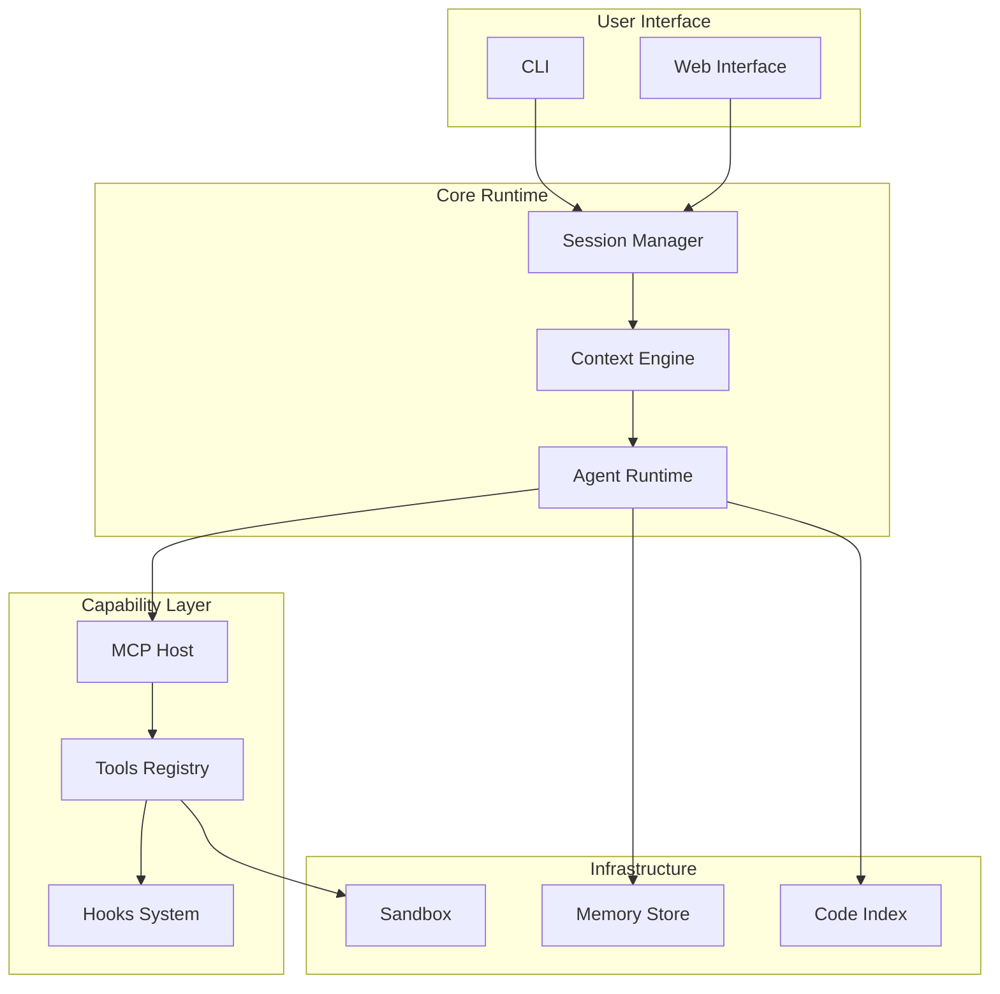

### B. 伪代码速查

#### Task分发算法

```typescript
function dispatchTask(task, agents) {
  // 1. 分解任务
  const subtasks = decompose(task);
  
  // 2. 构建依赖图
  const dag = buildDAG(subtasks);
  
  // 3. 拓扑排序
  const layers = topologicalSort(dag);
  
  // 4. 逐层执行
  for (const layer of layers) {
    const promises = layer.map(t => 
      executeWithAgent(t, selectAgent(t, agents))
    );
    await Promise.all(promises);
  }
}
```

#### Context压缩算法

```typescript
function compressContext(messages, budget) {
  // 按重要性排序
  const scored = messages.map(m => ({
    ...m,
    score: importance(m) * decay(m.age)
  }));
  
  // 保留高优先级
  const keep = scored.filter(m => m.score > 0.7);
  
  // 压缩低优先级
  const summarize = scored.filter(m => m.score <= 0.7);
  const summary = generateSummary(summarize);
  
  return [...keep, summary];
}
```

### C. 配置文件示例

#### settings.json完整配置

```json
{
  "permissions": {
    "mode": "acceptEdits",
    "allow": [
      "Bash(npm:*)",
      "Bash(git:*)",
      "Read(*)",
      "Edit(src/**)"
    ],
    "deny": [
      "Bash(rm:-rf*)",
      "Bash(sudo:*)",
      "Read(.env*)",
      "Read(**/secrets/**)"
    ]
  },
  "sandbox": {
    "filesystem": {
      "allowWrite": ["/tmp/build", "~/.kube"]
    },
    "network": {
      "allowedDomains": ["github.com", "npmjs.com", "registry.npmjs.org"]
    }
  },
  "hooks": {
    "PreToolUse": [
      {
        "matcher": "Bash",
        "handler": {
          "type": "command",
          "command": "./scripts/security-check.sh"
        }
      }
    ],
    "PostToolUse": [
      {
        "matcher": "Edit|Write",
        "handler": {
          "type": "command",
          "command": "npm run lint:fix"
        }
      }
    ]
  },
  "agents": {
    "reviewer": {
      "description": "Code review specialist",
      "tools": ["Read", "Grep", "Bash"],
      "model": "sonnet"
    }
  }
}
```

---

## 总结

Claude Code的内部架构体现了现代AI Coding Agent平台的最佳实践：

1. **Session管理**提供了有状态的长期运行环境，支持恢复、分叉和持久化
2. **Context工程**通过分层注入和智能压缩，最大化利用有限的Context Window
3. **Runtime环境**通过MCP协议和沙箱机制，实现安全、可扩展的能力调用
4. **记忆系统**分层存储不同类型的知识，支持跨会话学习
5. **Tools生态**提供原子化的操作能力，通过Hooks实现可扩展的治理
6. **代码检索**结合关键词和语义搜索，使Agent能够理解大型代码库
7. **多智能体架构**通过Orchestrator-Worker模式，实现复杂任务的并行处理

这些组件相互协作，构成了一个完整的AI开发助手平台，为构建类似的系统提供了宝贵的参考架构。

---

**文档结束**

*本白皮书基于Claude Code SDK（2025-2026版本）、MCP协议规范、Agentic OS架构模型以及社区开源资料编写。*
