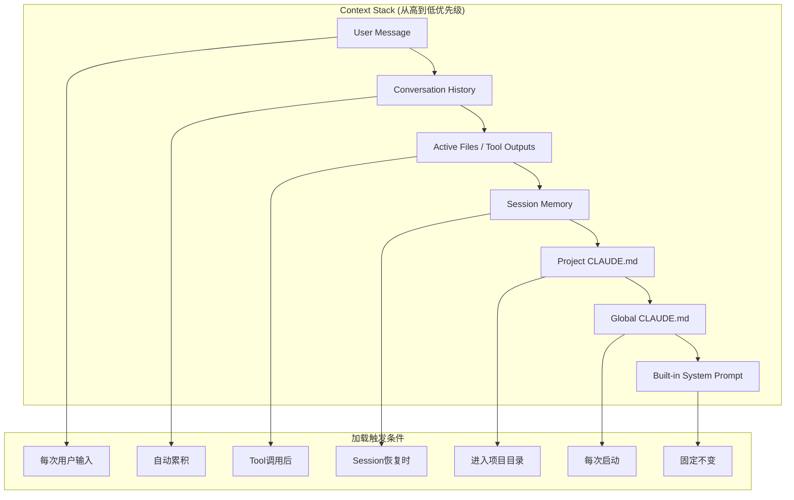
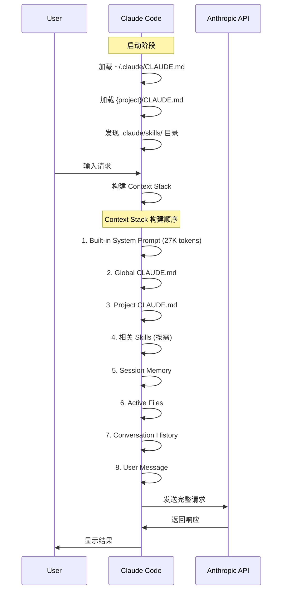
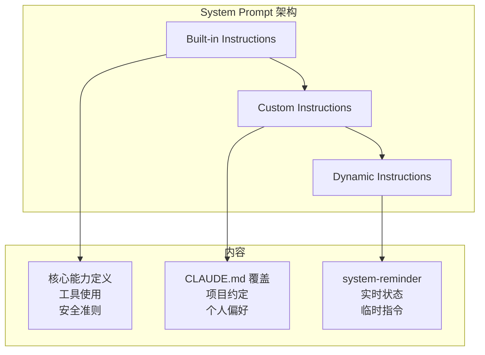
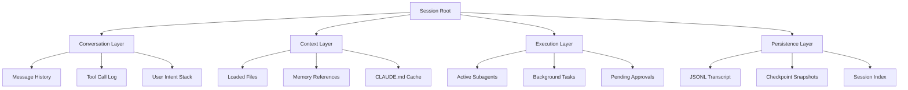
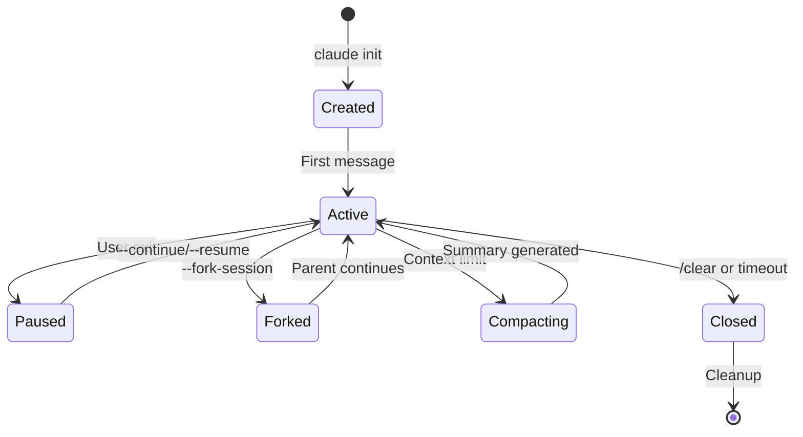
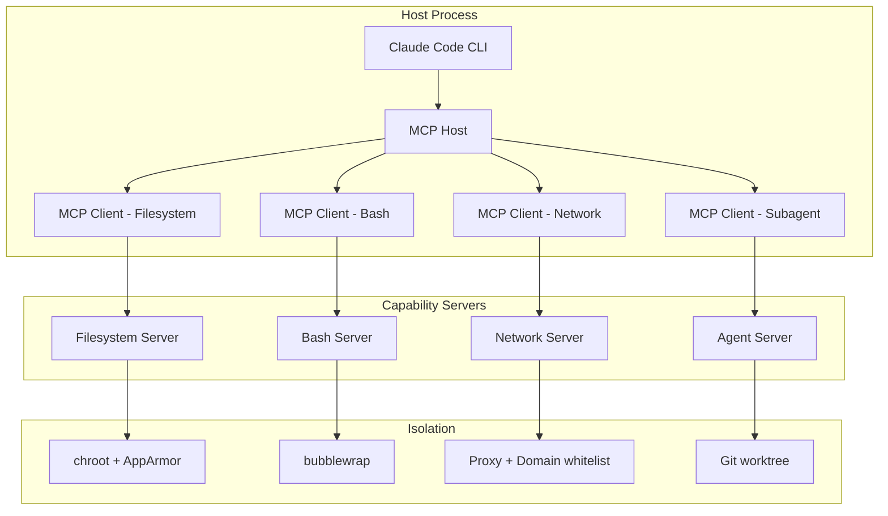
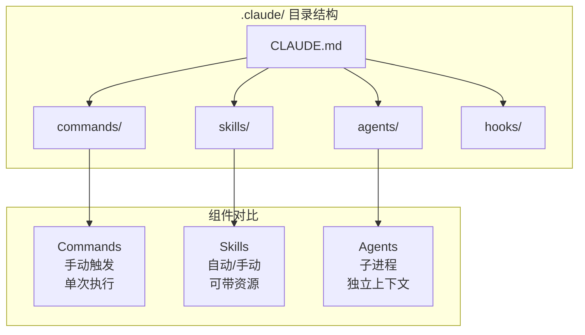
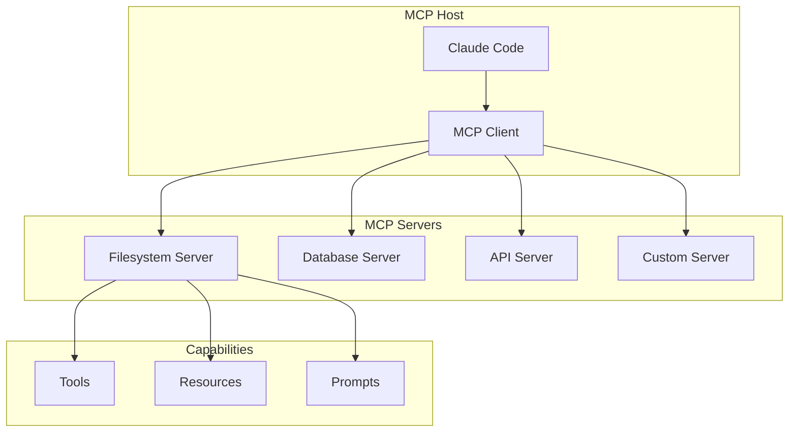

# Claude Code 核心组件深度解读

## Session、Runtime、Context、Prompt、Memory 系统详解

---

**文档版本**: v2.0  
**发布日期**: 2026年3月27日  
**文档长度**: ~20,000字

---

## 目录

1. [Context 分层注入系统](#1-context-分层注入系统)
2. [Prompt 工程与系统Prompt结构](#2-prompt-工程与系统prompt结构)
3. [Session 生命周期管理](#3-session-生命周期管理)
4. [Runtime 运行时环境](#4-runtime-运行时环境)
5. [Memory 记忆系统](#5-memory-记忆系统)
6. [Skills、Commands、Agents 组件](#6-skillscommandsagents-组件)
7. [Tools 工具系统](#7-tools-工具系统)
8. [MCP 协议与能力发现](#8-mcp-协议与能力发现)

---

## 1. Context 分层注入系统

### 1.1 Context 分层架构概览

Claude Code 的 Context 系统采用**分层注入模型**，不同来源的上下文按优先级和作用域分层叠加，形成最终的 Prompt。这种设计确保了关键信息始终可用，同时允许动态加载任务特定的上下文。



### 1.2 三层 Context 架构

| 层级 | 路径 | 作用域 | Recall | Attention | Context Load |
|------|------|--------|--------|-----------|--------------|
| **Root CLAUDE.md** | `~/.claude/CLAUDE.md` | 全局 | 最高 - 总是加载 | 随Context大小下降 | 高 - 始终消耗Token |
| **Sub-dir CLAUDE.md** | `{subdir}/CLAUDE.md` | 目录级 | 高 - 访问文件时加载 | 高于Root（噪音更少） | 中等 - 仅相关时 |
| **Skills** | `.claude/skills/**/SKILL.md` | 按需 | 较低 - 手动或自动触发 | 最高 - 新鲜聚焦 | 最低 - 按需加载 |

### 1.3 CLAUDE.md 分层加载机制

#### 1.3.1 全局 CLAUDE.md (Layer 1)

**位置**: `~/.claude/CLAUDE.md`

**加载时机**: 每次 Claude Code 启动时自动加载

**用途**: 包含跨所有项目通用的个人偏好、身份信息、快捷方式

```markdown
---
# 个人身份信息
## Identity
Name: 张三
Role: 全栈工程师
Timezone: Asia/Shanghai

## 活跃项目
| 缩写 | 项目 | 技术栈 |
|------|------|--------|
| PROJ1 | 电商平台 | Next.js, Prisma, PostgreSQL |
| PROJ2 | 内部工具 | Python, FastAPI, Vue3 |

## 关键人员
| 姓名 | 角色 |
|------|------|
| 李四 | PROJ1 产品经理 |
| 王五 | PROJ2 后端负责人 |

## 通用偏好
- 快速、直接，不废话
- 基础设施优于指令
- 单一职责原则
- 不使用表情符号

## Shell 快捷方式
| 命令 | 路径 |
|------|------|
| proj1 | ~/Projects/ecommerce/ |
| proj2 | ~/Projects/internal-tools/ |

## 关键规则
1. 永远不要提交 .env 或凭证
2. 使用 uv 运行 Python
3. 更改后始终验证构建 + 测试
```

#### 1.3.2 项目级 CLAUDE.md (Layer 2)

**位置**: `{project-root}/CLAUDE.md`

**加载时机**: 进入项目目录时加载

**用途**: 项目特定的技术栈、架构约定、命令、当前迭代信息

```markdown
---
# 项目特定上下文
## 技术栈
- Next.js 14, TypeScript, Tailwind CSS
- Prisma ORM + PostgreSQL
- tRPC 用于 API
- Zod 用于验证

## 架构
- 依赖注入贯穿始终
- 每个文件一个组件
- 所有外部依赖使用接口

## 命令
| 命令 | 用途 |
|------|------|
| npm run dev | 开发服务器在 3000 端口 |
| npm run validate | Lint + build + test |
| npm run db:migrate | 运行数据库迁移 |

## 关键模式
- 所有 API 调用通过 src/lib/api-client.ts
- 认证通过 AuthProvider wrapper 提供
- 数据库类型自动生成，永不手写

## 当前迭代
- 功能: AI 助手对话
- 分支命名: feature/ai-assistant-{description}
```

#### 1.3.3 子目录 CLAUDE.md (Layer 3)

**位置**: `{subdir}/CLAUDE.md`

**加载时机**: Claude 读取该目录或子目录中的文件时

**用途**: 模块特定的模式、API 约定

```markdown
---
# API 模块特定上下文
## API 路由约定
- 始终使用 Zod 模式验证
- 使用 withAuth HOC 保护路由
- 错误处理使用 AppError 类

## 数据库操作
- 多表操作使用事务
- 永远不要不带 where 子句使用 delete()
```

### 1.4 Context 注入顺序详解



### 1.5 Prompt Caching 优化策略

Claude Code 使用 `cache_control: {"type": "ephemeral"}` 实现 Prompt Caching，降低 90% 的 Token 成本。

```typescript
// Claude Code API 请求结构
interface ClaudeCodeRequest {
  system: [
    {
      type: "text";
      text: string;  // Built-in system prompt
      cache_control: { type: "ephemeral" }  // 缓存点1
    },
    {
      type: "text";
      text: string;  // CLAUDE.md content
      cache_control: { type: "ephemeral" }  // 缓存点2
    }
  ];
  tools: ToolDefinition[];  // 工具定义也可缓存
  messages: Message[];  // 对话历史（不缓存）
}
```

**Caching 策略**:

| 内容 | 是否缓存 | 原因 |
|------|----------|------|
| Built-in System Prompt | ✅ | 所有用户共享 |
| Global CLAUDE.md | ✅ | 个人配置不变 |
| Project CLAUDE.md | ✅ | 同项目共享 |
| Skills | ✅ | 静态内容 |
| Conversation History | ❌ | 动态变化 |
| User Message | ❌ | 每次不同 |
| Tool Outputs | ❌ | 实时变化 |

**静态内容优先、动态内容置后**的布局原则：

```
[缓存区域 - 静态内容]
├── Built-in System Prompt
├── Global CLAUDE.md
├── Project CLAUDE.md
└── Skills

[非缓存区域 - 动态内容]
├── <system-reminder> (日期、git状态等)
├── Conversation History
├── Tool Outputs
└── User Message
```

### 1.6 system-reminder 机制

对于易变信息（日期、git状态、文件修改），Claude Code 使用 `<system-reminder>` 标签在 User Message 中传递，而非更新 System Prompt：

```json
{
  "role": "user",
  "content": "<system-reminder>\n# currentDate\nToday's date is 2026-03-27.\n</system-reminder>\n\nFix the login bug"
}
```

这样可以保持 System Prompt 不变，缓存不失效。

---

## 2. Prompt 工程与系统Prompt结构

### 2.1 系统Prompt三层结构



### 2.2 Built-in System Prompt 核心内容

根据泄露的 Claude Code System Prompt，其核心结构包括：

```markdown
# Claude Code Built-in System Prompt 结构

## 1. 身份定义
You are Claude Code, an interactive CLI tool for software development.

## 2. 核心能力
- File operations (Read, Write, Edit)
- Shell command execution (Bash)
- Code search (Grep, Glob)
- Web access (WebSearch, WebFetch)
- Subagent spawning (Task/Agent)

## 3. 工具使用规则
- Read before Edit - 必须先读取再编辑
- Use exact string matching for Edit
- Check file existence before Write

## 4. 安全准则
- Ask permission before destructive operations
- Never execute untrusted code
- Respect .gitignore patterns

## 5. 行为偏好
- Be concise and direct
- Lead with findings, not process
- Use parallel tool calls when possible
```

### 2.3 XML 标签控制行为

Anthropic 官方使用 XML 标签控制 Claude 行为：

| 标签 | 作用 |
|------|------|
| `<do_not_act_before_instructions>` | 延迟行动直到条件满足 |
| `<default_to_action>` | 优先工具使用而非聊天回复 |
| `<use_parallel_tool_calls>` | 同时执行独立工具 |
| `<investigate_before_answering>` | 回答前进行研究 |
| `<avoid_excessive_markdown_and_bullet_points>` | 偏好散文而非列表 |

**示例**:

```markdown
<default_to_action>
When given a task, immediately start using tools to accomplish it rather than asking clarifying questions.
</default_to_action>

<use_parallel_tool_calls>
Execute independent tool calls simultaneously for efficiency.
</use_parallel_tool_calls>
```

### 2.4 Prompt 工程最佳实践

#### 2.4.1 正面表述优于禁止

| ❌ 避免 | ✅ 推荐 |
|--------|--------|
| "Never use X" | "Use Y instead [because reason]" |
| "Don't include X" | "Include only Y" |
| "Avoid X" | "Prefer Y" |
| "Don't explain" | "Output only the result" |

#### 2.4.2 具体优于模糊

| ❌ 模糊 | ✅ 具体 |
|--------|--------|
| "Format code properly" | "Use 2-space indentation for all code" |
| "Write good commit messages" | "Use conventional commits: `type(scope): description`" |
| "Handle errors correctly" | "Catch exceptions only when you have a specific recovery action" |

#### 2.4.3 提供动机说明

```markdown
## Python 环境
使用 `uv run` 执行所有 Python 命令。
**原因**: 自动管理虚拟环境和依赖。
```

### 2.5 Context Window 优化

#### 2.5.1 重要性评分算法

```typescript
interface MessageImportance {
  role: 'system' | 'user' | 'assistant' | 'tool';
  content: string;
  timestamp: number;
  markedImportant: boolean;
}

function calculateImportance(message: MessageImportance): number {
  const baseScores = {
    system: 1.0,
    user: 0.8,
    assistant: 0.6,
    tool: 0.4
  };
  
  // 时间衰减因子
  const age = Date.now() - message.timestamp;
  const timeDecay = Math.exp(-0.1 * age / (24 * 60 * 60 * 1000));
  
  // 显式标记重要性
  const explicitBonus = message.markedImportant ? 1.5 : 1.0;
  
  return baseScores[message.role] * timeDecay * explicitBonus;
}
```

#### 2.5.2 压缩策略

当 Context Window 接近上限（200K tokens）时：

1. **保留高优先级消息** (score > 0.7)
2. **压缩早期助手消息** - 摘要化
3. **移除低优先级文件内容**
4. **生成结构化摘要**

```typescript
interface CompactionStrategy {
  // 1. 识别保留消息
  keep: Message[];
  
  // 2. 识别可摘要消息
  summarize: Message[];
  
  // 3. 生成摘要
  summary: string;
  
  // 4. 重建上下文
  compactedContext: [
    ...keep,
    { type: 'summary', content: summary }
  ];
}
```

---

## 3. Session 生命周期管理

### 3.1 Session 状态层次



### 3.2 Session 生命周期状态机



### 3.3 持久化存储结构

```
~/.claude/
├── history.jsonl              # 全局对话历史索引
├── settings.json              # 用户级配置
├── projects/
│   └── {project-hash}/
│       ├── sessions-index.json    # Session元数据索引
│       ├── sessions/
│       │   ├── {session-id}.jsonl # 完整对话记录
│       │   └── agent-{agent-id}.jsonl  # 子Agent记录
│       └── memory/
│           ├── MEMORY.md          # 自动生成的记忆文件
│           └── episodic/          # 情景记忆片段
└── worktrees/                 # Git worktree隔离目录
    └── agent-{id}/
```

### 3.4 恢复机制

| 模式 | 命令 | 行为 | 使用场景 |
|------|------|------|----------|
| Continue | `claude -c` | 恢复最近Session | 短暂中断后继续 |
| Resume | `claude -r [id]` | 恢复指定Session | 跨天工作恢复 |
| Fork | `--fork-session` | 创建分支Session | 并行探索不同方案 |

---

## 4. Runtime 运行时环境

### 4.1 Client-Server 架构



### 4.2 沙箱安全模型

#### 4.2.1 文件系统沙箱

```typescript
interface FilesystemSandbox {
  rootPath: string;
  permissions: {
    read: string[];    // Glob patterns
    write: string[];
    deny: string[];    // 优先匹配
  };
  
  resolvePath(requestedPath: string): string {
    const resolved = path.resolve(this.rootPath, requestedPath);
    
    // 防止目录遍历
    if (!resolved.startsWith(this.rootPath)) {
      throw new SecurityError("Path traversal detected");
    }
    
    // 检查权限
    if (this.matchesDeny(resolved)) {
      throw new PermissionDeniedError();
    }
    
    return resolved;
  }
}
```

#### 4.2.2 命令执行沙箱 (Linux bubblewrap)

```bash
bwrap \
  --ro-bind /usr /usr \
  --ro-bind /lib /lib \
  --ro-bind /lib64 /lib64 \
  --bind /home/user/project /home/user/project \
  --tmpfs /tmp \
  --unshare-net \
  --die-with-parent \
  -- bash -c "$USER_COMMAND"
```

### 4.3 权限系统

#### 4.3.1 权限评估顺序

```
deny → ask → allow
```

**第一条匹配的规则获胜**。

#### 4.3.2 权限模式

| 模式 | 行为 |
|------|------|
| `default` | 每个新工具都提示权限 |
| `acceptEdits` | 自动接受文件编辑 |
| `plan` | 只读模式 |
| `dontAsk` | 拒绝所有未在allow中明确允许的操作 |
| `bypassPermissions` | 跳过所有检查（仅隔离环境） |

#### 4.3.3 settings.json 配置

```json
{
  "permissions": {
    "defaultMode": "acceptEdits",
    "allow": [
      "Bash(npm run *)",
      "Bash(git commit *)",
      "Edit(/src/**)",
      "Read(*)"
    ],
    "deny": [
      "Bash(rm -rf *)",
      "Bash(sudo *)",
      "Read(~/.ssh/**)"
    ]
  }
}
```

### 4.4 Git Worktree 隔离

#### 4.4.1 Worktree 创建流程

```bash
# 启动时创建
claude --worktree my-feature-branch

# 会话中创建
> Create a worktree for this feature

# Agent 定义中声明
# .claude/agents/feature-builder.md
---
name: feature-builder
isolation: worktree
---
```

#### 4.4.2 Worktree 目录结构

```
.claude/worktrees/
├── agent-{id}/          # 子Agent worktree
│   ├── .git/            # 指向主仓库的git目录
│   └── {files}/         # 隔离的工作文件
└── {branch-name}/       # 命名worktree
```

---

## 5. Memory 记忆系统

### 5.1 四种记忆类型

```mermaid
graph TB
    subgraph "Memory Hierarchy"
        A[Working Memory] -->|溢出| B[Episodic Memory]
        B -->|抽象| C[Semantic Memory]
        C -->|固化| D[Procedural Memory]
    end
    
    subgraph "存储介质"
        A1[Context Window]
        B1[~/.claude/projects/{id}/memory/episodic/]
        C1[~/.claude/projects/{id}/memory/semantic/]
        D1[CLAUDE.md + Skills]
    end
    
    A --> A1
    B --> B1
    C --> C1
    D --> D1
```

| 记忆类型 | 定义 | 存储位置 | 访问方式 |
|----------|------|----------|----------|
| **Working** | 当前Context Window中的内容 | 内存 | 直接访问 |
| **Declarative** | 结构化事实，需要时加载 | CLAUDE.md, 知识库 | 按需检索 |
| **Episodic** | 过去会话的事件记录 | `/memory/sessions/`, `/memory/decisions/` | 时间戳检索 |
| **Procedural** | 技能和流程定义 | Skills, workflow scripts | 模式匹配 |

### 5.2 记忆存储结构

```
~/.claude/memory/
├── sessions/           # 会话记录
│   └── {timestamp}.json
├── decisions/          # 重要决策日志
│   └── {decision-id}.md
├── knowledge/          # 领域知识
│   ├── api-docs/
│   ├── patterns/
│   └── conventions/
└── episodic/           # 情景记忆片段
    └── {episode-id}.json
```

### 5.3 Episodic Memory 实现

```typescript
interface EpisodicMemory {
  id: string;
  timestamp: number;
  sessionId: string;
  type: 'decision' | 'action' | 'outcome' | 'error';
  content: {
    task: string;
    context: string;
    action: string;
    result: string;
    lessons?: string[];
  };
  embedding: number[];
  importance: number;
}

class EpisodicMemoryStore {
  async store(memory: EpisodicMemory): Promise<void> {
    // 1. 生成embedding
    memory.embedding = await this.embedder.embed(
      `${memory.content.task} ${memory.content.action}`
    );
    
    // 2. 计算重要性
    memory.importance = this.calculateImportance(memory);
    
    // 3. 持久化
    await fs.appendFile(
      path.join(this.storagePath, 'episodes.jsonl'),
      JSON.stringify(memory) + '\n'
    );
  }
}
```

### 5.4 遗忘曲线实现

```typescript
class ForgettingCurve {
  private readonly FORGETTING_RATE = 0.3;
  
  calculateRetention(
    memory: EpisodicMemory,
    currentTime: number
  ): number {
    const age = (currentTime - memory.timestamp) / (24 * 60 * 60 * 1000);
    const importance = memory.importance;
    
    // 修正的遗忘曲线：重要性越高，遗忘越慢
    return importance * Math.exp(-this.FORGETTING_RATE * age / importance);
  }
}
```

---

## 6. Skills、Commands、Agents 组件

### 6.1 组件关系图



### 6.2 Skills 详解

#### 6.2.1 Skill 目录结构

```
.claude/skills/{skill-name}/
├── SKILL.md              # 必需 - 主技能文件
├── scripts/              # 可选 - 可执行脚本
│   ├── analyzer.py
│   └── validator.js
├── references/           # 可选 - 参考文档
│   ├── advanced-config.md
│   └── error-patterns.md
└── assets/               # 可选 - 模板、资源
    └── report-template.docx
```

#### 6.2.2 SKILL.md 格式

```markdown
---
name: code-reviewer                    # 技能名称（kebab-case）
description: >                         # 描述（用于自动触发判断）
  Review code for best practices, security issues, and potential bugs.
  Use when reviewing PRs, analyzing code quality, or checking implementations.
version: 1.0.0                         # 版本号
allowed-tools: Read, Grep, Bash        # 允许的工具（可选）
---

# Code Review Skill

## Purpose
[一句话描述技能用途]

## Workflow
### Step 1: [动作]
[具体指令]

## Examples
[2-3个输入/输出示例]
```

#### 6.2.3 Skills vs Commands

| 特性 | Commands (Legacy) | Skills |
|------|-------------------|--------|
| 位置 | `.claude/commands/*.md` | `.claude/skills/*/SKILL.md` |
| 触发 | 手动 (`/command`) | 自动 + 手动 |
| 支持文件 | 否 | 是 |
| Frontmatter | 可选 | 支持 |
| 优先级 | 低 | 高（同名时优先） |

### 6.3 Commands 详解

#### 6.3.1 Command 文件格式

```markdown
---
name: security-audit
description: Run security audit on codebase
allowed-tools: Read, Grep, Bash
argument-hint: [scope]
---

Perform a comprehensive security audit:

1. Check for hardcoded secrets
2. Review authentication logic
3. Validate input sanitization
4. Check dependency vulnerabilities

Scope: $ARGUMENTS
```

#### 6.3.2 参数传递

| 占位符 | 用途 |
|--------|------|
| `$ARGUMENTS` | 所有参数 |
| `$1`, `$2`, `$3` | 位置参数 |
| `@filename` | 引用文件 |
| `!command` | 执行bash命令 |

### 6.4 Agents 详解

#### 6.4.1 Agent 定义文件

```markdown
---
name: backend-architect
description: Design RESTful APIs, microservice boundaries, and database schemas
model: sonnet
tools:
  - Read
  - Write
  - Edit
  - Bash
disallowedTools: []
permissionMode: acceptEdits
isolation: worktree
maxTurns: 25
memory:
  scope: project
  persist: true
---

You are a senior backend architect specializing in scalable system design.

Your responsibilities:
1. Design clean API contracts
2. Define database schemas with proper indexing
3. Ensure microservice boundaries are well-defined

Never:
- Modify frontend code
- Commit directly to main branch
```

#### 6.4.2 Agent Frontmatter 字段

| 字段 | 类型 | 说明 |
|------|------|------|
| `name` | string | Agent标识 |
| `description` | string | 用途描述（用于路由） |
| `model` | string | 模型选择 (`sonnet`, `opus`, `haiku`, `inherit`) |
| `tools` | string[] | 允许的工具 |
| `disallowedTools` | string[] | 禁止的工具 |
| `permissionMode` | string | 权限模式 |
| `isolation` | string | 隔离模式 (`none`, `worktree`) |
| `maxTurns` | number | 最大轮数 |
| `skills` | string[] | 预加载的skills |
| `mcpServers` | object | MCP服务器配置 |
| `hooks` | object | Hook配置 |
| `memory` | object | 记忆配置 |
| `background` | boolean | 是否后台运行 |

### 6.5 渐进式披露模式

Skills 采用渐进式披露控制 Context Load：

```
Stage 1: Metadata (name + description)
    ↓ 约100 tokens，始终在Context中
Stage 2: SKILL.md body
    ↓ 触发时加载
Stage 3: Bundled resources
    ↓ 按需加载
```

---

## 7. Tools 工具系统

### 7.1 内置Tools列表

| Tool | 功能 | 幂等性 | 超时 |
|------|------|--------|------|
| `Read` | 读取文件 | ✅ | 30s |
| `Write` | 创建/覆盖文件 | ❌ | 30s |
| `Edit` | 精确字符串替换 | ❌ | 30s |
| `Bash` | 执行Shell命令 | ❌ | 2-10min |
| `Grep` | 正则搜索 | ✅ | 60s |
| `Glob` | 文件模式匹配 | ✅ | 30s |
| `LS` | 列出目录 | ✅ | 10s |
| `Task`/`Agent` | 创建子Agent | ❌ | 无限制 |
| `TodoWrite` | 创建任务列表 | ❌ | - |
| `WebSearch` | 网络搜索 | ✅ | 30s |
| `WebFetch` | 抓取网页 | ✅ | 30s |

### 7.2 Tool 使用约束

#### 7.2.1 Read Tool

```typescript
interface ReadTool {
  name: 'Read';
  parameters: {
    file_path: string;
    offset?: number;      // 起始行号
    limit?: number;       // 最大行数（默认2000）
  };
  returns: {
    content: string;      // cat -n 格式
    truncated: boolean;
    total_lines: number;
  };
  
  // 强制约束
  constraints: {
    mustReadBeforeEdit: true;
    lineNumberFormat: 'cat-n';
  };
}
```

#### 7.2.2 Edit Tool

```typescript
interface EditTool {
  name: 'Edit';
  parameters: {
    file_path: string;
    old_string: string;   // 必须唯一匹配
    new_string: string;
    replace_all?: boolean;
  };
  returns: {
    success: boolean;
    replacements: number;
  };
  
  constraints: {
    uniquenessCheck: true;
    readRequirement: true;
    atomicity: true;
  };
}
```

### 7.3 Todo 任务管理

#### 7.3.1 TodoWrite Tool

```typescript
interface TodoWriteTool {
  name: 'TodoWrite';
  parameters: {
    todos: Array<{
      id: string;
      content: string;
      status: 'pending' | 'in_progress' | 'completed';
      priority: 'high' | 'medium' | 'low';
    }>;
  };
  
  // 约束
  constraints: {
    singleInProgress: true;  // 只能有一个in_progress
    requiredFields: ['id', 'content', 'status', 'priority'];
  };
}
```

#### 7.3.2 使用场景

**使用 TodoWrite**:
- 复杂多步骤任务（3+步骤）
- 非平凡的复杂任务
- 用户明确要求
- 用户提供的任务列表
- 收到新指令后

**不使用 TodoWrite**:
- 单一简单任务
- 可以在3步内完成的琐碎任务
- 纯对话/信息性任务

---

## 8. MCP 协议与能力发现

### 8.1 MCP 架构



### 8.2 MCP 核心概念

| 概念 | 定义 | 示例 |
|------|------|------|
| **Tools** | 可执行的函数 | `search_database(query)`, `send_email(to, subject)` |
| **Resources** | 只读数据源 | `file:///project/data.json`, `postgres://db/table` |
| **Prompts** | 预定义模板 | "分析季度销售数据" |

### 8.3 MCP 消息格式

```typescript
// MCP Request (JSON-RPC 2.0)
interface MCPRequest {
  jsonrpc: "2.0";
  id: string;
  method: "tools/call" | "resources/read" | "prompts/get";
  params: {
    name: string;
    arguments?: Record<string, unknown>;
  };
}

// MCP Response
interface MCPResponse {
  jsonrpc: "2.0";
  id: string;
  result?: {
    content: Array<{
      type: "text" | "image" | "resource";
      text?: string;
      data?: string;
      mimeType?: string;
    }>;
  };
  error?: {
    code: number;
    message: string;
  };
}
```

### 8.4 能力发现流程

```typescript
interface CapabilityDiscovery {
  async initialize(): Promise<ServerCapabilities> {
    const response = await this.sendRequest({
      method: "initialize",
      params: {
        protocolVersion: "2025-03-26",
        capabilities: {
          tools: {},
          resources: {},
          prompts: {}
        }
      }
    });
    
    return {
      tools: response.capabilities.tools?.list || [],
      resources: response.capabilities.resources?.list || [],
      prompts: response.capabilities.prompts?.list || []
    };
  }
}
```

### 8.5 .mcp.json 配置

```json
{
  "mcpServers": {
    "notion": {
      "command": "npx",
      "args": ["-y", "@notionhq/mcp-server"],
      "env": {
        "NOTION_TOKEN": "${NOTION_TOKEN}"
      }
    },
    "postgres": {
      "command": "docker",
      "args": ["run", "-i", "--rm", "mcp/postgres"],
      "env": {
        "DATABASE_URL": "${DATABASE_URL}"
      }
    }
  }
}
```

---

## 9. Hooks 生命周期系统

### 9.1 12个生命周期事件

| 事件 | 触发时机 | 可阻塞 | 主要用途 |
|------|----------|--------|----------|
| `PreToolUse` | 工具执行前 | ✅ | 安全门、文件保护 |
| `PostToolUse` | 工具执行后 | ❌ | 自动格式化、lint |
| `UserPromptSubmit` | 用户提交prompt | ✅ | 输入验证 |
| `PermissionRequest` | 请求权限时 | ✅ | 自定义权限逻辑 |
| `SessionStart` | Session启动 | ❌ | 初始化 |
| `SessionEnd` | Session结束 | ❌ | 清理 |
| `SubagentStart` | 子Agent启动 | ❌ | 子Agent配置 |
| `SubagentStop` | 子Agent完成 | ❌ | 结果验证 |
| `PreCompact` | Context压缩前 | ❌ | 保存关键状态 |
| `ConfigChange` | 配置变更 | ❌ | 配置同步 |
| `Notification` | 发送通知 | ❌ | 外部通知 |
| `Stop` | Claude完成响应 | ❌ | 最终质量检查 |

### 9.2 Hooks 配置

```json
{
  "hooks": {
    "PreToolUse": [
      {
        "matcher": "Write|Edit",
        "hooks": [
          {
            "type": "command",
            "command": "bash ${CLAUDE_PLUGIN_ROOT}/scripts/validate.sh",
            "timeout": 30
          }
        ]
      }
    ],
    "PostToolUse": [
      {
        "matcher": "Edit|Write",
        "hooks": [
          {
            "type": "command",
            "command": "npm run lint:fix"
          }
        ]
      }
    ]
  }
}
```

### 9.3 Handler 类型

| 类型 | 用途 |
|------|------|
| `command` | 执行shell命令 |
| `prompt` | 发送prompt给Claude |
| `agent` | 调用子Agent |

---

## 附录

### A. 完整目录结构示例

```
project/
├── CLAUDE.md                    # 项目级上下文
├── .claude/
│   ├── CLAUDE.md               # 项目CLAUDE.md（同上）
│   ├── settings.json           # 项目级配置
│   ├── settings.local.json     # 个人本地配置（不提交git）
│   ├── commands/               # 自定义斜杠命令
│   │   ├── code-review.md
│   │   └── security-audit.md
│   ├── skills/                 # Skills
│   │   ├── api-testing/
│   │   │   └── SKILL.md
│   │   └── database-migrations/
│   │       ├── SKILL.md
│   │       └── examples/
│   ├── agents/                 # Agent定义
│   │   ├── backend-architect.md
│   │   ├── frontend-specialist.md
│   │   └── code-reviewer.md
│   ├── hooks/                  # Hooks配置
│   │   └── hooks.json
│   └── worktrees/              # Git worktrees（自动创建）
├── .mcp.json                   # MCP服务器配置
└── src/
    └── CLAUDE.md               # 子目录CLAUDE.md
```

### B. 配置优先级

```
高优先级
├── User Message
├── Conversation History
├── Active Files
├── Session Memory
├── Sub-dir CLAUDE.md
├── Project CLAUDE.md
├── Global CLAUDE.md
└── Built-in System Prompt
低优先级
```

### C. Token 消耗估算

| 组件 | Token 数 |
|------|----------|
| Built-in System Prompt | ~16-25K |
| Global CLAUDE.md | ~1-5K |
| Project CLAUDE.md | ~1-10K |
| Skills (按需) | ~0.5-3K |
| Conversation History | 变量 |
| User Message | 变量 |

**总计初始请求**: ~27-30K tokens（带缓存）

---

**文档结束**

*本文档基于 Claude Code 官方文档、社区资源、学术论文和开源实现编写。*
