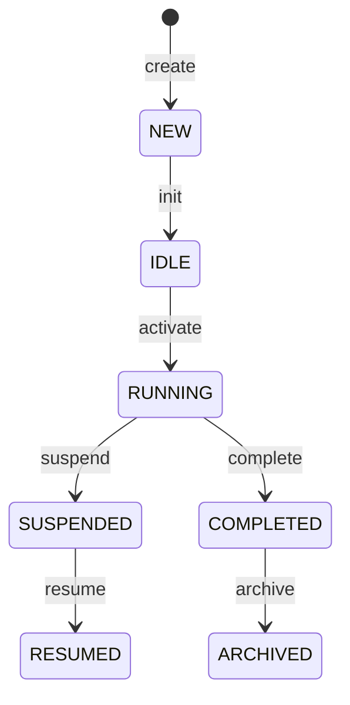
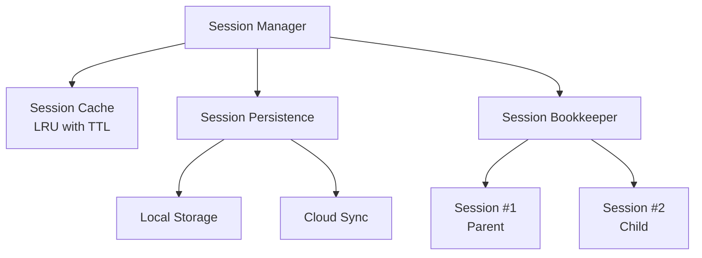
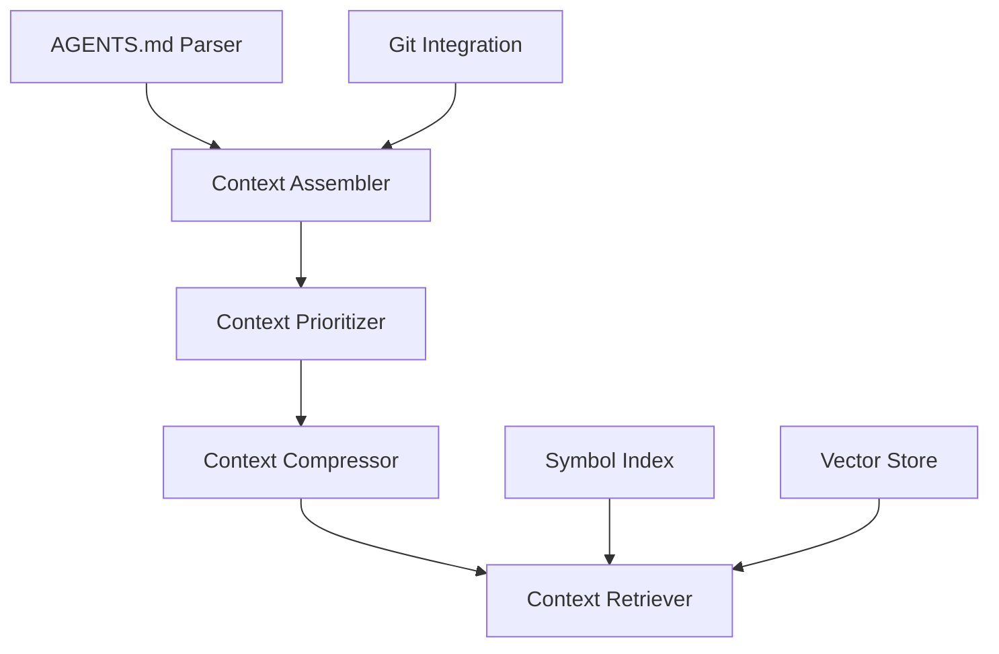
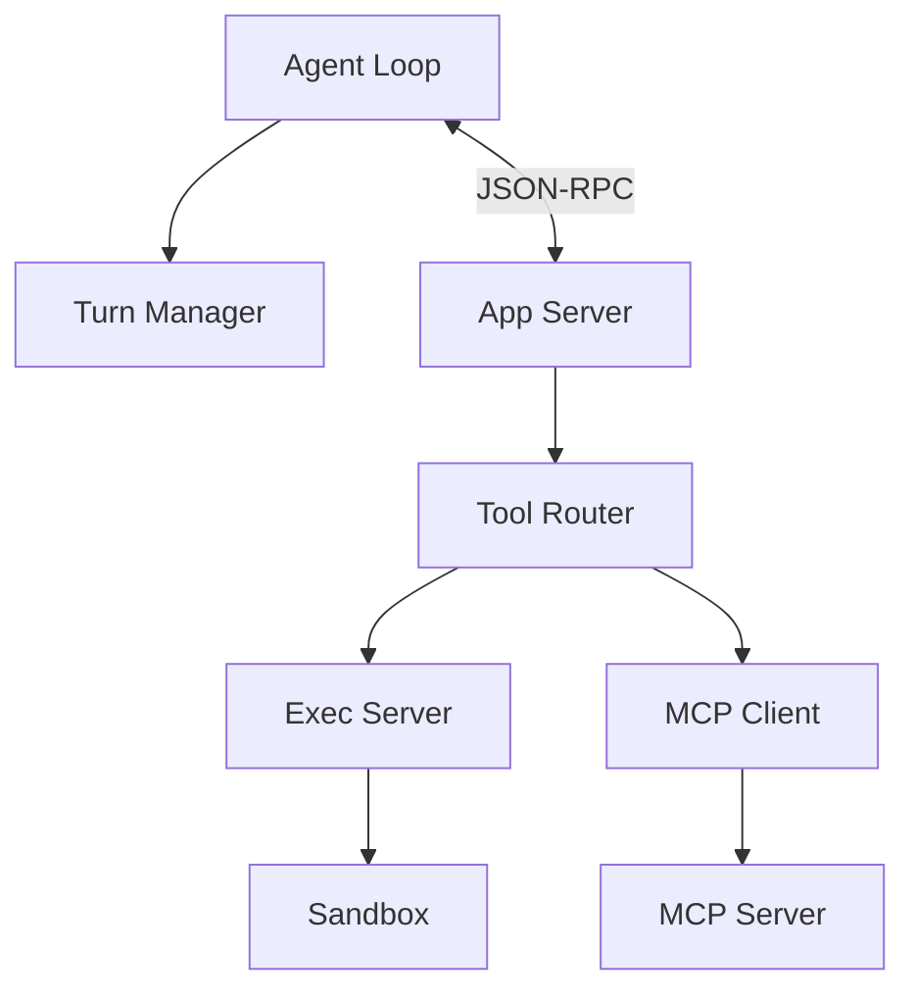
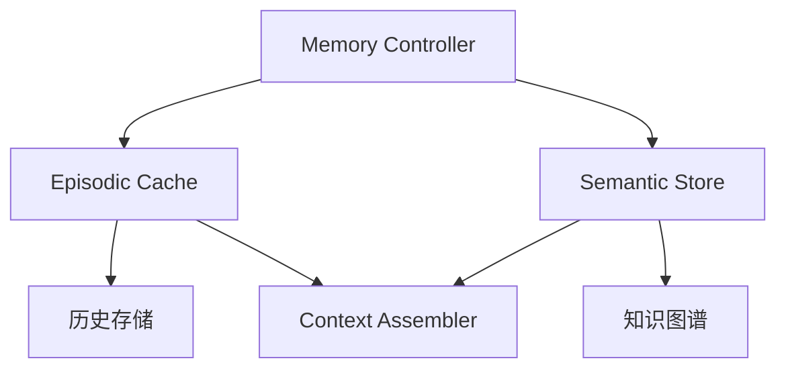
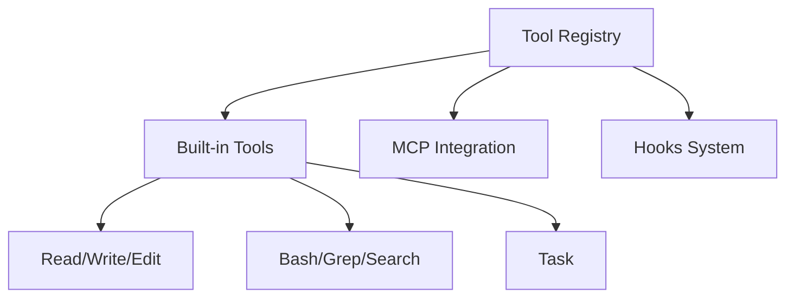
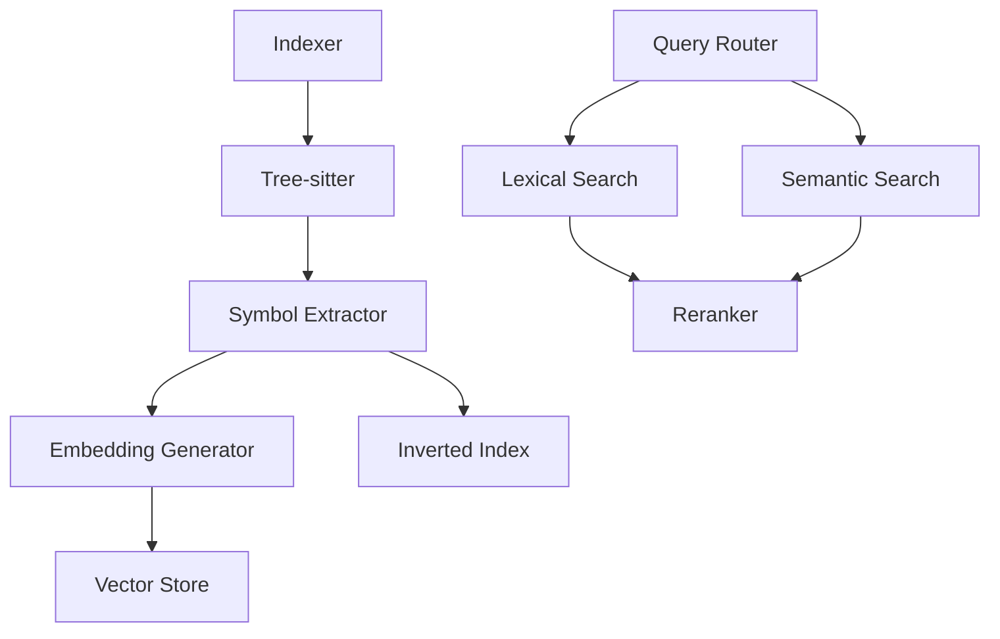
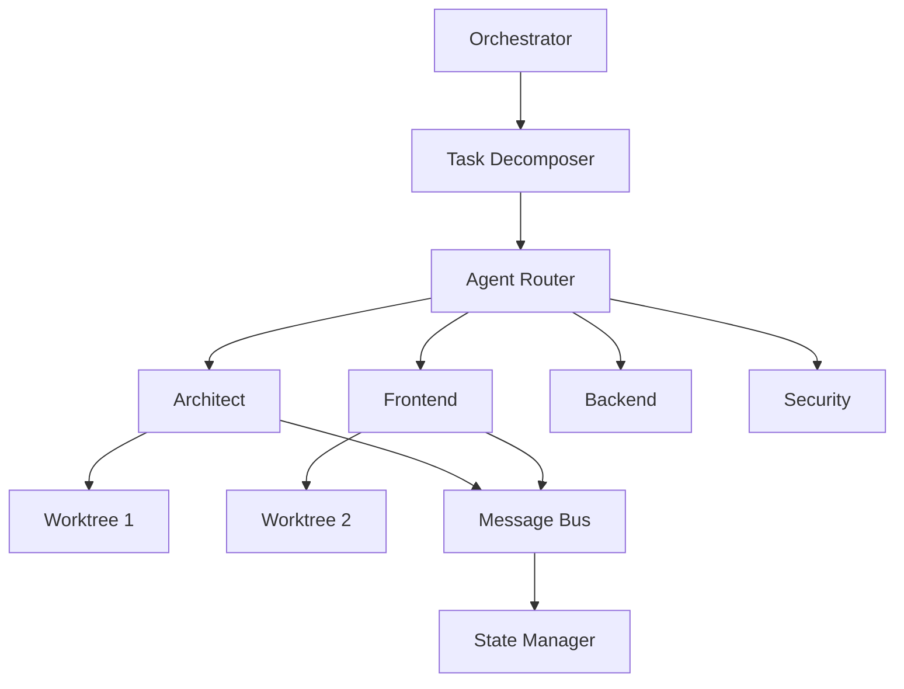

# Codex工程内部架构技术白皮书

> **文档版本**: 1.0  
> **最后更新**: 2026-03-27  
> **目标读者**: 构建AI Coding Agent平台的工程团队  
> **文档性质**: 内部架构深度解析

---

## 目录

1. [Session生命周期管理架构](#1-session生命周期管理架构)
2. [Context上下文工程系统](#2-context上下文工程系统)
3. [Runtime运行时环境](#3-runtime运行时环境)
4. [Memory记忆系统架构](#4-memory记忆系统架构)
5. [Tools工具生态系统](#5-tools工具生态系统)
6. [Code Retrieval & Indexing代码检索系统](#6-code-retrieval--indexing代码检索系统)
7. [Multi-Agent Architecture多智能体架构](#7-multi-agent-architecture多智能体架构)

---

## 1. Session生命周期管理架构

### 1.1 原理说明

Session是Codex的核心计算单元，支持长达30+小时的连续运行任务。与无状态的传统CLI工具不同，Codex Session具有**可持久化、可恢复、可分叉**的特性。

Session状态模型采用有限状态机（FSM）设计：



**核心特性对比**：

| 特性 | Codex Session | Claude Code Session |
|------|---------------|---------------------|
| 持久化格式 | JSONL + Markdown Artifact | JSONL + Checkpoint |
| Resume机制 | `codex resume --session-id` | `--continue` |
| Token预算 | 独立计算（272K默认） | 共享上下文（200K） |
| 父子Session | 原生支持（Worktree隔离） | Subagent工具模式 |

### 1.2 架构设计

Session管理器采用分层架构：



**存储结构**：
```
~/.codex/
├── history.jsonl              # 主会话索引
├── checkpoints/               # Checkpoint目录
│   └── {session-id}/
│       ├── metadata.json      # 会话元数据
│       ├── turns/             # Turn数据
│       └── state.bin          # 运行时状态
└── worktrees/                 # Git worktree目录
```

### 1.3 实现机制

**Resume核心逻辑**：

```rust
pub async fn resume_session(&self, session_id: SessionId) -> Result<Session> {
    // 1. 从持久化存储加载
    let metadata = self.persistence.load_metadata(&session_id).await?;
    
    // 2. 恢复Git worktree状态
    let worktree = self.worktree_manager.attach(&session_id, &metadata.cwd).await?;
    
    // 3. 重建Context Window
    let turns = self.persistence.load_turns(&session_id).await?;
    let context_window = ContextWindow::from_history(turns, metadata.token_budget.used);
    
    // 4. 恢复环境变量
    let env_vars = self.restore_env_vars(&metadata.context.env_vars).await?;
    
    Session { id: session_id, context_window, worktree, env_vars, ..metadata }
}
```

**Token预算管理**：

```rust
pub struct TokenBudget {
    total: usize,           // 272K默认
    reserved: usize,        // 响应预留
    used: usize,
    compaction_threshold: f64,  // 0.9
}

impl TokenBudget {
    pub fn should_compact(&self) -> bool {
        self.utilization() > self.compaction_threshold
    }
}
```

### 1.4 最佳实践

1. **合理设置Session边界**：一个功能点一个Session
2. **利用Resume机制**：`codex resume sess_abc123`
3. **主动Checkpoint**：在关键决策点后手动触发
4. **Token预算监控**：使用`/status`命令查看使用情况

---

## 2. Context上下文工程系统

### 2.1 原理说明

Context工程是Codex区别于普通代码补全工具的关键。系统通过**分层注入、智能压缩、动态检索**三大机制，确保模型始终获得最相关、最精炼的上下文。

**五层Context架构**：

| 层级 | 内容 | 生命周期 |
|------|------|---------|
| Layer 5: Session | 对话历史、用户偏好 | 单次会话 |
| Layer 4: Project | AGENTS.md、项目结构 | 项目存续 |
| Layer 3: Repository | Git状态、最近修改 | 工作区变化 |
| Layer 2: Codebase | 符号索引、语义搜索 | 按需加载 |
| Layer 1: System | 系统Prompt、工具定义 | 固定不变 |

### 2.2 架构设计



### 2.3 实现机制

**AGENTS.md自动注入**：

```rust
pub async fn load(&self, cwd: &Path) -> Result<Vec<AgentsMdContent>> {
    let search_paths = vec![
        cwd.join(".codex").join("AGENTS.md"),
        cwd.join("AGENTS.md"),
    ];
    
    for path in search_paths {
        if path.exists() {
            let content = self.load_file(&path).await?;
            // 使用matter库解析YAML Front Matter
            let matter = Matter::<YAML>::new();
            let result = matter.parse(&content);
            contents.push(result);
        }
    }
    Ok(contents)
}
```

**重要性评分算法**：

```rust
fn compute_relevance_score(&self, memory: &Memory, query: &str) -> f64 {
    let mut score = 0.0;
    
    // 语义相似度 (40%)
    if let Some(embedding) = &memory.embedding {
        score += 0.4 * cosine_similarity(query_embedding, embedding);
    }
    
    // 时间衰减 (30%)
    let recency = (-age_hours / 24.0).exp();
    score += 0.3 * recency;
    
    // 重要性得分 (20%)
    score += 0.2 * memory.importance_score;
    
    // 访问频率 (10%)
    score += 0.1 * (memory.access_count as f64 / 10.0).min(1.0);
    
    score
}
```

**滑动窗口策略**：

```rust
pub fn fit_to_window(&self, messages: Vec<Message>) -> (Vec<Message>, Option<String>) {
    // 1. 分离必须保留的最近消息
    let recent = messages.split_off(messages.len() - self.min_recent_messages);
    
    // 2. 对旧消息评分并排序
    let mut scored: Vec<_> = messages.into_iter()
        .map(|m| (self.scorer.score(&m), m))
        .collect();
    scored.sort_by(|a, b| b.0.partial_cmp(&a.0).unwrap());
    
    // 3. 贪心选择高优先级消息
    let mut selected = Vec::new();
    for (score, msg) in scored {
        if self.fits_budget(&selected, &msg) {
            selected.push(msg);
        }
    }
    
    (selected, summary)
}
```

### 2.4 最佳实践

1. **结构化Front Matter**：明确定义Agent类型、权限、工具集
2. **关键信息优先**：重要约束放在AGENTS.md前面
3. **主动提供相关文件**：`@src/auth/login.ts 请重构`
4. **请求Context摘要**：定期 compact 释放Token

---

## 3. Runtime运行时环境

### 3.1 原理说明

Codex Runtime采用**分离式架构**，将LLM推理循环与工具执行隔离在不同进程中，实现安全隔离和故障隔离。

**三级进程架构**：
```
Level 1: Main Process (codex)
├── Level 2: App Server (codex app-server)
│   ├── Level 3: Exec Server
│   └── Level 3: MCP Server Processes
```

### 3.2 架构设计



### 3.3 实现机制

**Agent Loop状态机**：

```rust
pub enum AgentState {
    Idle,
    Inferencing,
    ExecutingTool(ToolCall),
    WaitingForApproval(ApprovalRequest),
    Compacting,
}

impl AgentLoop {
    pub async fn run(&mut self, user_input: UserInput) -> Result<TurnResult> {
        let prompt = self.assemble_prompt(user_input).await?;
        let response = self.backend.complete(prompt).await?;
        
        match response {
            Response::AssistantMessage(msg) => Ok(TurnResult::Message(msg)),
            Response::ToolCall(call) => {
                let result = self.execute_tool(call).await?;
                self.context.add_tool_result(result);
                self.run(UserInput::ToolResult).await  // 递归
            }
        }
    }
}
```

**macOS Seatbelt沙箱**：

```rust
fn generate_profile(&self, policy: &SandboxPolicy) -> String {
    let mut rules = vec![];
    rules.push("(version 1)".to_string());
    rules.push("(deny default)".to_string());
    
    match policy.filesystem {
        FsPolicy::ReadOnly => {
            rules.push(format!("(allow file-read* (subpath \"{}\"))", policy.working_dir.display()));
        }
        FsPolicy::WorkspaceWrite => {
            rules.push(format!("(allow file-read* (subpath \"{}\"))", policy.working_dir.display()));
            for root in &policy.writable_roots {
                rules.push(format!("(allow file-write* (subpath \"{}\"))", root.display()));
            }
        }
    }
    
    if policy.network == NetworkPolicy::Disabled {
        rules.push("(deny network*)".to_string());
    }
    
    rules.join("\n")
}
```

**MCP协议握手**：

```rust
async fn initialize(&self) -> Result<InitializeResult> {
    let params = json!({
        "protocolVersion": "2024-11-05",
        "capabilities": { "tools": {}, "resources": {}, "prompts": {} },
        "clientInfo": { "name": "codex", "version": "1.0.0" }
    });
    
    let response = self.request("initialize", params).await?;
    self.notify("initialized", json!({})).await?;
    
    Ok(response)
}
```

### 3.4 最佳实践

1. **沙箱配置**：开发用`workspace-write`，CI/CD用`read-only`
2. **资源限制**：设置`max_memory_mb`和`max_execution_time`
3. **错误分类**：可重试错误（Timeout）vs 不可重试错误（PermissionDenied）

---

## 4. Memory记忆系统架构

### 4.1 原理说明

Codex记忆系统采用**双层架构**：Episodic Memory（情景记忆）存储短期任务上下文，Semantic Memory（语义记忆）存储长期领域知识。

| 特性 | Episodic Memory | Semantic Memory |
|------|-----------------|-----------------|
| 内容 | 短期任务上下文 | 长期知识图谱 |
| 存储 | 内存+本地JSON | Vector DB |
| 检索 | 时间+相似度 | 向量相似度 |
| 遗忘 | LRU+时间衰减 | 手动管理 |

### 4.2 架构设计



### 4.3 实现机制

**遗忘曲线实现**：

```rust
impl ForgettingCurve {
    pub fn memory_strength(&self, age: Duration, review_count: u32) -> f64 {
        let hours = age.num_hours() as f64;
        let effective_strength = self.base_strength 
            * (1.0 + self.review_boost * review_count as f64);
        (-hours / effective_strength).exp()  // 艾宾浩斯曲线
    }
    
    pub fn should_forget(&self, memory: &EpisodicMemory) -> bool {
        let strength = self.memory_strength(age, memory.access_count);
        strength < 0.1 && age > Duration::days(7)
    }
}
```

**知识图谱增量更新**：

```rust
async fn incremental_update(&mut self, changes: Vec<CodeChange>) -> Result<()> {
    for change in changes {
        match change.change_type {
            ChangeType::Added => {
                let node = self.code_entity_to_node(&change)?;
                let node_id = self.add_node(node).await?;
                self.update_dependencies(&change, node_id).await?;
            }
            ChangeType::Modified => {
                self.remove_by_path(&change.path).await?;
                self.add_node(self.code_entity_to_node(&change)?).await?;
            }
            ChangeType::Deleted => {
                self.mark_node_deprecated(node_id).await?;
            }
        }
    }
    self.update_embeddings(&changes).await?;
    Ok(())
}
```

### 4.4 最佳实践

1. **记忆类型选择**：临时任务用Episodic，架构知识用Semantic
2. **遗忘策略配置**：`episodic_retention_days = 7`
3. **Embedding缓存**：启用缓存减少API调用

---

## 5. Tools工具生态系统

### 5.1 原理说明

Tools是连接LLM与外部世界的桥梁。Codex工具系统分为三层：Built-in Tools（内置工具）、MCP Tools（扩展工具）、Custom Tools（自定义工具）。

### 5.2 架构设计



### 5.3 实现机制

**Tool Schema定义**：

```rust
pub struct ToolDefinition {
    pub name: String,
    pub description: String,
    pub parameters: JsonSchema,
    pub metadata: ToolMetadata,
}

pub struct ToolMetadata {
    pub idempotent: bool,
    pub readonly: bool,
    pub requires_approval: bool,
    pub timeout_seconds: u64,
    pub max_retries: u32,
}
```

**Task工具（多Agent核心）**：

```rust
async fn execute(&self, args: Value, ctx: &ToolContext) -> Result<Value> {
    let config = AgentConfig {
        agent_type: args["agent"].as_str().unwrap_or("default").to_string(),
        instructions: format!("Task: {}", args["description"].as_str().unwrap()),
        parent_session: Some(ctx.session_id.clone()),
    };
    
    let child_agent = self.agent_spawner.spawn(config).await?;
    let result = child_agent.wait_for_completion().await?;
    
    Ok(json!({
        "agent_id": child_agent.id,
        "status": result.status,
        "summary": result.summary,
    }))
}
```

**Hooks系统**：

```rust
pub enum PreHookResult {
    Allow,
    Block(String),
    Modify(Value),
}

pub struct SensitiveFileHook;
impl PreHook for SensitiveFileHook {
    async fn before_execute(&self, tool_name: &str, args: &Value) -> Result<PreHookResult> {
        if let Some(path) = args["file_path"].as_str() {
            let sensitive = ["*.env", "*secrets*", "~/.ssh/*"];
            for pattern in &sensitive {
                if glob::Pattern::new(pattern)?.matches(path) {
                    return Ok(PreHookResult::Block(format!("Access to '{}' blocked", path)));
                }
            }
        }
        Ok(PreHookResult::Allow)
    }
}
```

### 5.4 最佳实践

1. **幂等性保证**：相同输入产生相同输出
2. **错误重试策略**：指数退避重试
3. **工具组合**：顺序ToolChain和并行ToolParallel

---

## 6. Code Retrieval & Indexing代码检索系统

### 6.1 原理说明

代码检索系统通过**语法感知、语义理解、关系追踪**三大能力，帮助Agent理解大型代码库。

**三级混合检索**：

| 检索类型 | 速度 | 精度 | 权重 |
|---------|------|------|------|
| Lexical (BM25) | ★★★★★ | ★★★☆☆ | 0.4 |
| Semantic (Vector) | ★★★☆☆ | ★★★★☆ | 0.5 |
| Graph (依赖) | ★★☆☆☆ | ★★★★★ | 0.1 |

### 6.2 架构设计



### 6.3 实现机制

**Tree-sitter符号提取**：

```rust
fn extract_functions(&self, node: &Node, content: &str) -> Result<Vec<FunctionDef>> {
    let query = tree_sitter::Query::new(
        node.language(),
        "[
            (function_declaration
                name: (identifier) @name
                parameters: (parameters) @params
                body: (block) @body)
        ]"
    )?;
    
    let mut cursor = tree_sitter::QueryCursor::new();
    for match_ in cursor.matches(&query, *node, content.as_bytes()) {
        let name_node = match_.captures[0].node;
        functions.push(FunctionDef {
            name: content[name_node.byte_range()].to_string(),
            ..Default::default()
        });
    }
    Ok(functions)
}
```

**RRF融合算法**：

```rust
fn reciprocal_rank_fusion(&self, lexical: &[Result], semantic: &[Result]) -> Vec<Fused> {
    let mut scores: HashMap<String, f64> = HashMap::new();
    const K: f64 = 60.0;
    
    for (rank, r) in lexical.iter().enumerate() {
        *scores.entry(r.id.clone()).or_insert(0.0) += 1.0 / (K + rank as f64 + 1.0) * 0.4;
    }
    for (rank, r) in semantic.iter().enumerate() {
        *scores.entry(r.id.clone()).or_insert(0.0) += 1.0 / (K + rank as f64 + 1.0) * 0.5;
    }
    
    let mut fused: Vec<_> = scores.into_iter().map(|(id, s)| Fused { id, score: s }).collect();
    fused.sort_by(|a, b| b.score.partial_cmp(&a.score).unwrap());
    fused
}
```

### 6.4 最佳实践

1. **索引配置**：排除`node_modules/`、`target/`等目录
2. **查询优化**：使用`in src/`限定搜索范围
3. **增量更新**：启用文件监听自动更新索引

---

## 7. Multi-Agent Architecture多智能体架构

### 7.1 原理说明

多智能体架构是Codex的核心竞争力。通过将复杂任务分解为多个子任务，并由专业化Agent并行执行，实现任务并行化、专业化分工和错误隔离。

**与单智能体对比**：

| 维度 | Single-Agent | Multi-Agent |
|------|--------------|-------------|
| Context管理 | 单一Window易溢出 | 分层隔离 |
| Token消耗 | O(n) | O(log n) |
| 并行度 | 顺序执行 | 多线程并行 |
| 容错性 | 单点失败 | 子Agent可重启 |

### 7.2 架构设计



### 7.3 实现机制

**Agent定义（YAML Front Matter）**：

```rust
#[derive(Deserialize)]
pub struct AgentMetadata {
    pub name: String,
    pub model: ModelSpec,
    pub permissions: Permissions,
    pub tools: Vec<String>,
    pub color: String,
}

pub struct Permissions {
    pub filesystem: FsPermission,  // ReadOnly/WorkspaceWrite/FullAccess
    pub network: NetworkPermission, // Disabled/AllowedDomains/FullAccess
    pub execution: ExecutionPermission,
    pub spawn: SpawnPermission,
}
```

**父子通信机制**：

```rust
#[derive(Serialize, Deserialize)]
pub struct AgentMessage {
    pub id: MessageId,
    pub trace_id: TraceId,
    pub from: AgentId,
    pub to: AgentId,
    pub payload: MessagePayload,
}

#[serde(tag = "type")]
pub enum MessagePayload {
    TaskAssign { task_id: TaskId, description: String, inputs: HashMap<String, Value> },
    ProgressUpdate { task_id: TaskId, progress: f64, message: String },
    TaskResult { task_id: TaskId, status: TaskStatus, outputs: HashMap<String, Value> },
    Error { task_id: TaskId, error_type: ErrorType, message: String },
}
```

**Context隔离策略**：

```rust
pub fn create_isolated_context(
    parent: Option<&ContextWindow>,
    agent_def: &AgentDefinition,
) -> ContextWindow {
    let budget = match self.context_isolation {
        ContextIsolationPolicy::Independent { budget } => budget,
        ContextIsolationPolicy::Proportional { ratio } => {
            parent.map(|p| (p.remaining_budget() as f64 * ratio) as usize)
                .unwrap_or(272000)
        }
    };
    
    let mut context = ContextWindow::new(budget);
    context.set_system_prompt(agent_def.system_prompt.clone());
    
    // 继承父Agent摘要
    if let Some(parent_ctx) = parent {
        if let Some(summary) = parent_ctx.generate_summary() {
            context.add_context_item(ContextItem::Summary(summary));
        }
    }
    context
}
```

**Orchestrator编排模式**：

```rust
impl OrchestratorAgent {
    pub async fn orchestrate(&self, task: ComplexTask) -> Result<TaskResult> {
        // 1. 任务分解
        let subtasks = self.decomposition.decompose(&task).await?;
        
        // 2. 动态路由Agent选择
        let assignments = self.route_subtasks(&subtasks).await?;
        
        // 3. 并行派生子Agent
        let handles: Vec<_> = assignments.into_iter()
            .map(|(subtask, agent_def)| self.spawn_and_execute(subtask, agent_def))
            .collect();
        
        // 4. 等待完成并聚合结果
        let results = futures::future::join_all(handles).await;
        self.aggregate_results(results).await
    }
}
```

### 7.4 最佳实践

1. **单一职责**：每个Agent有明确的职责边界
2. **明确的输入输出**：使用结构化数据格式
3. **适当的权限限制**：遵循最小权限原则
4. **并发控制**：使用Semaphore限制并行数

### 7.5 边界情况处理

**Token溢出处理**：

```rust
pub async fn handle_token_overflow(&mut self) -> Result<()> {
    if self.context.can_compact() {
        self.context.compact().await?;
        return Ok(());
    }
    
    // 请求父Agent接管
    if let Some(parent) = &self.parent_id {
        self.bus.send_async(AgentMessage {
            payload: MessagePayload::Error {
                error_type: ErrorType::ContextOverflow,
                message: "Context window full".to_string(),
                recoverable: true,
            },
            ..Default::default()
        }).await?;
    }
    
    self.checkpoint().await?;
    self.state = AgentState::Suspended;
    Ok(())
}
```

**无限递归防护**：

```rust
const MAX_AGENT_DEPTH: usize = 3;

pub async fn spawn(&self, parent_id: Option<AgentId>, ...) -> Result<Agent> {
    let depth = parent_id.as_ref()
        .and_then(|id| self.get_depth(id))
        .unwrap_or(0);
    
    if depth >= MAX_AGENT_DEPTH {
        return Err(Error::MaxDepthExceeded);
    }
    // ...
}
```

---

## 附录：性能指标汇总

| 模块 | 指标 | 数值 |
|------|------|------|
| Session | 创建延迟 | ~50ms |
| Session | Resume延迟 | ~100ms |
| Context | 组装耗时 | ~20ms |
| Runtime | App Server启动 | ~100ms |
| Runtime | MCP握手 | ~50ms |
| Memory | Episodic检索 | ~10ms |
| Memory | 向量搜索 | ~5ms |
| Tools | 内置工具执行 | ~10ms |
| Code Retrieval | 混合检索 | ~50ms |
| Multi-Agent | Agent启动 | ~200ms |
| Multi-Agent | 消息传递 | ~5ms |

---

## 参考文献

1. OpenAI Codex GitHub: https://github.com/openai/codex
2. Model Context Protocol Specification: https://modelcontextprotocol.io
3. OpenAI Agents SDK: https://developers.openai.com/codex/guides/agents-sdk/
4. "Unrolling the Codex agent loop" - OpenAI Engineering Blog

---

*文档版本: 1.0*  
*最后更新: 2026-03-27*
