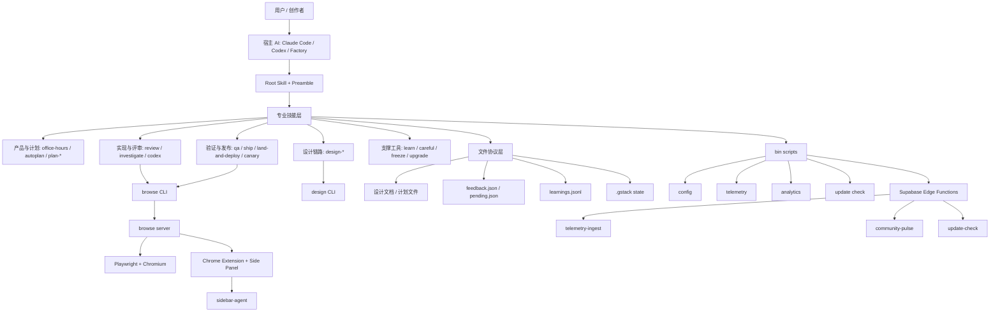

# gstack 项目总览与阅读地图

## 这份文档在解决什么问题

如果你第一次打开 `gstack`，最容易产生三个错觉：

- 第一种错觉是：它像一个“技能仓库”，只是很多 `SKILL.md` 的集合。
- 第二种错觉是：它像一个“浏览器工具”，核心只是 `browse` 二进制。
- 第三种错觉是：它像一个“个人工作流偏好包”，只是作者把自己的习惯开源了。

这三个判断都**只说对了一部分**。

更准确地说，`gstack` 是一个把 **AI 工程团队角色化、流程化、可执行化** 的系统：

- 底层有一个长期存活、可恢复、低延迟的浏览器执行引擎。
- 上层有一套由 `SKILL.md.tmpl` 生成的专业角色协议。
- 中间有设计生成、评审、QA、发布、回顾、学习记忆、遥测分析等胶水层。
- 外围还有安装、宿主适配、扩展侧栏、测试评估、工作区隔离、云端聚合统计等支撑系统。

所以，理解 `gstack` 最好的方法不是问：

> “这个命令怎么用？”

而是问：

> “它怎样把一个人 + AI，组织成像一个小型软件工厂那样工作？”

本目录下的文档，就是围绕这个问题写的。

---

## 一句话结论

**`gstack` 的本质，是“浏览器运行时 + 角色化技能协议 + 文件化协作约定 + 局部人工决策”的 AI 软件工厂。**

它不是一个通用 agent 框架；它更像一套对软件研发流程高度有主张的、为 Claude Code / Codex / Factory 等宿主准备的**专业工作流操作系统**。

---

## 先给出最重要的 12 个判断

### 1. `gstack` 的真正核心，不是 skills，而是“可持续运行的执行基座”

很多项目把 agent 能力建立在一次性命令调用上，而 `gstack` 把最难的部分放在了**持久浏览器状态**、**低延迟命令调用**、**真实页面交互**、**会话恢复**、**扩展联动**上。

这意味着它不是只会“想”，它非常强调“真的做”。

### 2. skills 不是普通文档，而是“角色协议”

`SKILL.md` 在这里不是帮助说明，而是 agent 执行时真正会读取的**操作剧本**。

这些剧本定义了：

- 角色定位
- 步骤顺序
- 必须做的检查
- 必须问用户的时机
- 可自动决策的边界
- 输出格式
- 遥测、会话、学习、升级检查等统一前导逻辑

### 3. `gstack` 不是一个单 agent 系统，而是“多角色单元作战系统”

它没有做一个“大而全的超级 agent”，而是把软件研发流程拆成多个专业角色：

- 产品发现
- CEO 视角缩放范围
- 工程架构审查
- 设计审查
- 设计生成
- 代码审查
- QA 修复
- 发布
- 部署验证
- 性能基线
- 安全审计
- 发布文档更新
- 回顾与学习

这是一种**用角色分化来控制上下文膨胀与判断偏移**的设计。

### 4. 它强调“流程先于自由发挥”

`gstack` 的很多技能并不追求 prompt 的开放性，而追求：

- 顺序必须对
- 前置条件必须满足
- 检查清单必须走完
- 证据要写出来
- 风险要明确升级

它更像 SOP 系统，不像自由聊天系统。

### 5. `browse` 的设计目标不是“功能最多”，而是“单位上下文成本最低”

从作者的架构说明可以看到，它明确反对在本地浏览器控制里引入重协议层。

因此 `browse` 被做成：

- 本地 localhost HTTP
- 纯文本 stdout/stderr
- 编译后二进制
- 几乎零协议装饰成本

这不是偶然，而是有意识地对抗 agent 上下文浪费。

### 6. `gstack` 很多“智能”，本质上来自文件协作，不来自复杂编排器

它并没有构建一个庞大的中心化 orchestration server 来编排所有智能体。

相反，它大量依赖：

- Git diff
- 计划文件
- `DESIGN.md`
- `feedback.json`
- `feedback-pending.json`
- `learnings.jsonl`
- `.gstack/browse.json`
- `.context/sidebar-inbox`
- `~/.gstack/projects/...`

也就是说，它把很多 agent coordination 问题**降解成文件协议问题**。

### 7. 它不是完全自动，也并不追求完全无人化

`ETHOS.md` 里最重要的原则之一是 **User Sovereignty**。

直白说：

- 模型可以强烈建议。
- 多模型可以形成共识。
- 但最终方向、范围、口味、风险承受度，由用户决定。

这使得 `gstack` 更像 **human-on-the-loop**，而不是 human-out-of-the-loop。

### 8. 它适合“一个人像一个小团队一样工作”

`README.md` 的叙事非常明确：

- 一个人
- 多个并行工作流
- 多个专业角色
- 从想法到发布的闭环

它不是为了传统大团队审批流而设计的，而是为了**单个强执行者**放大产能。

### 9. 它有很强的“宿主适配意识”

项目并不绑定单一宿主。

它支持：

- Claude Code
- Codex / `.agents/skills`
- Kiro
- Factory Droid
- 与 Conductor 类并行工作区场景兼容

这说明作者把 `gstack` 看作一层**工作流资产层**，而不是某个厂商产品的附庸。

### 10. 它的第二核心是“模板生成系统”

如果没有 `scripts/gen-skill-docs.ts`，这个项目很容易变成“文档和实现迅速漂移”的系统。

作者显然很清楚这一点，所以把以下内容拉回单一事实源：

- browse 命令表
- snapshot flags
- preamble
- 宿主路径适配
- 安全提示
- Codex / Factory 元数据

这使得 skills 不只是手写 prompt，而是**构建产物**。

### 11. 它很重视可观察性，而不是只重视成功路径

从浏览器日志、activity stream、eval partial store、harvest patch、telemetry、community pulse，可以看出这个项目有很强的“我要知道它怎么坏掉”的倾向。

这意味着它适合真实长期使用，而不是仅用于 demo。

### 12. 它把“研发闭环”视为产品，而不是把“代码生成”视为产品

很多 AI 编程项目的产品边界到“生成代码”为止。

`gstack` 的边界更远：

- 想法重构
- 方案审查
- 设计探索
- 代码实现
- diff 评审
- 浏览器 QA
- 自动回归测试
- 发布
- 部署验证
- 文档同步
- retro
- learnings 积累

也就是说，它卖的不是一个能写代码的 agent，而是一条**从思考到落地再到复盘的作业线**。

---

## 系统全景图

---

## 用“五层模型”理解这个项目

| 层级 | 你看到的东西 | 它真实承担的作用 | 为什么关键 |
|---|---|---|---|
| 第 1 层：产品叙事层 | `README.md`、`ETHOS.md` | 定义这个系统相信什么、服务谁、流程为何存在 | 决定了整个 repo 的价值观和边界 |
| 第 2 层：技能协议层 | 各目录下 `SKILL.md.tmpl` / `SKILL.md` | 定义各专业角色的工作方式 | 决定 agent 如何“像团队一样分工” |
| 第 3 层：执行工具层 | `browse/`、`design/`、`bin/` | 提供真实执行能力 | 决定系统不是空谈，而能动手 |
| 第 4 层：状态与协作层 | `.gstack`、`feedback.json`、`learnings.jsonl` 等 | 让多角色、多轮次、多会话能接上 | 决定流程能否闭环 |
| 第 5 层：观测与演进层 | `test/`、`scripts/`、`supabase/` | 评估、遥测、升级、分析、回放 | 决定项目能否长期维护 |

---

## 目录地图：第一次阅读时应该怎么看

| 路径 | 应该怎么理解 | 在系统里的地位 |
|---|---|---|
| `README.md` | 产品定位与入口叙事 | 解释作者为什么造这个系统 |
| `ARCHITECTURE.md` | 核心技术设计说明 | 理解 browse 和模板系统的最佳入口 |
| `BROWSER.md` | 浏览器子系统技术文档 | 理解运行时、扩展、侧栏 agent 的最佳入口 |
| `ETHOS.md` | 设计哲学与决策原则 | 理解为什么它不是“完全自动” |
| `SKILL.md` | 根技能、总入口、通用前导协议 | 所有技能共享行为的源头之一 |
| `docs/skills.md` | 各技能深度导览 | 从工作流角度理解产品面 |
| `browse/` | 最硬核的运行时实现 | 整个系统最难、最不可替代的底座 |
| `design/` | 设计生成与比较看板系统 | 让“设计”也进入 agent 流水线 |
| `scripts/` | 生成器、评估器、健康检查 | 保证 skills 与实现同步 |
| `bin/` | 配置、遥测、学习、升级、分析脚本 | 让系统具备运维与积累能力 |
| `extension/` | Chrome 扩展与侧边栏 UI | 让浏览器协作更像“共驾”而不是后台黑盒 |
| `supabase/` | 云端 edge function 与 schema | 负责可选遥测和社区聚合统计 |
| `test/` | 单测、E2E、eval、worktree 测试 | 用来验证这套工厂真的能运转 |
| `review/` | checklist 与评审资产 | 让评审不只是 prompt，而是资产复用 |
| `qa/` | QA 参考资料与模板 | 让测试和修复形成固定闭环 |

---

## 这套系统最适合什么场景

### 非常适合

- 你是一个**高上下文、强判断、强执行**的开发者或 founder。
- 你想把“构思、设计、实现、评审、测试、发布”压缩到一个人身上。
- 你愿意接受流程纪律，而不是只想要一个随叫随到的代码聊天机器人。
- 你重视浏览器 QA、真实页面验证、设计评审、文档同步这些通常被忽略的环节。
- 你会并行推进多个 feature 或多个项目。

### 不那么适合

- 你只想要一个“生成函数”的轻量助手。
- 你不接受任何流程约束，只想随意 prompt。
- 你完全不需要浏览器交互、QA、设计评审、发布流程。
- 你所在组织已经有非常重的标准化 DevOps / SDLC 体系，且不允许 agent 介入。

---

## 这个项目不是在替代什么，而是在重组什么

`gstack` 不是在简单替代：

- IDE autocomplete
- 单次代码生成
- 单个 review bot
- 单个浏览器自动化工具

它在重组的是：

- 角色分工
- 步骤顺序
- 风险升级点
- 证据输出方式
- 人与模型的控制权边界
- 一次 sprint 的完整生命周期

这就是为什么它看起来像很多子系统拼在一起。

因为它想替代的不是某个按钮，而是**一个人组织软件工作的方式**。

---

## 为什么你会看到这么多 agent / skills

表面上看，技能很多。

但如果按“组织职责”分组，其实很清楚：

| 组织职责 | 对应技能 |
|---|---|
| 产品与范围定义 | `office-hours`、`plan-ceo-review`、`autoplan` |
| 工程可实施性 | `plan-eng-review`、`investigate` |
| 设计质量与设计生成 | `plan-design-review`、`design-consultation`、`design-shotgun`、`design-html`、`design-review` |
| 代码质量 | `review`、`codex` |
| 测试与真实验证 | `browse`、`qa`、`qa-only`、`benchmark`、`canary` |
| 安全与风险 | `cso`、`careful`、`freeze`、`guard` |
| 发布与善后 | `ship`、`land-and-deploy`、`document-release`、`retro` |
| 记忆与基础设施 | `learn`、`setup-*`、`gstack-upgrade` |

因此，skills 很多并不意味着系统混乱。

相反，它说明作者是在把传统团队里的**岗位职责显式化**。

---

## 阅读顺序建议

### 如果你只想快速理解“它是干嘛的”

按这个顺序：

1. `README.md`
2. `docs/skills.md`
3. 本目录的 [01-整体架构与核心设计](./01-整体架构与核心设计.md)
4. 本目录的 [03-skills体系与多agent协作机制](./03-skills体系与多agent协作机制.md)

### 如果你最关心“浏览器运行时为什么这么强”

按这个顺序：

1. `ARCHITECTURE.md`
2. `BROWSER.md`
3. `browse/src/cli.ts`
4. `browse/src/browser-manager.ts`
5. `browse/src/snapshot.ts`
6. 本目录的 [02-browse运行时与扩展系统](./02-browse运行时与扩展系统.md)

### 如果你最关心“多 agent 如何配合”

按这个顺序：

1. `AGENTS.md`
2. `SKILL.md`
3. `office-hours/SKILL.md`
4. `autoplan/SKILL.md`
5. `review/SKILL.md`
6. `qa/SKILL.md`
7. `ship/SKILL.md`
8. 本目录的 [03-skills体系与多agent协作机制](./03-skills体系与多agent协作机制.md)

### 如果你最关心“是否可长期运行”

按这个顺序：

1. `ARCHITECTURE.md`
2. `browse/src/config.ts`
3. `browse/src/server.ts`
4. `bin/gstack-telemetry-log`
5. `bin/gstack-learnings-log`
6. `test/` 和 `lib/worktree.ts`
7. 本目录的 [04-模块拆解、自动化边界与24x7运行分析](./04-模块拆解、自动化边界与24x7运行分析.md)

---

## 术语表

### `browse`

项目的浏览器执行子系统。

它不是普通脚本，而是：

- CLI 薄客户端
- 本地 HTTP server
- Playwright/Chromium 执行器
- 扩展通信桥
- 侧栏 agent 运行环境

### `design`

项目的设计生成与对比评审子系统。

它负责：

- 生成 mockup
- 多方案变体
- 对比 board
- 用户反馈 roundtrip
- 实现与 mockup 的一致性验证

### `SKILL.md.tmpl`

技能模板源文件。

其中包含：

- 手写方法论
- 占位符
- 宿主无关/宿主相关内容

最终会被生成脚本转换成各宿主可用的 `SKILL.md`。

### preamble

所有技能前面的统一启动段。

它做的事包括：

- 更新检查
- 会话计数
- contributor mode
- 学习条目计数
- 遥测开关处理
- Search Before Building 原则注入

### refs

`@e1`、`@e2`、`@c1` 这类元素引用。

这是 `browse` 的关键交互模型，用于让 agent 不必依赖脆弱 CSS selector。

### sidebar agent

Chrome Side Panel 里的一个子 Claude 进程。

它通过：

- 本地 JSONL 队列
- `claude -p`
- 事件流回传
- 每 tab 独立处理

实现“浏览器里再有一个 agent 帮手”。

### worktree

用于隔离并行会话或测试运行的 Git worktree。

它是 `gstack` 实现多会话不互相污染的重要手段之一。

### learnings

项目级别的跨会话经验积累。

它不是模型内存，而是**落在文件里的项目经验层**。

---

## 这套文档的组成

本目录后续文档分别回答不同层面的问题：

- [01-整体架构与核心设计](./01-整体架构与核心设计.md)
  - 讲清楚系统分层、设计原则、安装构建、宿主适配、安全与状态模型。

- [02-browse运行时与扩展系统](./02-browse运行时与扩展系统.md)
  - 讲清楚浏览器子系统、CLI/daemon、snapshot/ref、Chrome 扩展、sidebar agent、通信协议。

- [03-skills体系与多agent协作机制](./03-skills体系与多agent协作机制.md)
  - 讲清楚为什么这么多角色、各技能如何衔接、自动决策边界、人机协作点、跨模型机制。

- [04-模块拆解、自动化边界与24x7运行分析](./04-模块拆解、自动化边界与24x7运行分析.md)
  - 讲清楚 `bin/`、`scripts/`、`design/`、`supabase/`、`test/` 等模块，以及是否可长期自动运行。

- [05-模块与关键文件速查表](./05-模块与关键文件速查表.md)
  - 适合作为源码导览与维护时的快速索引。

---

## 最后先给一个总判断

如果只允许我用一句更“带评价”的话来定义这个项目，我会这么说：

**`gstack` 不是“给 AI 增加几个命令”，而是“把软件研发活动拆成多个专业角色，再给这些角色配上真实可执行底座、文件协议和少量必要的人类裁决点”。**

也正因为如此，它看上去不像一个传统 npm 包。

它更像一套已经带着方法论、运行时、协作格式、运维脚本和产品哲学的**个人软件工厂蓝图**。
