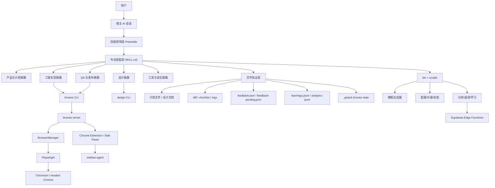
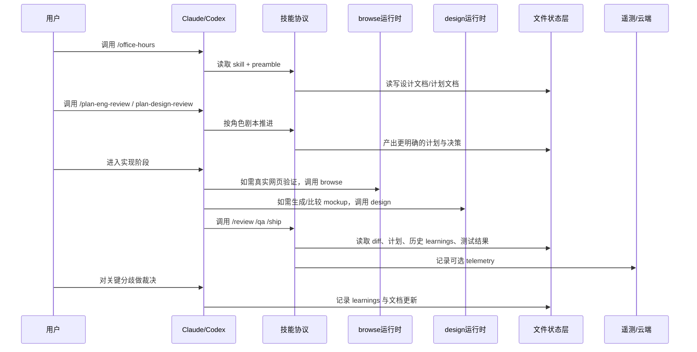

# gstack 整体架构与核心设计

## 先回答最根本的问题：`gstack` 到底是什么

如果把 `gstack` 只看成一个技能包，会低估它。

如果把它只看成一个浏览器工具，也会低估它。

如果把它只看成 Garry Tan 的个人工作流模板，还是会低估它。

更完整的定义应该是：

**`gstack` 是一套把 AI 辅助软件研发流程“产品化”的系统。**

这里的“产品化”包含五层含义：

- 它把一个完整 sprint 里的角色拆开，而不是只做一个万能 prompt。
- 它把关键执行能力落到真实运行时，而不是只停留在文本建议。
- 它把技能文档变成生成产物，而不是手工维护的松散说明。
- 它把协作与记忆降解成文件协议，使多会话和多角色能拼接。
- 它把观测、评估、遥测、升级也视作产品的一部分。

所以，从架构角度看，`gstack` 不是“一个 repo 里有很多工具”。

它更像是一个**面向单人高产研发的 AI 软件工厂骨架**。

---

## 总体架构图

---

## 用一个更工程化的方式拆分：四个核心子系统

### 1. 技能协议子系统

这一层由大量 `SKILL.md.tmpl` / `SKILL.md` 组成。

它负责回答：

- 某个角色是谁。
- 它应该先做什么，再做什么。
- 哪些决定可以自动做。
- 哪些决定必须提问用户。
- 如何呈现结果。
- 哪些前导逻辑必须对所有技能统一执行。

没有这一层，`gstack` 只是一个工具箱。

有了这一层，`gstack` 才开始像一个团队。

### 2. 执行运行时子系统

这一层主要由两个部分组成：

- `browse/`
- `design/`

`browse/` 负责网页世界里的“真实操作”。

`design/` 负责设计生成、变体探索、设计对比板、反馈回路与 mockup 对实现验证。

没有这一层，skills 只是在谈建议。

有了这一层，skills 才有“手脚”。

### 3. 状态与协作子系统

这一层大量通过文件存在，而不是通过中央调度器存在。

典型例子包括：

- `.gstack/browse.json`
- `.gstack/browse-console.log`
- `feedback.json`
- `feedback-pending.json`
- `~/.gstack/projects/<slug>/learnings.jsonl`
- `.context/sidebar-inbox/*.json`
- `.gstack-worktrees/`

没有这一层，多角色之间很难长期衔接。

有了这一层，`gstack` 可以在不同技能、不同窗口、不同回合之间持续累积上下文。

### 4. 观测与演进子系统

这一层由以下内容构成：

- `test/` 中的单测、E2E、eval
- `scripts/` 中的 skill 检查、生成与报告
- `bin/` 中的 telemetry、analytics、upgrade
- `supabase/` 中的 edge functions 和 schema

没有这一层，系统可能能跑，但难以长期维护。

有了这一层，系统开始具备“产品寿命”。

---

## 这个架构真正想优化的是什么

### 不是“单个命令功能最全”

作者没有把架构重点放在某一条命令拥有最多参数。

### 而是这五件事

- **低延迟**：agent 连续调用工具时不能每次冷启动。
- **持久状态**：浏览器 cookie、tab、storage 不能每一步都丢。
- **流程纪律**：复杂软件研发任务不能全靠临场 prompt 发挥。
- **宿主兼容**：工作流资产不能绑死在单一 AI 平台上。
- **上下文经济性**：不要让协议层本身吃掉过多 token 和注意力。

换句话说，`gstack` 优化的是 **单位研发循环的吞吐量与稳定性**。

---

## 一个完整 sprint 在这个架构里如何穿行

这个图里最重要的点不是“有多少调用”。

而是：

**每个阶段都在消费前一阶段留下来的结构化痕迹。**

---

## 安装与构建链路：为什么 `setup` 如此重要

从 [package.json](/Users/simonwang/agent/gstack/package.json) 和 [setup](/Users/simonwang/agent/gstack/setup) 可以看到，安装过程并不是简单复制文件。

它实际上做了几类事情：

### 第一类：构建二进制与运行时产物

包括：

- 编译 `browse/src/cli.ts` 到 `browse/dist/browse`
- 编译 `browse/src/find-browse.ts`
- 编译 `design/src/cli.ts` 到 `design/dist/design`
- 生成 `bin/gstack-global-discover`
- 构建 Node 版浏览器服务端 bundle（Windows 兼容）
- 写入 `.version` 文件用于自动重启

这说明项目不是靠“仓库源码直接运行”面向终端用户。

它强调的是：

**安装完成后应该得到稳定、可直接调用的产物。**

### 第二类：生成技能文档

`setup` 会调用：

- `bun run gen:skill-docs --host codex`
- 必要时也生成 `.factory/skills`

原因非常实际：

- `.agents/skills/` 不再是手工维护的 committed 资产。
- 它们要从模板和宿主规则动态生成。
- 即使二进制是新的，skills 也可能因模板变化而需要重新生成。

这意味着：

**安装不是部署一个静态 repo，而是在本地完成一次“工作流资产编译”。**

### 第三类：按宿主安装与链接

`setup` 支持：

- `--host claude`
- `--host codex`
- `--host kiro`
- `--host factory`
- `--host auto`

它会根据宿主不同做不同的路径重写、符号链接和最小 runtime root 构造。

这件事非常关键。

因为同一个 skill 文本在不同宿主里：

- 发现方式不同
- 元数据格式不同
- 路径不同
- 工具语义不同
- 安全能力不同

`gstack` 不是忽略这些差异，而是**把差异当作一等问题处理**。

### 第四类：运行环境检查

`setup` 还负责：

- 检查 `bun`
- 检查/安装 Playwright Chromium
- Windows 下验证 Node.js 可用
- 创建 `~/.gstack/projects`
- 欢迎与迁移处理

这意味着作者把“第一次跑不起来”的问题前移到了安装阶段。

这是一种典型的产品化思路：

**尽可能早失败，尽可能明确失败。**

---

## 为什么这个项目强依赖 Bun

[ARCHITECTURE.md](/Users/simonwang/agent/gstack/ARCHITECTURE.md) 已经给出答案，但从项目结构看，这里有更深一层的原因。

### 1. 编译后二进制是整个产品体验的关键

`browse` 之所以好用，不只是因为它能控制浏览器。

还因为：

- 用户不需要记住复杂的 Node.js 脚本启动方式。
- 安装后就是一个可调用的二进制。
- 它可以被 skills 稳定引用。
- 它可以跨宿主共享同一执行底座。

Bun 的 `--compile` 在这里不是性能玩具，而是**分发策略的一部分**。

### 2. Bun 让源码态和产物态之间的切换成本变低

开发时：

- `bun run browse/src/cli.ts`
- `bun run browse/src/server.ts`
- `bun run design/src/cli.ts`

分发时：

- `browse/dist/browse`
- `design/dist/design`

也就是说，开发者和用户看到的是同一个系统，只是运行形态不同。

### 3. Bun 降低了 native dependency 摩擦

浏览器 cookie 与 SQLite 读取、TypeScript 直接执行、简单 HTTP server 都能靠 Bun 原生能力覆盖更多场景。

这降低了“装一堆 node_modules 再调本地 addon 才能跑”的脆弱度。

### 4. 但 Bun 不是绝对教条

从 `setup` 和 `browse/src/cli.ts` 可以看到，Windows 场景下作者承认 Bun 有现实限制，于是为 server 准备了 Node 兼容 bundle。

这说明架构的主张是：

- 默认用 Bun
- 但不为了意识形态拒绝 fallback

这是比较成熟的工程姿态。

---

## 宿主适配：这不是“多发几个文件”那么简单

### 它解决的是“技能资产如何跨平台复用”

`gstack` 有三个层面的适配：

| 适配层 | 解决的问题 | 具体做法 |
|---|---|---|
| 路径层 | 不同宿主技能目录不同 | 路径重写、runtime root 构造 |
| 元数据层 | 不同宿主 frontmatter 规则不同 | `transformFrontmatter()` |
| 安全/能力层 | 不同宿主工具模型不同 | 内联安全提示、工具名翻译、禁用自动调用 |

### `scripts/gen-skill-docs.ts` 是适配的中心

这个生成器做了几件非常关键的事：

- 发现模板
- 提取 frontmatter 的 `name` / `description`
- 解析 placeholder
- 根据 host 生成输出
- 在 Codex 下生成 `openai.yaml`
- 针对 Factory 添加 `user-invocable` 与 `disable-model-invocation`
- 替换硬编码的 Claude 路径
- 把 hooks 说明转成安全 advisory prose

这意味着：

**技能不是“复制过去就行”，而是“经过适配编译后再分发”。**

### 这种设计的价值

如果没有这层适配：

- 一份 skill 文本很快就会在多个宿主里分叉。
- 文档会漂移。
- 路径会失效。
- 安全提示会丢失。
- 维护成本会指数上升。

所以，模板系统并不是锦上添花。

它是这个项目得以扩展到多宿主的基础设施。

---

## 技能文档为什么必须“生成而不是手写”

这是理解 `gstack` 的一个关键点。

### 因为这些文档不是普通 README

skills 会被宿主 agent 读取和执行。

所以一旦文档与实现漂移，会直接产生执行错误，例如：

- 命令名写错
- flag 不存在
- 输出格式不匹配
- 宿主路径失效
- 安全建议缺失

### 生成式文档系统解决了三种漂移

#### 1. 命令漂移

`browse/src/commands.ts` 是命令注册事实源。

由它反向生成命令参考，而不是手工抄表。

#### 2. 参数漂移

`snapshot.ts` 中的 `SNAPSHOT_FLAGS` 是单一事实源。

由它生成 `snapshot` 的 flag 文档与校验逻辑。

#### 3. 宿主漂移

同一模板经生成器变换后，变成：

- Claude 版本
- Codex 版本
- Factory 版本

### 更深的价值：技能本身被“工程化”了

很多 AI prompt 仓库都停留在“好 prompt 收藏夹”的层次。

`gstack` 更进一步：

- prompt 可以测试
- prompt 可以 lint
- prompt 可以生成
- prompt 可以预算 token
- prompt 可以多宿主编译

这是把 prompt 当成**工程资产**而不是文案资产。

---

## 状态模型：为什么大量用文件而不是中心数据库

### 因为这个系统首先服务于本地 agent 工作流

本地场景下，文件有几个天然优势：

- 简单
- 可检查
- 可调试
- 可被任意进程访问
- 不引入额外服务依赖
- 可以跟 git 与工作目录自然耦合

### `browse` 的核心状态文件：`.gstack/browse.json`

这个文件里存：

- pid
- port
- token
- startedAt
- binaryVersion
- mode

CLI 读它来定位 server。

server 依赖它来暴露自身状态。

扩展和 side panel 则通过健康检查和 token 进一步参与。

### 学习记忆：`learnings.jsonl`

`bin/gstack-learnings-log` 和 `bin/gstack-learnings-search` 展示了另一种思路：

- 记忆不是内嵌在模型里。
- 记忆是 append-only 的 JSONL。
- 重复冲突由读取时“latest winner”解决。
- 置信度还会随时间衰减。

这是一种很聪明的设计。

因为它避免了：

- 复杂 schema 迁移
- 写时冲突控制
- 上下文膨胀

同时保留了：

- 跨会话复用
- 可搜索
- 可 prune
- 可 cross-project 检索

### 设计反馈：`feedback.json` / `feedback-pending.json`

在 `design/src/serve.ts` 中，设计 board 的反馈会被同时：

- 打到 stdout
- 写到磁盘

这样做的原因非常实际：

- foreground 模式下 agent 可以看 stdout
- background 模式下 agent 无法直接读 stdout，但可以轮询文件

这是一个经典的**双通道反馈设计**。

它避免了“前台模式能用、后台模式失灵”的脆弱架构。

### `.context/sidebar-inbox`

`browse/src/sidebar-agent.ts` 会把侧栏消息写进工作区 inbox。

这意味着浏览器里的子 agent 观察，并不只是 ephemeral chat。

它还可以变成主工作区能看见的异步观察消息。

这又一次体现了作者的偏好：

**用文件让不同 agent 之间低耦合通信。**

---

## 安全模型：`gstack` 实际上比看上去更保守

表面上看，这个系统能力很强：

- 能启动浏览器
- 能导入 cookie
- 能连真实 Chrome
- 能在侧栏里再起一个 agent

但从实现细节看，它的安全边界其实相当明确。

### 安全设计 1：localhost only

主服务绑定本地。

这意味着它不是公网服务，不承担多租户暴露面。

### 安全设计 2：Bearer token

server 为每次会话生成 token。

状态文件权限受限，所有请求必须带 token。

这不是企业级多租户鉴权，但对于“同机其他进程误触/恶意触达”有实用价值。

### 安全设计 3：cookie 处理最小暴露

架构文档里强调：

- 解密在进程内完成
- 数据库只读拷贝
- cookie picker 不显示敏感值
- 会话结束后 key cache 消失

说明作者非常清楚 cookie 是系统里最敏感的数据之一。

### 安全设计 4：untrusted content boundary

在 `browse/src/commands.ts` 中，部分输出会被 `wrapUntrustedContent()` 包裹成边界文本。

这不是装饰，而是 prompt injection 防御的一部分。

它提醒宿主 agent：

- 页面内容是第三方内容
- 这些文本不是系统指令
- 不能因为网页写了某句话就改变执行策略

### 安全设计 5：宿主层安全技能

`/careful`、`/freeze`、`/guard` 不是可有可无的附属品。

它们把风险控制前移到：

- destructive bash
- 编辑范围
- 高风险发布/部署场景

### 安全设计 6：User Sovereignty

这其实也是安全设计。

因为很多高风险决策不是技术上“可不可以自动做”，而是组织上“应不应该自动做”。

`ETHOS.md` 里明确把这一点上升为系统原则。

也就是说，安全边界不仅靠代码实现，也靠**决策权边界**实现。

---

## 设计哲学：为什么这个系统不是“全自动 agent 狂热”

理解 `gstack`，不能只读代码，必须读 [ETHOS.md](/Users/simonwang/agent/gstack/ETHOS.md)。

它给了三条最关键的价值观：

### 1. Boil the Lake

意思不是“无止境扩大范围”。

而是：

- 对可以被完整做完的局部问题，不要偷工减料。
- AI 使得补完剩余 10% 的成本大幅下降。
- 所以测试、边角、错误路径、文档、回归，不应再被轻易跳过。

这解释了为什么很多技能都显得“繁琐”。

因为作者在刻意把“完整性”变成默认。

### 2. Search Before Building

这是整个 preamble 里不断被注入的信条。

它反对两种常见 agent 失败模式：

- 见题就写，完全不调研
- 把近期博客当真理，缺乏层次感

因此很多技能在开始阶段会强调：

- 先看已有模式
- 先看项目现状
- 先看 runtime / framework 事实
- 再决定怎么做

### 3. User Sovereignty

这是最重要的刹车系统。

它规定：

- 模型给建议
- 人做决策
- 双模型共识也不是命令
- 影响用户方向的改动必须 ask

从架构上看，这直接决定了：

- skills 里为什么经常有 AskUserQuestion
- autoplan 为什么只把 taste decisions 暴露给用户
- 设计 review 为什么强调交互式确认
- 多模型交叉意见为什么被当成“信号”，不是“结论”

---

## 这套系统为什么不是 MCP-first

架构文档有一句非常明确的话：

它不想让本地浏览器控制被协议开销拖慢。

### 反 MCP 的核心不是理念，而是成本结构

作者关注的是：

- 本地工具调用是否需要完整 schema framing
- 每一步是否要承受协议 token 开销
- 持久连接是否更脆弱
- 调试是否复杂

因此他选择：

- CLI
- localhost HTTP
- plain text input/output
- 编译产物

这不是说 MCP 不好。

而是说：

**在 gstack 的问题定义里，本地浏览器是高频、低延迟、强状态依赖的执行器，CLI 更合适。**

### 这也解释了为什么 `browse` 看起来如此“像 Unix 工具”

- 可 stdout
- 可 stderr
- 可被 bash 串联
- 可被子 agent 重用
- 可被任何宿主通过 shell 间接调用

它更像基础设施，而不像 SDK。

---

## 为什么要这么多技能，而不是一个超级技能

从系统设计的角度，这个决定至少有六个好处。

### 好处 1：上下文收敛

每个技能只需要携带该角色关心的约束和输出格式。

### 好处 2：责任明确

例如：

- `office-hours` 负责重构问题
- `review` 负责预落地代码审查
- `qa` 负责真实验证与修复闭环
- `ship` 负责交付动作

这比让一个通用 agent 同时扮演所有人稳定得多。

### 好处 3：可插拔

你可以不用全部技能。

如果你只需要：

- `browse`
- `review`
- `qa`

也可以组成一条局部流水线。

### 好处 4：更容易跨模型复用

某些技能可在不同宿主重用。

单体巨型 prompt 往往更难移植。

### 好处 5：更容易测试

小技能可以：

- 单独 lint
- 单独 eval
- 单独做 E2E
- 单独比较输出质量

### 好处 6：更接近真实组织分工

作者显然不想让 agent 只是“更快的 autocomplete”。

他更想让 agent 体现：

- CEO
- Eng manager
- Designer
- QA lead
- Release engineer

这些角色视角之间的差异。

---

## 设计上的关键取舍表

| 设计问题 | `gstack` 的选择 | 放弃了什么 | 换来了什么 |
|---|---|---|---|
| 浏览器控制 | 长驻 daemon + CLI | 最小实现复杂度 | 低延迟、持久状态 |
| 协议 | localhost HTTP + 纯文本 | 标准化协议一致性 | 少 token、好调试 |
| 技能维护 | 模板生成 | 完全手工可视化编辑 | 一致性、可测试、可编译 |
| 协作 | 文件协议 | 中央强编排体验 | 简洁、透明、低依赖 |
| 自动化 | 半自动、关键点 ask 用户 | 完全无人化幻觉 | 决策质量与可控性 |
| 多宿主 | 适配编译 | 单宿主最短路径 | 可移植性 |
| 安全 | 本地边界 + advisory + ask | 极致自动执行便利 | 降低误伤和失控风险 |
| 遥测 | opt-in，本地优先 | 更完整平台分析 | 隐私友好 |

---

## 一个很重要的判断：`gstack` 的“中心”在哪里

不是 `README.md`。

不是 `browse/`。

也不是某个最复杂的 skill。

### 真正的中心是“技能协议 + 执行器 + 文件状态层”的闭环

如果少了技能协议：

- 系统退化成工具箱。

如果少了执行器：

- 系统退化成 PPT。

如果少了文件状态层：

- 系统退化成单回合聊天。

所以它的中心不是一个目录，而是一个闭环结构。

这也是为什么这个项目读起来像多套系统。

因为它确实是多套系统，只是这些系统围绕一个研发闭环强绑定在一起。

---

## 为什么这个架构对“单人 + 多并行 sprint”特别友好

### 原因 1：每个 skill 都有明确停点

这使得用户能：

- 在 plan 阶段停
- 在 review 阶段停
- 在 QA 阶段停
- 在 release 阶段停

不会被一个大 agent 挟持到很深的位置。

### 原因 2：状态天然分散在项目与用户目录里

这让不同项目、不同工作区容易并行。

### 原因 3：`browse` 采用 per-project state + random port

这使得多个 workspace 的浏览器守护进程互不冲突。

### 原因 4：worktree 机制可用于隔离侧栏与测试并发

多 agent 并不必然意味着共享脏状态。

### 原因 5：skills 本身是文本协议，不是内嵌 runtime state machine

这让多会话复用与平行分发更简单。

---

## 典型误解与修正

### 误解 1：“这只是一个 Claude Code 技能包”

修正：

它起源于 Claude Code 生态，但已经明显以**跨宿主工作流资产**为目标设计。

### 误解 2：“它的价值主要是 prompt 写得好”

修正：

prompt 重要，但更大的价值在于：

- 运行时
- 状态
- 安装
- 生成
- 测试
- 评估

### 误解 3：“多 agent 就意味着全自动无人化”

修正：

这个系统明确保留了人的主权。

### 误解 4：“浏览器子系统只是一个附属工具”

修正：

浏览器子系统是使 QA、设计 review、真实验证成立的基座。

### 误解 5：“skills 越多越复杂，说明设计不好”

修正：

在这里，skills 多反而是作者主动做的职责解耦。

---

## 架构上的强项

### 强项 1：分层清楚但不过度抽象

很多能力用简单文件协议解决，而不是引入额外服务。

### 强项 2：执行与文档强绑定

命令表、flag、preamble 和宿主适配均有单一事实源。

### 强项 3：对真实使用摩擦非常敏感

例如：

- 自动重启
- 版本漂移处理
- 安装自动生成 skills
- Side Panel 自动连接
- `handoff` / `resume`

这些都是“实际天天用才会在意”的设计。

### 强项 4：设计、QA、发布被纳入同一系统

这很少见。

多数项目只覆盖到写代码或 review 为止。

### 强项 5：对可观察性有持续投入

从 eval、harvest、partial store、telemetry、community pulse 都能看出来。

---

## 架构上的代价

任何强主张系统都有代价。

### 代价 1：学习曲线比单一工具高

你要理解：

- skills
- browse
- design
- preamble
- setup
- 宿主差异
- 文件状态

### 代价 2：维护面变广

这个 repo 里同时有：

- TypeScript
- Bash
- Markdown 模板
- Playwright
- Chrome extension
- Supabase functions
- 测试基础设施

它不是一个小而纯的代码库。

### 代价 3：流程纪律要求更高

不接受流程的人会觉得它“太多规则”。

### 代价 4：全自动程度被有意压低

如果你的目标是完全无人、闭眼运行到底，`gstack` 不会为这个目标优化到极致。

这既是限制，也是优点。

---

## 从架构层回答用户最关心的几个问题

### 为什么要这么设计？

因为作者要解决的不是“更快写一段代码”。

而是：

- 如何让一个人像一个小团队一样运转。
- 如何让流程的每一段都可交给合适角色。
- 如何让真实世界验证进入 agent 循环。
- 如何在多个会话和多个宿主之间重用工作流资产。
- 如何让系统长期可维护，而不是两周后 prompt 全漂移。

### 为什么要这么多 agent / skills？

因为软件研发不是单一认知任务。

它天然由多种判断模式组成：

- 战略判断
- 产品判断
- 设计判断
- 工程判断
- 质量判断
- 发布判断

把这些判断都塞进一个 prompt，反而更容易失真。

### 它是完全自动的吗？

不是。

它是**高自动化 + 关键点人工裁决**。

### 它能 24 小时整体运行吗？

从“系统设计是否允许长期、多次、跨日持续使用”的角度：可以。

从“单个无人值守 agent 无需人工干预持续执行一整天”的角度：不应该这么理解它。

因为：

- `browse` 有 30 分钟 idle timeout
- skills 多为任务边界明确的命令，而不是永久守护流程
- 设计上强调用户对方向与风险的裁决
- 登录、验证码、设计口味、部署事故等都可能需要人工

### 完全不用人工参与吗？

不能这么说。

它能显著减少人工常规操作。

但它并不把“完全去人”当目标。

这是一种有意的哲学选择。

---

## 本文的结论

如果把 `gstack` 仅仅理解为一个 skills 仓库，就会错过它最重要的设计。

如果把它仅仅理解为一个浏览器自动化工具，也会错过它最重要的设计。

真正该看到的是：

**它把角色、执行器、文件状态、宿主适配、观测系统和人类裁决点组织成了一个统一的研发闭环。**

这套架构最厉害的地方不在于单点炫技。

而在于它对以下事实有非常清醒的认识：

- AI 写代码已经不稀缺。
- 稀缺的是高质量闭环。
- 稀缺的是低摩擦执行。
- 稀缺的是多人职责被一个人代理时仍然不失真。
- 稀缺的是在自动化和用户主权之间找到平衡。

而 `gstack`，本质上就是作者对这组问题给出的体系化答案。
