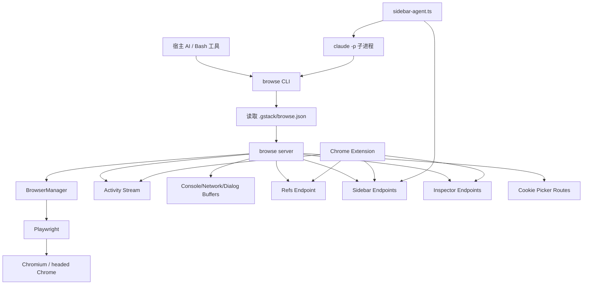

# gstack 的 `browse` 运行时与扩展系统深度解读

## 为什么必须单独讲 `browse`

如果说整个 `gstack` 有一个最像“硬科技底座”的部分，那就是 `browse`。

原因很简单：

- skills 可以改写。
- 角色可以增加。
- prompt 可以演化。
- 但如果没有一个**低延迟、可持续、真实可交互**的浏览器运行时，`qa`、`design-review`、`connect-chrome`、`sidebar agent`、`handoff` 这些能力都只是概念。

也就是说：

**`browse` 不是附属工具，而是让 `gstack` 从“会说”进化到“会做”的最关键执行器。**

---

## 先给出一句话定义

`browse` 是一个由 **CLI 薄客户端 + 本地 HTTP 守护服务 + Playwright/Chromium 执行层 + Chrome 扩展桥 + 侧栏子 agent** 组成的浏览器操作系统。

---

## 子系统结构图

---

## 整体运行模型：为什么是 CLI + daemon

### CLI 是薄客户端，不做重活

从 [browse/src/cli.ts](/Users/simonwang/agent/gstack/browse/src/cli.ts) 可以看出，CLI 的主要职责是：

- 找到 server
- 必要时启动 server
- 做健康检查
- 发送 HTTP 请求
- 把结果打印到 stdout/stderr

它**不直接控制 Playwright**。

这个取舍非常重要。

如果 CLI 每次都直接启动浏览器，会有两个问题：

- 每次调用冷启动太慢
- 会话状态无法跨调用保留

### daemon 才是“真实浏览器大脑”

守护服务负责：

- 启动 Chromium
- 保留 tab/cookies/localStorage
- 路由所有命令
- 管理 refs
- 记录日志
- 为扩展提供接口
- 为 sidebar agent 提供桥接

所以它本质上是 `browse` 的**状态容器**。

### 这个模型解决了什么问题

#### 问题 1：高频调用延迟

AI 浏览器操作通常不是 1 次，而是 10~50 次串联。

如果每次都 `launch browser → do one thing → quit`，整体体验会极差。

daemon 模型使得：

- 首次调用成本高一点
- 后续调用极低成本

#### 问题 2：网页状态连续性

浏览器任务非常依赖：

- 登录态
- 已打开 tab
- SPA 路由状态
- 已填表单
- local/session storage

daemon 把这些都留在内存与 Chromium context 中。

#### 问题 3：agent 连续操作的可组合性

有了 daemon，agent 可以先：

- `goto`
- `snapshot -i`
- `click @e3`
- `wait --networkidle`
- `console --errors`
- `screenshot`

这些动作之间不需要重新建立世界。

---

## 配置模型：每个项目一个 `.gstack/`

[browse/src/config.ts](/Users/simonwang/agent/gstack/browse/src/config.ts) 提供了一个很清晰的配置解析层。

### 解析顺序

1. 如果有 `BROWSE_STATE_FILE`，优先从它反推 stateDir/projectDir。
2. 否则尝试 `git rev-parse --show-toplevel`。
3. 如果不是 git 仓库，则退回当前工作目录。

### 这意味着什么

`browse` 不是一个全局单例浏览器。

它更接近：

- 每个项目一个状态空间
- 每个工作区一个 `.gstack/`
- 每个 workspace 一个独立 daemon

### 为什么这非常重要

如果浏览器状态是全局共享的，会出现：

- 项目 A 登录态污染项目 B
- 端口冲突
- tab 混乱
- 调试日志混杂

而 per-project state 让多 workspace 并行成为可能。

### 自动维护 `.gitignore`

`ensureStateDir()` 甚至会尝试把 `.gstack/` 写入项目 `.gitignore`。

这代表作者很清楚 `.gstack/` 是：

- 项目局部运行状态
- 应该持久于工作区
- 但不应进版本库

这是很细腻的产品设计。

---

## server 发现、锁与自动重启

[browse/src/cli.ts](/Users/simonwang/agent/gstack/browse/src/cli.ts) 里有一整套很“工程化”的 server 生命周期逻辑。

### 1. 读取状态文件，不信 PID，优先健康检查

CLI 会读取 `.gstack/browse.json`，但它不只看 PID。

它进一步调用 `/health` 来确认 server 是否真的活着。

这点非常重要，因为：

- PID 可能残留
- Windows 下进程检测并不稳定
- 活着不等于可响应

所以作者把“健康 HTTP 响应”视为更权威的 liveness signal。

### 2. 启动有锁，避免并发抢占

`acquireServerLock()` 使用 `.lock` 文件避免多个 CLI 同时发现“server 不在”而重复启动。

这说明作者不是只考虑单用户单终端 happy path。

而是在考虑：

- 并行 skill
- 多窗口
- 多 agent 同时触发 browse

### 3. 自动版本漂移重启

CLI 会读取 `browse/dist/.version`，比较当前二进制版本与 server 记录的 `binaryVersion`。

不一致时会自动 kill old server 并重启。

这是一类特别实际的“省心设计”。

否则用户经常会陷入：

- 代码已经更新
- 二进制已重编译
- 但后台服务仍是旧版本
- 行为奇怪又难定位

### 4. 连接丢失自动恢复

`sendCommand()` 若发现 `ECONNREFUSED` / `ECONNRESET` / `fetch failed`，会尝试重启 server 后重发一次。

这给 agent 提供了基本的自恢复能力。

---

## BrowserManager：真正的浏览器会话中心

[browse/src/browser-manager.ts](/Users/simonwang/agent/gstack/browse/src/browser-manager.ts) 是整个 `browse` 最重要的类之一。

### 它管理哪些状态

- `browser`
- `context`
- `pages`（tabId → Page）
- `activeTabId`
- `refMap`
- `lastSnapshot`
- dialog auto accept 策略
- headed/handoff 状态
- watch mode 状态
- frame context
- headers/user-agent 自定义状态

### 这意味着什么

`BrowserManager` 不是一个 Playwright wrapper 那么简单。

它更像是：

**浏览器会话状态机**。

### 为什么这层不可省略

如果没有 `BrowserManager`，server 会变成大量命令处理器直接操作 Playwright 对象：

- 状态散落
- tab 切换逻辑散落
- refs 生命周期散落
- handoff/restore 散落
- headed/headless 切换散落

随着功能增加，系统会迅速失控。

`BrowserManager` 把这些跨命令共享状态集中到一个中心。

---

## refs 系统：这是 `browse` 最聪明的设计之一

### 传统浏览器自动化的痛点

普通 browser automation 往往依赖：

- CSS selector
- XPath
- 手写 data-testid

对 agent 来说，这三种方式都有问题：

- CSS selector 脆弱
- XPath 太重且难读
- data-testid 不是所有页面都有

### `browse` 的方案：基于可访问性树的引用系统

`snapshot.ts` 的主流程是：

1. 读取 `ariaSnapshot()`。
2. 解析树。
3. 为节点分配 `@e1`, `@e2`, ...。
4. 为每个节点构造 Playwright `Locator`。
5. 存入 `refMap`。
6. 之后 `click @e3` 即可转成对应 locator.click()。

### 为什么这比 DOM 注入更好

作者在架构文档里已经明确反对给 DOM 注入 `data-ref`。

原因包括：

- CSP
- hydration 冲突
- Shadow DOM
- 框架重绘剥离属性

用 locator map 的方式：

- 不改 DOM
- 更抗框架变动
- 更贴近用户可访问性语义
- 让 agent 输出更短、更可读

### `@c` refs 的补全意义

除了 ARIA tree，`snapshot -C` 还会扫描：

- `cursor:pointer`
- `onclick`
- `tabindex`

捕获那些**用户可点但无明确 ARIA 语义**的自定义组件。

这说明作者对现代前端的现实问题非常清醒：

很多页面不是 semantic HTML，但用户还是会点它。

### stale refs 检测为何重要

SPA 页面经常：

- URL 不变
- DOM 却已经变了

如果 ref 不做校验，agent 很容易：

- 点击不存在的旧元素
- 等待 Playwright 超时 30 秒
- 无法区分是页面慢还是元素已消失

所以 `resolveRef()` 会先做 `count()` 检查。

这种设计的价值不在于“更优雅”，而在于：

**失败更快、错误更可解释。**

---

## snapshot 系统：不仅是取树，更是多功能观测器

[snapshot.ts](/Users/simonwang/agent/gstack/browse/src/snapshot.ts) 不只是一个 `snapshot -i`。

它实际承载了四种能力：

### 能力 1：结构化元素发现

最基础的能力，就是从页面里给 agent 找出可操作对象。

### 能力 2：差异比较

`-D / --diff` 使用 `BrowserManager.lastSnapshot` 保存上一次快照文本，再返回 unified diff。

这特别适合验证：

- 点击后页面是否变化
- 表单提交后状态是否变化
- 切 tab / modal / 折叠后 UI 是否变化

### 能力 3：带标注截图

`-a / --annotate` 会临时注入 overlay box 与 ref label，再截图，再清理。

这本质上是在生成：

- 人类可读的视觉证据
- agent 与用户共享的“同一视觉坐标系”

### 能力 4：作用域缩小与 frame 感知

- 可以 `-s selector` 局部 snapshot
- 如果当前在 iframe context，会加 header

这让复杂页面不至于一上来就生成超大树。

---

## 命令注册表：为什么 `commands.ts` 是 browse 的“单一事实源”

[browse/src/commands.ts](/Users/simonwang/agent/gstack/browse/src/commands.ts) 有几个重要角色：

### 1. 分类系统

命令被分为：

- `READ_COMMANDS`
- `WRITE_COMMANDS`
- `META_COMMANDS`

这不只是为了好看。

它帮助 server：

- 路由处理器
- 维持心智模型
- 让 docs/test/parser 共享事实源

### 2. `COMMAND_DESCRIPTIONS`

这是文档生成的命令元数据源。

它直接被：

- server
- `gen-skill-docs.ts`
- skill parser
- skill health 检查

共同消费。

### 3. trust boundary 标注

`PAGE_CONTENT_COMMANDS` 与 `wrapUntrustedContent()` 把第三方页面内容和系统文本边界做了显式区分。

这说明作者已经意识到浏览器自动化是 prompt injection 高风险表面。

---

## 日志与缓冲：为什么不用直接同步写盘

[browse/src/buffers.ts](/Users/simonwang/agent/gstack/browse/src/buffers.ts) 和 [browse/src/activity.ts](/Users/simonwang/agent/gstack/browse/src/activity.ts) 体现了一种很好的运行时分层思想。

### 三个环形缓冲区

分别存：

- console
- network
- dialog

容量都是 `50_000`。

### 选择 ring buffer 的原因

- 插入 O(1)
- 内存有上界
- 老数据自动覆盖
- 可以配合 flush cursor 持续写盘

### 为什么命令读取的是内存，不是磁盘

因为：

- 实时命令不应被磁盘 I/O 拖慢
- 磁盘日志主要用于 crash 后取证
- 命令读取应该拿最新内存态

这是一种很典型的“在线路径与离线路径分离”设计。

### activity stream 的额外价值

activity stream 不只是日志，它是**扩展侧栏实时界面**的后端。

它做了：

- ring buffer 保留最近活动
- subscriber 订阅
- SSE 推送
- 敏感参数过滤
- gap 检测（客户端 cursor 太老）

这让侧栏不只是一个静态面板，而像一个真正的 live cockpit。

---

## 扩展系统：为什么要做 Chrome Side Panel

很多浏览器自动化工具停留在“后端执行 + stdout 输出”。

`gstack` 多做了一层：`extension/`。

### 这层解决的问题

- 用户想看 agent 正在做什么。
- 用户想从浏览器里直接和 agent 交互。
- 用户想在真实页面上 inspect / style / cleanup / prettyscreenshot。
- 用户需要共驾感，而不是把一切都藏在终端后面。

### `background.js` 的职责

[extension/background.js](/Users/simonwang/agent/gstack/extension/background.js) 负责：

- 轮询 `/health`
- 维护连接徽章状态
- 代理 command 到 browse server
- 把 sidebar message POST 到 `/sidebar-command`
- 转发 inspector 选择结果
- 监听 tab 激活切换并通知 sidepanel

它本质上是：

**扩展世界与本地 server 的桥接层。**

### `sidepanel.js` 的职责

虽然我们没有逐行展开，但从搜索结果可知它负责：

- 轮询 `/sidebar-chat`
- 维护 per-tab chat context
- 切换 tab 的侧栏上下文
- 停止 agent
- 拉取 tab 列表
- 清空 chat
- 发起 inspect 与 sidebar command

这意味着侧栏不是单一全局聊天框，而是**与浏览器 tab 对齐的多上下文界面**。

### 为什么这是非常重要的体验设计

浏览器里的任务天然是 tab-scoped 的。

如果侧栏上下文不跟 tab 绑定，会导致：

- A 页的 agent 输出混到 B 页
- 用户切 tab 后不知道当前命令作用在哪
- 多页并行任务难以管理

而 `gstack` 显式做了 per-tab context。

这很像 IDE 中每个 buffer 的局部状态，而不是全局唯一聊天框。

---

## headed 模式与 `connect`：为什么它不是简单的“打开可见浏览器”

### 普通 headless browser 的问题

headless 很适合自动化，但有几个局限：

- 用户看不到 agent 做了什么
- 某些站点行为与真实 Chrome 不完全一致
- 登录 / MFA / CAPTCHA 场景需要人接管
- 设计评审缺少共视图

### `connect` 的设计目标

在 `browse/src/cli.ts` 和 `browser-manager.ts` 里，`connect` 会：

- 用 headed 模式重启 server
- 使用固定端口 `34567`
- 自动加载扩展
- 启动 sidebar-agent
- 让用户和 agent 共用同一真实浏览器窗口

### 这比“只是显示浏览器”多了什么

- 有明确的 mode 切换语义
- 有 extension auto-load
- 有 auth token bootstrap 给扩展
- 有 side panel 协作
- 有 headed server 不能静默替换的保护

这个保护尤其好：

如果 headed server 不健康，CLI 不会偷偷改成 headless，而是要求用户显式处理。

这是对“用户感知一致性”的保护。

### 视觉指示器为什么值得专门做

`launchHeaded()` 里会注入顶部渐变线，扩展还会显示 `gstack` pill。

这看起来像小细节，实则是 trust design：

- 用户知道哪个窗口被 agent 控制
- 不会和自己的普通浏览器搞混
- 共驾时认知负担更低

---

## handoff / resume：这比“人工接管”更高级

`handoff()` / `resume()` 是一个特别值得单独称赞的设计。

### 普通方案

很多 agent 工具遇到验证码、MFA 时只能说：

- “我卡住了，请你手动处理。”

问题在于，这通常意味着：

- 状态断裂
- 用户得自己重新定位页面
- agent 恢复时没有同一上下文

### `gstack` 的方案

`handoff()` 会：

1. 保存当前 headless 状态。
2. 启动新的 headed browser。
3. 恢复 cookies、pages、storage。
4. 关闭旧 headless browser。

然后用户处理问题，之后 `resume()`：

- 清空 stale refs
- 重置失败计数
- 重新回到 agent 控制节奏

### 这件事说明作者理解的不是“自动化”而是“协作连续性”

重点不是谁在控制浏览器。

重点是：

**控制权切换时，世界模型不能碎。**

这就是 handoff 的真正价值。

---

## sidebar-agent：浏览器里再起一个 Claude 子进程意味着什么

[browse/src/sidebar-agent.ts](/Users/simonwang/agent/gstack/browse/src/sidebar-agent.ts) 是 `gstack` 多 agent 结构的一个小缩影。

### 它是如何工作的

1. server 或扩展把消息写入 JSONL 队列。
2. `sidebar-agent.ts` 轮询该队列。
3. 按 tabId 并发处理，不同 tab 可同时运行。
4. 对每条消息启动 `claude -p` 子进程。
5. 子进程获得：
   - prompt
   - cwd
   - `BROWSE_STATE_FILE`
   - `BROWSE_TAB`
6. 子进程通过 Bash 调用 `$B` 完成浏览器操作。
7. 事件流回 `/sidebar-agent/event`，由 server 再转给侧栏 UI。

### 这说明什么

sidebar agent 不是 server 内部直接嵌套 LLM 调用。

它是：

**文件队列 + 独立 Claude 子进程 + HTTP 事件回传**。

这种设计非常符合整个项目的风格：

- 低耦合
- 易调试
- 易隔离
- 可按 tab 并发

### 每 tab 独立处理为什么关键

浏览器中的真实任务天然以 tab 为单位：

- 不同页面
- 不同会话
- 不同目标

`processingTabs` 集合确保每个 tab 有自己的运行状态，不互相踩。

同时通过 `BROWSE_TAB` 环境变量把 `$B` 命令固定到对应 tab 上。

这避免了多 agent 同时操作浏览器时最容易发生的灾难：

- A agent 切走了 B agent 的页面
- 输出和实际操作错位

### 它为什么允许 `Write`

代码中的默认 `allowedTools` 包含 `Write`，而注释提到这并没有突破真实安全边界，因为 Bash 早已提供更强写能力。

这说明作者在安全问题上不是表面主义。

他关心的是**真实攻击面**，而不是名义上减少几个工具名。

---

## server 暴露了哪些接口，说明了什么

通过对 [browse/src/server.ts](/Users/simonwang/agent/gstack/browse/src/server.ts) 的路由抽取，可以看到主要接口包括：

- `/health`
- `/refs`
- `/activity/stream`
- `/activity/history`
- `/sidebar-tabs`
- `/sidebar-tabs/switch`
- `/sidebar-chat`
- `/sidebar-command`
- `/sidebar-chat/clear`
- `/sidebar-agent/kill`
- `/sidebar-agent/stop`
- `/sidebar-session`
- `/sidebar-session/new`
- `/sidebar-session/list`
- `/sidebar-agent/event`
- `/inspector/pick`
- `/inspector`
- `/inspector/apply`
- `/inspector/reset`
- `/inspector/history`
- `/inspector/events`
- `/command`
- `/cookie-picker/*`

### 这说明 browse server 不是一个单纯命令执行器

它已经是一个本地 control plane。

它同时承担：

- 命令 API
- 状态 API
- 实时流 API
- 扩展桥 API
- inspector API
- cookie picker API
- sidebar session API

也就是说，`browse` 的后端已经从“执行引擎”扩张成了**本地浏览器控制平台**。

---

## Cookie picker 与真实浏览器 cookie 导入

虽然这里没有全文拆 `cookie-import-browser.ts`，但从文档与路由上可以得出几个关键判断。

### 为什么需要它

QA 最大的现实阻碍之一就是认证态。

如果每次都让 agent 重新登录：

- 慢
- 容易卡在 MFA/CAPTCHA
- 流程不稳定

### `gstack` 的解法

- 直接从用户真实浏览器读取 cookie 数据库
- 解密后导入 Playwright context
- 提供 HTTP picker UI 让用户选域名和 profile

### 为什么这是一种“高价值但高敏感”的能力

高价值在于：

- 让 staging/prod authenticated QA 变得现实

高敏感在于：

- 涉及浏览器凭证

而项目在这方面做的防御是：

- 仅本地
- 只读数据库
- keychain 用户授权
- 明文不落盘

---

## inspect / style / cleanup / prettyscreenshot：为什么说 `browse` 不只是测试工具

扩展与命令表表明，`browse` 正在逐渐变成“页面现场调试与视觉处理工具”。

### `inspect`

它提供更深的 CSS / rule cascade / box model 检查。

### `style`

让用户可以在页面现场修改某元素样式，并带 undo 历史。

### `cleanup`

移除广告、cookie banner、sticky 元素、social widgets。

### `prettyscreenshot`

不是普通截图，而是适合生成“干净视觉稿”的截图工具。

### 这说明什么

作者并不把 browse 限定在“测试自动化”这个狭义场景。

他正在把它扩展成：

- QA cockpit
- design review aid
- page cleanup tool
- live CSS debugging assistant

这和 `connect-chrome`、design 工作流其实是一致的。

---

## 为什么 `browse` 特别适合 agent，而不是只适合人类脚本

### 1. 命令面是小而平的

命令多，但语义都很直接：

- `goto`
- `snapshot`
- `click`
- `fill`
- `console`
- `network`
- `screenshot`

这比直接暴露 Playwright API 更适合语言模型。

### 2. 错误消息是为 agent 设计的

架构文档强调错误必须可行动。

例如 stale ref 会明确提示重新 `snapshot`。

### 3. 输出强调 plain text

对 agent 来说，干净文本比冗长 JSON schema 更友好。

### 4. refs 系统显著降低选择器生成难度

这是 agent ergonomics 的核心。

### 5. 支持逐步验证

`snapshot -D`、`console --errors`、`network`、`perf` 让 agent 能在每一步自检，而不是盲点操作。

---

## 运行时设计中的几个高明细节

### 细节 1：Windows 特殊处理不是补丁，而是架构分支

CLI 会在 Windows 上走 Node server bundle。

这不是在代码末尾 if 一下，而是系统性地承认平台差异。

### 细节 2：old headed server 不会被静默替换

这保护用户对“我正在看的可见浏览器”的信任。

### 细节 3：队列轮询间隔 200ms

这说明作者关注 first-token latency。

### 细节 4：tool use 描述转成人话

`sidebar-agent.ts` 会把 tool call 归纳成用户更易读的话。

这说明侧栏不是给程序员调试，而是给人在共驾时理解 agent 行为。

### 细节 5：tab 激活事件即时推送

不是全靠侧栏轮询。

这又一次说明作者在努力减少“交互感觉上的迟钝”。

---

## 这个运行时的局限与边界

再强的系统也有边界。

### 边界 1：它仍然是单用户本地控制面

不是多租户浏览器服务。

### 边界 2：某些平台能力不完全统一

例如 cookie 解密支持、Windows fallback 等。

### 边界 3：iframe 不是全自动探索

文档说明 frame 需要显式进入语境。

### 边界 4：长时无人守护并非核心目标

虽然可以长期反复使用，但设计上更偏向任务式交互而不是永远不落地的 autonomous loop。

### 边界 5：安全最终仍取决于宿主与用户习惯

尽管有信任边界和 advisory，但浏览器访问第三方内容时，prompt injection 风险永远不能完全归零。

---

## 对整个项目的意义：为什么说 `browse` 是最不可替代的底层

如果去掉很多 skill，`gstack` 仍然有相当价值。

但如果去掉 `browse`，你会失去：

- 真实 QA
- 页面级验证
- headed 共驾
- side panel 协作
- handoff/resume
- 视觉与交互证据
- design board 的现实操作基础

而这些恰恰是很多 AI coding workflow 里最缺的部分。

所以：

**`browse` 不是 gstack 的配件，而是它最有产品壁垒的部分之一。**

---

## 本文结论

`browse` 子系统之所以重要，不在于它有多少命令。

而在于它同时完成了五件很少有人一起做好的事情：

- 为 agent 提供了低延迟、持久状态的真实浏览器。
- 为 agent 提供了比 selector 更稳定的 refs 交互模型。
- 为用户提供了 headed 共驾、side panel、inspect、cleanup 等可见化协作界面。
- 为多 agent 协作提供了 per-tab 隔离、队列、事件流与文件协议。
- 为长期使用提供了日志、状态恢复、自动重启与平台适配。

如果把 `gstack` 比作一个软件工厂，skills 是岗位说明书，流程是作业线，那么 `browse` 就是生产线上的**机器人手臂和传送带控制系统**。

没有它，其他很多环节依然能讨论。

但没有它，这个系统很难真正进入“可持续执行”的层次。
