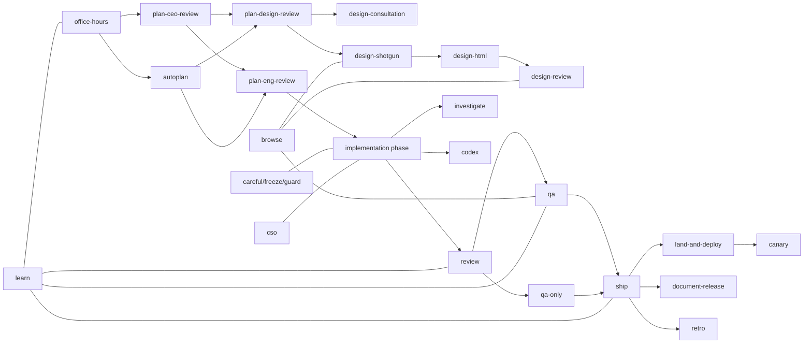

# gstack 的 skills 体系与多 agent 协作机制深度解读

## 先回答一个最直接的问题：为什么会有这么多 skills

很多人第一次看到 `gstack` 的目录，第一反应是：

- 太多技能了。
- 太多角色了。
- 一个大 agent 不行吗？

这个问题很合理。

但如果你先把“软件研发”看成一个单一任务，才会觉得技能多余。

如果你把它看成一个由多种认知模式构成的连续流程，你会发现这些 skills 其实是在模拟团队分工。

### 软件研发至少包含这些不同判断模式

- **问题定义**：你真的在解决正确的问题吗？
- **范围判断**：要扩还是收？什么是 10 分版本？
- **工程结构**：状态、边界、数据流、失败模式是什么？
- **设计质量**：这是不是 AI slop？交互、品牌、层级是否成立？
- **实现质量**：diff 里哪些 bug 生产上会炸？
- **真实验证**：在浏览器里它真的工作了吗？
- **发布责任**：测试是否可信？PR 是否可发？文档是否同步？
- **安全视角**：这会不会是漏洞？
- **反思学习**：以后如何做得更好？

一个单 agent 可以勉强覆盖所有这些视角，但通常会出现两个问题：

- 上下文太杂，判断失焦。
- 输出风格漂移，步骤不稳定。

所以 `gstack` 选择的不是“一个万能人格”，而是：

**把不同判断模式拆成不同角色协议。**

---

## 核心结论

`gstack` 里的 skills，不是“命令集合”，而是**角色化的工作协议**。

每个 skill 都规定了：

- 角色身份
- 进入条件
- 读取哪些上下文
- 必须遵循的步骤顺序
- 自动决策的范围
- 升级给用户的边界
- 输出格式
- 与下游技能的衔接方式

因此，skills 不是附加层，而是整个系统的编排语言。

---

## 技能体系总图

这个图不是说一定每次都要走完整条链。

而是说明：

**作者把这些 skills 设计成了一条能彼此消费上下游产物的流水线。**

---

## 技能分层：从角色设计看整个系统

### 第一层：问题定义与计划层

代表技能：

- `office-hours`
- `plan-ceo-review`
- `plan-eng-review`
- `plan-design-review`
- `autoplan`

这层的职责不是写代码，而是**防止错误问题被高效实现**。

#### 为什么这层如此重要

AI 极大提升了实现速度。

但实现速度越高，越容易把错误方向迅速放大。

所以 `gstack` 把：

- 问题重构
- 范围判断
- 工程约束
- 设计质量

前移到代码之前。

这其实是对“agent 容易直接冲进实现”的一种反制。

### 第二层：设计链路

代表技能：

- `design-consultation`
- `design-shotgun`
- `design-html`
- `design-review`

这层的特别之处在于，它不是把设计当作“最后修修 UI”。

它把设计当成：

- 需求澄清工具
- 方案探索工具
- 实现约束工具
- 用户偏好记忆工具

这是很少见的。

### 第三层：实现与审查层

代表技能：

- `review`
- `investigate`
- `codex`
- 有时也包括 `cso`

这层强调的是：

- diff 视角
- 失败归因
- 二次独立意见
- 系统性问题发现

它不是“继续写代码”，而是把实现阶段产生的风险显式化。

### 第四层：真实验证与交付层

代表技能：

- `browse`
- `qa`
- `qa-only`
- `ship`
- `land-and-deploy`
- `canary`
- `benchmark`
- `document-release`
- `retro`

这层是很多 AI 编程系统缺失最严重的部分。

而 `gstack` 正好在这里投入很深。

---

## 根技能与 Preamble：为什么所有技能看起来都有相似的“前戏”

根技能 [SKILL.md](/Users/simonwang/agent/gstack/SKILL.md) 和生成器定义了一个统一 preamble。

### 这个 preamble 做什么

- 更新检查
- 会话计数
- ELI16 / 多窗口上下文提示
- contributor mode
- learnings count
- Search Before Building
- AskUserQuestion 格式统一
- 遥测逻辑

### 这看起来琐碎，但其实是编排系统最重要的“公共 runtime”

如果没有 preamble，每个 skill 都会：

- 自己决定是否升级检查
- 自己决定是否要询问用户
- 自己决定是否考虑并发 session
- 自己决定是否加载 learnings
- 自己决定输出风格

结果就是系统风格迅速失控。

所以 preamble 的作用是：

**让所有技能都站在同一个组织文化和运行环境上。**

---

## 为什么 `office-hours` 是真正的入口技能

从 `office-hours/SKILL.md.tmpl` 提取到的结构可以看出，它并不是“收集需求”。

它分为多个阶段：

- Context Gathering
- Startup Mode / Builder Mode
- Related Design Discovery
- Landscape Awareness
- Premise Challenge
- Alternatives Generation
- Founder Signal Synthesis
- Design Doc 产出

### 这说明它解决的不是“把需求写清楚”

而是：

- 重新定义问题
- 发现你没意识到自己在做什么
- 挑战错误前提
- 强制提出多个实现方向
- 最后写出下游可消费的设计文档

### 它为什么重要

因为后续 skills 大多依赖一个前提：

**计划文件是真的值得推进的。**

`office-hours` 就是在尽量提高这个前提成立的概率。

### 为什么它不是全自动脑暴

它设计了大量“pushback”与“forcing questions”。

这说明作者认为最有价值的部分不是 agent 说更多，而是 agent **逼用户把模糊性显性化**。

---

## `autoplan`：自动化不等于跳过判断

`autoplan` 可能是整个项目里最能体现“自动化边界”的技能之一。

### 从结构上看，它做了什么

根据模板骨架，它大致分为：

- 6 Decision Principles
- Decision Classification
- Sequential Execution
- Auto-Decide 的定义
- Restore Point
- CEO Review
- Design Review（有条件）
- Eng Review + Dual Voices
- Decision Audit Trail

### 关键点 1：顺序执行是强约束，不是建议

这说明作者不希望多阶段 review 彼此污染顺序。

### 关键点 2：自动化的是“已编码原则”，不是所有决定

`autoplan` 的思想不是：

- 让 agent 自己想怎么改就怎么改

而是：

- 依据预先定义的决策原则自动推进明显问题
- 仅把 taste decisions、边界 scope、模型分歧暴露给用户

这是一种非常成熟的自动化观：

**自动化不是尽可能多做，而是把低争议、高可编码的决策自动做掉。**

### 关键点 3：Restore Point

它会记录 restore point，说明作者默认 plan 自动修改是可逆操作。

这非常重要。

因为 plan 阶段的自动改写一旦走偏，影响后续所有技能。

因此需要：

- 可回溯
- 可比较
- 可重跑

### 关键点 4：Dual Voices

`autoplan` 明确要求：

- Claude subagent
- Codex

在某些阶段提供双重声音。

这说明它不是只追求单模型连贯性，而是希望通过**认知异质性**减少盲点。

---

## `review`：为什么它不是普通 PR review

`review/SKILL.md` 的章节骨架显示它包含：

- branch check
- scope drift detection
- plan file discovery
- actionable item extraction
- diff cross-reference
- checklist
- Greptile comments
- prior learnings
- two-pass review
- confidence calibration
- design review（conditional）
- test coverage diagram
- regression rule
- fix-first review

### 这说明它关注的不只是代码正确性

它同时关注：

- 当前改动是否偏离已批准计划
- 当前改动是否遗漏计划项
- 是否存在设计层问题
- 测试是否覆盖到真正变化
- 能否先自动修掉明显问题

### 这实际上是“交付前集成评审”

不是传统意义上的：

- 看看有没有 bug
- 留几个 review comment

它更像一个 release-facing 审查者。

### `fix-first` 的设计意义

很多 review agent 只会指出问题。

`gstack` 的 `review` 则在一些问题上会倾向先修再报告。

这意味着作者在追求：

- 减少 review 往返
- 把低争议问题直接处理掉
- 把用户注意力留给真正需要裁决的问题

---

## `qa`：这是一个“测试 → 修复 → 验证”闭环技能

从骨架上看，`qa` 至少包含这些部分：

- Setup
- browse setup check
- Test Framework Bootstrap
- CI/CD pipeline
- Create TESTING.md
- Test Plan Context
- 多种 mode
- Workflow phases

### 这说明 `qa` 不只是“去网页上点一圈”

它的完整目标是：

1. 用真实浏览器验证。
2. 发现 bug。
3. 修 bug。
4. 生成回归测试。
5. 再验证一次。

### 为什么这非常关键

很多 AI QA 流程停在第 1 步或第 2 步：

- 发现问题
- 写报告

但如果没有回归测试与再验证，这些问题只是短期发现，不是长期质量资产。

### bootstrap test framework 的意义

如果项目根本没有测试基础设施，`qa` 与 `ship` 都提供 bootstrap 流程。

这件事非常有 `gstack` 风格：

- 不因为你没有现成测试体系就跳过质量闭环
- 而是把“建立质量闭环”本身纳入 skill 的职责

这就是 `Boil the Lake` 在工程实践里的体现。

---

## `ship`：它其实是在替用户承担 release engineer 的职责

`ship/SKILL.md` 的骨架中包含：

- Review Readiness Dashboard
- Distribution Pipeline Check
- merge base branch
- test framework bootstrap
- test failure ownership triage
- eval suites
- 以及更多后续步骤

### 它在做什么

它并不是单纯：

- 跑 tests
- push branch
- 开 PR

它在做的是：

- 判断当前状态是否值得 ship
- 识别失败是本分支问题还是历史债务
- 决定哪些失败必须修、哪些可记录
- 确保文档与测试一起进入交付面

### 为什么它要在 `review` 和 `qa` 之后存在

因为 release engineer 的思维和 reviewer / QA 不同：

- reviewer 关心实现是否有风险
- QA 关心系统是否真的可用
- ship 关心“在现有证据下，这个版本是否应被推进到协作/交付系统”

### 这就是角色分化的意义

不是为了名字好看。

而是因为同一个 diff，在不同阶段应被不同评价函数审视。

---

## 多 agent 究竟体现在哪里

很多人一听“多 agent”，会以为一定有一个中心 orchestrator 调度十几个智能体。

`gstack` 不是这样。

它的多 agent 更偏向下面几种形式。

### 形式 1：多角色技能顺序串联

最常见的是：

- `/office-hours`
- `/plan-ceo-review`
- `/plan-eng-review`
- `/review`
- `/qa`
- `/ship`

这里的“多 agent”不一定是多个并发进程，而是多个**角色化协议**按阶段接力。

### 形式 2：子 agent / subagent

某些技能显式调用 Claude subagent，例如：

- `autoplan`
- `plan-design-review`

这是一种真正的“一个 skill 内部再起一个独立声音”的做法。

### 形式 3：跨模型第二意见

`/codex` 以及 `autoplan` / `plan-design-review` 中的 Codex 调用，代表另一种多 agent：

- 主模型：Claude
- 次模型：Codex

它们不是主从，而是**相互校验**。

### 形式 4：浏览器侧栏子 agent

`sidebar-agent.ts` 让浏览器里的 side panel 可以起一个独立 Claude 子进程。

它和主工作区会话不是同一个 agent。

### 形式 5：多工作区并发

结合 Conductor 或 worktree 隔离，可以同时跑多个会话，每个会话在自己的 repo/worktree 里工作。

这是一种更高层的多 agent：

- 每个 workspace 一个独立 sprint
- 通过 git、PR、文件状态、用户大脑进行汇合

---

## 多 agent 为什么不是“同时越多越好”

这是个特别容易被误解的点。

### `gstack` 并没有无脑追求最大并发

从架构和 skills 可以看出，它在两个地方很克制：

- **顺序很重要的任务**，强制顺序执行。
- **需要用户口味裁决的任务**，不会自动并发决策到底。

### 原因很简单

并发只适合：

- 互不依赖的探索
- 独立意见收集
- 多 workspace 并行 feature

并发不适合：

- 上一阶段输出是下一阶段输入的 pipeline
- 强依赖共享状态的改写
- 需要统一 taste 的设计决策

### 这说明作者对 agent orchestration 的认知比较成熟

不是“能并发就并发”。

而是：

**并发是吞吐优化，不是认知优化本身。**

---

## agent 之间如何通信和协调

这是你问题里最关键的一项，我分几个层次来说。

## 第一种协调：通过文件产物协调

这是最核心的一种。

### 常见文件载体

- 计划文件
- `DESIGN.md`
- diff
- review checklist
- `feedback.json`
- `feedback-pending.json`
- `learnings.jsonl`
- `.context/sidebar-inbox`

### 这种方式的特点

- 简单
- 可见
- 可 debug
- 不依赖中心编排器
- 可以被任意技能消费

### 举例

- `office-hours` 产出设计文档，下游计划技能读取它。
- `design` 看板把用户反馈写成文件，agent 轮询读取它。
- `learn` 技能读取长期 learnings 为后续评审提供经验。

## 第二种协调：通过宿主上下文协调

skills 共享同一宿主会话中的：

- 当前 git 分支
- 当前 diff
- 当前工作目录
- 近期文件
- 当前用户意图

这种协调更轻，但也更 ephemeral。

## 第三种协调：通过运行时状态协调

`browse` 运行时提供共享状态，例如：

- 当前 tab
- 当前登录态
- refs
- headed / headless 模式

侧栏 agent 与主会话都可以在同一浏览器世界中工作，但通过 `BROWSE_TAB` 等方式隔离具体 tab。

## 第四种协调：通过事件流协调

扩展和 sidebar agent 使用：

- JSONL 队列
- HTTP POST
- SSE / polling

来传递：

- 用户输入
- agent 开始/结束
- tool use 摘要
- 文本输出
- inspect 结果

## 第五种协调：通过用户协调

这很重要。

在 `gstack` 里，用户不是外部旁观者，而是**系统的一部分**：

- 负责 taste decisions
- 负责方向纠偏
- 负责在模型分歧时裁决
- 负责验证码/MFA 等人工步骤
- 负责接受或拒绝重大修改建议

因此，用户本身也是“协调机制”的一环。

---

## 为什么设计上保留这么多 AskUserQuestion

很多人可能会说：

- 有双模型了
- 有 history 了
- 有计划了
- 为什么还要问我？

答案就在 `ETHOS.md` 的 **User Sovereignty**。

### 哪些问题必须 ask

通常是：

- 范围增减
- 风格/口味选择
- 用户已表达方向可能被推翻
- 高风险 destructive 操作
- 多模型存在有意义分歧

### 为什么不能自动决定

因为这些问题不是事实判断，而是：

- 价值判断
- 商业判断
- 时机判断
- 品牌判断

即使两个模型都一致，也不能替代用户。

### 这其实是让系统更强，不是更弱

因为完全自动最常见的失败模式就是：

- 技术上看似合理
- 业务上完全跑偏

`gstack` 明显是在避免这个坑。

---

## 跨模型机制：为什么作者愿意引入 Codex

许多系统为了流畅性，会避免跨模型协作。

`gstack` 则在一些关键环节有意识地引入 Codex。

### 原因 1：独立盲点

不同模型：

- 训练分布不同
- 风格不同
- 偏差不同
- 检查角度不同

### 原因 2：策略 / 设计类问题特别受模型偏见影响

例如：

- 范围判断
- 设计 critique
- 完整性判断

这些不是纯粹可编译问题。

多模型交叉有额外价值。

### 原因 3：交叉意见不是让系统替用户决策，而是提升信号密度

特别注意：

`gstack` 并没有把多模型共识当作自动执行许可。

它把它当作：

- 更强的建议
- 更明确的风险信号
- 更值得用户关注的分歧焦点

### 这是一种很成熟的 second-opinion 设计

不是为了“炫多模型”，而是为了：

**在高不确定性阶段引入认知多样性。**

---

## 设计看板反馈回路：这是一个典型的人机协作范式

`design/src/serve.ts` 和 `design/src/compare.ts` 展示了一个很好的闭环：

1. agent 生成多个设计变体。
2. compare board 在浏览器里展示。
3. 用户：
   - 选偏好项
   - 打星
   - 写评论
   - 请求更多类似方向
4. board 把反馈：
   - 输出到 stdout
   - 写到 `feedback.json` 或 `feedback-pending.json`
5. agent 轮询反馈文件。
6. 如果是 regenerate，就生成新 board 并调用 `/api/reload`。
7. 如果是 submit，就收束流程。

### 为什么这个模式很优秀

因为它没有试图让用户去写抽象 prompt。

它让用户在**可见选项空间里做选择**。

这对设计类任务尤其重要。

### 这也是多 agent 协作的一种形式

这里的“参与者”包括：

- 设计生成 agent
- 浏览器 board
- 用户
- 轮询反馈的主 agent

协调方式不是中心调度，而是**共享文件 + HTTP reload + 用户操作**。

---

## side panel agent：它和主会话是什么关系

### 不是替代关系

它不是“主 Claude 会话的前端 UI”。

它更像一个**局部浏览器工作代理**。

### 它适合什么

- 局部浏览器任务
- 快速观察
- 抓取列表
- 做一次 form flow
- 帮主会话收集现场信息

### 它不适合什么

- 大范围重构
- 复杂代码编辑编排
- 全局项目架构变更

### 所以它和主会话的最佳关系是

- 主会话：负责总体项目策略与代码主线
- 侧栏 agent：负责浏览器现场执行与局部观察

这就是一种很自然的“前台 scout + 后台主控”分工。

---

## 这套系统是完全自动的吗

### 短答案

**不是。**

### 更准确的说法

它是：

**高自动化、强流程化、关键点人类裁决的半自动软件工厂。**

### 自动化到什么程度

它可以自动完成大量事情：

- 计划审查
- 风险识别
- 设计生成
- diff 评审
- 浏览器 QA
- 回归测试生成
- PR 打开
- 遥测记录
- learnings 累积

### 哪里还需要人工

- 需求方向
- 设计口味
- 模型分歧裁决
- 登录/MFA/CAPTCHA
- 高风险 destructive 操作
- 发布与业务后果承担

### 为什么不追求完全自动

因为项目的哲学不是“把人拿掉”，而是“让人把注意力留在真正重要的决策上”。

---

## 能不能 24 小时整体运行

这个问题要分两层理解。

### 从系统可持续使用角度：可以

`gstack` 完全支持：

- 每天长期使用
- 多项目切换
- 多工作区并行
- 持续积累 learnings
- 长期保留本地 analytics
- 持续升级

### 从单个无人值守 agent 无限运行角度：不建议这样理解

原因有几个：

#### 1. 很多 skills 是任务型，不是 daemon 型

它们是：

- 做完一个 review
- 做完一次 QA
- 做完一次 ship

而不是永远循环运行。

#### 2. `browse` 有 idle timeout

这是合理的资源管理设计。

#### 3. 用户主权要求在关键节点有人

完全无人意味着 taste 与风险决策会被跳过或假定。

#### 4. 外部世界本身不可全自动

- 登录验证
- 环境故障
- 部署异常
- 真实用户反馈

这些都可能需要人工判断。

### 更合理的描述

`gstack` 适合 **24x7 地成为你的工作系统**，但不等于 **24x7 无人值守地替你做所有决策**。

---

## 为什么这种“半自动 + 角色化 + 文件协议”的设计反而更实用

### 原因 1：更容易 debug

因为每一环：

- 产物可见
- 状态可见
- 文件可见
- 路由可见

### 原因 2：更容易插手

用户可以在：

- 计划文档
- 设计看板
- diff 审查
- QA 阶段

随时插入自己的判断。

### 原因 3：更容易迁移与拆分

你可以只用其中几条链路，而不用整个系统。

### 原因 4：更适合真实世界的不确定性

真实研发环境不稳定。

一个极其中心化、极其自动的系统一旦某点出错，通常很难局部恢复。

而 `gstack` 的模块化与文件协议让局部恢复容易得多。

---

## 多 agent 设计的优点与成本

## 优点

### 1. 认知分工清楚

每个角色有自己的评价函数。

### 2. 更容易暴露关键分歧

特别是在多模型场景下。

### 3. 可按需使用

并不是每次都要全链路。

### 4. 更接近真实组织流程

用户更容易理解每一步为什么存在。

### 5. 有利于并发 sprint

不同 workspace 可以运行不同阶段的不同技能。

## 成本

### 1. 体系复杂度高于“一个 prompt 走到底”

### 2. 用户需要理解每个技能大概适用场景

### 3. 有些产出依赖前一阶段文件质量

### 4. 自动化边界需要用户认知配合

这些成本是真实存在的。

但作者显然认为，它们换来的质量提升更值得。

---

## 一个更本质的理解：这些 skills 其实在重新定义“manager”这个词

在传统团队里：

- manager 是人
- designer 是人
- reviewer 是人
- QA 是人

在 `gstack` 里，这些角色首先变成了：

- 一套显式的判断协议
- 一组强约束的检查步骤
- 一种可重复调用的思维框架

所以这里的“多 agent”并不只是“多个模型实例”。

更深层的是：

**把团队角色从隐性的组织经验，变成显性的技能资产。**

这比简单说“开了很多 agent”要深得多。

---

## 本文结论

`gstack` 之所以需要这么多 skills 和这么多看似分散的 agent 机制，不是因为作者喜欢复杂。

而是因为他在解决一个非常现实的问题：

**当一个人用 AI 承担原本由一个小团队承担的工作时，如何既保留专业分工，又避免流程失控。**

他的答案不是：

- 一个超大 prompt
- 一个万能 agent
- 一个全自动黑盒系统

而是：

- 多角色 skills
- 文件化状态衔接
- 跨模型第二意见
- 浏览器现场子 agent
- 关键点 AskUserQuestion
- 用户主权高于模型共识

所以，`gstack` 的多 agent 体系，本质上不是追求“更多 agent”。

而是在追求：

**更多清晰的职责边界、更高质量的判断切面，以及更少因为自动化过度而导致的失控。**
