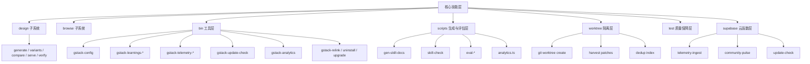

# gstack 模块拆解、自动化边界与 24x7 运行分析

## 为什么还需要这一篇

前面几篇已经分别讲了：

- 总体定位
- 核心架构
- `browse` 运行时
- skills 与多 agent 机制

但如果只看到这些，你仍然会低估 `gstack`。

因为支撑这个系统长期可用的，不只是核心路径。

更重要的是那些“外围基础设施”模块：

- `design/`
- `scripts/`
- `bin/`
- `supabase/`
- `lib/worktree.ts`
- `test/`
- `learn/`
- telemetry / analytics / update / upgrade

这些模块决定了 `gstack` 是否只是一次性演示，还是能成为长期工作系统。

这篇文档就专门拆这些部分。

---

## 模块全景图

---

## `design/` 子系统：为什么它不是附属玩具

### 一句话定义

`design/` 是 `gstack` 的设计生成、设计比较、用户反馈 roundtrip、设计记忆提取、mockup 校验与 HTML 生成子系统。

### 为什么它重要

很多 AI coding 工作流把设计放在外部：

- 去 Figma
- 去截图
- 去另一个 AI 工具
- 再回到工程实现

`gstack` 则尽量把设计也纳入同一流水线。

这使得设计不再是“前置静态资源”，而是：

- 可迭代资产
- 可回收反馈资产
- 可验证资产
- 可被实现过程直接消费的资产

---

## `design/src/cli.ts`：stateless CLI 的意义

从 [design/src/cli.ts](/Users/simonwang/agent/gstack/design/src/cli.ts) 可以看到，`design` 和 `browse` 的设计哲学明显不同。

### `browse` 是 stateful daemon

因为浏览器会话需要：

- cookies
- tabs
- storage
- refs
- 持续控制

### `design` 是 stateless CLI

每次调用做的是：

- 读参数
- 解析命令
- 做 API 调用 / 文件操作
- 输出 JSON

### 为什么这样分化是合理的

设计生成任务的状态性远弱于浏览器会话。

真正需要跨轮次保存的设计状态，通常可以通过：

- session 文件
- mockup 文件
- board feedback 文件

来表达，而不是维持一个长驻进程。

### 这体现了很好的架构纪律

作者没有因为 `browse` 是 daemon，就把所有东西都做成 daemon。

而是根据任务特征选择状态模型。

---

## `design` 的命令面反映了怎样的设计流程

从 CLI 可以看到的主要命令包括：

- `generate`
- `check`
- `compare`
- `prompt`
- `setup`
- `variants`
- `iterate`
- `extract`
- `diff`
- `verify`
- `evolve`
- `gallery`
- `serve`

### 这些命令构成了一个完整链路

| 阶段 | 命令 | 作用 |
|---|---|---|
| 初始生成 | `generate` | 产出初版 mockup |
| 多方案探索 | `variants` | 批量生成变体 |
| 板式比较 | `compare` + `serve` | 给用户看、让用户选 |
| 反馈迭代 | `iterate` / `evolve` | 基于反馈再生成 |
| 设计知识提取 | `extract` | 提取设计语言并更新 `DESIGN.md` |
| 对比与验证 | `diff` / `verify` | 比较两个 mockup，验证实现是否贴近批准稿 |
| 实现桥接 | `prompt` | 为 design-to-code 生成更合理的实现提示 |

### 这说明作者真正想做的不是“生成一张图”

而是：

**让设计也进入可编排、可反馈、可验证的工程循环。**

---

## compare board 与 feedback roundtrip：设计协作的核心创新之一

[design/src/compare.ts](/Users/simonwang/agent/gstack/design/src/compare.ts) 生成的 HTML board 其实很有代表性。

### 这个 board 不是展示用，而是决策用

它提供：

- 每个 variant 的 pick 选择
- 打星
- 文字反馈
- “More like this”
- regenerate 按钮
- overall direction 文本域

### 这说明作者对设计协作的理解是

不要让用户说抽象的话，比如：

- “再高级一点”
- “更有感觉”

而要让用户对**可见候选项**做局部偏好表达。

### 技术上它是怎么闭环的

和 [design/src/serve.ts](/Users/simonwang/agent/gstack/design/src/serve.ts) 配合后：

- board 通过 HTTP 提交反馈
- 反馈既写 stdout 也写磁盘
- regenerate 时写 `feedback-pending.json`
- submit 时写 `feedback.json`
- agent 轮询这些文件
- 生成新 board 后通过 `/api/reload` 热切换

### 这有什么意义

它让设计不再是单向输出，而是一个**人机共同雕刻的选择空间**。

---

## `scripts/`：这个目录决定 skills 不是“提示词收藏夹”

`scripts/` 目录很关键，因为它把整个 skills 体系从文案管理拉到了工程管理。

主要脚本包括：

- `gen-skill-docs.ts`
- `discover-skills.ts`
- `skill-check.ts`
- `eval-list.ts`
- `eval-compare.ts`
- `eval-summary.ts`
- `eval-watch.ts`
- `analytics.ts`

---

## `gen-skill-docs.ts`：为什么它是项目的另一个核心

这份脚本我们前面已经提到过，但这里从“模块拆解”角度再强调一次。

### 它实际承担四种职责

#### 1. 模板编译器

把 `.tmpl` 编成不同宿主可用的 `SKILL.md`。

#### 2. 单一事实源连接器

把：

- 命令表
- snapshot flags
- host paths
- frontmatter
- 共享方法论

拼成最终 skill 文档。

#### 3. 宿主适配器

生成：

- Claude 版
- Codex 版
- Factory 版

#### 4. 可测试构建产物生成器

支持 `--dry-run`，便于 CI 检查文档是否 stale。

### 为什么这很重要

因为如果没有它，整个 skill 层会非常快地漂移、腐化。

---

## `skill-check.ts` 与 eval 系列：如何防止技能失控

### skill-check

这个脚本的存在说明作者不满足于“它能生成 skill”。

他还要知道：

- skills 是否健康
- 是否存在配置错误
- 是否有遗漏项

### eval 系列

`eval-list`、`eval-compare`、`eval-summary`、`eval-watch` 表明：

项目不只做单测，还在做：

- 跨 run 比较
- 历史统计
- 长期趋势观察
- 部分结果实时查看

这意味着 `gstack` 对 AI 工作流的质量监控，不停留在“有无测试”层面，而是已经进入“评测系统”层面。

---

## `bin/`：把“工作系统”真正产品化的工具层

`bin/` 里有大量脚本。它们看似杂，但其实可以分成几类。

### 第一类：配置与安装类

例如：

- `gstack-config`
- `gstack-relink`
- `gstack-uninstall`
- `gstack-platform-detect`
- `gstack-repo-mode`
- `gstack-global-discover`

这些工具解决的是：

- 安装在哪
- 用哪个宿主
- 是否是 repo-local 模式
- 怎么重新链接 skills
- 怎么卸载

它们使 `gstack` 不是“手工 hack 出来能跑”，而是真正具备可维护生命周期。

### 第二类：学习记忆类

- `gstack-learnings-log`
- `gstack-learnings-search`
- `gstack-slug`

这些脚本构成跨会话 learnings 的落盘和检索能力。

### 第三类：遥测与分析类

- `gstack-telemetry-log`
- `gstack-telemetry-sync`
- `gstack-analytics`
- `gstack-community-dashboard`

这些脚本把项目从“本地使用”带到“可统计、可回顾、可演化”。

### 第四类：升级与版本类

- `gstack-update-check`
- `gstack-upgrade`

这保证系统不是一次安装、永远漂移。

---

## `gstack-learnings-*`：长期记忆为什么不是数据库，而是 JSONL

`gstack-learnings-log` 与 `gstack-learnings-search` 的设计，值得专门分析。

### 设计核心

- 存储：append-only JSONL
- 作用域：project slug 级别
- 冲突解决：读取时 latest winner
- 置信度：按时间衰减
- 查询：支持类型、关键词、跨项目搜索

### 为什么这是好设计

#### 1. 写入简单且稳定

日志追加比复杂事务写入更适合本地工具链。

#### 2. 读取时去重比写时更新更鲁棒

对于 agent 产物，写入时过度追求唯一性经常会制造更多脆弱性。

#### 3. 置信度衰减非常聪明

很多经验不是永真理。

- 框架会变
- 代码库会变
- 团队习惯会变

把 observed / inferred 的置信度按时间衰减，意味着系统不会被旧经验永久绑死。

#### 4. 它比模型内隐记忆更可控

- 可看
- 可搜
- 可 prune
- 可导出

这很符合 `gstack` 的一贯风格：

**能落文件的，不尽量落在黑盒记忆里。**

---

## `gstack-telemetry-log`：隐私边界为什么相对清楚

这个脚本值得仔细讲，因为它体现了作者对遥测的取舍。

### 本地优先

脚本先把事件写到本地 JSONL：

- `~/.gstack/analytics/skill-usage.jsonl`

然后再异步触发 sync。

### 三种层级

配置里有：

- `off`
- `anonymous`
- `community`

### 本地保留但远端不上报的字段

脚本里明确区分：

- 本地字段，如 `_repo_slug`, `_branch`
- 远端安全字段，如 skill、duration、outcome、version、os

### 这说明什么

作者不是完全拒绝遥测，而是试图做一套“本地可丰富、远端尽量克制”的体系。

### pending marker 的设计也很值得注意

它为并发会话创建 `.pending-SESSION_ID`，用于最终补全 telemetry。

这意味着即便 skill 非正常结束，也尽量留下合理的“unknown” 结局，而不是完全丢失事件。

这在长期分析里很重要。

---

## Supabase Edge Functions：云端部分做得很克制

`s​​upabase/functions/` 目前主要有三个入口：

- `telemetry-ingest`
- `community-pulse`
- `update-check`

### `telemetry-ingest`

作用：

- 校验 schema
- 限制 batch 大小
- 限制 payload
- allowlist `event_type`
- 截断字段长度
- 插入 `telemetry_events`
- upsert `installations`

### 为什么值得肯定

它不是把客户端 JSON 原样塞进数据库。

它做了严格输入收敛，这样：

- 降低滥用面
- 避免 schema 膨胀
- 控制表结构稳定性

### `community-pulse`

作用：

- 周活跃近似统计
- top skills
- crash clusters
- version distribution
- server-side cache

### 它的价值

不是为了商业增长 dashboard，而是为了让维护者知道：

- 哪些技能最常用
- 哪些版本问题最多
- 社区正在怎样使用这套系统

### 这仍然保持了克制

它没有发展成一个重型 SaaS 后台。

它只是给项目维护提供足够的观测面。

---

## `lib/worktree.ts`：并行与隔离为什么是“真实问题”

[lib/worktree.ts](/Users/simonwang/agent/gstack/lib/worktree.ts) 很有代表性。

### 它解决什么问题

当你想：

- 跑真实 E2E
- 在隔离环境中让 agent 改文件
- 并行运行多组测试或多会话

你需要一个不会污染主工作树的机制。

### 它怎么做

- 创建真实 git worktree
- 复制 `.agents/` 和 `browse/dist` 等 gitignored 产物
- 允许 agent 在 worktree 内改动
- harvest diff 为 patch
- 对 patch 做 hash 去重
- 清理 worktree

### 这有多重要

如果没有它，很多评测/并发场景只能：

- 在主 repo 乱改
- 手工恢复
- 结果不可回放

而 worktree + harvest 设计让 agent 运行产物变成：

- 可保存 patch
- 可去重
- 可审查
- 可重新 apply

这已经不只是测试辅助，而是在构建**agent 实验沙箱**。

---

## 测试体系：项目为什么不像“prompt 仓库”，更像工程系统

从 `package.json` 可看到：

- `test`
- `test:evals`
- `test:e2e`
- `test:gate`
- `test:periodic`
- `test:codex`
- `test:gemini`
- `test:audit`

### 这说明测试不只覆盖代码，也覆盖工作流

项目有多种测试层：

- 普通单元/集成测试
- skill 静态校验
- 真实 `claude -p` E2E
- Codex / Gemini 适配 E2E
- 审计合规测试
- 评测统计

### 一个很关键的观念

这里测试的不是“某个函数返回值”，而是：

- 某个技能是否真的能被宿主正确使用
- 文档是否与实现一致
- 真实 agent session 会不会卡死
- 多宿主 skill 是否有效
- observability 写入是否健壮

这是一种“workflow-as-product”的测试方法。

---

## 24x7 运行分析：到底能否全天候工作

你原始问题里明确问到了：

- 能否 24 小时整体运行？
- 完全不用人工参与吗？

这里给出一个清晰、工程化的回答。

---

## 第一层：从“基础设施稳定性”看，能长期使用吗？

### 答案：能

原因包括：

- `browse` daemon 有明确健康检查与自动重启逻辑
- 版本漂移可自动重启
- `.gstack/` per-project state 避免多 workspace 污染
- worktree 提供隔离执行能力
- learnings / analytics / logs 都是 append-friendly 文件格式
- 多数脚本是幂等或近幂等操作
- `setup` 对环境差异做了大量兼容

### 换句话说

如果你的意思是：

> “我能不能把它当一个长期工作系统，每天持续开很多会话、很多 sprint？”

答案是：**可以，而且这正是它的目标场景之一。**

---

## 第二层：从“单个 agent 无人值守 24 小时跑到底”看，成立吗？

### 答案：不应该这么理解

原因有四类。

### 原因 1：很多 skills 是 task-bounded，不是 daemon-bounded

例如：

- `/review`
- `/qa`
- `/ship`

它们本来就是完成一段任务后退出，不是永远循环。

### 原因 2：关键决策点明确要求用户参与

- 范围变化
- 设计 taste
- 模型分歧
- destructive 操作
- 发布风险

这不是“能力不够”，而是产品哲学。

### 原因 3：真实世界中存在人工必经关卡

比如：

- MFA
- CAPTCHA
- 第三方站点异常
- 生产告警后业务取舍

### 原因 4：`browse` 自身有 idle timeout

系统更偏任务驱动，而不是无限守护。

---

## 第三层：从“多并行 sprint 不停流转”看，是否现实

### 答案：是现实的，但需要人担任总控

作者在 README 里反复强调并行 sprint 场景。

从架构看，这种并行的成立条件是：

- 每个 workspace 有独立 state
- skills 有明确阶段边界
- 用户只在关键节点介入
- 其余阶段由 agent 自主推进

### 所以更准确的表述是

`gstack` 支持：

**一名用户长期维持多个并行 agent 工作流，像管理一个小团队一样轮流收口关键决策。**

这不是“彻底放手”，而是“高层管理式参与”。

---

## 自动化边界：哪些事它适合自动，哪些事不适合

### 适合高度自动化的事情

- 环境探测
- 命令文档生成
- skills 适配编译
- 基础浏览器操作
- 页面快照与 refs 生成
- console/network/perf 采集
- diff 评审中的明显问题
- 测试框架 bootstrap
- 遥测本地写入
- learnings 记录
- PR 打开与流程推进

### 适合“自动建议 + 用户确认”的事情

- scope 调整
- 设计风格选择
- 重大架构 trade-off
- 模型分歧中的方向选择
- 删除/重命名等高影响改动
- 发布是否立即推进

### 不应追求完全自动的事情

- 商业方向裁决
- 品牌/审美最终判断
- 风险承受阈值判断
- 组织政治或外部沟通后果承担
- 对外生产事故处理策略

这条边界和 `ETHOS.md` 是完全一致的。

---

## 为什么这种边界对长期运行反而更友好

很多人以为“完全自动”才是长期运行的前提。

现实往往相反。

### 完全自动的问题

- 一旦跑偏，偏得更快
- 用户很难在中途纠偏
- 难以界定责任边界
- 高价值决策被模型惯性吞掉

### `gstack` 的半自动优势

- 明确哪里可以放心放手
- 明确哪里必须收口
- 让长期使用不会变成“黑盒焦虑”

这正是一个工作系统比一个 demo 系统更重要的地方。

---

## 这些基础设施模块共同体现了什么设计思想

如果把这些模块放在一起看，会发现一个强烈的一致性。

### 一致性 1：优先用简单机制解决复杂协作

- 文件
- JSONL
- worktree
- 本地 HTTP
- 纯文本

### 一致性 2：不迷信中心化 orchestrator

很多 coordination 问题都被转化为：

- 文件产物是否存在
- 当前状态是什么
- 用户是否已裁决

### 一致性 3：把“演化能力”做进系统

- telemetry
- analytics
- eval compare
- learnings
- update check

### 一致性 4：尊重本地优先与隐私边界

- 本地日志完整
- 远端遥测 opt-in
- repo/branch 等敏感信息只在本地保留

### 一致性 5：让失败尽量可见、可恢复

- health check
- restart
- restore point
- patch harvest
- partial eval persistence
- stdout + file 双通道反馈

这就是为什么这个项目虽然复杂，却并不显得“玄学”。

它的复杂大多是可解释、可见、可恢复的复杂。

---

## 对维护者与使用者的实际启发

### 如果你是使用者

你最该重视的不是“我会不会所有 skill”。

而是：

- 理解哪些产物是下游依赖的
- 理解哪些阶段要你做决定
- 理解 learnings 和 design doc 会长期影响后续行为

### 如果你是维护者

你最该重视的不是“再加一个新 skill”。

而是：

- 新 skill 是否进入模板与测试体系
- 是否尊重 preamble 与 host adaptation 机制
- 是否有可观测性
- 是否需要 worktree / file protocol 支撑
- 是否会引入新的 state consistency 风险

---

## 本文结论

`gstack` 能不能长期运行、能不能支撑很多并行工作流，答案很大程度上不在那些最显眼的 skills 上。

真正决定它能否长期稳定工作的，是这些外围基础设施：

- `design/` 让设计进入闭环
- `scripts/` 让 skills 成为可编译、可测试资产
- `bin/` 让配置、升级、分析、学习成为产品功能
- `supabase/` 让 opt-in 遥测与社区反馈成为可能
- `worktree` 让并发与试验不污染主线
- `test/` 让整个系统不是“看起来很强”，而是“被持续验证”

因此，对“是否能 24x7 运行”的最准确回答是：

**`gstack` 非常适合作为一个长期、持续、跨项目、多并行工作流的 AI 研发系统运行；但它并不是为了“完全不需要人”的黑盒自治工厂而设计。**

它更像一座高自动化工厂，其中：

- 机器负责大量重复与局部判断
- 不同工位各司其职
- 传送带和状态记录清晰可见
- 主管在关键节点做最终裁决

而这，也正是它比很多“单 agent 全自动幻想”更现实、更耐用的地方。
